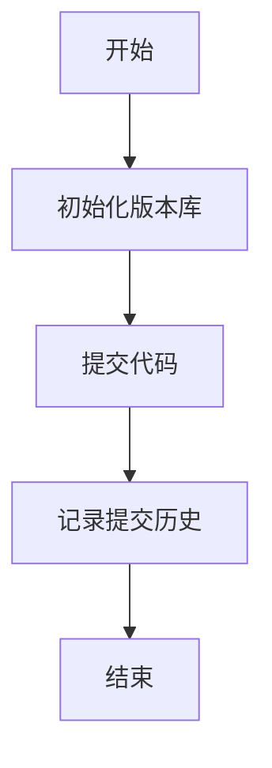
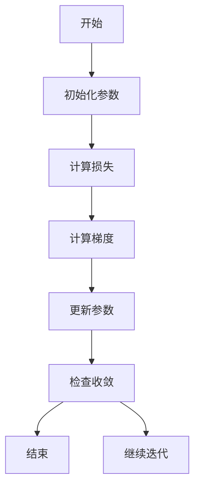
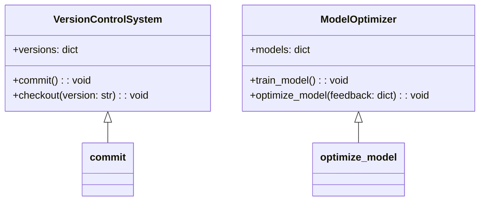
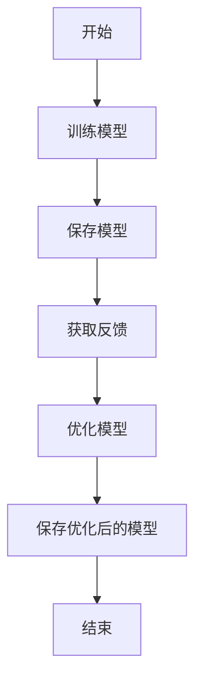

                 


```markdown
# AI Agent的版本控制与迭代优化流程

> 关键词：AI Agent，版本控制，迭代优化，算法原理，系统架构设计，项目实战

> 摘要：本文详细探讨了AI Agent的版本控制与迭代优化流程，从基本概念到核心原理，再到系统架构设计和实际项目案例，全面解析了AI Agent在版本控制与迭代优化中的关键步骤和方法。通过本文的分析，读者可以深入了解AI Agent的版本控制与迭代优化的核心原理，并能够将其应用到实际项目中，提升AI Agent的开发效率和性能。

---

## 第一部分: AI Agent的基本概念与背景

### 第1章: AI Agent的基本概念与背景

#### 1.1 AI Agent的定义与类型
##### 1.1.1 AI Agent的定义
AI Agent（人工智能代理）是指能够感知环境、自主决策并执行任务的智能实体。AI Agent可以通过传感器获取信息，通过计算得出决策，并通过执行器与环境交互。AI Agent可以是软件程序、机器人或其他智能系统。

##### 1.1.2 基于规则的AI Agent与基于模型的AI Agent
- **基于规则的AI Agent**：通过预定义的规则和条件进行决策，适用于任务明确、环境简单的场景。
- **基于模型的AI Agent**：通过构建环境模型，利用模型进行预测和优化决策，适用于任务复杂、环境动态变化的场景。

##### 1.1.3 AI Agent的典型应用场景
- 智能助手（如Siri、Alexa）
- 自动驾驶系统
- 医疗诊断辅助系统
- 智能推荐系统

#### 1.2 AI Agent的版本控制问题
##### 1.2.1 版本控制在AI开发中的重要性
AI Agent的开发是一个复杂的过程，涉及到多版本的迭代优化。版本控制是确保每次迭代的可追溯性和可恢复性的关键。

##### 1.2.2 AI Agent迭代优化的基本流程
1. **需求分析**：明确AI Agent的目标和功能。
2. **模型训练**：基于数据训练AI Agent的模型。
3. **版本控制**：记录每次迭代的模型、代码和实验结果。
4. **迭代优化**：根据反馈不断优化AI Agent的性能。

##### 1.2.3 版本控制与迭代优化的边界与外延
- 版本控制的边界：AI Agent的代码、模型和配置文件。
- 迭代优化的外延：结合反馈机制，优化模型、算法和参数。

#### 1.3 本章小结
本章介绍了AI Agent的基本概念、类型和应用场景，并详细阐述了版本控制在AI Agent开发中的重要性以及迭代优化的基本流程。

---

## 第二部分: AI Agent版本控制的核心概念与联系

### 第2章: 版本控制与迭代优化的核心原理

#### 2.1 版本控制的原理
##### 2.1.1 版本控制的基本原理
版本控制是一种记录文件修改历史的机制，通过版本控制可以实现文件的回滚、分支开发和合并。在AI Agent的开发中，版本控制用于管理代码、模型和实验结果。

##### 2.1.2 基于版本控制的AI Agent更新机制
AI Agent的更新可以通过版本控制工具（如Git）实现，每次迭代优化后，将代码和模型提交到版本控制仓库。

##### 2.1.3 版本控制与AI模型训练的关系
版本控制不仅记录代码的变化，还可以记录模型训练的参数、数据和结果，为后续的迭代优化提供参考。

#### 2.2 迭代优化的核心原理
##### 2.2.1 迭代优化的基本概念
迭代优化是一种通过多次迭代改进模型性能的方法，每次迭代基于前一次的结果进行优化。

##### 2.2.2 基于反馈的AI Agent优化方法
AI Agent通过与环境的交互获得反馈，根据反馈调整模型参数，实现性能的提升。

##### 2.2.3 迭代优化中的收敛性问题
迭代优化的目标是使模型的性能逐渐趋近于最优值，收敛性问题是指模型在迭代过程中是否能够稳定地趋近于最优解。

#### 2.3 本章小结
本章详细阐述了版本控制和迭代优化的核心原理，解释了它们在AI Agent开发中的具体应用和相互关系。

---

### 第3章: 核心概念与联系

#### 3.1 核心概念的属性特征对比
| 概念       | 属性特征                   |
|------------|----------------------------|
| 版本控制   | 记录变更、可回滚、可追溯     |
| 迭代优化   | 基于反馈、逐步改进、收敛性   |

#### 3.2 ER实体关系图
```mermaid
erd
  actor: AI Agent开发人员
  version_control_system: 版本控制系统
  model: AI Agent模型
  feedback: 用户反馈
  optimization: 迭代优化过程
  actor --> version_control_system: 提交代码和模型
  version_control_system --> model: 管理模型版本
  model --> feedback: 与环境交互，获取反馈
  feedback --> optimization: 优化模型参数
  optimization --> model: 更新模型
```

#### 3.3 本章小结
本章通过属性特征对比和ER实体关系图，展示了版本控制与迭代优化的核心概念及其联系。

---

## 第三部分: AI Agent版本控制与迭代优化的系统分析与架构设计

### 第4章: 算法原理讲解

#### 4.1 版本控制算法
##### 4.1.1 版本回溯算法
版本回溯算法用于从当前版本回滚到指定版本，具体步骤如下：
1. 获取当前版本的提交历史。
2. 找到目标版本的提交记录。
3. 回滚代码到目标版本。

##### 4.1.2 版本控制的数学模型
版本控制的数学模型可以用图论中的树结构表示，每个节点表示一个版本，边表示版本之间的依赖关系。

##### 4.1.3 代码实现与流程图


代码实现（使用Git作为版本控制工具）：
```bash
git init
git add .
git commit -m "initial commit"
```

#### 4.2 迭代优化算法
##### 4.2.1 梯度下降算法
梯度下降算法是一种常用的迭代优化算法，用于最小化目标函数。数学公式如下：
$$ J = \frac{1}{2m} \sum_{i=1}^m (y_i - \hat{y}_i)^2 $$
$$ \theta := \theta - \alpha \frac{\partial J}{\partial \theta} $$

##### 4.2.2 迭代优化的数学公式
迭代优化的数学公式可以表示为：
$$ \theta_{n+1} = \theta_n - \eta \frac{\partial J}{\partial \theta_n} $$
其中，$\theta$表示模型参数，$\eta$表示学习率，$J$表示目标函数。

##### 4.2.3 代码实现与流程图


代码实现（使用Python）：
```python
def optimize(theta, learning_rate):
    for _ in range(iterations):
        loss = calculate_loss(theta)
        gradient = compute_gradient(theta, loss)
        theta -= learning_rate * gradient
        if loss < threshold:
            break
    return theta
```

---

### 第5章: 系统分析与架构设计

#### 5.1 问题场景介绍
##### 5.1.1 AI Agent版本控制的典型问题场景
- 多人协作开发中的版本冲突
- 复杂模型的版本管理
- 实验结果的可追溯性

##### 5.1.2 迭代优化的典型问题场景
- 模型训练的收敛性问题
- 参数调整的复杂性
- 反馈机制的设计与实现

#### 5.2 系统功能设计
##### 5.2.1 领域模型设计
AI Agent版本控制系统包括以下功能模块：
- 版本管理模块：管理代码和模型的版本
- 反馈收集模块：收集用户反馈
- 优化模块：基于反馈优化模型

##### 5.2.2 功能模块划分


#### 5.3 系统架构设计
##### 5.3.1 系统架构图
```mermaid
container AI Agent版本控制系统 {
  VersionControlSystem
  ModelOptimizer
}
```

##### 5.3.2 接口设计与交互流
```mermaid
sequenceDiagram
  actor: 开发人员
  version_control: 版本控制系统
  model_optimizer: 模型优化模块
  actor -> version_control: 提交代码和模型
  version_control -> model_optimizer: 更新模型
  model_optimizer -> version_control: 提交优化后的模型
```

---

## 第四部分: 项目实战

### 第6章: 项目实战

#### 6.1 项目介绍
##### 6.1.1 项目背景
本项目旨在开发一个医疗诊断AI Agent，能够根据患者的症状和病史进行诊断。

##### 6.1.2 项目目标
- 实现AI Agent的版本控制
- 实现迭代优化流程
- 提供用户反馈机制

#### 6.2 环境安装
##### 6.2.1 安装Git
```bash
sudo apt-get install git
```

##### 6.2.2 安装机器学习库
```bash
pip install numpy scikit-learn
```

#### 6.3 核心实现
##### 6.3.1 版本控制实现
```python
import git

def save_model(model, version):
    repo = git.Repo('.')
    repo.git.add(all=True)
    repo.git.commit('-m', f'save model version {version}')
```

##### 6.3.2 迭代优化实现
```python
def optimize_model(model, feedback):
    # 根据反馈优化模型
    pass
```

#### 6.4 代码实现与流程图
##### 6.4.1 代码实现
```python
import git
import numpy as np
from sklearn import svm

def save_model(model, version):
    repo = git.Repo('.')
    repo.git.add(all=True)
    repo.git.commit('-m', f'save model version {version}')

def optimize_model(model, feedback):
    # 假设model是SVM模型
    if feedback['accuracy'] < 0.8:
        model = svm.SVC(C=1.0, kernel='rbf', gamma=0.1)
        model.fit(feedback['data'], feedback['target'])
        save_model(model, 'optimized')
    return model
```

##### 6.4.2 流程图


#### 6.5 项目小结
本章通过一个实际的医疗诊断AI Agent项目，详细展示了版本控制与迭代优化流程在实际项目中的应用。

---

## 第五部分: 总结与展望

### 第7章: 总结与展望

#### 7.1 总结
本文详细探讨了AI Agent的版本控制与迭代优化流程，从基本概念到核心原理，再到系统架构设计和实际项目案例，全面解析了AI Agent在版本控制与迭代优化中的关键步骤和方法。

#### 7.2 未来展望
未来的研究方向包括：
- 更高效的版本控制算法
- 更智能的迭代优化方法
- 更人性化的反馈机制

#### 7.3 最佳实践Tips
- 在AI Agent开发中，版本控制是必不可少的工具
- 迭代优化需要结合实际反馈进行
- 系统设计需要注重模块化和可扩展性

---

## 作者信息

作者：AI天才研究院/AI Genius Institute & 禅与计算机程序设计艺术 /Zen And The Art of Computer Programming

---

感谢您的阅读，希望本文对您理解AI Agent的版本控制与迭代优化流程有所帮助！
```

