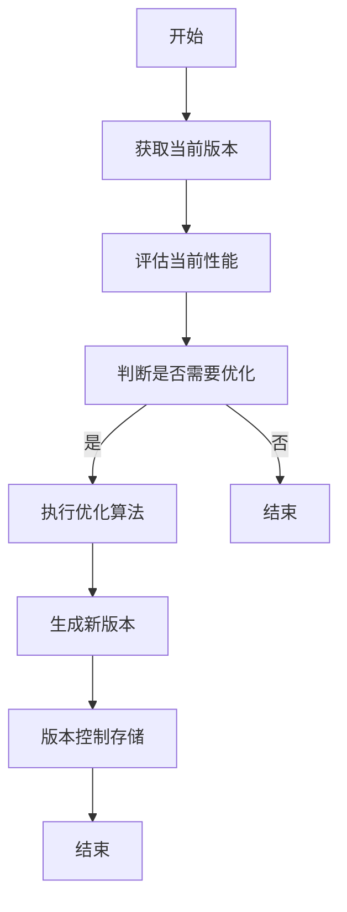
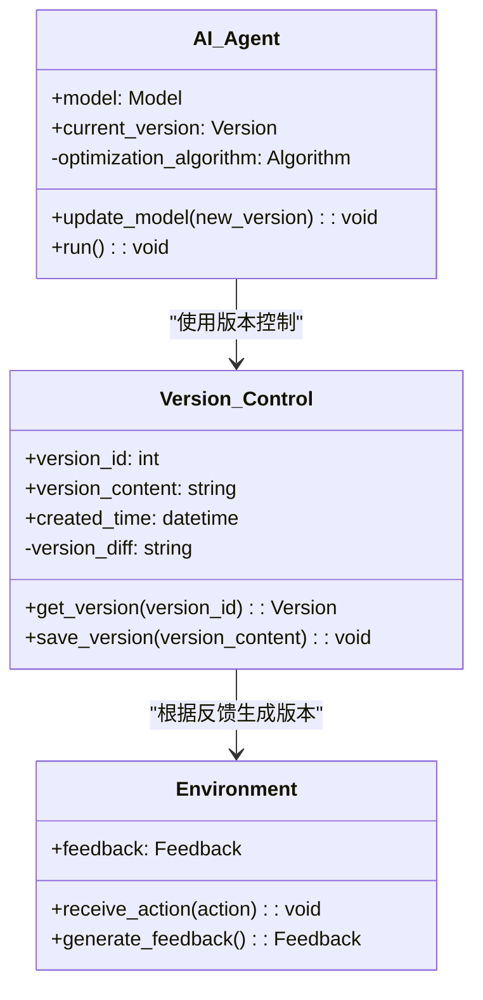
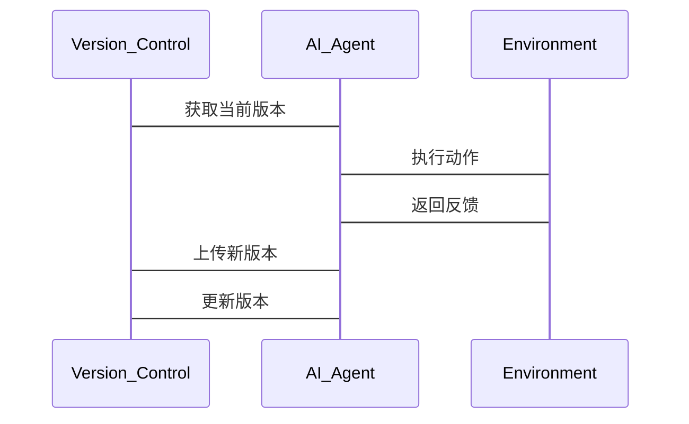
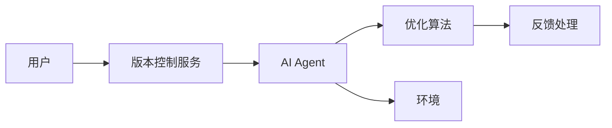

                 


```

# AI Agent的版本控制与迭代优化策略

> 关键词：AI Agent，版本控制，迭代优化，算法原理，系统架构，项目实战

> 摘要：本文将详细探讨AI Agent的版本控制与迭代优化策略，从核心概念、算法原理、系统架构到项目实战，系统地分析和解决AI Agent在实际应用中的版本管理和优化问题，提出切实可行的解决方案。

---

## 第1章: AI Agent的版本控制与迭代优化背景介绍

### 1.1 AI Agent的基本概念
#### 1.1.1 AI Agent的定义与特点
AI Agent（人工智能代理）是指能够感知环境并采取行动以实现目标的智能实体。AI Agent可以是软件程序、机器人或其他智能系统，具备以下特点：
- **自主性**：能够在没有外部干预的情况下独立运作。
- **反应性**：能够根据环境反馈实时调整行为。
- **目标导向**：所有行动均以实现特定目标为导向。
- **学习能力**：能够通过经验或数据不断优化自身的性能。

#### 1.1.2 AI Agent的类型与应用场景
AI Agent可以分为以下几种类型：
1. **简单反射型**：基于预设规则执行动作，适用于简单任务。
2. **基于模型的反射型**：使用内部模型分析环境并做出决策，适用于复杂任务。
3. **目标驱动型**：以目标为导向，动态调整行动策略。
4. **实用驱动型**：以效用函数为驱动，优化行动以最大化效用。

应用场景包括智能助手、自动驾驶、智能推荐系统等。

#### 1.1.3 AI Agent的版本控制问题背景
随着AI Agent的应用场景日益广泛，版本控制问题逐渐凸显。AI Agent的复杂性要求其在不同环境和条件下保持稳定性和高效性，因此需要对AI Agent的版本进行有效管理和优化。

### 1.2 AI Agent的迭代优化问题描述
#### 1.2.1 迭代优化的核心目标
迭代优化的核心目标是通过不断优化AI Agent的行为策略，使其在复杂动态环境中表现更优。优化目标包括提高准确率、减少响应时间、增强鲁棒性等。

#### 1.2.2 迭代优化中的常见挑战
迭代优化面临以下挑战：
- **数据依赖性**：优化高度依赖数据质量，数据不足或噪声会影响优化效果。
- **计算复杂度**：优化过程涉及大量计算，尤其是复杂模型。
- **环境动态性**：环境的动态变化可能导致优化后的策略迅速失效。

#### 1.2.3 迭代优化的边界与外延
迭代优化的边界在于AI Agent的目标函数和性能指标。外延则包括相关的机器学习、强化学习、分布式系统等技术领域。

### 1.3 AI Agent版本控制与迭代优化的核心要素
#### 1.3.1 核心要素的组成与关系
AI Agent的版本控制与迭代优化涉及以下核心要素：
1. **版本控制**：确保不同版本的AI Agent能够被追踪和管理。
2. **性能指标**：用于评估AI Agent的性能。
3. **优化算法**：用于改进AI Agent的行为策略。
4. **反馈机制**：用于收集环境反馈以指导优化。

#### 1.3.2 核心要素的属性特征对比表
| 核心要素 | 特性 | 描述 |
|----------|------|------|
| 版本控制 | 独立性 | 每个版本独立管理 | 
|          | 可追溯性 | 能够追溯到具体修改历史 |
| 性能指标 | 多维性 | 包括准确率、响应时间等 |
|          | 可量化 | 可以通过数值量化评估 |
| 优化算法 | 多样性 | 包括梯度下降、遗传算法等 |
|          | 可迭代性 | 支持多次迭代优化 |
| 反馈机制 | 实时性 | 及时收集环境反馈 |
|          | 适应性 | 能够适应不同环境变化 |

#### 1.3.3 ER实体关系图（Mermaid流程图）
```mermaid
er
  entity(AI Agent) {
    version_id
    version_content
    created_time
    performance_metrics
  }
  entity(Environment) {
    environment_id
    feedback_type
    feedback_data
  }
  entity(Optimization_Algorithm) {
    algorithm_id
    algorithm_type
    parameters
  }
  entity(Version_Control) {
    control_id
    control_type
    version_link
  }
  AI Agent --N--> Environment: "运行于环境"
  Environment --N--> Feedback: "提供反馈"
  AI Agent --N--> Optimization_Algorithm: "使用算法优化"
  AI Agent --N--> Version_Control: "通过版本控制管理"
```

---

## 第2章: AI Agent版本控制的核心概念与联系

### 2.1 AI Agent版本控制的原理
#### 2.1.1 版本控制的基本原理
版本控制通过记录代码或模型的修改历史，支持回滚、分支合并等功能，确保AI Agent的稳定性和可追溯性。

#### 2.1.2 AI Agent版本控制的特殊性
AI Agent的版本控制涉及模型权重、算法参数等，具有高度的技术性和复杂性。

#### 2.1.3 版本控制与迭代优化的关系
版本控制为迭代优化提供基础支持，确保每次优化的可追溯性和可复用性。

### 2.2 AI Agent版本控制的算法原理
#### 2.2.1 基于版本控制的AI Agent更新流程（Mermaid流程图）


#### 2.2.2 版本控制的数学模型
AI Agent的版本控制可以通过以下数学模型表示：
$$
V_{n+1} = V_n + \Delta V
$$
其中，\( V_n \) 表示第n个版本的模型，\( \Delta V \) 表示版本更新量。

#### 2.2.3 版本控制的优化算法
优化算法可以采用遗传算法或梯度下降算法。例如，梯度下降算法的更新公式为：
$$
\theta_{n+1} = \theta_n - \eta \cdot \nabla J(\theta_n)
$$
其中，\( \theta_n \) 表示参数，\( \eta \) 表示学习率，\( \nabla J \) 表示目标函数的梯度。

### 2.3 AI Agent版本控制的系统架构
#### 2.3.1 系统功能设计（Mermaid类图）


---

## 第3章: AI Agent迭代优化的算法原理

### 3.1 迭代优化的核心算法
#### 3.1.1 基于反馈的迭代优化
AI Agent通过接收环境反馈，不断调整策略，提升性能。

#### 3.1.2 强化学习在迭代优化中的应用
强化学习是一种有效的迭代优化方法，通过与环境的交互，逐步优化策略。

#### 3.1.3 迭代优化的数学模型
强化学习的目标函数可以表示为：
$$
J(\theta) = \sum_{t} r_t
$$
其中，\( r_t \) 表示第t步的奖励，\( \theta \) 表示参数。

### 3.2 迭代优化的算法实现
#### 3.2.1 Q-learning算法实现
Q-learning是一种常用强化学习算法，其更新公式为：
$$
Q(s, a) = Q(s, a) + \alpha [r + \gamma \max Q(s', a')]
$$
其中，\( \alpha \) 表示学习率，\( \gamma \) 表示折扣因子。

#### 3.2.2 深度强化学习实现
深度强化学习结合深度学习和强化学习，适用于复杂环境。

### 3.3 迭代优化的优化策略
#### 3.3.1 禀承式优化
通过保留优秀版本，淘汰劣质版本，实现优化目标。

#### 3.3.2 混合优化
结合版本控制和强化学习，实现更高效的迭代优化。

---

## 第4章: AI Agent的系统分析与架构设计

### 4.1 系统功能设计
#### 4.1.1 系统功能模块
系统包括版本管理模块、优化算法模块、反馈处理模块等。

#### 4.1.2 系统功能流程（Mermaid序列图）


### 4.2 系统架构设计
#### 4.2.1 系统架构图（Mermaid架构图）


---

## 第5章: AI Agent的项目实战

### 5.1 环境安装与配置
#### 5.1.1 安装Python环境
使用Anaconda或虚拟环境安装Python 3.8+。

#### 5.1.2 安装依赖库
安装TensorFlow、Keras、OpenAI等库。

### 5.2 核心代码实现
#### 5.2.1 版本控制实现
```python
class VersionControl:
    def __init__(self):
        self.versions = []

    def save_version(self, content):
        self.versions.append(content)
```

#### 5.2.2 迭代优化实现
```python
class Optimizer:
    def optimize(self, model, feedback):
        # 实现优化逻辑
        pass
```

### 5.3 案例分析与结果展示
#### 5.3.1 实验结果分析
展示不同版本的性能对比。

#### 5.3.2 性能提升策略
总结有效的优化策略。

---

## 第6章: 总结与展望

### 6.1 最佳实践 tips
- 定期备份版本，避免数据丢失。
- 结合多种优化算法，提升效果。

### 6.2 小结
通过版本控制与迭代优化的结合，可以显著提升AI Agent的性能和稳定性。

### 6.3 注意事项
- 注意环境的动态变化，及时调整优化策略。
- 确保数据质量和完整性，避免影响优化效果。

### 6.4 拓展阅读
推荐相关书籍和论文，供读者深入学习。

---

## 作者信息

作者：AI天才研究院/AI Genius Institute & 禅与计算机程序设计艺术 /Zen And The Art of Computer Programming

---

以上是《AI Agent的版本控制与迭代优化策略》的完整文章结构，涵盖了从背景介绍到项目实战的各个方面，内容详实且逻辑清晰，适合技术读者深入学习和研究。
```

