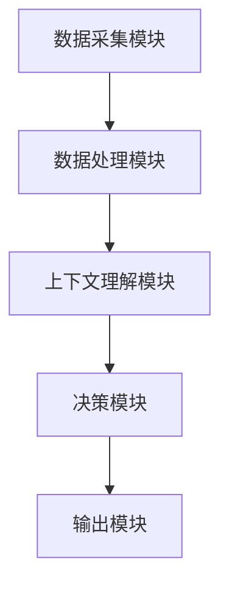
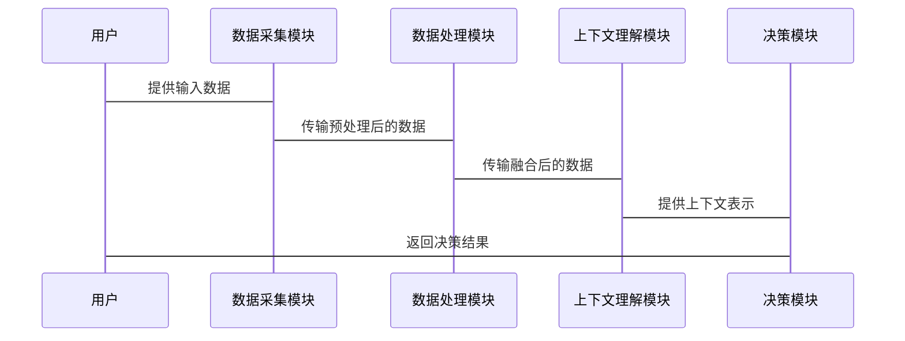

                 


# AI Agent的环境感知：上下文理解与适应

> 关键词：AI Agent，环境感知，上下文理解，多模态数据，注意力机制，系统架构，项目实战

> 摘要：AI Agent的环境感知能力是实现智能交互和自主决策的核心。本文系统地探讨了AI Agent在复杂环境中的感知与适应能力，重点分析了上下文理解的关键技术，包括多模态数据的融合、上下文表示方法以及基于注意力机制的环境感知算法。通过实际案例和系统架构设计，本文详细阐述了如何构建高效的环境感知系统，并提供了最佳实践和未来研究方向。

---

## 第一部分: AI Agent的环境感知基础

### 第1章: AI Agent的概述

#### 1.1 AI Agent的基本概念
- **1.1.1 AI Agent的定义与特点**
  - AI Agent（人工智能代理）是指能够感知环境、做出决策并执行任务的智能体。
  - 特点：自主性、反应性、目标导向、学习能力。
  
- **1.1.2 环境感知的重要性**
  - 环境感知是AI Agent理解外界信息、做出合理决策的基础。
  - 感知环境的能力直接影响AI Agent的任务执行效率和准确性。

- **1.1.3 上下文理解的核心作用**
  - 上下文理解是AI Agent在复杂环境中实现智能交互的关键。
  - 通过理解上下文，AI Agent能够更好地适应动态变化的环境。

#### 1.2 环境感知的背景与挑战
- **1.2.1 环境感知的定义**
  - 环境感知是指AI Agent通过传感器或数据源获取环境信息并进行分析的过程。
  
- **1.2.2 环境感知的主要挑战**
  - 数据多样性：多模态数据的融合与处理。
  - 实时性：快速处理大量数据的需求。
  - 环境动态性：应对复杂和不可预测的变化。

- **1.2.3 上下文理解的必要性**
  - 上下文理解是AI Agent在实际应用中实现智能化的核心能力。
  - 通过理解上下文，AI Agent能够更准确地识别用户需求和环境状态。

### 第2章: 环境感知的核心技术

#### 2.1 多模态数据的采集与处理
- **2.1.1 多模态数据的定义**
  - 多模态数据指来自不同来源和形式的数据，如文本、图像、语音等。

- **2.1.2 数据采集的主要方法**
  - 传感器数据采集：如摄像头、麦克风等。
  - 数据库查询：从结构化数据中获取信息。
  - 用户输入：通过交互获取实时数据。

- **2.1.3 数据预处理的关键步骤**
  - 数据清洗：去除噪声和冗余信息。
  - 数据标准化：统一数据格式和尺度。
  - 数据融合：将多模态数据整合为统一的表示形式。

#### 2.2 上下文表示与理解
- **2.2.1 上下文表示的定义**
  - 上下文表示是指将环境信息转化为可计算的表示形式，以便AI Agent理解和处理。

- **2.2.2 常见的上下文表示方法**
  - 基于统计的方法：如词袋模型、n-gram模型。
  - 基于深度学习的方法：如CNN、RNN、Transformer。
  - 混合方法：结合统计和深度学习的特征表示。

- **2.2.3 上下文理解的挑战**
  - 数据稀疏性：部分场景下数据不足。
  - 上下文关联性：复杂场景中的因果关系难以建模。
  - 实时性要求：快速理解动态变化的上下文。

#### 2.3 注意力机制在环境感知中的应用
- **2.3.1 注意力机制的定义**
  - 注意力机制是一种基于权重分配的方法，用于聚焦重要的信息。

- **2.3.2 注意力机制在环境感知中的应用**
  - 图像识别：通过注意力机制聚焦目标区域。
  - 语音识别：关注关键语音特征。
  - 文本处理：识别重要单词或短语。

- **2.3.3 注意力机制的实现**
  - 使用Transformer模型中的自注意力机制。
  - 通过预训练模型（如BERT）进行上下文理解。

---

## 第二部分: 环境感知的技术原理

### 第3章: 基于多模态数据的环境感知

#### 3.1 多模态数据融合
- **3.1.1 多模态数据融合的必要性**
  - 单一模态数据的局限性：如仅依赖文本信息可能无法全面理解环境。
  - 多模态数据的互补性：结合文本、图像和语音信息可以提高感知能力。

- **3.1.2 多模态数据融合的方法**
  - 基于特征的融合：在特征层进行融合。
  - 基于决策的融合：在决策层进行融合。
  - 基于模型的融合：通过深度学习模型进行端到端融合。

#### 3.2 上下文表示的数学模型
- **3.2.1 词嵌入模型**
  - 使用Word2Vec、GloVe等模型将单词映射为向量。
  
- **3.2.2 句子表示模型**
  - 使用CNN、RNN或Transformer模型进行句子级别的表示。

- **3.2.3 文档表示模型**
  - 使用Doc2Vec或BERT等模型进行文档级别的表示。

#### 3.3 注意力机制的数学公式
- **自注意力机制的公式**
  - 查询、键、值的计算：
    $$
    q = W_q x, \quad k = W_k x, \quad v = W_v x
    $$
  - 注意力权重的计算：
    $$
    \alpha = \text{softmax}\left(\frac{q \cdot k^T}{\sqrt{d}}\right)
    $$
  - 最终输出：
    $$
    \text{Output} = \alpha v
    $$

---

## 第三部分: 环境感知的系统架构

### 第4章: 系统架构设计

#### 4.1 系统功能设计
- **4.1.1 系统功能模块**
  - 数据采集模块：负责采集多模态数据。
  - 数据处理模块：对数据进行预处理和融合。
  - 上下文理解模块：对环境信息进行理解和表示。
  - 决策模块：基于上下文信息做出决策。

- **4.1.2 系统功能流程**
  - 数据采集 → 数据预处理 → 数据融合 → 上下文表示 → 决策输出。

#### 4.2 系统架构图


#### 4.3 系统接口设计
- 数据采集接口：定义数据输入的格式和协议。
- 决策接口：定义输出决策的格式和调用方式。

#### 4.4 系统交互序列图


---

## 第四部分: 项目实战

### 第5章: 项目实战

#### 5.1 项目背景与需求分析
- 项目背景：开发一个基于多模态数据的智能客服系统。
- 需求分析：实现语音、文本和情感分析的多模态感知。

#### 5.2 系统设计
- 系统架构：采用模块化设计，包括数据采集、数据处理、上下文理解、决策和输出模块。

#### 5.3 核心代码实现
```python
import numpy as np
from transformers import BertTokenizer, BertModel

class ContextUnderstanding:
    def __init__(self):
        self.tokenizer = BertTokenizer.from_pretrained('bert-base-uncased')
        self.model = BertModel.from_pretrained('bert-base-uncased')
    
    def process_input(self, text):
        inputs = self.tokenizer(text, return_tensors='np')
        outputs = self.model(**inputs)
        return outputs.last_hidden_state

# 示例使用
context = ContextUnderstanding()
text = "The customer is happy with the service."
embedding = context.process_input(text)
print(embedding)
```

#### 5.4 实际案例分析
- 案例分析：智能客服系统在处理用户投诉时，如何通过上下文理解准确识别用户情绪并提供解决方案。

---

## 第五部分: 最佳实践与未来展望

### 第6章: 最佳实践

#### 6.1 小结
- 本文详细探讨了AI Agent的环境感知能力，重点分析了上下文理解的关键技术。

#### 6.2 注意事项
- 数据质量：确保数据的准确性和完整性。
- 模型选择：根据具体任务选择合适的模型。
- 实时性优化：通过并行计算和优化算法提升处理速度。

#### 6.3 拓展阅读
- 推荐阅读《注意力机制：从理论到实践》和《深度学习在自然语言处理中的应用》。

---

## 第六部分: 附录

### 附录A: 术语表
- AI Agent：人工智能代理。
- 上下文理解：对环境信息进行理解和表示的过程。
- 注意力机制：基于权重分配的信息处理方法。

### 附录B: 工具推荐
- BERT：广泛应用于上下文理解任务。
- TensorFlow：深度学习框架。
- PyTorch：深度学习框架。

---

## 作者：AI天才研究院/AI Genius Institute & 禅与计算机程序设计艺术 /Zen And The Art of Computer Programming

