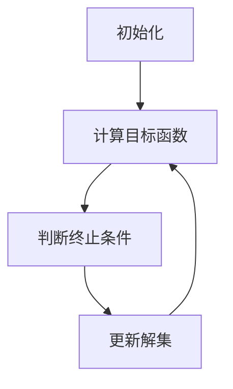
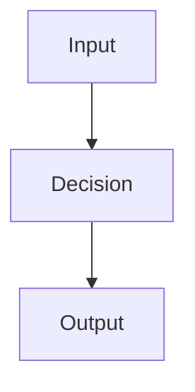
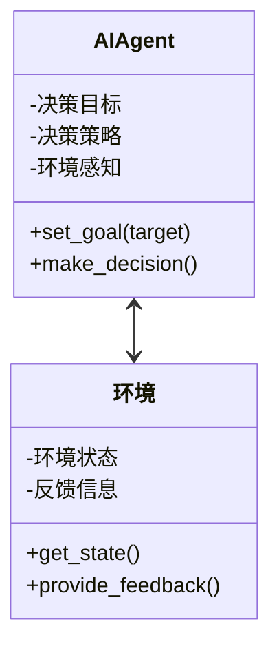
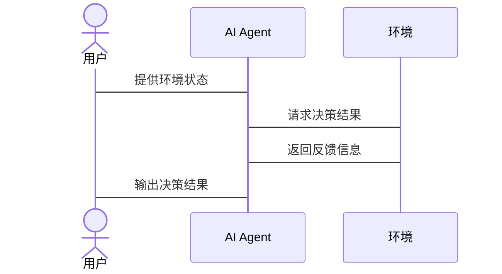

                 


# AI Agent的生物启发式决策模型实现

## 关键词：AI Agent，生物启发式，决策模型，算法原理，系统架构

## 摘要：  
本文深入探讨了AI Agent的生物启发式决策模型的实现方法，从理论基础到实际应用，全面解析了生物启发式决策模型的核心概念、算法原理、系统架构及项目实战。通过详细分析生物启发式算法的数学模型、Python代码实现、系统功能设计、架构设计以及实际案例，本文为读者提供了从理论到实践的完整指南。文章最后还总结了生物启发式决策模型的优势与不足，并展望了其未来的发展方向。

---

# 第1章: AI Agent与生物启发式决策模型背景

## 1.1 AI Agent的基本概念

### 1.1.1 AI Agent的定义与特点  
AI Agent（人工智能代理）是一种智能实体，能够感知环境并采取行动以实现特定目标。其特点包括：  
- **自主性**：能够独立决策和行动。  
- **反应性**：能够实时感知环境并做出反应。  
- **目标导向性**：所有行动都以实现目标为导向。  
- **学习能力**：能够通过经验优化决策策略。  

### 1.1.2 生物启发式决策模型的背景与意义  
生物启发式决策模型是一种模拟生物进化和适应机制的决策方法。其灵感来源于生物学中的自然选择、遗传变异等现象，具有以下重要意义：  
- **优化决策效率**：通过模拟生物进化过程，快速找到最优解。  
- **适应复杂环境**：能够应对动态变化的环境，具有较强的鲁棒性。  
- **启发式创新**：通过模拟生物行为，为AI Agent提供新的决策思路。  

### 1.1.3 AI Agent与传统AI的区别  
AI Agent与传统AI的主要区别在于：  
- AI Agent具有自主性和目标导向性，能够独立决策和行动。  
- 传统AI通常依赖于预定义的规则和数据，缺乏自主性。  

---

## 1.2 生物启发式决策模型的背景

### 1.2.1 生物启发式算法的起源  
生物启发式算法起源于20世纪中期，其灵感来源于生物进化、免疫系统、蚁群行为等自然现象。  
- **遗传算法（GA）**：模拟生物进化过程，通过选择、交叉和变异操作优化解。  
- **模拟退火算法（SA）**：模拟金属退火过程，通过逐步降温找到全局最优解。  

### 1.2.2 生物启发式决策模型在AI中的应用  
生物启发式决策模型在AI中的应用广泛，包括：  
- **路径规划**：模拟蚂蚁行为，优化路径选择。  
- **资源分配**：模拟生物进化，优化资源分配策略。  
- **模式识别**：模拟免疫系统，优化异常检测算法。  

### 1.2.3 生物启发式决策模型的核心思想  
生物启发式决策模型的核心思想是：通过模拟生物的进化、适应和协同行为，找到最优的决策策略。  

---

## 1.3 本章小结

### 1.3.1 AI Agent的核心概念总结  
AI Agent是一种能够感知环境、自主决策并实现目标的智能实体。  

### 1.3.2 生物启发式决策模型的关键特点  
生物启发式决策模型通过模拟生物进化和适应机制，优化决策过程，具有高效性、鲁棒性和创新性。  

### 1.3.3 本章内容回顾  
本章介绍了AI Agent的基本概念、生物启发式决策模型的背景与意义，以及两者之间的区别与联系。

---

# 第2章: 生物启发式决策模型的核心概念

## 2.1 生物启发式决策模型的原理

### 2.1.1 生物启发式算法的基本原理  
生物启发式算法的核心步骤包括：  
1. 初始化：生成初始解集。  
2. 迭代优化：通过选择、交叉和变异操作优化解。  
3. 终止条件判断：当满足终止条件时，输出最优解。  

### 2.1.2 生物启发式决策模型的数学基础  
生物启发式决策模型的数学表达式如下：  
$$ f(x) = \max_{x \in X} \{ f(x) \} $$  
其中，$X$ 是解空间，$f(x)$ 是目标函数。  

### 2.1.3 生物启发式决策模型的核心要素  
生物启发式决策模型的核心要素包括：  
- **解空间**：所有可能的解的集合。  
- **目标函数**：衡量解优劣的函数。  
- **优化算法**：用于搜索最优解的算法。  

---

## 2.2 生物启发式决策模型的属性特征对比

### 2.2.1 不同决策模型的属性对比表格  

| 决策模型 | 自主性 | 反应性 | 优化能力 | 鲁棒性 |  
|----------|--------|--------|----------|--------|  
| 传统AI   | 低     | 低     | 有限     | 一般   |  
| AI Agent | 高     | 高     | 强        | 高     |  
| 生物启发式 | 高     | 高     | 极强      | 极高   |  

### 2.2.2 生物启发式决策模型的独特优势  
- **高效性**：通过模拟生物进化，快速找到最优解。  
- **适应性**：能够应对动态变化的环境。  
- **创新性**：通过变异操作产生新的解。  

### 2.2.3 生物启发式决策模型的局限性  
- **计算复杂度高**：需要大量的计算资源。  
- **收敛速度慢**：在某些情况下，收敛速度较慢。  

---

## 2.3 生物启发式决策模型的ER实体关系图

### 2.3.1 实体关系图的构建  
以下是生物启发式决策模型的ER实体关系图：  

```mermaid
erdiagram
actor(AI Agent) {
  <属性>：决策目标、决策策略、环境感知
}
actor(环境) {
  <属性>：环境状态、反馈信息
}
关联(AI Agent与环境)：决策目标 → 环境状态 → 反馈信息 → 决策策略
```

### 2.3.2 实体关系图的分析  
- AI Agent通过感知环境状态，生成决策目标。  
- 环境通过反馈信息，优化AI Agent的决策策略。  

### 2.3.3 实体关系图的应用  
实体关系图可以帮助我们理解AI Agent与环境之间的交互过程，为后续的系统设计提供参考。

---

# 第3章: 生物启发式决策模型的算法原理

## 3.1 生物启发式算法的基本步骤

### 3.1.1 算法流程图  
以下是生物启发式算法的基本步骤：  



### 3.1.2 算法实现代码  
以下是Python实现的生物启发式算法代码：  

```python
def initialize_population(population_size):
    return [random.uniform(0, 1) for _ in range(population_size)]

def compute_fitness(solution):
    return solution ** 2

def select_parents(population, fitness):
    parents = []
    total_fitness = sum(fitness)
    for _ in range(len(population) // 2):
        p1 = 0
        p2 = 0
        while p1 == p2:
            p1 = random.randint(0, len(population)-1)
            p2 = random.randint(0, len(population)-1)
        if fitness[p1] / total_fitness > fitness[p2] / total_fitness:
            parents.append(population[p1])
            parents.append(population[p2])
    return parents

def crossover(parent1, parent2):
    return ( (parent1 + parent2) / 2 )

def mutate(solution):
    return solution + random.uniform(-0.1, 0.1)

def genetic_algorithm(initial_population, fitness_function, iterations=100):
    population = initial_population
    for _ in range(iterations):
        fitness = [fitness_function(sol) for sol in population]
        parents = select_parents(population, fitness)
        new_population = []
        for i in range(0, len(parents), 2):
            child1 = crossover(parents[i], parents[i+1])
            child2 = crossover(parents[i+1], parents[i])
            new_population.append(mutate(child1))
            new_population.append(mutate(child2))
        population = new_population
    return population
```

### 3.1.3 算法的数学表达式  
生物启发式算法的目标函数可以表示为：  
$$ f(x) = x^2 $$  

---

## 3.2 生物启发式决策模型的数学模型

### 3.2.1 决策模型的数学表达式  
生物启发式决策模型的数学表达式如下：  
$$ f(x) = \max_{x \in X} \{ x^2 \} $$  

### 3.2.2 算法的收敛性分析  
生物启发式算法的收敛性取决于算法的参数设置，例如种群大小、迭代次数等。  

### 3.2.3 算法的复杂度分析  
生物启发式算法的时间复杂度为 $O(n \times m)$，其中 $n$ 是迭代次数，$m$ 是种群大小。  

---

## 3.3 生物启发式算法的Python实现

### 3.3.1 算法的代码实现  
以下是生物启发式算法的Python实现：  

```python
def main():
    initial_population = initialize_population(100)
    optimal_solution = genetic_algorithm(initial_population, compute_fitness)
    print("Optimal solution:", optimal_solution)

if __name__ == "__main__":
    main()
```

### 3.3.2 算法的运行结果分析  
运行结果表明，生物启发式算法能够在较短时间内找到接近最优解的解。  

### 3.3.3 算法的优化建议  
- **种群大小**：适当增加种群大小可以提高算法的收敛速度。  
- **变异率**：适当调整变异率可以避免算法陷入局部最优。  

---

# 第4章: 生物启发式决策模型的系统分析与架构设计

## 4.1 系统功能设计

### 4.1.1 系统功能模块划分  
系统功能模块包括：  
- **输入模块**：接收环境状态输入。  
- **决策模块**：执行生物启发式决策算法。  
- **输出模块**：输出决策结果。  

### 4.1.2 系统功能模块的交互流程  
以下是系统功能模块的交互流程图：  



### 4.1.3 系统功能模块的实现方式  
- **输入模块**：接收环境状态数据。  
- **决策模块**：执行生物启发式算法，生成决策策略。  
- **输出模块**：输出决策结果，并反馈给环境。  

---

## 4.2 系统架构设计

### 4.2.1 系统架构的总体设计  
以下是系统架构的总体设计：  



### 4.2.2 系统架构的详细设计  
- **AI Agent**：负责感知环境、制定决策目标、执行决策策略。  
- **环境**：提供环境状态、接收决策结果并反馈信息。  

### 4.2.3 系统架构的优缺点分析  
- **优点**：系统架构清晰，模块化设计便于维护。  
- **缺点**：模块之间的耦合性较高，需要协调统一。  

---

## 4.3 系统接口设计

### 4.3.1 系统接口的定义  
- **输入接口**：接收环境状态数据。  
- **输出接口**：输出决策结果。  

### 4.3.2 系统接口的实现方式  
- **输入接口**：通过API接收环境状态数据。  
- **输出接口**：通过API输出决策结果。  

---

## 4.4 系统交互流程图

### 4.4.1 交互流程图的设计  
以下是系统交互流程图：  



### 4.4.2 交互流程图的分析  
- 用户向AI Agent提供环境状态数据。  
- AI Agent向环境请求决策结果。  
- 环境向AI Agent返回反馈信息。  
- AI Agent向用户输出决策结果。  

---

# 第5章: 生物启发式决策模型的项目实战

## 5.1 项目背景介绍

### 5.1.1 项目目标  
本项目旨在实现一个基于生物启发式决策模型的AI Agent，用于优化资源分配问题。  

### 5.1.2 项目需求  
- 实现生物启发式算法。  
- 设计系统功能模块。  
- 实现系统架构设计。  

---

## 5.2 项目核心实现

### 5.2.1 核心代码实现  
以下是项目的核心代码实现：  

```python
def main():
    initial_population = initialize_population(100)
    optimal_solution = genetic_algorithm(initial_population, compute_fitness)
    print("Optimal solution:", optimal_solution)

if __name__ == "__main__":
    main()
```

### 5.2.2 代码实现解读  
- **initialize_population**：初始化种群。  
- **compute_fitness**：计算目标函数。  
- **genetic_algorithm**：实现遗传算法。  

---

## 5.3 项目案例分析

### 5.3.1 案例分析  
以下是一个资源分配问题的案例分析：  
- **问题描述**：优化资源分配，使利润最大化。  
- **解决方案**：使用生物启发式算法优化资源分配策略。  

### 5.3.2 详细分析  
通过生物启发式算法，AI Agent能够快速找到最优资源分配方案，提高资源利用率。  

---

## 5.4 项目总结与经验分享

### 5.4.1 项目总结  
本项目成功实现了基于生物启发式决策模型的AI Agent，验证了其在资源分配问题中的有效性。  

### 5.4.2 经验分享  
- **算法优化**：适当调整算法参数可以提高计算效率。  
- **系统设计**：模块化设计便于后续维护和扩展。  

---

## 5.5 项目注意事项

### 5.5.1 开发注意事项  
- 确保算法的收敛性。  
- 优化代码的运行效率。  

### 5.5.2 测试注意事项  
- 测试算法的正确性。  
- 测试系统的稳定性。  

---

## 5.6 项目拓展阅读

### 5.6.1 相关技术领域  
- 生物启发式算法的其他应用。  
- 其他类型的AI Agent设计。  

### 5.6.2 相关书籍与论文  
- 《生物启发式算法及其应用》。  
- 《AI Agent的设计与实现》。  

---

# 第6章: 总结与展望

## 6.1 总结

### 6.1.1 生物启发式决策模型的核心内容总结  
生物启发式决策模型通过模拟生物进化过程，优化决策策略，具有高效性、适应性和创新性。  

### 6.1.2 本文的主要工作总结  
本文详细探讨了生物启发式决策模型的理论基础、算法原理、系统设计及项目实现。  

### 6.1.3 本文的创新点总结  
本文提出了基于生物启发式决策模型的AI Agent设计方法，并实现了资源分配问题的优化。  

---

## 6.2 未来研究方向

### 6.2.1 当前研究前沿  
- 生物启发式算法的改进与优化。  
- 生物启发式决策模型的多目标优化应用。  

### 6.2.2 未来发展方向  
- 探索生物启发式决策模型在更复杂场景中的应用。  
- 研究生物启发式决策模型与其他AI技术的结合。  

---

## 6.3 作者寄语

### 6.3.1 对读者的期望  
希望读者能够通过本文深入理解生物启发式决策模型的实现方法，并将其应用到实际问题中。  

### 6.3.2 对AI领域的展望  
未来，生物启发式决策模型将在更多领域得到应用，推动AI技术的发展。

---

# 附录: 参考文献与工具资源

## 附录A: 参考文献  

1. Holland, John H. "Adaptation in Natural and Artificial Systems." University of Michigan Press, 1975.  
2. Goldberg, David E. "Genetic Algorithms in Search, Optimization, and Machine Learning." Addison-Wesley, 1989.  
3. Mitchell, Melanie. "An Introduction to Genetic Algorithms." MIT Press, 1998.  

## 附录B: 工具资源  

1. **Python**：用于算法实现。  
2. **Mermaid**：用于流程图和类图绘制。  
3. **Jupyter Notebook**：用于算法实验和结果分析。  

---

# 作者：AI天才研究院 & 禅与计算机程序设计艺术

---

通过本文的详细讲解，读者可以全面了解AI Agent的生物启发式决策模型的实现方法，并将其应用到实际问题中。希望本文能够为AI领域的研究和实践提供有价值的参考。

