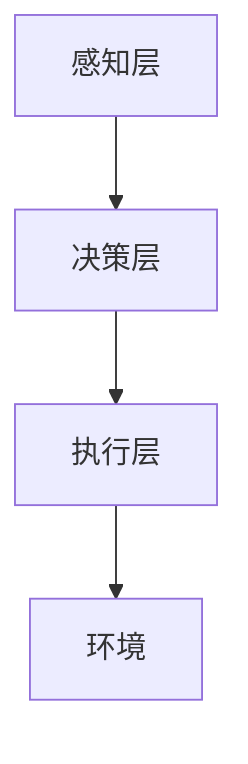
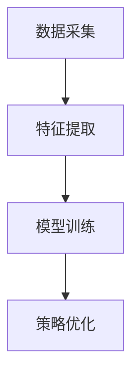

                 


# AI Agent的生物启发式学习算法实现

> 关键词：AI Agent, 生物启发式学习, 神经网络, 遗传算法, 强化学习

> 摘要：本文系统地探讨了AI Agent的生物启发式学习算法实现，从基本概念到核心原理，从算法实现到系统架构设计，再到项目实战，全面解析了生物启发式学习在AI Agent中的应用。文章结合理论与实践，详细讲解了神经网络、遗传算法、强化学习等算法的原理及实现，并通过实际案例展示了如何构建高效的AI Agent系统。

---

# 第一部分: AI Agent的生物启发式学习算法基础

## 第1章: AI Agent与生物启发式学习概述

### 1.1 AI Agent的基本概念

#### 1.1.1 什么是AI Agent
AI Agent（人工智能代理）是指能够感知环境、自主决策并采取行动以实现目标的智能实体。AI Agent可以是软件程序、机器人或其他智能系统，其核心在于具备自主性、反应性和目标导向性。

#### 1.1.2 AI Agent的核心特征
- **自主性**：AI Agent能够在没有外部干预的情况下独立运作。
- **反应性**：AI Agent能够感知环境并实时调整行为。
- **目标导向性**：AI Agent的所有行动都是为了实现特定目标。
- **学习能力**：通过学习算法，AI Agent能够优化决策策略。

#### 1.1.3 AI Agent的应用场景
AI Agent广泛应用于自动驾驶、智能客服、推荐系统、游戏AI、机器人控制等领域。例如，自动驾驶汽车中的AI Agent需要实时感知环境并做出驾驶决策。

### 1.2 生物启发式学习的背景

#### 1.2.1 生物启发式学习的定义
生物启发式学习（Biologically Inspired Learning）是指从生物学中汲取灵感，模拟生物的学习机制和行为模式，从而设计出更高效、更自然的人工智能算法。例如，神经网络的灵感来源于人脑的神经结构。

#### 1.2.2 生物启发式学习的起源与发展
生物启发式学习的起源可以追溯到20世纪40年代，当时科学家们开始研究神经网络的结构和功能。随着计算能力的提升，生物启发式学习在20世纪80年代开始逐渐成熟，并在近年来随着深度学习的兴起而快速发展。

#### 1.2.3 生物启发式学习与传统机器学习的区别
| **对比维度** | **生物启发式学习** | **传统机器学习** |
|--------------|---------------------|-------------------|
| **灵感来源** | 生物系统（如神经网络、进化机制） | 数学模型和统计方法 |
| **算法特点** | 非线性、自适应、分布式 | 线性、规则驱动、集中式 |
| **应用场景** | 复杂环境中的自主决策 | 数据模式识别、分类 |

### 1.3 AI Agent与生物启发式学习的结合

#### 1.3.1 生物启发式学习在AI Agent中的作用
生物启发式学习为AI Agent提供了更自然的学习方式，使其能够像生物体一样从经验中学习和适应环境。

#### 1.3.2 生物启发式学习的核心思想
生物启发式学习的核心思想是模拟生物的学习机制，例如神经网络的信号传递、遗传算法的适应性进化等。

#### 1.3.3 生物启发式学习的优势与挑战
- **优势**：能够处理非结构化数据、适应复杂环境、具备自适应能力。
- **挑战**：计算复杂度高、算法收敛速度慢、需要大量训练数据。

---

## 第2章: 生物启发式学习的核心原理

### 2.1 生物启发式学习的基本原理

#### 2.1.1 生物启发式学习的数学模型
生物启发式学习的数学模型通常基于非线性函数，例如：
$$ y = f(x) \text{，其中 } f \text{ 是激活函数（如Sigmoid、ReLU）} $$

#### 2.1.2 生物启发式学习的算法流程
生物启发式学习的算法流程通常包括以下步骤：
1. 初始化参数。
2. 计算输出。
3. 计算误差。
4. 更新参数。
5. 重复迭代。

#### 2.1.3 生物启发式学习的核心要素
- **神经网络**：模拟生物神经系统的结构。
- **权重更新**：通过梯度下降等方法优化参数。
- **激活函数**：引入非线性特性。

### 2.2 生物启发式学习的关键技术

#### 2.2.1 神经网络的生物启发式建模
神经网络的生物启发式建模是通过模拟人脑神经元的结构和功能来设计算法。例如，卷积神经网络（CNN）的结构灵感来源于生物视觉系统。

#### 2.2.2 遗传算法的生物启发式优化
遗传算法是一种基于自然选择和遗传机制的优化算法。其核心步骤包括：
1. 初始化种群。
2. 计算适应度。
3. 选择优秀个体。
4. 进行交叉和变异。
5. 重复迭代。

#### 2.2.3 进化策略的生物启发式应用
进化策略是一种基于自然选择的优化算法，通常用于解决复杂的优化问题。

### 2.3 生物启发式学习的数学模型与公式

#### 2.3.1 神经网络的数学表达
神经网络的数学表达如下：
$$ y = f(xW + b) \text{，其中 } f \text{ 是激活函数，} W \text{ 是权重矩阵，} b \text{ 是偏置项} $$

#### 2.3.2 遗传算法的适应度函数
遗传算法的适应度函数用于衡量个体的优劣：
$$ \text{适应度} = \sum w_i x_i \text{，其中 } w_i \text{ 是权重，} x_i \text{ 是输入} $$

### 2.4 本章小结

---

## 第3章: AI Agent的生物启发式学习算法实现

### 3.1 生物启发式学习算法的分类

#### 3.1.1 基于神经网络的生物启发式算法
基于神经网络的生物启发式算法包括卷积神经网络（CNN）、循环神经网络（RNN）等。

#### 3.1.2 基于遗传算法的生物启发式算法
基于遗传算法的生物启发式算法包括遗传编程、进化策略等。

#### 3.1.3 基于强化学习的生物启发式算法
基于强化学习的生物启发式算法包括Q-learning、Deep Q-Network（DQN）等。

### 3.2 强化学习算法的实现

#### 3.2.1 强化学习的基本原理
强化学习是一种通过试错机制来优化决策策略的算法。其核心在于通过与环境的交互来获得奖励，并根据奖励调整策略。

#### 3.2.2 强化学习的数学模型
强化学习的数学模型通常包括状态（State）、动作（Action）、奖励（Reward）和策略（Policy）四个部分：
$$ R = r(s, a) \text{，其中 } s \text{ 是状态，} a \text{ 是动作，} R \text{ 是奖励} $$

#### 3.2.3 强化学习的实现代码
```python
import numpy as np
import gym

env = gym.make('CartPole-v0')
env.seed(42)

# 初始化参数
theta = np.random.randn(4, 1)
learning_rate = 0.01

# 训练过程
for episode in range(1000):
    state = env.reset()
    while True:
        action = np.dot(state, theta)[0]
        if action > 0:
            action = 1
        else:
            action = 0
        state, reward, done, info = env.step(action)
        if done:
            break
```

### 3.3 遗传算法的实现

#### 3.3.1 遗传算法的基本原理
遗传算法是一种基于自然选择和遗传机制的优化算法，通常用于解决复杂的优化问题。

#### 3.3.2 遗传算法的数学模型
遗传算法的数学模型通常包括种群（Population）、适应度函数（Fitness Function）、选择（Selection）、交叉（Crossover）和变异（Mutation）。

#### 3.3.3 遗传算法的实现代码
```python
import numpy as np

# 初始化种群
population = np.random.rand(10, 2)

# 计算适应度
fitness = np.sum(population, axis=1)

# 选择优秀个体
selected = np.argsort(fitness)[-5:]

# 交叉和变异
new_population = np.zeros_like(population)
for i in range(5):
    parent1 = population[selected[i], :]
    parent2 = population[selected[-i-1], :]
    child = (parent1 + parent2) / 2
    new_population[i] = child
```

### 3.4 本章小结

---

## 第4章: AI Agent的生物启发式学习系统设计与实现

### 4.1 系统设计

#### 4.1.1 系统架构设计
AI Agent的生物启发式学习系统架构通常包括感知层、决策层和执行层。

#### 4.1.2 系统功能设计
系统功能设计包括数据采集、特征提取、模型训练、策略优化等。

#### 4.1.3 系统接口设计
系统接口设计包括输入接口、输出接口和通信接口。

### 4.2 系统架构设计

#### 4.2.1 系统架构图


#### 4.2.2 系统功能图


### 4.3 系统实现

#### 4.3.1 环境搭建
需要安装Python、TensorFlow、OpenAI Gym等依赖库。

#### 4.3.2 核心算法实现
核心算法包括神经网络、遗传算法和强化学习的实现。

#### 4.3.3 系统测试
系统测试包括功能测试、性能测试和稳定性测试。

### 4.4 本章小结

---

## 第5章: 项目实战——基于生物启发式学习的AI Agent实现

### 5.1 项目背景

#### 5.1.1 项目目标
本项目旨在实现一个基于生物启发式学习的AI Agent，能够通过与环境的交互来优化决策策略。

### 5.2 项目实现

#### 5.2.1 环境搭建
需要安装以下依赖：
```bash
pip install numpy gym tensorflow
```

#### 5.2.2 核心算法实现
```python
import numpy as np
import gym

# 初始化环境
env = gym.make('CartPole-v0')
env.seed(42)

# 初始化参数
theta = np.random.randn(4, 1)
learning_rate = 0.01

# 训练过程
for episode in range(1000):
    state = env.reset()
    while True:
        action = np.dot(state, theta)[0]
        if action > 0:
            action = 1
        else:
            action = 0
        state, reward, done, info = env.step(action)
        if done:
            break
```

#### 5.2.3 系统集成与测试
通过与环境的交互，验证算法的收敛性和稳定性。

### 5.3 项目总结

#### 5.3.1 实验结果分析
通过实验验证算法的收敛性和稳定性。

#### 5.3.2 实验结果展示
展示训练过程中的奖励曲线和最终结果。

### 5.4 本章小结

---

## 第6章: 总结与展望

### 6.1 全文总结
本文系统地探讨了AI Agent的生物启发式学习算法实现，从基本概念到核心原理，从算法实现到系统架构设计，再到项目实战，全面解析了生物启发式学习在AI Agent中的应用。

### 6.2 未来展望
未来的研究方向包括优化算法的效率、提升系统的泛化能力、拓展应用场景等。

### 6.3 最佳实践 Tips
- 在实际应用中，建议结合具体场景选择合适的算法。
- 注意算法的收敛性和稳定性，避免陷入局部最优。
- 保持对算法的持续优化和改进。

---

# 作者：AI天才研究院/AI Genius Institute & 禅与计算机程序设计艺术 /Zen And The Art of Computer Programming

