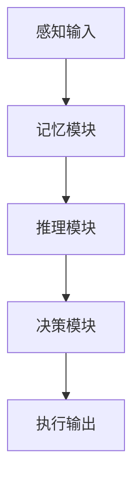
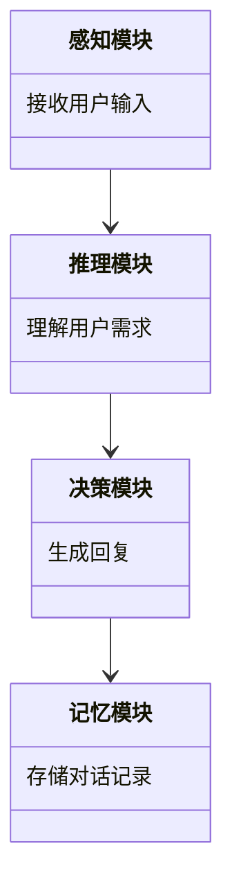
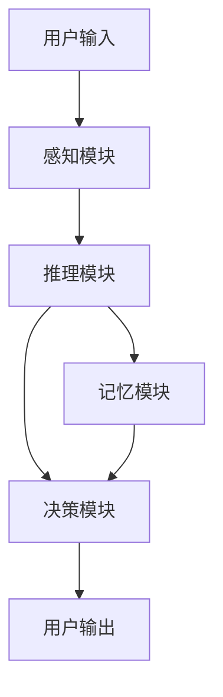

                 


# AI Agent的生物启发式认知架构实现

> 关键词：AI Agent, 生物启发式认知架构, 认知科学, 人工智能, 系统架构设计

> 摘要：本文系统地介绍AI Agent的生物启发式认知架构实现，从背景、概念、算法到系统设计和项目实战，全面解析如何通过生物认知系统启发构建更高效的AI Agent架构。通过对比分析、数学建模、系统架构设计和项目实现，深入探讨生物启发式认知架构的核心原理和实际应用。

---

## 第一部分：AI Agent与生物启发式认知架构概述

### 第1章：AI Agent的基本概念

#### 1.1 什么是AI Agent
AI Agent（人工智能代理）是一种能够感知环境、自主决策并采取行动的智能实体。它能够根据环境信息做出反应，完成特定任务，是人工智能领域的重要研究方向。

#### 1.2 AI Agent的核心特征
AI Agent具有以下几个核心特征：
- **自主性**：能够在没有外部干预的情况下自主运行。
- **反应性**：能够实时感知环境并做出反应。
- **主动性**：能够主动采取行动以实现目标。
- **社会性**：能够与其他Agent或人类进行交互协作。

#### 1.3 生物启发式认知架构的定义
生物启发式认知架构是一种基于生物认知系统（如人类大脑）的启发，构建的AI Agent认知模型。它模拟生物认知过程，如感知、记忆、推理和决策，以实现更高效的智能行为。

---

### 第2章：生物启发式认知架构的背景与意义

#### 2.1 生物认知系统的启发
生物认知系统（如人类大脑）通过感知、记忆、推理和决策完成复杂的认知任务。其特点是高效性、适应性和灵活性，为AI Agent的架构设计提供了重要启发。

#### 2.2 传统AI架构的局限性
传统AI架构（如基于规则的系统或基于逻辑推理的系统）往往依赖于预定义的规则，难以应对复杂动态环境，缺乏灵活性和自适应性。

#### 2.3 生物启发式认知架构的优势
生物启发式认知架构通过模拟生物认知过程，能够在动态复杂的环境中实现自适应和自主决策，具有更强的鲁棒性和灵活性。

---

## 第二部分：生物启发式认知架构的核心概念与联系

### 第3章：生物启发式认知架构的核心概念

#### 3.1 生物启发式认知架构的原理
生物启发式认知架构通过模拟生物认知过程，将感知、记忆、推理和决策等模块有机结合，实现智能行为。其核心原理包括：
- **感知**：通过传感器或数据输入获取环境信息。
- **记忆**：存储和检索相关信息，支持推理和决策。
- **推理**：基于感知信息和记忆知识，进行逻辑推理。
- **决策**：根据推理结果做出最优决策。

#### 3.2 核心概念对比分析
以下是生物启发式认知架构与传统AI架构的核心概念对比：

| 概念 | 生物启发式认知架构 | 传统AI架构 |
|------|-------------------|------------|
| 感知 | 基于实时数据流    | 预定义规则 |
| 记忆 | 类似人脑存储机制  | 静态知识库 |
| 推理 | 基于动态信息推理  | 基于逻辑推理 |
| 决策 | 动态优化决策      | 静态规则驱动 |

#### 3.3 生物启发式认知架构的层次结构
生物启发式认知架构的层次结构如下：

```
+----------------+
|                |
|     决策层     |
|                |
+----------------+      +----------------+
|                |      |                |
|     推理层     |      |     行为层     |
|                |      |                |
+----------------+      +----------------+
                  |
                  |
+----------------+      +----------------+
|                |      |                |
|     感知层     |      |     执行层     |
|                |      |                |
+----------------+      +----------------+
```

---

## 第三部分：生物启发式认知架构的数学模型与算法原理

### 第4章：生物启发式认知架构的数学模型

#### 4.1 记忆模块的数学模型
记忆模块通过概率图模型表示知识存储与检索。例如，记忆存储可以表示为图结构，节点表示知识单元，边表示关联关系。

$$ P(A|B) = \frac{P(B|A)P(A)}{P(B)} $$

#### 4.2 推理模块的数学模型
推理模块基于贝叶斯推理进行逻辑推理，公式如下：

$$ P(C|A,B) = \frac{P(A|C)P(B|C)P(C)}{P(A,B)} $$

#### 4.3 决策模块的数学模型
决策模块通过Q-learning算法进行最优决策，公式如下：

$$ Q(s,a) = r + \gamma \max Q(s',a') $$

---

### 第5章：生物启发式认知架构的算法实现

#### 5.1 算法流程图
以下是生物启发式认知架构的算法流程图：



---

## 第四部分：生物启发式认知架构的系统分析与架构设计

### 第6章：系统分析与架构设计

#### 6.1 问题场景与项目介绍
假设我们正在开发一个智能客服AI Agent，需要实现以下功能：
- 感知：接收用户的输入信息。
- 记忆：存储用户的历史对话记录。
- 推理：理解用户需求并生成回复。
- 决策：根据推理结果生成最终回复。

#### 6.2 系统功能设计
以下是系统功能模块划分：



#### 6.3 系统架构设计
以下是系统架构图：



---

## 第五部分：生物启发式认知架构的项目实战

### 第7章：项目实战

#### 7.1 环境安装与配置
- 安装Python 3.8及以上版本。
- 安装必要的依赖库：`numpy`, `pandas`, `scikit-learn`.

#### 7.2 核心代码实现
以下是感知模块的实现代码：

```python
import numpy as np

def感知数据处理(input_data):
    # 数据预处理
    processed_data = input_data.lower().split()
    return processed_data

# 示例调用
input_data = "用户输入：我需要帮助"
processed_data = 感知数据处理(input_data)
print(processed_data)
```

#### 7.3 实际案例分析
假设用户输入为“我需要帮助”，感知模块将其处理为关键词列表`["我", "需要", "帮助"]，推理模块理解用户需求并生成回复。

---

## 第六部分：总结与展望

### 第8章：总结与展望

#### 8.1 最佳实践 tips
- 在实际应用中，建议结合具体场景优化各模块的实现。
- 使用实时数据流处理技术提升感知模块的效率。
- 定期更新知识库以保持记忆模块的有效性。

#### 8.2 小结
本文系统地介绍了AI Agent的生物启发式认知架构实现，从核心概念、算法原理到系统设计和项目实战，全面解析了如何通过生物认知系统的启发构建高效的AI Agent架构。

#### 8.3 注意事项
- 确保感知模块的实时性和准确性。
- 合理设计记忆模块的存储机制，避免数据冗余。
- 在决策模块中引入多种推理方法，提升决策的灵活性。

#### 8.4 拓展阅读
推荐阅读以下书籍和论文：
- 《人脑的奥秘》
- 《人工智能：一种现代的方法》
- 《基于生物认知系统的智能体设计》

---

作者：AI天才研究院/AI Genius Institute & 禅与计算机程序设计艺术 /Zen And The Art of Computer Programming

