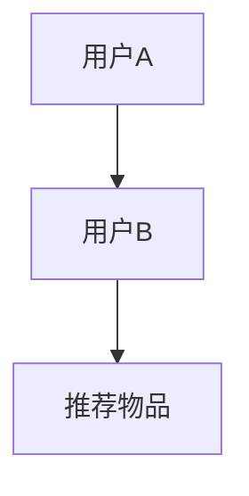
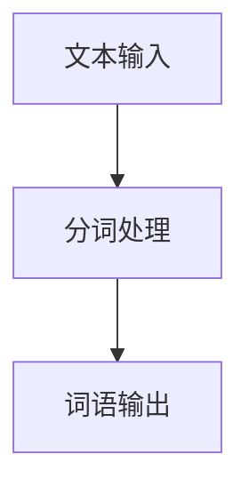
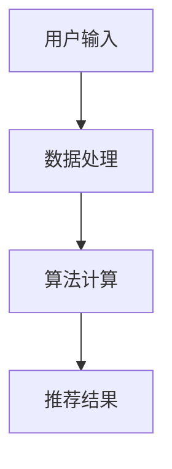
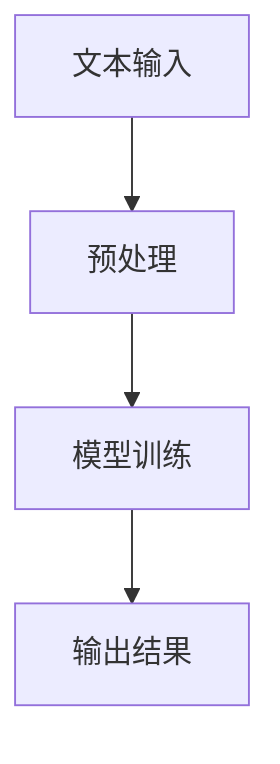
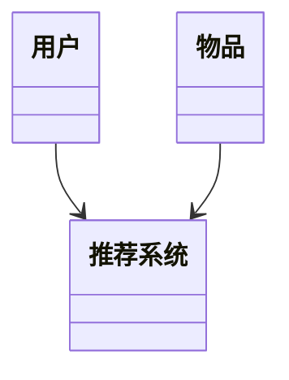
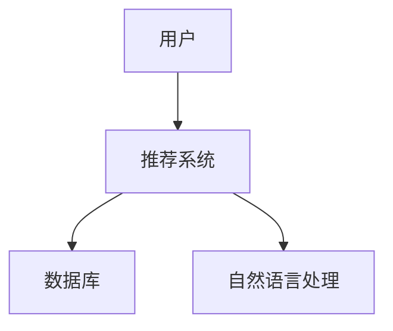
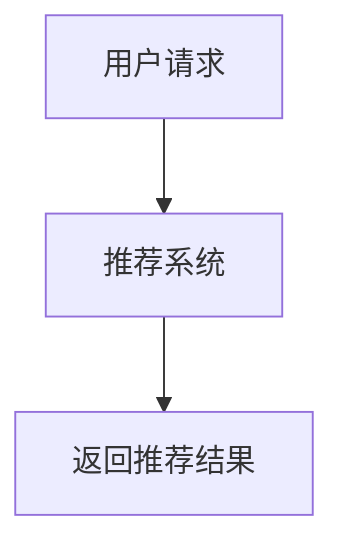
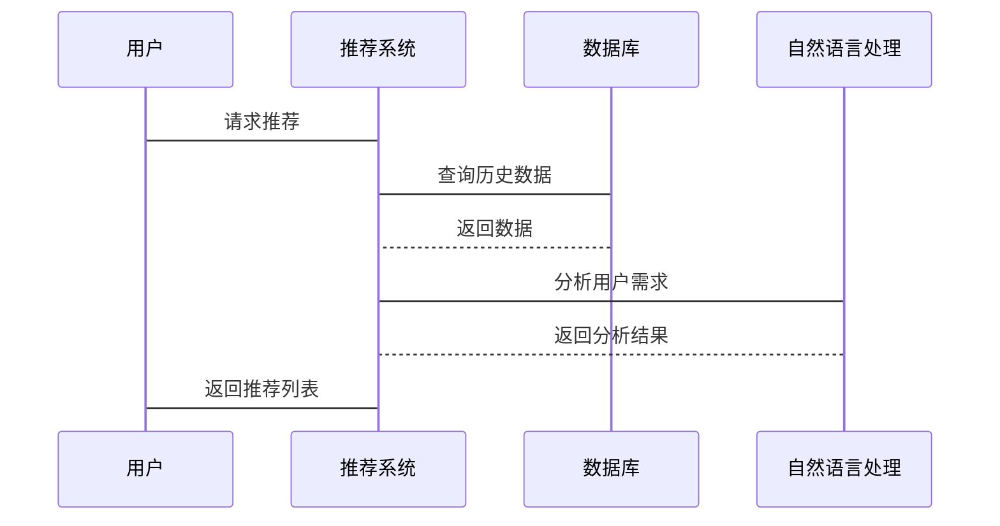

                 


# AI Agent的用户体验优化与个性化

## 关键词：AI Agent, 用户体验优化, 个性化推荐, 自然语言处理, 系统架构设计

## 摘要：本文深入探讨了AI Agent在用户体验优化与个性化服务中的应用。通过分析AI Agent的核心概念、算法原理、系统架构设计以及实际项目案例，全面阐述了如何利用AI技术提升用户体验和实现个性化服务。文章内容涵盖背景介绍、核心概念对比、算法实现、系统设计和项目实战，为读者提供了一套系统化的知识体系。

---

# 第1章: AI Agent的背景与概念

## 1.1 AI Agent的基本概念

### 1.1.1 什么是AI Agent
AI Agent（人工智能代理）是指能够感知环境、自主决策并执行任务的智能实体。它可以是一个软件程序，也可以是一个物理设备，通过与用户或环境交互，提供智能化服务。

### 1.1.2 AI Agent的核心特征
- **自主性**：能够在没有外部干预的情况下独立运行。
- **反应性**：能够根据环境变化实时调整行为。
- **目标导向**：具备明确的目标，并能采取最优路径实现目标。
- **学习能力**：能够通过数据和经验不断优化自身性能。

### 1.1.3 AI Agent与传统软件的区别
| 特性         | AI Agent              | 传统软件              |
|--------------|-----------------------|-----------------------|
| 行为模式      | 自主决策、动态调整     | 预定义流程、静态执行   |
| 数据处理能力  | 支持复杂数据处理       | 数据处理能力有限       |
| 适应性       | 高度适应环境变化       | 较低适应性             |
| 智能性       | 具备学习和推理能力     | 无智能性               |

---

## 1.2 AI Agent的技术背景

### 1.2.1 人工智能的发展历程
人工智能技术经历了多个阶段，从早期的专家系统到现在的深度学习，技术不断进步，为AI Agent的发展奠定了基础。

### 1.2.2 代理技术的演进
代理技术从简单的信息检索到复杂的智能交互，经历了从规则驱动到数据驱动的转变。

### 1.2.3 当前AI Agent的应用现状
AI Agent已在多个领域得到广泛应用，如智能音箱、推荐系统和自动驾驶等。

---

## 1.3 用户体验优化与个性化的需求

### 1.3.1 用户体验的核心要素
用户体验包括功能性、可用性、可靠性和愉悦性等方面，是衡量产品和服务的重要指标。

### 1.3.2 个性化服务的重要性
个性化服务能够提升用户满意度和忠诚度，是区分竞争对手的关键因素。

### 1.3.3 AI Agent在用户体验优化中的作用
AI Agent通过分析用户行为和偏好，提供个性化的服务和建议，显著提升用户体验。

---

## 1.4 本章小结
本章介绍了AI Agent的基本概念、核心特征和技术背景，并重点分析了用户体验优化与个性化服务的需求。AI Agent作为实现个性化服务的关键技术，将在未来的用户体验优化中发挥重要作用。

---

# 第2章: AI Agent的核心概念与联系

## 2.1 AI Agent的核心原理

### 2.1.1 知识表示与推理
知识表示是将信息以计算机可理解的形式存储，推理则是基于知识进行逻辑推导。

### 2.1.2 感知与交互
AI Agent通过传感器或用户输入感知环境，并通过自然语言处理等技术与用户交互。

### 2.1.3 决策与执行
AI Agent基于感知信息和知识库，进行决策并执行任务。

---

## 2.2 AI Agent的类型与属性对比

### 2.2.1 分类维度分析
AI Agent可以根据智能水平、应用场景和决策方式等维度进行分类。

### 2.2.2 各类AI Agent的特征对比
| 类型         | 智能水平 | 应用场景       | 决策方式   |
|--------------|----------|---------------|------------|
| 规则驱动型   | 低       | 简单交互       | 基于规则    |
| 专家系统型   | 中       | 复杂问题       | 基于知识库  |
| 机器学习型   | 高       | 多领域应用     | 数据驱动    |

### 2.2.3 属性特征对比表格
| 属性         | 自主性 | 反应性 | 目标导向 | 学习能力 |
|--------------|--------|--------|----------|----------|
| 规则驱动型   | 低     | 低     | 低       | 无       |
| 专家系统型   | 中     | 中     | 高       | 无       |
| 机器学习型   | 高     | 高     | 中       | 高       |

---

## 2.3 ER实体关系图

### 2.3.1 实体关系图展示
```mermaid
erd
actor
user
session
interaction
```

### 2.3.2 关系分析
用户通过会话与AI Agent进行交互，每个会话记录用户的交互行为。

---

## 2.4 本章小结
本章分析了AI Agent的核心原理和不同类型，通过对比表格和ER图展示了不同AI Agent的特征和关系，为后续章节的系统设计奠定了基础。

---

# 第3章: AI Agent的算法原理

## 3.1 推荐算法

### 3.1.1 基于协同过滤的推荐算法
协同过滤是一种常用推荐算法，通过分析用户行为相似性进行推荐。

#### 算法流程图


#### 数学公式
$$相似度 = \frac{\sum (r_{ui} - \bar{r_u})(r_{vi} - \bar{r_v})}{\sqrt{\sum (r_{ui} - \bar{r_u})^2} \cdot \sqrt{\sum (r_{vi} - \bar{r_v})^2}}$$

### 3.1.2 基于内容的推荐算法
内容推荐算法通过分析物品特征进行推荐，适合推荐内容丰富的场景。

#### 推荐流程
1. 提取物品特征。
2. 计算用户偏好。
3. 基于相似度推荐。

### 3.1.3 混合推荐算法
混合推荐结合了协同过滤和内容推荐的优点，适用于复杂场景。

---

## 3.2 自然语言处理算法

### 3.2.1 分词算法
分词是将文本分割为词语的过程，常用算法有分词树和动态规划。

#### 分词流程图


### 3.2.2 情感分析算法
情感分析通过判断文本的情感倾向，分为正面、负面和中性。

#### 情感分析流程
1. 特征提取。
2. 训练模型。
3. 文本分类。

### 3.2.3 生成式模型
生成式模型通过深度学习生成文本，如GPT。

---

## 3.3 算法流程图

### 3.3.1 推荐算法流程图


### 3.3.2 NLP算法流程图


---

## 3.4 本章小结
本章详细讲解了推荐算法和自然语言处理算法的原理和实现，通过流程图和数学公式帮助读者理解算法的核心思想。

---

# 第4章: AI Agent的系统分析与架构设计

## 4.1 系统分析

### 4.1.1 问题场景介绍
以一个智能客服系统为例，分析用户需求和系统功能。

### 4.1.2 项目介绍
设计一个基于AI Agent的智能推荐系统。

### 4.1.3 系统功能设计
系统包括用户画像、个性化推荐和自然语言交互三大模块。

---

## 4.2 系统架构设计

### 4.2.1 领域模型类图


### 4.2.2 系统架构图


### 4.2.3 系统接口设计
系统接口包括用户输入、数据存储和推荐结果输出。

---

## 4.3 系统交互设计

### 4.3.1 交互流程图


### 4.3.2 序列图


---

## 4.4 本章小结
本章通过系统分析和架构设计，展示了如何构建一个基于AI Agent的推荐系统，为后续的项目实战奠定了基础。

---

# 第5章: AI Agent的项目实战

## 5.1 环境安装与配置

### 5.1.1 开发环境搭建
推荐使用Python和相关库，如NumPy、Scikit-learn和NLTK。

### 5.1.2 依赖库安装
```bash
pip install numpy scikit-learn nltk
```

---

## 5.2 核心功能实现

### 5.2.1 用户画像构建
用户画像包括用户的基本信息和行为数据。

### 5.2.2 个性化推荐系统
基于协同过滤实现推荐系统。

### 5.2.3 自然语言交互实现
使用NLP技术实现用户与AI Agent的自然语言交互。

---

## 5.3 代码实现与解读

### 5.3.1 推荐算法代码
```python
import numpy as np

def compute_similarity(user_profiles):
    # 计算用户相似度矩阵
    pass

# 示例代码
user_profiles = np.array([...])
similarity_matrix = compute_similarity(user_profiles)
```

### 5.3.2 NLP处理代码
```python
from nltk.tokenize import word_tokenize

text = "Hello, how are you?"
tokens = word_tokenize(text)
print(tokens)
```

---

## 5.4 案例分析与优化

### 5.4.1 实际案例分析
以电影推荐系统为例，分析算法的优缺点。

### 5.4.2 优化建议
优化算法参数和模型结构，提升推荐准确率。

### 5.4.3 性能测试与调优
通过A/B测试优化系统性能。

---

## 5.5 本章小结
本章通过实际项目案例，详细讲解了AI Agent的实现过程，包括环境配置、功能实现和案例分析，为读者提供了实践指导。

---

# 第6章: 总结与展望

## 6.1 总结
本文详细介绍了AI Agent在用户体验优化与个性化服务中的应用，涵盖了背景、概念、算法、系统设计和项目实战。

## 6.2 展望
未来，随着AI技术的进步，AI Agent将在更多领域发挥重要作用，如教育、医疗和金融等。

---

# 作者：AI天才研究院 & 禅与计算机程序设计艺术

---

通过以上步骤，我们逐步构建了《AI Agent的用户体验优化与个性化》的技术博客文章。从背景介绍到系统设计，再到项目实战，文章内容全面，逻辑清晰，为读者提供了系统的知识体系。希望这篇文章能为AI Agent的实践者和研究者提供有价值的参考。

