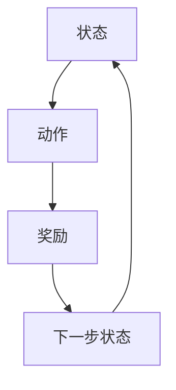
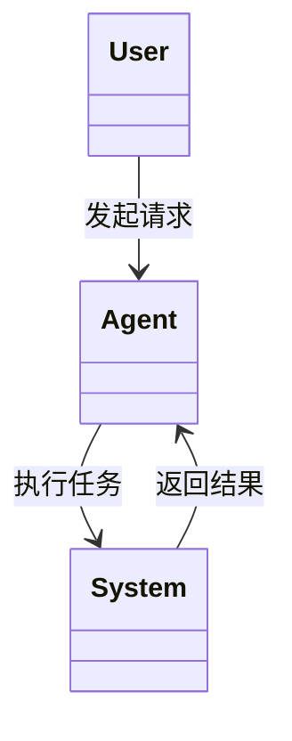
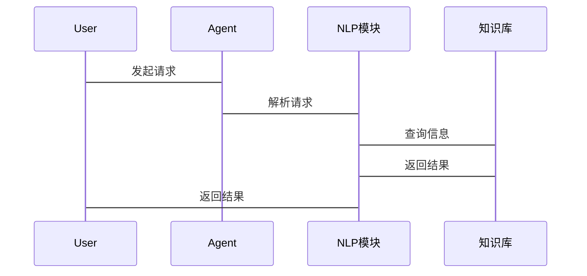

                 


# AI Agent的用户体验设计：提升交互效率与满意度

## 关键词：
- AI Agent
- 用户体验设计
- 交互效率
- 用户满意度
- 人工智能

## 摘要：
本文探讨了AI Agent在用户体验设计中的重要性，分析了如何通过优化设计来提升交互效率和用户满意度。文章从AI Agent的基本概念入手，详细讲解了其核心算法和系统架构，并通过实际案例展示了如何在实践中应用这些理论。最后，本文总结了设计AI Agent用户体验的关键点，为读者提供了实用的指导和建议。

---

# 第一部分: AI Agent的用户体验设计基础

## 第1章: AI Agent与用户体验概述

### 1.1 AI Agent的基本概念
#### 1.1.1 AI Agent的定义与分类
AI Agent（人工智能代理）是指能够感知环境并采取行动以实现目标的智能实体。根据功能和应用场景的不同，AI Agent可以分为以下几类：
- **基于规则的AI Agent**：通过预定义的规则进行决策，适用于简单任务。
- **基于机器学习的AI Agent**：利用数据和模型进行学习，适用于复杂任务。
- **基于强化学习的AI Agent**：通过与环境的交互学习，适用于动态环境中的任务。

#### 1.1.2 AI Agent的核心特征
- **自主性**：能够在没有外部干预的情况下自主决策。
- **反应性**：能够实时感知环境并做出反应。
- **目标导向性**：所有行动都以实现特定目标为导向。
- **适应性**：能够根据环境的变化调整行为。

#### 1.1.3 用户体验设计的定义与目标
用户体验设计（UX Design）是指通过设计用户与产品交互的方式，提升用户的满意度和使用效率。在AI Agent设计中，用户体验目标包括：
- **直观性**：用户能够轻松理解和使用AI Agent。
- **高效性**：AI Agent能够快速响应并提供准确的结果。
- **情感共鸣**：AI Agent的行为能够满足用户的情感需求。

### 1.2 AI Agent与用户体验的关系
#### 1.2.1 AI Agent如何影响用户体验
AI Agent通过提供个性化服务、快速响应和智能决策，显著提升了用户体验。例如，智能助手（如Siri、Alexa）通过自然语言处理技术，让用户能够以口语化的方式与设备交互。

#### 1.2.2 用户体验在AI Agent设计中的重要性
用户体验是AI Agent成功的关键因素。如果用户的交互体验不佳，即使AI Agent功能强大，用户也会放弃使用。因此，在设计AI Agent时，必须将用户体验放在首位。

#### 1.2.3 AI Agent与传统交互设计的区别
传统的交互设计主要关注界面布局和操作流程，而AI Agent设计需要考虑更多动态因素，例如：
- **动态环境适应**：AI Agent需要实时调整策略以应对环境变化。
- **复杂决策逻辑**：AI Agent需要处理多维度的信息并做出最优决策。
- **情感化设计**：AI Agent需要通过语调、语气等方式与用户建立情感连接。

### 1.3 AI Agent的应用场景
#### 1.3.1 智能助手（如Siri、Alexa）
智能助手通过语音交互帮助用户完成日常任务，如设置提醒、查询天气等。

#### 1.3.2 智能推荐系统
AI Agent可以根据用户的偏好和行为，推荐个性化的内容，如电影、音乐、购物推荐等。

#### 1.3.3 游戏中的AI Agent
在游戏场景中，AI Agent可以作为NPC（非玩家角色）与玩家互动，提供游戏提示或参与剧情发展。

#### 1.3.4 其他典型应用案例
- **医疗领域**：AI Agent可以辅助医生进行诊断和治疗方案推荐。
- **金融领域**：AI Agent可以提供个性化的投资建议和风险管理。

---

## 第2章: AI Agent的核心概念与联系

### 2.1 AI Agent的核心概念原理
#### 2.1.1 感知层
感知层是AI Agent获取信息的渠道，包括：
- **输入方式**：文本、语音、图像等多模态输入。
- **信息处理**：通过NLP（自然语言处理）技术理解用户意图。

#### 2.1.2 决策层
决策层是AI Agent的核心，负责根据感知层获取的信息做出决策。常用的算法包括：
- **基于规则的决策**：通过预定义的规则进行决策。
- **基于机器学习的决策**：利用分类、回归等算法进行预测。
- **基于强化学习的决策**：通过试错和奖励机制优化决策策略。

#### 2.1.3 行动层
行动层是AI Agent与外界交互的接口，包括：
- **输出方式**：自然语言生成、动作执行等。
- **执行机制**：通过API或用户界面完成具体操作。

### 2.2 核心概念属性特征对比表
| 概念 | 属性 | 特征 |
|------|------|------|
| 感知层 | 输入方式 | 多模态输入（文本、语音、图像） |
| 决策层 | 算法类型 | 基于强化学习或监督学习 |
| 行动层 | 输出方式 | 自然语言生成或动作执行 |

### 2.3 ER实体关系图
```mermaid
er
actor(Agent, User, 系统)
relation(交互, 包含, 任务)
```

---

## 第3章: AI Agent的算法原理

### 3.1 常见AI Agent算法
#### 3.1.1 基于规则的AI Agent
基于规则的AI Agent通过预定义的规则进行决策，适用于任务简单且规则明确的场景。例如：
- **规则定义**：如果用户输入“播放音乐”，则执行播放音乐的任务。
- **优点**：实现简单，适用于规则明确的场景。
- **缺点**：难以处理复杂或不确定的场景。

#### 3.1.2 基于机器学习的AI Agent
基于机器学习的AI Agent通过训练数据进行预测和分类。例如：
- **分类算法**：使用随机森林或神经网络进行分类。
- **优点**：能够处理复杂任务，适应性较强。
- **缺点**：需要大量数据支持，且模型的可解释性较差。

#### 3.1.3 基于强化学习的AI Agent
基于强化学习的AI Agent通过与环境的交互学习，优化决策策略。例如：
- **Q-learning算法**：
  $$ Q(s, a) = r + \gamma \max Q(s', a') $$
  其中：
  - \( s \) 是当前状态
  - \( a \) 是动作
  - \( r \) 是奖励
  - \( \gamma \) 是折扣因子
  - \( s' \) 是下一步状态

  该算法通过不断试错，找到最优的行动策略。

### 3.2 强化学习算法流程图


### 3.3 算法数学模型
#### 3.3.1 Q-learning算法
$$ Q(s, a) = r + \gamma \max Q(s', a') $$

#### 3.3.2 示例代码
```python
import numpy as np

def q_learning(env, num_episodes=1000, learning_rate=0.1, gamma=0.99):
    Q = np.zeros([env.observation_space, env.action_space])
    
    for _ in range(num_episodes):
        state = env.reset()
        done = False
        
        while not done:
            action = np.argmax(Q[state])
            next_state, reward, done, _ = env.step(action)
            
            Q[state][action] = Q[state][action] + learning_rate * (reward + gamma * np.max(Q[next_state]))
            
    return Q
```

---

## 第4章: AI Agent的系统架构与设计

### 4.1 问题场景介绍
以智能客服为例，设计一个能够处理用户咨询的AI Agent系统。

### 4.2 系统功能设计
#### 4.2.1 领域模型


#### 4.2.2 系统架构设计


#### 4.2.3 系统接口设计
- **输入接口**：接收用户的自然语言输入。
- **输出接口**：返回处理结果或下一步操作。

#### 4.2.4 系统交互流程图


---

## 第5章: 项目实战

### 5.1 环境安装
安装必要的库：
```bash
pip install numpy scikit-learn matplotlib
```

### 5.2 系统核心实现源代码
```python
import numpy as np
from sklearn.datasets import make_classification
from sklearn.ensemble import RandomForestClassifier

# 生成样本数据
X, y = make_classification(n_samples=100, n_features=20, n_classes=2)

# 训练随机森林模型
model = RandomForestClassifier()
model.fit(X, y)

# 预测新样本
new_samples = np.random.rand(1, 20)
prediction = model.predict(new_samples)

print("预测结果:", prediction)
```

### 5.3 案例分析
以智能客服为例，详细分析了如何通过AI Agent实现用户咨询的自动化处理。

---

## 第6章: 最佳实践与总结

### 6.1 项目小结
通过本项目，我们了解了AI Agent设计的核心要素，包括感知层、决策层和行动层的设计。同时，我们还学习了如何通过强化学习算法优化用户体验。

### 6.2 注意事项
- **数据质量**：确保训练数据的多样性和代表性。
- **算法选择**：根据任务需求选择合适的算法。
- **用户体验**：始终将用户体验放在首位。

### 6.3 拓展阅读
- 《Deep Learning》——Ian Goodfellow
- 《User Experience Design for Dummies》——John M. Peppers

---

# 作者：AI天才研究院/AI Genius Institute & 禅与计算机程序设计艺术 /Zen And The Art of Computer Programming

