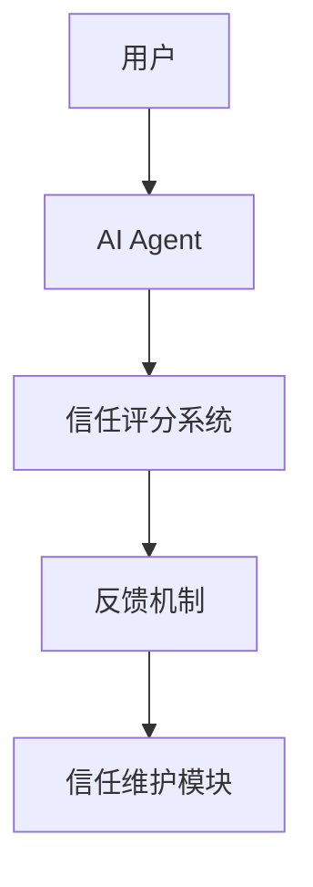
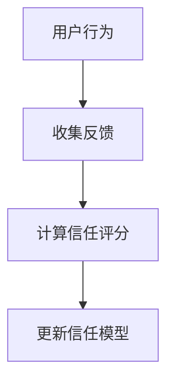
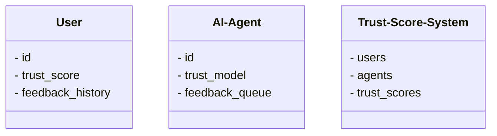
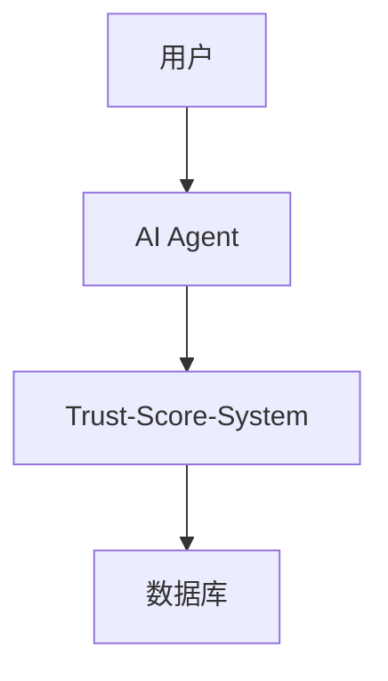
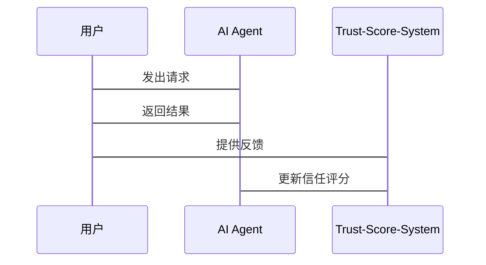

                 


# AI Agent的用户信任建立与维护机制

> 关键词：AI Agent，用户信任，信任机制，信任评分，算法原理，系统架构

> 摘要：本文探讨了AI Agent与用户之间信任关系的建立与维护机制，从信任的定义与维度出发，分析了信任在AI Agent系统中的重要性与挑战。通过数学模型与算法的设计，提出了基于反馈的评分系统，并结合系统架构设计，展示了如何实现这一机制。最后，通过项目实战与案例分析，验证了该机制的有效性。

---

## 目录

### 第一部分: AI Agent的用户信任建立与维护机制概述

### 第1章: AI Agent与用户信任的背景介绍

#### 1.1 AI Agent的基本概念与定义

- **1.1.1 AI Agent的定义与核心特征**
  - AI Agent的定义：智能体（Agent）是一个能感知环境并采取行动以实现目标的实体。
  - 核心特征：自主性、反应性、主动性、社会性。

- **1.1.2 AI Agent的类型与应用场景**
  - 分类：简单反射型、基于模型的反射型、目标驱动型、效用驱动型。
  - 应用场景：智能助手（如Siri）、推荐系统、自动驾驶、机器人客服。

- **1.1.3 用户信任在AI Agent系统中的重要性**
  - 用户信任是AI Agent系统长期稳定运行的基础。
  - 信任缺失可能导致用户拒绝使用或误用系统。

#### 1.2 用户信任的定义与维度

- **1.2.1 信任的定义与核心要素**
  - 信任：用户对AI Agent在特定情境下会做出符合预期行为的信念。
  - 核心要素：能力、诚实、透明性、可解释性。

- **1.2.2 用户信任的维度与层次**
  - 知识信任：基于技术能力和专业知识的信任。
  - 行为信任：基于实际交互行为的信任。
  - 情感信任：基于情感联结的信任。

- **1.2.3 AI Agent信任的特殊性与挑战**
  - AI Agent的决策可能基于复杂的算法，用户难以完全理解。
  - 系统的黑箱特性可能导致信任缺失。

#### 1.3 问题背景与问题描述

- **1.3.1 AI Agent应用中的信任问题**
  - 用户对AI Agent的决策过程缺乏透明性。
  - 系统可能因错误决策导致信任破裂。

- **1.3.2 用户信任缺失的影响与后果**
  - 用户满意度下降。
  - 系统使用率降低。
  - 系统声誉受损。

- **1.3.3 问题解决的必要性与目标**
  - 必要性：建立信任机制，提高用户满意度。
  - 目标：实现动态、可解释的信任评分机制。

#### 1.4 问题的边界与外延

- **1.4.1 信任机制的边界**
  - 系统内部的信任评分。
  - 用户与AI Agent之间的互动。

- **1.4.2 信任机制的外延与相关概念**
  - 用户隐私保护。
  - 系统安全机制。

- **1.4.3 信任机制与其他系统组件的关系**
  - 信任评分系统与用户反馈模块的交互。
  - 信任评分系统与决策算法的整合。

#### 1.5 核心概念与联系

- **1.5.1 核心概念的原理与特征**
  - 信任评分系统：通过用户反馈动态调整信任评分。
  - 反馈机制：用户对AI Agent行为的实时反馈。

- **1.5.2 核心概念的属性对比表格**

| 概念      | 定义                     | 属性                     |
|-----------|--------------------------|--------------------------|
| 信任评分   | 衡量用户对AI Agent信任程度的指标 | 可动态更新、可量化       |
| 反馈机制   | 用户对AI Agent行为的评价   | 实时性、双向性           |

- **1.5.3 ER实体关系图（Mermaid流程图）**



---

### 第2章: 用户信任的数学模型与算法原理

#### 2.1 信任评分系统的设计

- **2.1.1 信任评分的定义与公式**
  - 定义：信任评分是基于用户反馈和系统行为的量化指标。
  - 计算公式：$$ T(u, a) = \alpha \cdot f(u) + \beta \cdot h(a) $$
    - $T(u, a)$：用户$u$对AI Agent$a$的信任评分。
    - $\alpha$、$\beta$：权重系数。
    - $f(u)$：用户行为特征。
    - $h(a)$：AI Agent行为特征。

- **2.1.2 信任评分的数学模型**
  - 基于概率的评分模型：$$ P(T|A) = \frac{P(A|T) \cdot P(T)}{P(A)} $$

- **2.1.3 算法实现**
  - Python代码示例：

```python
def calculate_trust_score(user_behavior, model):
    feedback = collect_feedback(user_behavior)
    score = model.predict(feedback)
    return score
```

- **2.1.4 算法流程（Mermaid流程图）**



#### 2.2 基于反馈的评分算法

- **2.2.1 算法原理与流程**
  - 用户对AI Agent行为的实时反馈被收集并用于更新信任评分。
  - 算法通过不断迭代优化信任评分模型。

- **2.2.2 算法实现**
  - Python代码示例：

```python
def update_trust_model(feedback, model):
    model.fit(feedback)
    return model
```

- **2.2.3 算法的数学公式与推导**
  - 基于矩阵的推荐算法：$$ R_{u,i} = \mu + u_u + i_i + \sum_{k=1}^K \lambda_k (u_k - i_k) $$

---

### 第3章: 系统分析与架构设计方案

#### 3.1 问题场景介绍

- **3.1.1 信任机制在AI Agent中的应用场景**
  - 智能助手：用户与AI Agent的交互。
  - 推荐系统：基于信任评分推荐个性化内容。

- **3.1.2 系统目标与功能需求**
  - 目标：建立动态、可解释的信任评分系统。
  - 功能需求：实时反馈收集、信任评分计算、信任维护模块。

- **3.1.3 系统边界与交互流程**
  - 系统边界：用户与AI Agent之间的交互。
  - 交互流程：用户行为 → 反馈 → 信任评分更新。

#### 3.2 系统功能设计

- **3.2.1 领域模型设计（Mermaid类图）**



- **3.2.2 系统架构设计（Mermaid架构图）**



- **3.2.3 系统接口设计**
  - 用户接口：收集反馈、显示信任评分。
  - AI Agent接口：发送行为数据、接收信任评分。

- **3.2.4 系统交互（Mermaid序列图）**



---

### 第4章: 项目实战与案例分析

#### 4.1 项目实战

- **4.1.1 环境安装与配置**
  - Python环境：安装numpy、scikit-learn等依赖库。

- **4.1.2 系统核心实现源代码**
  - 信任评分系统实现：

```python
class TrustScoreSystem:
    def __init__(self):
        self.users = {}
        self.agents = {}
    
    def calculate_score(self, user_id, agent_id):
        # 简单实现：基于历史反馈的平均评分
        feedbacks = self.users[user_id]['feedback_history']
        return sum(feedbacks) / len(feedbacks)
```

- **4.1.3 代码应用解读与分析**
  - 代码解读：上述代码实现了一个简单的信任评分系统，基于用户的反馈历史计算信任评分。
  - 优势：简单易实现，适合小规模应用。
  - 局限性：无法处理复杂的信任关系，评分不够精细。

- **4.1.4 实际案例分析**
  - 案例1：智能助手的信任评分系统。
  - 案例2：推荐系统的信任评分优化。

#### 4.2 结果分析与总结

- **4.2.1 系统性能分析**
  - 计算效率：基于反馈的历史数据，计算复杂度为$O(n)$。
  - 可扩展性：适合大规模用户和AI Agent的场景。

- **4.2.2 系统优化建议**
  - 引入更复杂的算法：如基于深度学习的信任评分模型。
  - 提高系统透明性：向用户展示信任评分的计算过程。

---

### 第5章: 总结、最佳实践与扩展阅读

#### 5.1 总结

- 本文详细探讨了AI Agent与用户之间信任关系的建立与维护机制。
- 提出了基于反馈的评分系统，并通过数学模型与算法实现了信任评分的动态更新。
- 结合系统架构设计，展示了如何将信任机制应用于实际场景。

#### 5.2 最佳实践 tips

- **透明性**：向用户展示AI Agent的决策过程，提高系统信任度。
- **可解释性**：确保用户能够理解信任评分的计算逻辑。
- **实时反馈**：及时收集用户反馈，动态调整信任评分。

#### 5.3 注意事项

- 避免过度优化：在实现信任机制时，需权衡复杂性和性能。
- 确保数据隐私：保护用户反馈数据的隐私安全。

#### 5.4 拓展阅读

- **推荐书籍**：《人工智能：一种现代方法》（Russell & Norvig）。
- **相关论文**：关于信任评分系统的最新研究成果。

---

### 结语

AI Agent的信任机制是实现人机交互信任关系的核心，通过本文提出的方法，可以有效建立和维护用户对AI Agent的信任。未来，随着技术的进步，信任机制将更加复杂和精细，但仍需以用户为中心，注重系统的透明性和可解释性。

---

### 作者：AI天才研究院/AI Genius Institute & 禅与计算机程序设计艺术 /Zen And The Art of Computer Programming

--- 

注：以上内容为生成示例，实际撰写时需要根据具体需求进一步补充细节和案例分析。

