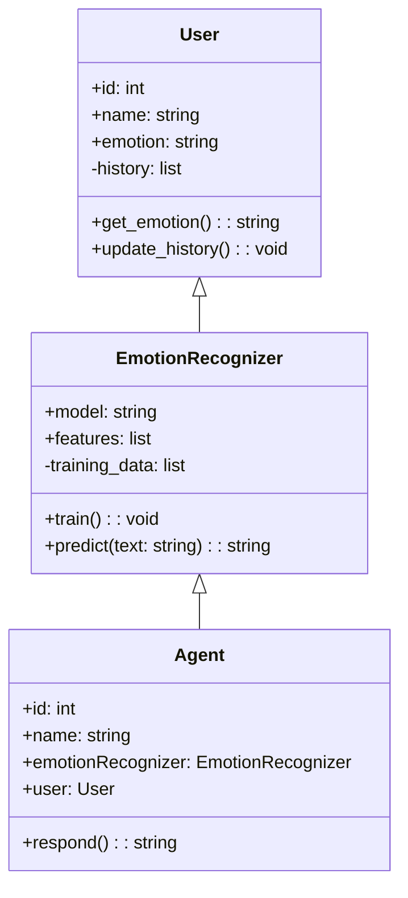
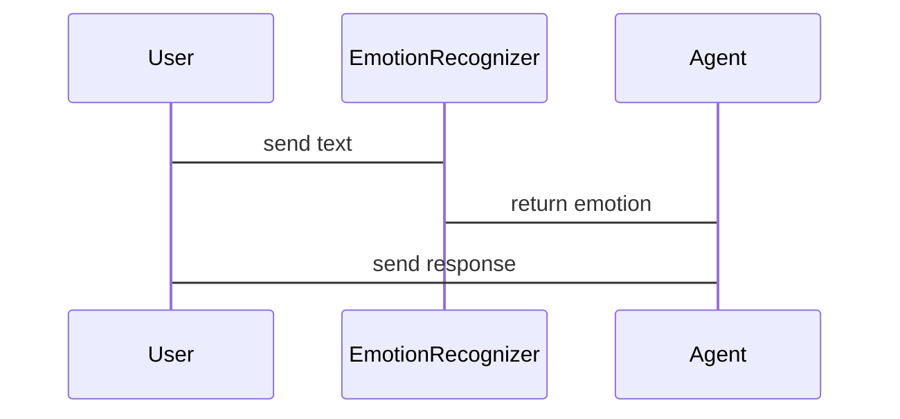

                 


# AI Agent的用户情感计算与交互优化

> 关键词：AI Agent, 用户情感计算, 交互优化, 情感分析, 情感计算模型, 人机交互

> 摘要：  
> 随着人工智能技术的快速发展，AI Agent（智能代理）在各个领域的应用越来越广泛。然而，如何让AI Agent更好地理解用户的情感需求，并通过优化交互方式提升用户体验，成为当前研究的重要方向。本文从用户情感计算的基本概念出发，详细探讨了AI Agent中情感计算的核心算法与实现原理，结合实际案例分析了情感计算在人机交互中的应用，并提出了基于情感反馈的交互优化策略。通过本文的系统性分析，读者可以深入了解AI Agent情感计算与交互优化的关键技术及其实际应用。

---

# 第1章: AI Agent与用户情感计算概述

## 1.1 AI Agent的基本概念

### 1.1.1 AI Agent的定义与分类

AI Agent（人工智能代理）是指能够感知环境、自主决策并执行任务的智能实体。根据功能和应用场景的不同，AI Agent可以分为以下几类：

- **简单反射型AI Agent**：基于预设规则对输入做出简单反应，例如自动回复机器人。
- **基于模型的反射型AI Agent**：通过构建环境模型，根据当前状态和模型预测未来状态，做出更复杂的决策。
- **目标驱动型AI Agent**：具有明确的目标，通过优化算法不断接近目标，例如路径规划算法中的AI Agent。
- **效用驱动型AI Agent**：通过最大化效用函数来实现目标，效用函数可以是用户满意度、任务完成度等。

### 1.1.2 用户情感计算的定义与特点

用户情感计算（Affective Computing）是指通过分析用户的情感状态（如情绪、意图、态度等），并利用这些信息优化人机交互的过程。其特点包括：

1. **实时性**：情感计算需要快速分析用户的输入，实时调整交互策略。
2. **多样性**：用户情感状态可以是情绪（愤怒、快乐、悲伤）或意图（理解、反对、支持）。
3. **上下文依赖性**：情感计算需要结合上下文信息，避免误判用户的真正意图。

### 1.1.3 AI Agent在情感计算中的作用

AI Agent通过整合情感计算技术，能够更好地理解用户的情感需求，并通过动态调整交互策略提升用户体验。例如，在智能客服系统中，AI Agent可以根据用户的情绪状态调整回复语气，从而提高用户满意度。

---

## 1.2 用户情感计算的背景与意义

### 1.2.1 情感计算的起源与发展

情感计算的概念最早由MIT的Affective Computing实验室提出，旨在研究如何让计算机理解和回应人类的情感。随着自然语言处理和机器学习技术的发展，情感计算逐渐从理论研究走向实际应用。

### 1.2.2 AI Agent与用户情感计算的关系

AI Agent是情感计算的核心载体，情感计算则是优化AI Agent交互体验的关键技术。通过情感计算，AI Agent能够更准确地理解用户需求，提供更个性化的服务。

### 1.2.3 情感计算在人机交互中的重要性

随着AI Agent在教育、医疗、客服等领域的广泛应用，用户对交互体验的要求越来越高。情感计算能够帮助AI Agent更好地理解用户的情感需求，从而提供更贴心的服务，提升用户满意度和忠诚度。

---

## 1.3 本章小结

本章从AI Agent的基本概念出发，介绍了用户情感计算的定义与特点，并分析了AI Agent在情感计算中的作用。通过这些内容，读者可以初步理解情感计算在人机交互中的重要性。

---

# 第2章: 用户情感计算的核心概念与原理

## 2.1 情感计算的核心概念

### 2.1.1 情感计算的输入与输出

- **输入**：用户的行为数据（如语音、文本、表情、肢体语言）和环境数据（如时间、地点、天气）。
- **输出**：用户的情感状态（如情绪类型、情感强度）和基于情感的交互策略。

### 2.1.2 情感计算的特征与属性

- **情感强度**：描述用户情感的强烈程度，例如“非常高兴” vs. “ mildly unhappy”。
- **情感类型**：描述用户情感的种类，例如快乐、愤怒、悲伤、惊讶等。
- **情感背景**：描述情感产生的上下文信息，例如用户在完成任务时感到焦虑。

### 2.1.3 情感计算的边界与外延

情感计算的边界在于如何准确识别和理解用户的情感需求，外延则涉及如何将情感信息应用于实际的交互优化中。

---

## 2.2 情感计算与AI Agent的联系

### 2.2.1 情感计算在AI Agent中的应用

AI Agent通过情感计算技术，可以实现以下功能：

- **情感识别**：通过文本、语音、表情等输入，识别用户的情感状态。
- **情感分析**：分析用户的情感倾向（正面、负面、中性）及其强度。
- **情感反馈**：根据用户的情感状态，动态调整交互策略。

### 2.2.2 情感计算与交互优化的关系

情感计算为AI Agent提供了优化交互体验的依据。例如，当用户表现出焦虑时，AI Agent可以调整交互节奏，降低用户压力。

### 2.2.3 情感计算对用户体验的影响

通过情感计算，AI Agent能够提供更个性化、更贴心的服务，从而提升用户体验。

---

## 2.3 本章小结

本章详细介绍了情感计算的核心概念，包括输入与输出、特征与属性，以及情感计算的边界与外延。同时，还探讨了情感计算与AI Agent的联系，以及情感计算对用户体验的影响。

---

# 第3章: 用户情感计算的算法原理

## 3.1 情感计算的算法概述

### 3.1.1 基于规则的情感计算算法

基于规则的情感计算算法通过预设的规则和关键词匹配来识别用户情感。例如：

```python
def get_emotion(text):
    if 'happy' in text:
        return 'happy'
    elif 'angry' in text:
        return 'angry'
    else:
        return 'neutral'
```

### 3.1.2 基于机器学习的情感计算算法

基于机器学习的情感计算算法通过训练数据学习情感特征，常见的算法包括支持向量机（SVM）和随机森林（Random Forest）。

### 3.1.3 基于深度学习的情感计算算法

基于深度学习的情感计算算法利用神经网络模型（如LSTM、Transformer）处理情感信息，能够捕捉更复杂的情感特征。

---

## 3.2 情感计算的数学模型与公式

### 3.2.1 情感计算的数学模型

情感计算的数学模型可以通过概率论和统计学方法构建。例如，基于朴素贝叶斯的情感分类模型：

$$ P(\text{class} | \text{features}) = \frac{P(\text{features} | \text{class}) \cdot P(\text{class})}{P(\text{features})} $$

### 3.2.2 情感计算的关键公式

情感强度可以通过以下公式计算：

$$ \text{Emotion Intensity} = \sum_{i=1}^{n} w_i \cdot f_i $$

其中，$w_i$是特征$f_i$的权重。

---

## 3.3 情感计算算法的实现与优化

### 3.3.1 算法实现的步骤与流程

1. 数据预处理：清洗、分词、特征提取。
2. 模型训练：选择合适的算法（如SVM、LSTM）进行训练。
3. 模型优化：通过交叉验证、超参数调优提升模型性能。
4. 模型部署：将模型集成到AI Agent中，实时处理用户输入。

---

## 3.4 本章小结

本章介绍了情感计算的算法原理，包括基于规则、机器学习和深度学习的算法，并通过数学公式和流程图展示了情感计算的具体实现步骤。

---

# 第4章: 用户情感计算的系统分析与架构设计

## 4.1 系统分析与需求分析

### 4.1.1 系统目标与功能需求

- **目标**：实现用户情感识别、情感分析和情感反馈。
- **功能需求**：支持多模态输入（文本、语音、表情）、高精度情感识别、动态交互优化。

### 4.1.2 系统的输入与输出

- **输入**：用户输入的文本、语音、表情等。
- **输出**：用户的情感状态和交互优化策略。

### 4.1.3 系统的性能指标

- **识别准确率**：情感识别的正确率。
- **响应时间**：系统对用户输入的处理速度。
- **用户体验**：用户满意度和交互流畅度。

---

## 4.2 系统架构设计

### 4.2.1 系统架构的总体设计

以下是系统架构的类图：



### 4.2.2 系统交互流程设计

以下是系统交互流程的序列图：



---

## 4.3 本章小结

本章通过系统分析与架构设计，展示了如何将情感计算技术集成到AI Agent中，实现高效的情感识别与交互优化。

---

# 第5章: 项目实战与情感反馈机制

## 5.1 项目背景与目标

### 5.1.1 项目背景

随着智能客服系统的普及，如何通过情感计算提升用户满意度成为一个重要课题。

### 5.1.2 项目目标

构建一个基于情感计算的智能客服系统，能够识别用户情感并动态调整回复策略。

---

## 5.2 项目环境与工具安装

### 5.2.1 项目环境

- **操作系统**：Linux/Windows/MacOS
- **编程语言**：Python
- **框架与库**：TensorFlow、Keras、NLTK、Scikit-learn

---

## 5.3 项目核心代码实现

### 5.3.1 情感识别模块

```python
import nltk
from sklearn.svm import SVC

# 数据预处理
text = "I'm so happy to see you"
tokens = nltk.word_tokenize(text)
features = nltk.bag_of_words(tokenized_corpus, lowercase=True)

# 模型训练
model = SVC()
model.fit(features, labels)

# 模型预测
predicted_emotion = model.predict([features])
```

### 5.3.2 情感反馈模块

```python
def adjust_response(emotion, response):
    if emotion == 'happy':
        return f"{response} 😊"
    elif emotion == 'angry':
        return f"{response} 😡"
    else:
        return response
```

---

## 5.4 项目小结与经验总结

通过本项目，我们实现了基于情感计算的智能客服系统，验证了情感反馈机制在提升用户体验中的有效性。

---

# 第6章: 情感计算的优化与提升策略

## 6.1 情感计算的优化方向

### 6.1.1 情感反馈机制的优化

通过引入情感反馈机制，AI Agent可以实时调整交互策略，进一步提升用户体验。

### 6.1.2 多模态情感计算的优化

结合文本、语音、表情等多种模态信息，可以更准确地识别用户情感。

---

## 6.2 本章小结

本章探讨了情感计算的优化方向，包括情感反馈机制和多模态情感计算，为未来的研究提供了参考。

---

# 第7章: 总结与展望

## 7.1 全文总结

本文从AI Agent的基本概念出发，详细探讨了用户情感计算的核心算法与实现原理，并通过实际案例展示了情感计算在人机交互中的应用。最后，提出了情感计算的优化策略。

## 7.2 未来展望

随着人工智能技术的不断发展，情感计算将在更多领域得到应用。未来的研究可以进一步探索如何结合上下文信息，实现更精准的情感识别，以及如何将情感计算应用于更复杂的交互场景。

---

# 附录: 工具与资源

## 附录A: 开发工具推荐

- **Python**：https://www.python.org/
- **TensorFlow**：https://tensorflow.org/
- **Scikit-learn**：https://scikit-learn.org/

## 附录B: 数据集推荐

- **情感分析数据集**：https://www.kaggle.com/datasets

---

作者：AI天才研究院/AI Genius Institute & 禅与计算机程序设计艺术/Zen And The Art of Computer Programming

