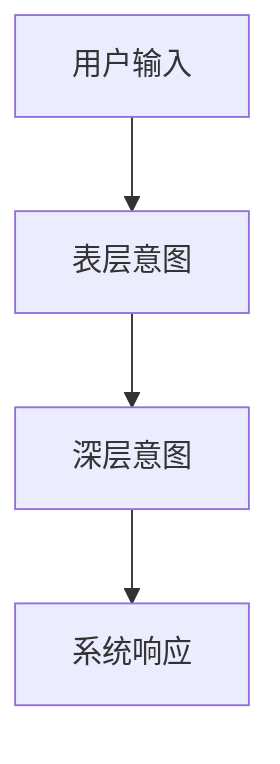
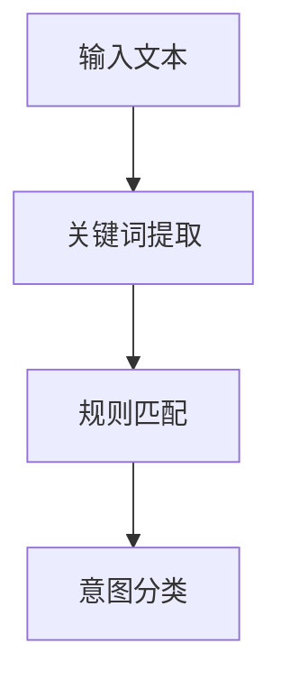
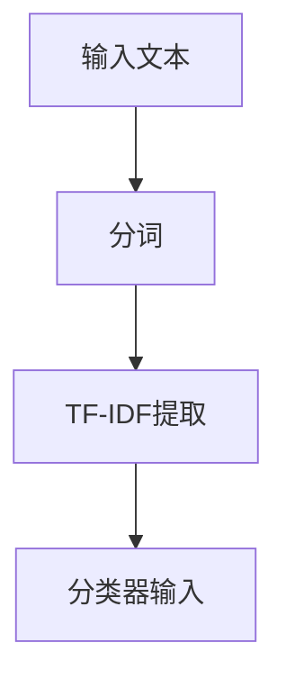
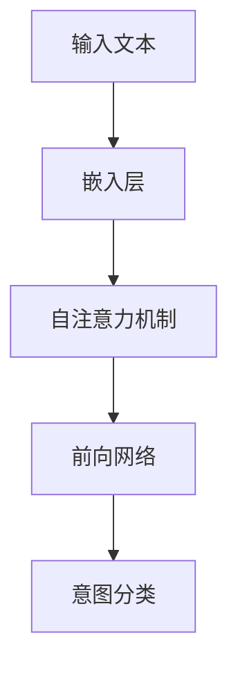

                 


# AI Agent的用户意图理解：从表层到深层

## 关键词：AI Agent, 用户意图理解, 深度学习, NLP, 意图分类

## 摘要：  
本文深入探讨AI Agent在用户意图理解中的技术与方法，从表层到深层意图的分析，结合实际应用场景，分析了基于规则、统计学习和深度学习的意图理解算法，重点阐述了深度学习模型在处理复杂用户意图中的优势，并提供了系统架构设计与项目实战案例。

---

# 第一部分: AI Agent用户意图理解的背景与核心概念

## 第1章: 用户意图理解的背景与问题背景

### 1.1 问题背景

#### 1.1.1 从显式需求到隐式需求的演变

用户意图的理解从最初的显式需求逐步向隐式需求发展。显式需求是指用户直接表达的需求，例如“播放音乐”，而隐式需求则需要通过上下文、历史行为等推断出来，例如“用户可能想听放松的音乐”。

#### 1.1.2 AI Agent在人机交互中的角色定位

AI Agent作为人机交互的桥梁，需要准确理解用户的意图，以便提供更智能的服务。AI Agent通过自然语言处理（NLP）和机器学习技术，能够将用户的输入转化为可执行的指令。

#### 1.1.3 当前用户意图理解的技术挑战

- **语境理解**：用户的意图可能依赖于上下文，例如“把空调调低”需要知道当前的温度设置。
- **多意图识别**：用户可能表达多个意图，例如“明天早上提醒我开会，同时把闹钟设置为7点”。
- **模糊表达**：用户可能使用模糊的语言，例如“我有点累，想休息一下”。

### 1.2 用户意图理解的定义与问题描述

#### 1.2.1 用户意图的层次结构

用户意图可以分为表层意图和深层意图两层：

- **表层意图**：用户直接表达的需求，例如“播放音乐”。
- **深层意图**：用户未明说但可以通过上下文推断的需求，例如“用户想放松心情”。

#### 1.2.2 表层意图与深层意图的定义

- **表层意图**：用户明确表达的需求，通常是显式的，可以直接通过关键词匹配或简单的规则推理得到。
- **深层意图**：用户未明确表达的需求，需要通过上下文、历史行为等进行推断。

#### 1.2.3 用户意图理解的核心问题

用户意图理解的核心问题在于如何从用户的输入中提取出准确的意图，尤其是在面对模糊表达、多意图和上下文依赖的情况下。

---

## 第2章: 用户意图理解的核心概念与联系

### 2.1 核心概念原理

#### 2.1.1 表层意图的特征与属性

- **明确性**：表层意图通常是用户直接表达的需求，具有较高的明确性。
- **可分解性**：表层意图可以分解为具体的任务或操作，例如“播放音乐”可以分解为“播放”和“音乐”两个任务。

#### 2.1.2 深层意图的特征与属性

- **隐含性**：深层意图通常是隐含的，需要通过上下文或其他信息推断出来。
- **相关性**：深层意图通常与用户的当前行为、历史行为或环境相关。

#### 2.1.3 表层与深层意图的关系

表层意图和深层意图之间存在一定的关联性。例如，用户表达“我有点累，想休息一下”（表层意图）可能隐含着深层意图“用户需要放松，可能希望AI Agent为其推荐放松的活动或播放舒缓的音乐”。

### 2.2 核心概念对比分析

#### 2.2.1 表层意图与深层意图的特征对比（表格形式）

| 特征                | 表层意图                         | 深层意图                         |
|---------------------|----------------------------------|----------------------------------|
| 明确性              | 高                               | 低                               |
| 可分解性            | 易                               | 难                               |
| 依赖性              | 较低                             | 较高                             |
| 示例                | “播放音乐”                       | “用户可能想放松心情”             |

#### 2.2.2 表层意图与深层意图的关系图（Mermaid流程图）



---

## 第3章: 用户意图理解的技术发展与应用前景

### 3.1 技术发展概述

#### 3.1.1 基于规则的意图理解

- **规则匹配**：通过关键词匹配或简单的规则（例如，如果用户提到“天气”，则归类为查询天气信息）。
- **优点**：实现简单，适用于简单的意图分类。
- **缺点**：难以处理复杂的上下文和语义关系。

#### 3.1.2 统计学习的意图理解

- **特征提取**：基于NLP技术提取文本特征，例如TF-IDF。
- **机器学习分类**：使用朴素贝叶斯、支持向量机（SVM）等模型进行意图分类。
- **优点**：能够处理更复杂的语义关系，准确率较高。
- **缺点**：依赖于特征工程，难以捕捉深层次语义。

#### 3.1.3 深度学习的意图理解

- **基于Transformer的序列建模**：例如，使用BERT模型进行意图分类。
- **预训练语言模型**：利用如GPT、BERT等预训练模型进行意图分类。
- **优点**：能够捕捉深层次语义，准确率高。
- **缺点**：计算资源需求较高。

### 3.2 应用场景分析

#### 3.2.1 智能音箱中的意图理解

- **场景描述**：用户对智能音箱说“我有点累，想休息一下”。
- **表层意图**：用户想休息。
- **深层意图**：用户可能需要放松的音乐或冥想建议。

#### 3.2.2 智能客服中的意图理解

- **场景描述**：用户在智能客服中输入“我的订单为什么还没到”。
- **表层意图**：查询订单状态。
- **深层意图**：用户可能对物流速度不满，可能需要投诉或退款。

#### 3.2.3 智能推荐中的意图理解

- **场景描述**：用户在电商平台上浏览商品后，AI Agent推荐相关商品。
- **表层意图**：用户浏览商品。
- **深层意图**：用户可能对特定类型的商品感兴趣，例如电子产品。

---

# 第二部分: 用户意图理解的算法原理与数学模型

## 第4章: 基于规则的意图理解算法

### 4.1 算法原理

#### 4.1.1 基于关键词匹配的规则

- **规则匹配流程**：输入文本 → 关键词提取 → 规则匹配 → 意图分类。
- **示例**：如果用户输入中包含“天气”，则归类为查询天气信息。

### 4.2 算法实现

#### 4.2.1 规则匹配流程图（Mermaid）



#### 4.2.2 规则匹配的Python实现代码

```python
def intent_classification_rule(text):
    keywords = ['天气', '查询', '天气预报']
    for keyword in keywords:
        if keyword in text:
            return '查询天气'
    return '其他意图'
```

#### 4.2.3 代码解读与优化建议

- **代码解读**：通过关键词匹配，将用户的输入文本归类为特定意图。
- **优化建议**：可以增加更多关键词，或者结合上下文信息进行优化。

---

## 第5章: 基于统计学习的意图理解算法

### 5.1 算法原理

#### 5.1.1 基于NLP的特征提取

- **TF-IDF特征提取**：将文本转换为TF-IDF向量，用于后续分类。

#### 5.1.2 机器学习分类

- **朴素贝叶斯分类**：基于概率的分类方法，适用于小规模数据。
- **支持向量机（SVM）**：适用于高维数据，分类效果较好。

### 5.2 算法实现

#### 5.2.1 特征提取流程图（Mermaid）



#### 5.2.2 机器学习模型的Python实现代码

```python
from sklearn.feature_extraction.text import TfidfVectorizer
from sklearn.naive_bayes import MultinomialNB

# 数据准备
texts = ["播放音乐", "查询天气", "我要休息"]
labels = ["播放", "查询", "休息"]

# 特征提取
vectorizer = TfidfVectorizer()
X = vectorizer.fit_transform(texts)

# 模型训练
model = MultinomialNB()
model.fit(X, labels)

# 预测
new_text = "我要休息"
new_X = vectorizer.transform([new_text])
predicted = model.predict(new_X)
print(predicted)
```

---

## 第6章: 基于深度学习的意图理解算法

### 6.1 算法原理

#### 6.1.1 基于Transformer的序列建模

- **Transformer模型**：通过自注意力机制，捕捉文本中的语义关系。
- **意图分类**：将Transformer的输出通过全连接层进行分类。

#### 6.1.2 预训练语言模型的意图分类

- **微调模型**：在特定领域数据上对预训练语言模型进行微调，以适应意图分类任务。

### 6.2 算法实现

#### 6.2.1 Transformer模型的意图分类流程图（Mermaid）



#### 6.2.2 基于BERT的意图分类代码示例

```python
import torch
from transformers import BertTokenizer, BertModel

# 加载预训练模型和tokenizer
tokenizer = BertTokenizer.from_pretrained('bert-base-uncased')
model = BertModel.from_pretrained('bert-base-uncased')

# 定义分类器
class IntentClassifier(torch.nn.Module):
    def __init__(self, num_classes=3):
        super().__init__()
        self.bert = model
        self.dropout = torch.nn.Dropout(0.1)
        self.classifier = torch.nn.Linear(768, num_classes)
    
    def forward(self, input_ids, attention_mask):
        outputs = self.bert(input_ids=input_ids, attention_mask=attention_mask)
        pooled_output = outputs.last_hidden_state[:, 0, :]
        pooled_output = self.dropout(pooled_output)
        return self.classifier(pooled_output)

# 示例输入
input_text = "我有点累，想休息一下"
input_ids = tokenizer.encode(input_text, return_tensors='pt')
attention_mask = torch.ones(input_ids.size())
outputs = model(input_ids=input_ids, attention_mask=attention_mask)
```

---

# 小结与注意事项

用户意图理解是AI Agent实现智能交互的核心技术，从表层意图到深层意图的分析需要结合多种技术手段。基于规则的方法适用于简单的意图分类，而统计学习和深度学习方法在复杂场景下表现更优。在实际应用中，需要根据具体场景选择合适的算法，并结合上下文信息优化模型性能。

---

# 作者信息

作者：AI天才研究院/AI Genius Institute & 禅与计算机程序设计艺术 /Zen And The Art of Computer Programming

---

本文通过系统地分析用户意图理解的核心概念、算法原理和应用场景，为读者提供了一种从表层到深层理解用户意图的方法。希望本文能够为AI Agent的开发者和研究者提供有价值的参考和启示。

