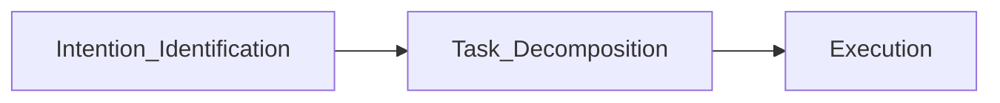
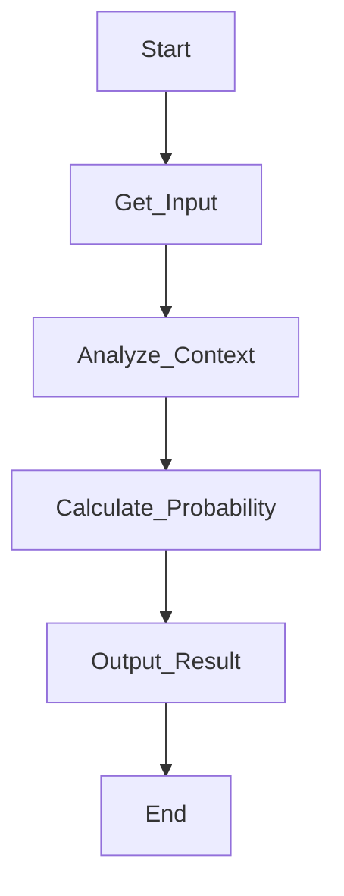
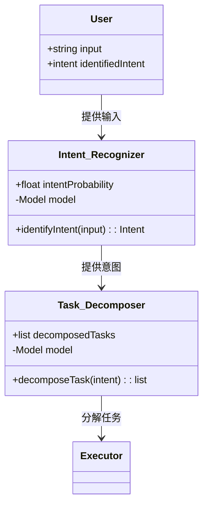
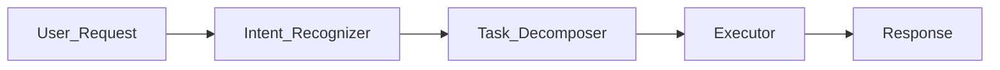

                 


# AI Agent的用户意图识别与任务分解

> 关键词：AI Agent, 用户意图识别, 任务分解, 人机交互, 算法原理, 系统架构设计

> 摘要：本文系统地探讨了AI Agent在用户意图识别与任务分解领域的核心原理和应用实践。通过分析用户意图识别的关键概念、算法原理及其实现方式，结合任务分解的方法和步骤，展示了如何将复杂的用户需求转化为可执行的任务序列。文章还深入探讨了AI Agent在实际应用中的系统架构设计、项目实现及最佳实践，为读者提供了全面的理论指导和实践参考。

---

# 第一部分: 背景介绍

# 第1章: AI Agent与用户意图识别概述

## 1.1 AI Agent的基本概念

AI Agent（人工智能代理）是指能够感知环境、自主决策并执行任务的智能实体。它通过与用户或系统的交互，理解用户需求，执行相应操作以满足用户目标。AI Agent的核心能力包括感知、推理、规划和执行。

用户意图识别是AI Agent实现人机交互的关键环节。通过识别用户的意图，AI Agent能够准确理解用户的请求，从而提供更精准的服务。任务分解则是将复杂的用户需求拆解为多个简单可执行的任务，帮助AI Agent高效完成目标。

## 1.2 用户意图识别的背景与问题描述

在人机交互中，用户的输入往往不够明确，可能包含歧义或不完整的信息。例如，用户可能说“我需要安排明天的会议”，这句话中包含了时间、参与者等多个隐含需求。AI Agent需要通过上下文分析、关键词提取和语义理解等技术，准确识别用户的意图。

任务分解则是将识别出的意图转化为具体的操作步骤。例如，将“安排会议”分解为“创建日历邀请”、“发送邮件提醒”等任务，每个任务都具有明确的目标和执行步骤。

## 1.3 任务分解的核心概念

任务分解的目标是将用户需求转化为可执行的任务序列。其核心概念包括任务目标、子任务、任务优先级和任务依赖关系。通过任务分解，AI Agent可以更好地规划执行顺序，提高任务完成的效率和质量。

## 1.4 本章小结

本章介绍了AI Agent的基本概念，阐述了用户意图识别和任务分解的背景与重要性。明确了用户意图识别和任务分解的定义，为后续章节的深入分析奠定了基础。

---

# 第二部分: 核心概念与联系

# 第2章: 用户意图识别的核心原理

## 2.1 意图识别的核心概念

### 2.1.1 意图识别的定义

意图识别是通过分析用户输入（如文本、语音或手势）来推断用户的意图。其目标是将用户的输入转化为机器可理解的意图表示。

### 2.1.2 意图识别的关键属性对比

| 属性 | 描述 |
|------|------|
| 输入形式 | 文本、语音、图像等 |
| 输出形式 | 意图标签或概率值 |
| 方法 | 基于规则、统计学习、深度学习 |

### 2.1.3 实体关系图（ER图）架构

通过ER图可以清晰地展示意图识别中的实体及其关系。例如，用户输入（Utterance）可以关联到多个意图（Intention），每个意图又对应多个实体（Entity）。

```mermaid
erd
    customer: 用户
    utterance: 用户输入
    intention: 用户意图
    entity: 实体

    customer --> utterance: 提供
    utterance --> intention: 映射
    intention --> entity: 关联
```

## 2.2 任务分解的核心原理

### 2.2.1 任务分解的定义

任务分解是将用户需求拆解为多个子任务的过程。每个子任务都有明确的目标和执行步骤。

### 2.2.2 任务分解的关键属性对比

| 属性 | 描述 |
|------|------|
| 输入形式 | 用户需求描述 |
| 输出形式 | 子任务列表 |
| 方法 | 基于规则、层次分解、动态规划 |

### 2.2.3 实体关系图（ER图）架构

任务分解的ER图展示了任务之间的关系。例如，主任务（Main Task）可以分解为多个子任务（Sub Task），每个子任务可能依赖其他子任务。

```mermaid
erd
    task: 任务
    sub_task: 子任务
    dependency: 依赖关系

    task --> sub_task: 分解为
    sub_task --> dependency: 依赖
```

## 2.3 意图识别与任务分解的关系

意图识别为任务分解提供了输入，任务分解则将识别出的意图转化为具体的执行步骤。两者协同工作，确保AI Agent能够高效地完成用户需求。

### 2.3.1 两者之间的协同作用



## 2.4 本章小结

本章详细介绍了意图识别和任务分解的核心概念，并通过ER图展示了它们之间的关系。理解这些概念是实现AI Agent的关键。

---

# 第三部分: 算法原理讲解

# 第3章: 用户意图识别的算法原理

## 3.1 基于上下文的意图识别算法

### 3.1.1 算法流程图



### 3.1.2 算法实现代码示例

```python
def get_user_intent(context):
    # 简单示例：计算意图概率
    intent_prob = 0.85  # 示例值
    return intent_prob
```

### 3.1.3 算法原理的数学模型和公式

意图识别通常基于概率论，计算用户输入属于某个意图的概率。公式如下：

$$ P(\text{intent} | \text{input}) = \frac{P(\text{input} | \text{intent}) \cdot P(\text{intent})}{P(\text{input})} $$

其中，$P(\text{intent})$ 是先验概率，$P(\text{input} | \text{intent})$ 是似然概率，$P(\text{input})$ 是全概率。

---

# 第四部分: 系统分析与架构设计

# 第4章: 系统架构设计

## 4.1 问题场景介绍

AI Agent需要处理复杂的用户请求，例如“预订机票和酒店”。用户意图识别需要识别出“预订”和“酒店”两个意图，并将任务分解为查询航班信息、选择酒店等子任务。

## 4.2 系统功能设计

### 4.2.1 领域模型



### 4.2.2 系统架构设计



---

# 第五部分: 项目实战

# 第5章: 项目实战

## 5.1 环境安装与配置

安装必要的库：

```bash
pip install numpy
pip install scikit-learn
pip install transformers
```

## 5.2 核心代码实现

### 5.2.1 意图识别代码

```python
from sklearn.feature_extraction.text import TfidfVectorizer
from sklearn.naive_bayes import MultinomialNB

def train Intent_classifier(X, y):
    vectorizer = TfidfVectorizer()
    X_vec = vectorizer.fit_transform(X)
    clf = MultinomialNB().fit(X_vec, y)
    return vectorizer, clf

def predict_intent(text, vectorizer, clf):
    text_vec = vectorizer.transform([text])
    return clf.predict(text_vec)[0]
```

### 5.2.2 任务分解代码

```python
def decompose_task(main_task, sub_tasks):
    task_tree = {'main_task': main_task, 'sub_tasks': sub_tasks}
    return task_tree
```

## 5.3 实际案例分析

案例：用户输入“预订明天的机票去北京”。

1. 意图识别：识别出“预订机票”和“预订酒店”两个意图。
2. 任务分解：将“预订机票”分解为查询航班、选择航班、确认预订等子任务。

---

# 第六部分: 最佳实践与总结

## 6.1 小结

本文详细探讨了AI Agent在用户意图识别与任务分解中的核心原理和实现方法。通过理论分析和实际案例，展示了如何将复杂的用户需求转化为可执行的任务序列。

## 6.2 注意事项

- 数据质量对意图识别至关重要。
- 任务分解需考虑任务之间的依赖关系。
- 系统设计需注重可扩展性和可维护性。

## 6.3 拓展阅读

推荐阅读《自然语言处理实战》和《人工智能：一种现代方法》，深入了解相关技术。

---

# 作者

作者：AI天才研究院（AI Genius Institute） & 禅与计算机程序设计艺术（Zen And The Art of Computer Programming）

---

通过以上内容，您可以系统地了解AI Agent的用户意图识别与任务分解的理论与实践。

