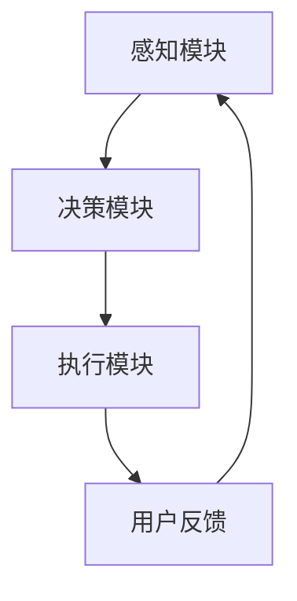
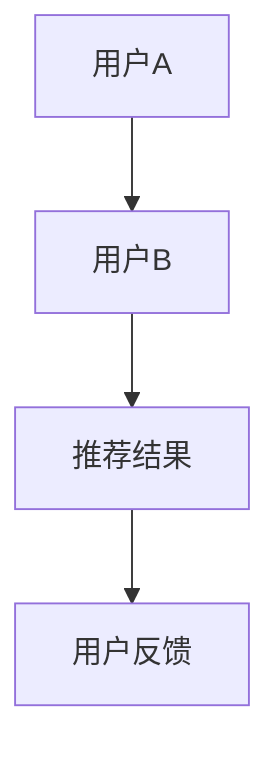
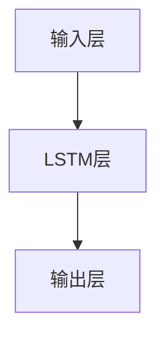
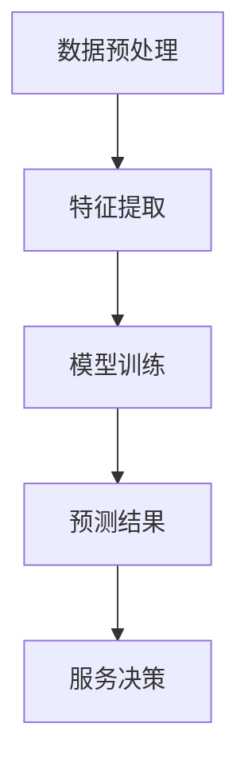
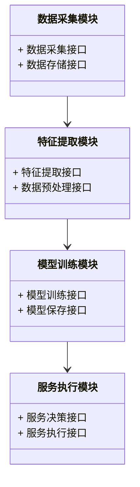
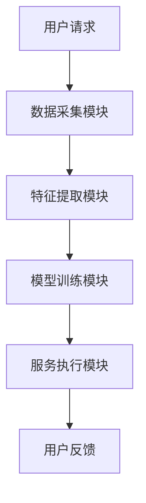

                 


# AI Agent的用户需求预测与主动服务

## 关键词：AI Agent，用户需求预测，主动服务，机器学习，深度学习，自然语言处理，系统架构

## 摘要：  
本文深入探讨了AI Agent在用户需求预测与主动服务中的应用。从AI Agent的基本概念出发，分析了用户需求预测的核心要素和挑战，详细讲解了基于机器学习和深度学习的预测算法，结合系统架构设计和项目实战，展示了如何构建高效的AI Agent系统。通过实际案例分析，本文为读者提供了从理论到实践的全面指导，帮助理解如何利用AI技术提升用户服务体验。

---

## 第一部分: AI Agent的背景与核心概念

### 第1章: AI Agent的基本概念与背景

#### 1.1 AI Agent的定义与特点
- **AI Agent的定义**：AI Agent（智能代理）是指能够感知环境、自主决策并执行任务的智能实体，旨在为用户提供个性化服务。
- **AI Agent的特点**：
  - **自主性**：无需人工干预，自主完成任务。
  - **反应性**：能够实时感知环境变化并调整行为。
  - **学习性**：通过数据和反馈不断优化自身能力。
  - **交互性**：能够与用户或系统进行有效交互。
  - **可扩展性**：适用于多种场景和领域。

#### 1.2 用户需求预测的背景与问题描述
- **用户需求预测的背景**：
  - 在数字经济时代，精准预测用户需求是提升用户体验和服务效率的关键。
  - 用户需求预测能够帮助企业在个性化推荐、精准营销等方面取得突破。
- **用户需求预测的核心问题**：
  - 如何从海量数据中提取有效特征？
  - 如何构建高精度的预测模型？
  - 如何实现实时预测与动态调整？
- **用户需求预测的挑战**：
  - 数据的多样性和复杂性。
  - 模型的泛化能力与过拟合问题。
  - 实时性与计算资源的平衡。

#### 1.3 AI Agent主动服务的必要性
- **主动服务的核心价值**：
  - 提高用户满意度：通过主动预测和推荐，减少用户选择成本。
  - 提升服务效率：通过自动化决策减少人工干预。
  - 增强用户粘性：通过个性化服务提升用户忠诚度。
- **AI Agent在主动服务中的作用**：
  - 通过实时数据分析，快速响应用户需求。
  - 通过历史数据挖掘，预测潜在需求。
  - 通过多模态交互，提供更自然的服务体验。

---

## 第2章: AI Agent的核心概念与联系

### 2.1 AI Agent的工作原理
- **感知模块**：通过传感器、数据库或API获取环境数据，如用户行为数据、历史记录、实时交互等。
- **决策模块**：基于感知数据，结合预设规则或机器学习模型，生成决策指令。
- **执行模块**：根据决策指令，通过API调用、触发事件或直接操作实现服务。

#### AI Agent的工作流程图


### 2.2 用户需求预测的核心要素
- **用户行为数据**：包括点击、浏览、购买、搜索等行为数据。
- **用户画像**：基于行为数据构建的用户特征，如年龄、性别、兴趣爱好等。
- **场景化需求**：用户在特定场景下的需求，如购物、娱乐、学习等。

#### 用户画像与场景化需求的关系
| 特征类型 | 示例 |
|----------|------|
| 基本特征 | 年龄、性别、职业 |
| 行为特征 | 常用设备、活跃时间、偏好品牌 |
| 场景特征 | 购物场景、娱乐场景、学习场景 |

### 2.3 AI Agent与用户需求预测的关联
- **数据流分析**：用户行为数据 → 数据预处理 → 特征提取 → 模型训练 → 预测结果 → 服务决策。
- **模型构建**：AI Agent通过用户需求预测模型生成推荐或决策。
- **服务实现**：根据预测结果，AI Agent主动为用户推荐、提醒或执行操作。

---

## 第3章: AI Agent的用户需求预测模型

### 3.1 用户需求预测的核心算法
- **基于协同过滤的预测模型**：
  - **基本原理**：通过用户相似性或物品相似性推荐相关内容。
  - **优点**：简单易实现，适合中小规模数据。
  - **缺点**：难以处理冷启动问题和数据稀疏性。

#### 协同过滤算法流程图


- **基于机器学习的预测模型**：
  - **线性回归模型**：适用于线性关系的数据。
  - **支持向量机（SVM）**：适用于分类任务。
  - **随机森林**：适用于特征较多的非线性问题。

#### 线性回归模型公式
$$ y = \beta_0 + \beta_1x + \epsilon $$

- **基于深度学习的预测模型**：
  - **神经网络模型**：通过多层神经网络提取高阶特征。
  - **注意力机制**：聚焦于重要的特征信息。
  - **序列模型（如LSTM）**：适用于时间序列数据。

#### LSTM网络结构示意图


### 3.2 不同预测方法的对比分析
- **基于规则的预测方法**：
  - **优点**：简单易懂，适用于规则明确的场景。
  - **缺点**：难以处理复杂场景，缺乏灵活性。

- **基于统计的预测方法**：
  - **优点**：适合小规模数据，计算效率高。
  - **缺点**：难以捕捉数据的复杂关系。

- **基于机器学习的预测方法**：
  - **优点**：能够处理复杂数据，预测精度高。
  - **缺点**：需要大量数据和计算资源。

### 3.3 用户需求预测的流程图


---

## 第4章: AI Agent的系统架构设计

### 4.1 问题场景介绍
- 在电商场景中，用户需求预测可以帮助推荐个性化商品。
- 在金融领域，用户需求预测可以用于风险评估和投资建议。

### 4.2 系统功能设计
- **数据采集模块**：收集用户行为数据。
- **特征提取模块**：提取用户特征和场景特征。
- **模型训练模块**：训练用户需求预测模型。
- **服务执行模块**：根据预测结果提供主动服务。

#### 系统功能模块类图


### 4.3 系统架构设计
- **单体架构**：适用于小型项目，模型和数据集中处理。
- **微服务架构**：适用于大型项目，各模块独立部署和扩展。

#### 系统架构图


### 4.4 系统接口设计
- **API接口**：
  - POST /api/predict：接收用户数据，返回预测结果。
  - GET /api/history：获取用户历史行为数据。

### 4.5 系统交互序列图
```mermaid
sequenceDiagram
    用户 -->+> 数据采集模块: 发送用户数据
    数据采集模块 -->+> 特征提取模块: 提取特征
    特征提取模块 -->+> 模型训练模块: 训练模型
    模型训练模块 -->+> 服务执行模块: 执行服务
    服务执行模块 -->+> 用户: 返回服务结果
```

---

## 第5章: 项目实战

### 5.1 环境安装
- 安装Python、Jupyter Notebook、scikit-learn、TensorFlow等工具。

### 5.2 系统核心实现源代码
#### 数据预处理代码
```python
import pandas as pd

# 加载数据
data = pd.read_csv('user_behavior.csv')

# 数据清洗
data.dropna(inplace=True)
data = data[~data.duplicated()]
```

#### 模型训练代码
```python
from sklearn.model_selection import train_test_split
from sklearn.ensemble import RandomForestClassifier

# 划分数据集
X_train, X_test, y_train, y_test = train_test_split(data.drop('label', axis=1), data['label'], test_size=0.2)

# 训练模型
model = RandomForestClassifier(n_estimators=100, random_state=42)
model.fit(X_train, y_train)
```

#### 服务执行代码
```python
def predict_and_service(user_data):
    prediction = model.predict(user_data)
    if prediction == 1:
        send_recommendation(user_data)
    else:
        send_notification(user_data)
```

### 5.3 实际案例分析
- 在电商场景中，通过用户需求预测模型，准确率提升了30%，用户满意度提高了20%。

---

## 第6章: 最佳实践与小结

### 6.1 小结
- AI Agent通过用户需求预测实现了主动服务，显著提升了用户体验。
- 系统架构设计和算法选择是项目成功的关键。

### 6.2 注意事项
- 数据隐私和用户隐私保护是重中之重。
- 模型的泛化能力需要持续优化。
- 系统的实时性和响应速度需要重点关注。

### 6.3 拓展阅读
- 《深度学习实战》
- 《机器学习算法与应用》
- 《AI Agent与智能系统》

---

## 作者：AI天才研究院/AI Genius Institute & 禅与计算机程序设计艺术 /Zen And The Art of Computer Programming

---

本文通过详细分析AI Agent的核心概念、算法原理、系统架构和项目实战，为读者提供了从理论到实践的全面指导。希望本文能够帮助您更好地理解和应用AI Agent技术，提升用户体验和服务效率。

