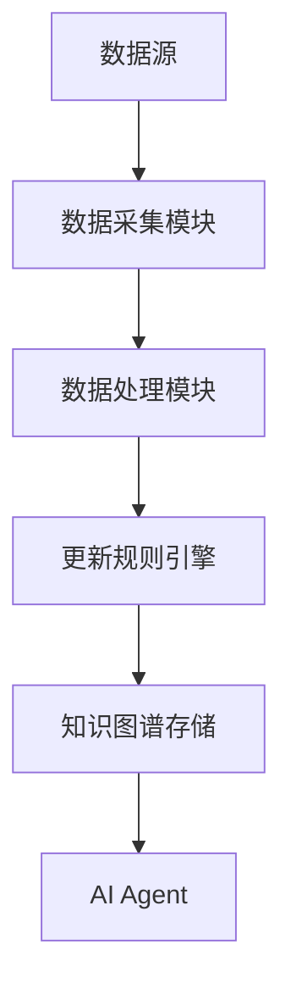
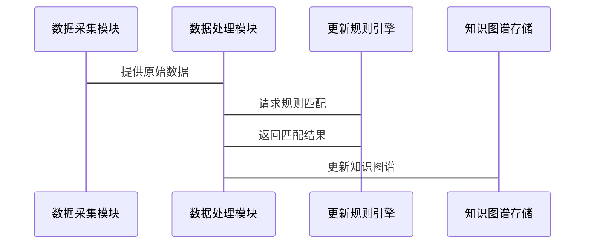

                 


# AI Agent的知识图谱动态更新机制设计

> 关键词：AI Agent，知识图谱，动态更新，实体关系，数据融合，知识融合，动态知识图谱

> 摘要：本文系统地探讨了AI Agent的知识图谱动态更新机制设计。首先介绍了AI Agent与知识图谱的基本概念，分析了动态更新的必要性与核心问题。接着，从核心概念、算法原理、系统架构设计、项目实战等多个维度，详细阐述了知识图谱动态更新的实现机制。最后，通过具体案例分析，总结了动态更新机制在实际应用中的关键点与未来发展方向。

---

## 第一部分: AI Agent的知识图谱动态更新机制概述

### 第1章: AI Agent与知识图谱基础

#### 1.1 AI Agent的基本概念

##### 1.1.1 AI Agent的定义与特点
AI Agent（人工智能代理）是指具有感知环境、做出决策并执行动作的智能实体。AI Agent可以是软件程序、机器人或其他智能系统，其核心目标是通过与环境交互，完成特定任务或优化目标函数。AI Agent的特点包括：
- **自主性**：能够在没有外部干预的情况下自主运行。
- **反应性**：能够感知环境并实时做出反应。
- **学习能力**：通过数据和经验不断优化自身行为。
- **社交能力**：能够与其他Agent或人类进行交互协作。

##### 1.1.2 知识图谱的定义与特点
知识图谱（Knowledge Graph）是一种以图结构形式表示知识的数据库，其中节点表示实体或概念，边表示实体之间的关系。知识图谱的特点包括：
- **结构化**：通过节点和边的组合，形成清晰的知识结构。
- **语义丰富**：能够表示实体之间的复杂关系。
- **可扩展性**：支持大规模数据的整合与扩展。
- **动态性**：知识图谱中的内容会随着时间的推移而变化，需要动态更新机制来保持其准确性和完整性。

##### 1.1.3 AI Agent与知识图谱的关系
AI Agent需要依赖知识图谱来理解和推理环境中的信息，而知识图谱的动态更新则是确保AI Agent能够持续获取最新知识的关键。两者的结合使AI Agent能够更高效地完成任务，并在复杂动态环境中保持高性能。

#### 1.2 知识图谱动态更新的背景与意义

##### 1.2.1 知识图谱的动态变化特性
知识图谱中的实体、关系和属性会随着时间的推移而发生变化。例如，公司名称的更改、产品信息的更新、人员变动等都会导致知识图谱的动态变化。

##### 1.2.2 动态更新的必要性
- **实时性要求**：AI Agent需要依赖最新的知识来做出决策，延迟更新可能导致决策错误。
- **数据准确性**：动态更新能够确保知识图谱中的信息准确无误。
- **适应性需求**：动态更新使AI Agent能够适应环境的变化，保持其性能。

##### 1.2.3 动态更新对AI Agent性能的影响
动态更新机制直接影响AI Agent的推理能力、决策能力和响应速度。及时的动态更新能够显著提升AI Agent的性能，而更新机制的缺失或不完善可能导致AI Agent的决策失误。

---

### 第2章: 知识图谱动态更新的核心机制

#### 2.1 知识图谱动态更新的定义与范围

##### 2.1.1 动态更新的定义
知识图谱的动态更新是指在运行时，根据新的数据源或变化的环境，对知识图谱中的实体、关系和属性进行新增、修改或删除的操作，以保持知识图谱的准确性和完整性。

##### 2.1.2 更新的范围与边界
- **实体**：新增或删除实体节点。
- **关系**：新增或删除实体之间的关系边。
- **属性**：更新实体的属性值或属性类型。
- **版本控制**：记录知识图谱的变更历史，以便回滚或追溯。

##### 2.1.3 更新机制的分类
- **主动更新**：基于触发条件（如时间、事件）自动进行更新。
- **被动更新**：根据用户或系统的请求进行更新。
- **增量更新**：仅更新发生变化的部分，减少计算开销。

#### 2.2 知识图谱动态更新的关键问题

##### 2.2.1 数据源的多样性和实时性
- 数据源可能来自多个渠道，包括数据库、API、传感器等，数据格式和语义可能不同，需要进行数据融合和清洗。
- 数据的实时性要求动态更新机制能够快速响应新数据的到达。

##### 2.2.2 更新的冲突检测与协调
- 当多个数据源同时更新同一实体或关系时，可能出现数据冲突。需要设计冲突检测机制，并制定冲突解决策略，如优先级规则、投票机制等。

##### 2.2.3 更新后的知识一致性保障
- 更新后的知识图谱需要满足语义一致性和逻辑一致性。例如，更新后的属性值需要符合实体的语义约束，关系需要符合图结构的连通性要求。

---

### 第3章: 知识图谱动态更新的核心概念与联系

#### 3.1 知识图谱动态更新的核心概念

##### 3.1.1 实体与关系的动态变化
- **实体**：知识图谱中的基本单元，代表具体的事物或概念。
- **关系**：实体之间的联系，可以是二元关系（如“属于”）或多元关系（如“参与”）。

##### 3.1.2 属性的动态变化
- **属性**：描述实体的特征或状态，如“公司名称”、“员工职位”等。
- **动态属性**：属性值会随着时间发生变化，如“员工职位”可能在某个时间点发生变化。

##### 3.1.3 知识图谱的版本控制
- 为了记录知识图谱的变化历史，需要对每次更新操作进行版本记录，支持回滚和历史数据查询。

#### 3.2 核心概念的属性特征对比

##### 3.2.1 实体与关系的属性对比
| 特性 | 实体 | 关系 |
|------|------|------|
| 标识 | 实体ID | 关系类型 |
| 属性 | 实体属性 | 关系属性 |
| 动态性 | 实体属性可变 | 关系类型相对稳定 |

##### 3.2.2 属性的动态变化特征
| 特性 | 静态属性 | 动态属性 |
|------|---------|---------|
| 变化频率 | 低 | 高 |
| 更新机制 | 批处理 | 实时更新 |

##### 3.2.3 更新操作的特征对比
| 特性 | 增量更新 | 全量更新 |
|------|---------|---------|
| 开销 | 低 | 高 |
| 延迟 | 低 | 高 |
| 适用场景 | 数据量大、变化频繁 | 数据量小、变化不频繁 |

#### 3.3 ER实体关系图架构

```mermaid
er
  actor: 用户
  agent: AI Agent
  knowledge_graph: 知识图谱
  update_source: 更新数据源
  update_rule: 更新规则
  relation: 关系
  attribute: 属性
  entity: 实体
  update_process: 更新流程
```

---

## 第二部分: 知识图谱动态更新的算法原理

### 第4章: 知识图谱动态更新的算法原理

#### 4.1 动态更新的基本算法

##### 4.1.1 基于规则的更新算法
- 基于预定义的规则，自动检测和处理更新操作。
- 例如，当检测到某个实体的属性值发生变化时，触发规则，自动更新知识图谱。

##### 4.1.2 基于概率的更新算法
- 使用概率论方法，评估更新操作的可信度，决定是否进行更新。
- 例如，当多个数据源报告同一属性值不同时，可以通过概率计算选择最可能的值。

##### 4.1.3 基于图的传播算法
- 利用图结构的传播特性，将更新信息扩散到整个知识图谱中。
- 例如，当某个实体的属性值更新后，将其影响传播到相关实体和关系。

#### 4.2 算法的数学模型与公式

##### 4.2.1 基于规则的更新模型
$$ P(e_i) = \sum_{j=1}^{n} w_j \cdot e_j $$
其中，$e_i$表示实体$i$的更新概率，$w_j$表示规则$j$的权重，$e_j$表示规则$j$的匹配程度。

##### 4.2.2 基于概率的更新模型
$$ P(a_i) = \frac{\sum_{k=1}^{m} p_k \cdot a_k}{\sum_{k=1}^{m} p_k} $$
其中，$a_i$表示属性$i$的更新概率，$p_k$表示数据源$k$的可信度，$a_k$表示数据源$k$提供的属性值。

##### 4.2.3 基于图的传播模型
$$ S_{t+1} = S_t + \alpha \cdot (S_{src} - S_t) $$
其中，$S_t$表示当前状态，$S_{src}$表示源节点的状态，$\alpha$表示传播系数。

#### 4.3 算法实现与代码示例

##### 4.3.1 基于规则的更新算法实现
```python
def update_knowledge_graph(entity, attribute, new_value):
    # 检查更新规则
    if check_rule(entity, attribute):
        # 更新知识图谱
        update_entity_attribute(entity, attribute, new_value)
        print(f"更新成功：{entity}.{attribute}={new_value}")
    else:
        print(f"更新失败：{entity}.{attribute}={new_value}不满足规则")
```

##### 4.3.2 基于概率的更新算法实现
```python
def probabilistic_update(entities, attributes, sources):
    # 计算每个属性的可信度
    probabilities = {}
    for entity in entities:
        for attribute in attributes:
            prob = 0
            for source in sources:
                prob += source.trust * source.value[entity][attribute]
            probabilities[(entity, attribute)] = prob
    # 确定最终值
    updated_values = {}
    for (entity, attribute), prob in probabilities.items():
        if prob > 0.5:
            updated_values[(entity, attribute)] = sources[0].value[entity][attribute]
    return updated_values
```

---

## 第三部分: 知识图谱动态更新的系统架构设计

### 第5章: 系统架构设计

#### 5.1 系统功能设计

##### 5.1.1 功能模块划分
- 数据采集模块：从多个数据源采集数据。
- 数据处理模块：清洗、融合和转换数据。
- 更新规则引擎：根据预定义规则或动态策略进行更新。
- 知识图谱存储：存储和管理动态更新后的知识图谱。
- 交互接口：供AI Agent查询和操作知识图谱。

##### 5.1.2 功能流程图


#### 5.2 系统架构设计

##### 5.2.1 系统架构图


##### 5.2.2 系统接口设计
- 数据采集模块接口：`fetch_data(source_id)`
- 数据处理模块接口：`process_data(data, rules)`
- 更新规则引擎接口：`apply_rules(data, rules)`
- 知识图谱存储接口：`update_graph(data)`

##### 5.2.3 系统交互流程


---

## 第四部分: 项目实战

### 第6章: 项目实战

#### 6.1 环境安装与配置

##### 6.1.1 环境需求
- Python 3.8+
- 图数据库（如Neo4j）
- 知识图谱处理库（如NetworkX）

##### 6.1.2 安装依赖
```bash
pip install neo4j networkx
```

#### 6.2 核心实现代码

##### 6.2.1 数据采集模块
```python
import neo4j

def fetch_data(source_id):
    driver = neo4j.driver("bolt://localhost:7687", auth=("neo4j", "password"))
    session = driver.session()
    result = session.run("MATCH (n) RETURN n LIMIT 10", {})
    session.close()
    return list(result)
```

##### 6.2.2 数据处理模块
```python
import networkx as nx

def process_data(data, rules):
    graph = nx.Graph()
    for node in data:
        graph.add_node(node['id'])
        for neighbor in node['neighbors']:
            graph.add_edge(node['id'], neighbor['id'], relation=neighbor['relation'])
    return graph
```

##### 6.2.3 更新规则引擎
```python
def apply_rules(data, rules):
    updated_data = data.copy()
    for rule in rules:
        if rule['condition'](updated_data):
            rule['action'](updated_data)
    return updated_data
```

##### 6.2.4 知识图谱存储
```python
def update_graph(data):
    driver = neo4j.driver("bolt://localhost:7687", auth=("neo4j", "password"))
    session = driver.session()
    # 更新逻辑
    session.run("MATCH (n) SET n.properties = $data", data=data)
    session.close()
```

#### 6.3 案例分析与实现解读

##### 6.3.1 案例背景
假设我们有一个公司员工信息的知识图谱，需要实时更新员工的职位信息。

##### 6.3.2 实现步骤
1. 从人力资源管理系统获取最新的员工职位信息。
2. 对比知识图谱中的现有数据，检测职位变化。
3. 根据更新规则，自动更新知识图谱中的员工职位信息。

##### 6.3.3 代码实现
```python
def update_employee_info(employee_id, new_position):
    # 获取现有数据
    existing_data = fetch_data("employee")
    # 检测更新规则
    if check_rule("position_change", employee_id):
        # 更新知识图谱
        update_graph({"employee_id": employee_id, "position": new_position})
```

#### 6.4 项目小结

##### 6.4.1 项目总结
通过本项目，我们实现了知识图谱的动态更新机制，能够实时响应数据源的变化，保持知识图谱的准确性和一致性。

##### 6.4.2 经验总结
- 数据处理模块需要高效的数据清洗和融合能力。
- 更新规则引擎的设计需要考虑数据源的多样性和冲突检测。
- 知识图谱的存储和查询性能直接影响系统的实时性。

---

## 第五部分: 最佳实践与未来展望

### 第7章: 最佳实践

#### 7.1 小结

#### 7.2 注意事项

##### 7.2.1 数据源的多样性
- 确保数据源的多样性和可靠性，避免单一数据源的依赖。

##### 7.2.2 更新规则的灵活性
- 更新规则需要具备灵活性，能够适应不同场景的需求。

##### 7.2.3 系统性能的优化
- 优化系统的计算性能，降低动态更新的开销。

#### 7.3 拓展阅读

##### 7.3.1 知识图谱的动态更新相关论文
- "Dynamic Knowledge Graph Update for Real-Time Applications"

##### 7.3.2 AI Agent的最新研究进展
- "Recent Advances in AI Agent Technology"

---

## 作者信息

作者：AI天才研究院/AI Genius Institute & 禅与计算机程序设计艺术 /Zen And The Art of Computer Programming

---

**注**：以上文章内容为简化版，实际撰写时需要根据具体需求扩展每部分内容，确保每个章节都有足够的细节和深度。

