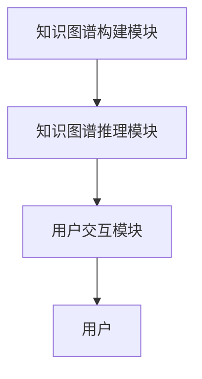

                 


# AI Agent的知识图谱应用

---

## 关键词：
- AI Agent
- 知识图谱
- 知识表示
- 推理算法
- 系统架构

---

## 摘要：
本文深入探讨AI Agent在知识图谱中的应用，从知识图谱的构建、推理到AI Agent的知识表示与建模，详细分析其核心原理与实际应用。通过结合具体案例和系统设计，展示知识图谱如何赋能AI Agent的智能决策能力。

---

# 第1章: AI Agent与知识图谱概述

## 1.1 AI Agent的基本概念

### 1.1.1 AI Agent的定义
AI Agent（人工智能代理）是一种能够感知环境、自主决策并执行任务的智能实体。它可以是一个软件程序、机器人或其他智能系统，通过与环境交互实现目标。

### 1.1.2 AI Agent的核心特征
- **自主性**：无需外部干预，自主决策。
- **反应性**：能够感知环境并实时响应。
- **目标导向**：基于目标进行行动。
- **学习能力**：通过经验改进自身能力。

### 1.1.3 AI Agent的分类与应用场景
- **简单反射型代理**：基于规则的简单响应。
- **基于模型的反射型代理**：基于内部模型进行推理和决策。
- **目标驱动型代理**：以目标为导向进行规划和执行。
- **效用驱动型代理**：通过最大化效用函数进行决策。

应用场景包括智能助手、推荐系统、自动驾驶、智能客服等。

---

## 1.2 知识图谱的基本概念

### 1.2.1 知识图谱的定义
知识图谱是一种以图结构表示知识的语义网络，由实体（概念）和关系组成，用于描述现实世界中的各种实体及其关系。

### 1.2.2 知识图谱的构建过程
1. 数据收集与预处理：从多种数据源收集数据并进行清洗和标准化。
2. 知识抽取：通过自然语言处理技术提取实体和关系。
3. 知识融合：将多个数据源中的知识进行整合，消除冲突。
4. 知识表示：将知识以图结构的形式表示，形成知识图谱。

### 1.2.3 知识图谱的应用领域
- 智能搜索：提升搜索结果的相关性。
- 自然语言处理：增强语义理解能力。
- 数据集成：整合分散的数据源。
- 智能推荐：基于知识图谱进行个性化推荐。

---

## 1.3 AI Agent与知识图谱的结合

### 1.3.1 知识图谱在AI Agent中的作用
知识图谱为AI Agent提供了丰富的背景知识，帮助其更好地理解任务需求、推理问题本质并做出合理决策。

### 1.3.2 AI Agent的知识表示与推理
知识图谱为AI Agent提供了结构化的知识表示方式，支持其进行基于图的推理和关联分析。

### 1.3.3 知识图谱驱动的智能决策
通过知识图谱，AI Agent能够基于上下文信息进行推理，从而做出更智能的决策。

---

## 1.4 本章小结
本章介绍了AI Agent和知识图谱的基本概念，并探讨了两者的结合方式。知识图谱为AI Agent提供了丰富的知识支持，使其能够更智能地进行决策和推理。

---

# 第2章: 知识图谱的构建与管理

## 2.1 知识图谱的构建方法

### 2.1.1 数据收集与预处理
- 数据来源：文本数据、结构化数据、图像数据等。
- 数据清洗：去除噪声数据，确保数据质量。
- 数据标注：对数据进行标签化处理。

### 2.1.2 知识抽取与表示
- 实体识别：识别文本中的实体并进行标注。
- 关系抽取：识别实体之间的关系并建立关系模型。
- 知识表示：将实体和关系以图结构形式表示。

### 2.1.3 知识融合与存储
- 数据融合：将多个数据源中的知识进行整合。
- 知识存储：使用图数据库存储知识图谱。

---

## 2.2 知识图谱的存储与管理

### 2.2.1 数据库选择
- 图数据库：如Neo4j、Neo5j等。
- 关系型数据库：适用于结构化数据存储。

### 2.2.2 知识图谱的存储技术
- 图数据库：支持高效的图结构查询。
- 知识库存储：支持大规模知识存储。

### 2.2.3 知识图谱的优化方法
- 压缩技术：减少存储空间占用。
- 索引优化：提高查询效率。

---

## 2.3 知识图谱的应用案例

### 2.3.1 智能问答系统
基于知识图谱构建问答系统，能够提供更精准的答案。

### 2.3.2 智能推荐系统
通过知识图谱分析用户行为和偏好，进行个性化推荐。

---

## 2.4 本章小结
本章详细介绍了知识图谱的构建与管理方法，并通过具体案例展示了知识图谱的应用场景。

---

# 第3章: 知识图谱的推理与应用

## 3.1 知识图谱推理的基本概念

### 3.1.1 推理的定义与分类
- 推理：基于现有知识推导出新的知识。
- 分类：基于规则推理、统计推理、深度学习推理。

### 3.1.2 知识图谱推理的挑战
- 数据稀疏性：部分实体或关系缺少足够的数据支持。
- 计算复杂度：大规模知识图谱推理计算量大。

### 3.1.3 推理算法的评估指标
- 准确率：推理结果的正确性。
- 召回率：推理结果的完整性。
- F1值：综合准确率和召回率的指标。

---

## 3.2 常见的推理算法

### 3.2.1 基于规则的推理算法
- 规则定义：通过预定义的规则进行推理。
- 优点：简单易懂，适用于规则明确的场景。
- 缺点：难以处理复杂场景。

### 3.2.2 基于统计的推理算法
- 统计方法：通过统计规律进行推理。
- 优点：适用于数据量大的场景。
- 缺点：依赖数据质量。

### 3.2.3 基于深度学习的推理算法
- 深度学习模型：如RNN、LSTM、Transformer等。
- 优点：能够处理复杂场景，具有较强的泛化能力。
- 缺点：计算资源消耗大。

---

## 3.3 知识图谱推理的实现

### 3.3.1 知识图谱推理的数学模型
$$ P(e_1, r, e_2) = \text{score}(e_1, r, e_2) $$
其中，$e_1$和$e_2$是实体，$r$是关系。

### 3.3.2 基于神经网络的推理模型
- 模型结构：将知识图谱嵌入到低维空间中，通过神经网络进行推理。
- 实现步骤：
  1. 实体嵌入：将实体映射为向量。
  2. 关系嵌入：将关系映射为向量。
  3. 推理：通过神经网络进行推理，输出结果。

---

## 3.4 本章小结
本章介绍了知识图谱推理的基本概念、算法分类及实现方法，并通过数学公式和神经网络模型展示了推理过程。

---

# 第4章: AI Agent的知识图谱建模

## 4.1 知识表示与知识图谱的关系

### 4.1.1 知识表示的基本概念
知识表示是将知识以某种形式表示出来，以便计算机能够理解和处理。

### 4.1.2 知识图谱的知识表示形式
- 三元组表示：$(头, 关系, 尾)$。
- 图结构表示：通过节点和边表示实体和关系。

### 4.1.3 知识图谱与知识表示的结合
知识图谱是一种特定的知识表示形式，能够有效地表示实体和关系。

---

## 4.2 基于知识图谱的本体建模

### 4.2.1 本体建模的基本概念
本体建模是通过构建本体（Ontology）来描述特定领域内的概念、关系和规则。

### 4.2.2 知识图谱的本体建模方法
- 本体构建：定义领域内的概念和关系。
- 本体推理：基于本体进行推理和推导。

### 4.2.3 本体建模的工具与技术
- 工具：OntoTool、Protégé等。
- 技术：本体工程、语义网络等。

---

## 4.3 知识图谱驱动的领域模型设计

### 4.3.1 领域模型的设计原则
- 面向领域：专注于特定领域的知识。
- 可扩展性：便于后续扩展和更新。

### 4.3.2 知识图谱在领域模型中的应用
- 知识抽取：从领域数据中抽取实体和关系。
- 知识表示：将领域知识表示为知识图谱。
- 知识推理：基于知识图谱进行推理和决策。

---

## 4.4 本章小结
本章探讨了知识图谱在AI Agent中的建模方法，介绍了知识表示、本体建模及领域模型设计的相关内容。

---

# 第5章: AI Agent的知识图谱系统架构

## 5.1 系统架构设计

### 5.1.1 系统功能设计
- 知识图谱构建模块：负责知识图谱的构建和存储。
- 知识图谱推理模块：基于知识图谱进行推理和决策。
- 用户交互模块：与用户进行交互，提供服务。

### 5.1.2 系统架构图


### 5.1.3 系统实现的技术选型
- 知识图谱存储：使用图数据库Neo4j。
- 推理算法：基于深度学习的模型。

---

## 5.2 系统接口设计

### 5.2.1 API接口设计
- GET /knowledge-graph：获取知识图谱数据。
- POST /reasoning：提交推理请求。

### 5.2.2 接口交互流程
1. 用户发送推理请求。
2. 系统接收请求并进行推理。
3. 系统返回推理结果。

---

## 5.3 本章小结
本章详细设计了AI Agent的知识图谱系统的架构，并通过接口设计展示了系统的实现流程。

---

# 第6章: 项目实战

## 6.1 环境安装

### 6.1.1 安装Python
```bash
# 安装Python
sudo apt-get install python3
```

### 6.1.2 安装依赖库
```bash
pip install neo4j requests
```

---

## 6.2 核心代码实现

### 6.2.1 知识图谱构建
```python
from neo4j import GraphDatabase

class KnowledgeGraph:
    def __init__(self, uri, user, password):
        self.driver = GraphDatabase.driver(uri, auth=(user, password))
    
    def create_graph(self):
        # 创建节点和关系
        with self.driver.session() as session:
            session.run("CREATE (a:Person {name: 'Alice'})")
            session.run("CREATE (b:Person {name: 'Bob'})")
            session.run("MATCH (a:Person {name: 'Alice'}), (b:Person {name: 'Bob'}) CREATE (a)-[r:KNOWS]->(b)")
```

### 6.2.2 推理算法实现
```python
from neo4j.exceptions import ServiceError

class Reasoner:
    def __init__(self, uri, user, password):
        self.graph = KnowledgeGraph(uri, user, password)
    
    def infer(self, head, relation, tail):
        # 查询关系
        result = []
        with self.graph.driver.session() as session:
            session.run("MATCH (a {name: $head})-[r:$relation]->(b) RETURN b.name", head=head, relation=relation)
            records = session.records
            for record in records:
                result.append(record['b.name'])
        return result
```

---

## 6.3 本章小结
本章通过具体代码实现了知识图谱的构建和推理功能，展示了AI Agent的知识图谱应用的实际操作。

---

# 第7章: 总结与展望

## 7.1 总结
本文系统地探讨了AI Agent在知识图谱中的应用，从知识图谱的构建、推理到系统架构设计，详细分析了其核心原理与实现方法。

## 7.2 展望
未来，随着AI技术的不断发展，知识图谱将在更多领域发挥重要作用。AI Agent的知识图谱应用也将更加智能化和个性化。

---

# 作者：AI天才研究院 & 禅与计算机程序设计艺术

