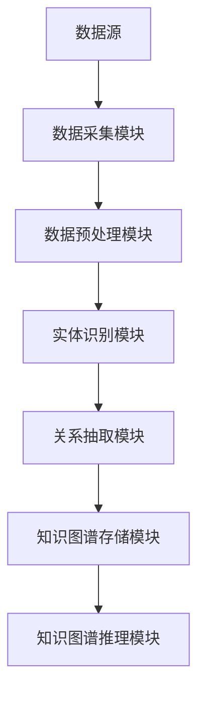
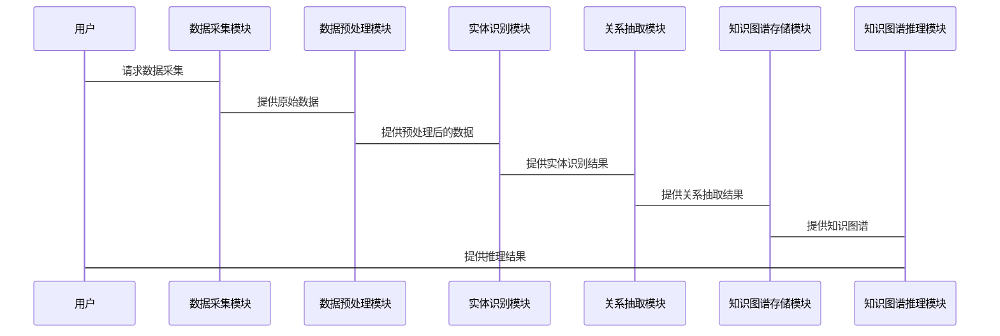

                 


# AI Agent的知识图谱构建与推理机制

> 关键词：AI Agent, 知识图谱, 推理机制, 图数据库, 混合推理

> 摘要：  
AI Agent作为一种智能体，其核心能力依赖于对知识的有效表示与推理。知识图谱作为一种结构化知识表示的形式，为AI Agent提供了强大的语义理解能力。本文详细探讨了AI Agent的知识图谱构建方法及其推理机制，从数据收集、实体识别、关系抽取到推理算法的选择与实现，逐一分析其技术细节，并结合实际案例，深入探讨了知识图谱构建与推理在AI Agent中的应用与挑战。通过本文的分析，读者可以全面理解AI Agent的知识图谱构建与推理机制的核心原理，并掌握其实际应用中的关键点。

---

## 第1章 AI Agent与知识图谱概述

### 1.1 AI Agent的基本概念

AI Agent（智能体）是指在计算机系统中，能够感知环境并采取行动以实现目标的实体。AI Agent具备以下核心特点：
- **自主性**：能够在没有外部干预的情况下独立运行。
- **反应性**：能够根据环境输入动态调整行为。
- **目标导向性**：所有行动均以实现特定目标为导向。
- **学习能力**：能够通过经验改进自身的性能。

### 1.2 知识图谱的概念与作用

知识图谱是一种以图结构形式表示知识的语义网络，节点表示实体或概念，边表示实体之间的关系。知识图谱的作用包括：
- **语义理解**：帮助AI Agent理解数据背后的语义信息。
- **知识表示**：提供结构化的知识表示，便于计算机处理。
- **推理支持**：通过图结构支持逻辑推理和关联分析。

### 1.3 AI Agent与知识图谱的关系

AI Agent的知识图谱构建与推理机制是AI Agent实现智能决策的核心技术。知识图谱为AI Agent提供了语义理解能力，而推理机制则使其能够基于知识图谱进行逻辑推理和关联分析，从而做出智能决策。

---

## 第2章 知识图谱的构建流程

### 2.1 数据收集与预处理

#### 2.1.1 数据来源与类型

知识图谱的数据来源包括：
- **结构化数据**：如数据库表、Excel表格等。
- **半结构化数据**：如HTML页面、XML文件等。
- **非结构化数据**：如文本、图像、视频等。

#### 2.1.2 数据清洗与标准化

数据清洗是将原始数据中的噪声（如冗余信息、格式不一致等）进行处理，确保数据的准确性和一致性。标准化则是将数据转换为统一的格式，例如日期格式统一、单位统一等。

#### 2.1.3 数据结构化处理

将非结构化或半结构化数据转化为结构化的数据形式，例如将文本数据转化为三元组（subject, predicate, object）形式。

### 2.2 实体识别与关系抽取

#### 2.2.1 实体识别算法

实体识别是通过自然语言处理技术从文本中提取出实体（如人名、地名、组织名等）。常用算法包括：
- **基于规则的方法**：通过预定义的规则进行匹配。
- **基于统计的方法**：通过统计学模型进行概率预测。
- **基于深度学习的方法**：如LSTM、BERT等。

#### 2.2.2 关系抽取方法

关系抽取是从文本中抽取实体之间的关系，例如“张三是公司的CEO”。常用方法包括：
- **基于模式匹配的方法**：通过预定义的模式进行匹配。
- **基于统计的方法**：通过统计学模型预测关系。
- **基于深度学习的方法**：如CNN、RNN等。

#### 2.2.3 实体消歧技术

实体消歧是解决同一实体在不同上下文中有不同指代的问题。常用技术包括：
- **基于上下文的消歧**：通过上下文信息进行实体识别。
- **基于知识库的消歧**：利用已有知识库进行实体匹配。

### 2.3 知识图谱的存储与管理

#### 2.3.1 图数据库的选择

常用图数据库包括：
- **Neo4j**：支持事务处理和高效查询。
- **Neo**：支持分布式存储和并行查询。
- **TitanDB**：支持大规模数据存储和高效查询。

#### 2.3.2 知识图谱的存储结构

知识图谱的存储结构包括：
- **节点**：表示实体或概念。
- **边**：表示实体之间的关系。
- **属性**：表示实体的属性值。

#### 2.3.3 知识图谱的更新与维护

知识图谱的更新与维护包括：
- **数据增量更新**：仅更新新增或修改的数据。
- **数据校验**：通过校验规则确保数据的准确性。
- **数据同步**：确保多个副本的数据一致性。

### 2.4 本章小结

本章详细介绍了知识图谱的构建流程，包括数据收集与预处理、实体识别与关系抽取、知识图谱的存储与管理等内容。通过这些步骤，可以将非结构化的数据转化为结构化的知识图谱，为后续的推理提供基础。

---

## 第3章 知识图谱的推理机制

### 3.1 逻辑推理

#### 3.1.1 基于规则的推理

基于规则的推理是通过预定义的逻辑规则进行推理。例如，规则可以定义为：
$$ \text{如果A是B的父亲，那么A是B的亲属} $$

#### 3.1.2 基于逻辑的推理

基于逻辑的推理是通过逻辑演算进行推理。例如，命题逻辑和一阶逻辑：
$$ \text{所有的人都是动物} $$
$$ \text{苏格拉底是人} $$
$$ \text{因此，苏格拉底是动物} $$

#### 3.1.3 推理的正确性与完备性

推理的正确性是指推理过程符合逻辑规则，推理的完备性是指能够覆盖所有可能的推理情况。

### 3.2 机器学习推理

#### 3.2.1 基于概率的推理

基于概率的推理是通过概率论进行推理。例如，贝叶斯网络：
$$ P(A|B) = \frac{P(B|A)P(A)}{P(B)} $$

#### 3.2.2 基于深度学习的推理

基于深度学习的推理是通过深度学习模型（如LSTM、Transformer）进行推理。

#### 3.2.3 推理的可解释性

推理的可解释性是指推理过程能够被人类理解和解释。

### 3.3 混合推理

#### 3.3.1 逻辑推理与机器学习推理的结合

混合推理是将逻辑推理和机器学习推理结合起来，利用逻辑推理的确定性和机器学习推理的泛化能力。

#### 3.3.2 混合推理的优势与挑战

混合推理的优势包括：
- **准确性**：结合了逻辑推理的准确性和机器学习推理的泛化能力。
- **可解释性**：逻辑推理部分具有较高的可解释性。

混合推理的挑战包括：
- **复杂性**：混合推理的实现较为复杂。
- **计算成本**：混合推理的计算成本较高。

### 3.4 本章小结

本章详细介绍了知识图谱的推理机制，包括逻辑推理、机器学习推理和混合推理等内容。通过这些推理方法，可以基于知识图谱进行逻辑推理和关联分析，为AI Agent提供决策支持。

---

## 第4章 知识图谱构建的算法原理

### 4.1 实体识别算法

#### 4.1.1 基于统计的实体识别算法

基于统计的实体识别算法通过统计学模型进行实体识别。例如，使用条件随机场（CRF）进行命名实体识别。

#### 4.1.2 基于深度学习的实体识别算法

基于深度学习的实体识别算法通过深度学习模型（如LSTM、BERT）进行实体识别。

#### 4.1.3 实体识别的评估指标

实体识别的评估指标包括：
- **精确率（Precision）**：识别的正确实体占所有识别实体的比例。
- **召回率（Recall）**：识别的正确实体占所有实际实体的比例。
- **F1值（F1-score）**：精确率和召回率的调和平均值。

### 4.2 关系抽取算法

#### 4.2.1 基于规则的关系抽取算法

基于规则的关系抽取算法通过预定义的规则进行关系抽取。

#### 4.2.2 基于深度学习的关系抽取算法

基于深度学习的关系抽取算法通过深度学习模型（如CNN、RNN）进行关系抽取。

#### 4.2.3 关系抽取的挑战与解决方案

关系抽取的挑战包括：
- **数据稀疏性**：某些关系的训练数据较少。
- **语义多样性**：同一关系在不同语境中有不同的表现形式。

解决方案包括：
- **数据增强**：通过数据增强技术增加训练数据。
- **预训练模型**：利用预训练模型（如BERT）进行关系抽取。

### 4.3 知识图谱构建的优化算法

#### 4.3.1 知识图谱的合并与冲突解决

知识图谱的合并与冲突解决包括：
- **实体对齐**：将不同来源的实体进行对齐。
- **关系对齐**：将不同来源的关系进行对齐。
- **冲突解决**：通过规则或算法解决实体或关系的冲突。

#### 4.3.2 知识图谱的扩展与完善

知识图谱的扩展与完善包括：
- **自动补全**：通过自动学习技术补全知识图谱中的缺失实体或关系。
- **动态更新**：根据实时数据动态更新知识图谱。

### 4.4 本章小结

本章详细介绍了知识图谱构建的算法原理，包括实体识别算法、关系抽取算法和知识图谱构建的优化算法等内容。通过这些算法，可以高效地构建高质量的知识图谱。

---

## 第5章 知识图谱推理的数学模型与公式

### 5.1 逻辑推理的数学模型

#### 5.1.1 命题逻辑的基本公式

命题逻辑的基本公式包括：
- 合取（AND）：$$ p \land q $$
- 析取（OR）：$$ p \lor q $$
- 蕴涵（IMPLIES）：$$ p \rightarrow q $$
- 否定（NOT）：$$ \neg p $$

#### 5.1.2 一阶逻辑的基本公式

一阶逻辑的基本公式包括：
- 存量词（存在量词）：$$ \exists x (P(x) \rightarrow Q(x)) $$
- 全称量词（全称量词）：$$ \forall x (P(x) \rightarrow Q(x)) $$

### 5.2 概率推理的数学模型

#### 5.2.1 贝叶斯网络的基本公式

贝叶斯网络的基本公式是贝叶斯定理：
$$ P(A|B) = \frac{P(B|A)P(A)}{P(B)} $$

#### 5.2.2 马尔可夫逻辑网络的基本公式

马尔可夫逻辑网络的基本公式包括：
- 独立性假设：$$ P(A|B) = P(A|B, C) \quad \text{如果A和C独立} $$
- 条件独立性：$$ P(A,B|C) = P(A|C)P(B|C) $$

### 5.3 混合推理的数学模型

混合推理的数学模型结合了逻辑推理和概率推理。例如：
$$ P(A|B) = \sum_{C} P(A|B,C)P(C|B) $$

其中，$$ P(A|B,C) $$ 是基于逻辑推理的结果，$$ P(C|B) $$ 是基于概率推理的结果。

---

## 第6章 知识图谱构建的系统架构设计

### 6.1 问题场景介绍

知识图谱构建的系统架构设计需要考虑以下问题：
- **数据来源多样性**：数据可能来自多个不同的来源。
- **数据格式多样性**：数据可能包括结构化、半结构化和非结构化数据。
- **数据规模**：知识图谱可能包含海量数据，需要高效的存储和处理能力。

### 6.2 系统功能设计

系统功能设计包括：
- **数据采集**：从多个数据源采集数据。
- **数据预处理**：清洗和结构化数据。
- **实体识别**：识别文本中的实体。
- **关系抽取**：抽取实体之间的关系。
- **知识图谱存储**：将知识图谱存储在图数据库中。
- **知识图谱推理**：基于知识图谱进行推理。

### 6.3 系统架构设计

以下是知识图谱构建系统的架构设计：



### 6.4 系统接口设计

系统接口设计包括：
- **数据采集接口**：从数据源获取数据。
- **数据预处理接口**：对数据进行清洗和结构化处理。
- **实体识别接口**：识别文本中的实体。
- **关系抽取接口**：抽取实体之间的关系。
- **知识图谱存储接口**：将知识图谱存储在图数据库中。
- **知识图谱推理接口**：基于知识图谱进行推理。

### 6.5 系统交互设计

以下是知识图谱构建系统的交互设计：



---

## 第7章 项目实战

### 7.1 环境安装

知识图谱构建与推理的环境安装包括：
- **Python**：安装Python 3.x。
- **图数据库**：安装Neo4j或其他图数据库。
- **自然语言处理库**：安装spaCy、NLTK等。
- **深度学习框架**：安装TensorFlow、PyTorch等。

### 7.2 系统核心实现源代码

以下是知识图谱构建与推理的核心代码示例：

```python
import neo4j
from spacy.lang.zh import Chinese

# 实体识别
nlp = Chinese()
doc = nlp("张三是中国的科学家。")
for ent in doc.ents:
    print(ent.text, ent.label_)

# 关系抽取
# 假设我们有一个关系抽取模型
# 模型输入：文本
# 模型输出：关系三元组
from model import RelationExtractor
extractor = RelationExtractor()
relations = extractor.extract(doc)
for relation in relations:
    print(relation.subject, relation.predicate, relation.object)

# 知识图谱存储
driver = neo4j.Driver("bolt://localhost:7687", auth=("neo4j", "password"))
with driver.session() as session:
    session.write_transaction(
        lambda tx: tx.run(
            "CREATE (:Person {name: $name})",
            name=relations.subject
        )
    )
    session.write_transaction(
        lambda tx: tx.run(
            "CREATE (:Concept {name: $name})",
            name=relations.object
        )
    )
    session.write_transaction(
        lambda tx: tx.run(
            "MATCH (a:Person {name: $a}), (b:Concept {name: $b}) CREATE (a)-[:$relation]->(b)",
            a=relations.subject, b=relations.object, relation=relations.predicate
        )
    )
```

### 7.3 代码应用解读与分析

上述代码示例展示了知识图谱构建的核心步骤：
1. **实体识别**：使用spaCy进行实体识别。
2. **关系抽取**：使用自定义的关系抽取模型提取关系三元组。
3. **知识图谱存储**：将实体和关系存储在Neo4j图数据库中。

### 7.4 实际案例分析

以“张三是中国的科学家”为例，系统将识别出“张三”（人名）和“中国的科学家”（概念），并抽取关系“张三是中国的科学家”，将其存储在知识图谱中。

### 7.5 项目小结

本章通过实际案例展示了知识图谱构建与推理的核心实现步骤，包括环境安装、实体识别、关系抽取、知识图谱存储和推理等内容。

---

## 第8章 总结与展望

### 8.1 本章总结

本文详细探讨了AI Agent的知识图谱构建与推理机制，从知识图谱的构建流程到推理机制的实现，逐一分析了其技术细节，并结合实际案例，深入探讨了知识图谱构建与推理在AI Agent中的应用与挑战。

### 8.2 未来展望

未来，知识图谱构建与推理技术将朝着以下方向发展：
- **知识图谱的动态更新**：随着数据的不断变化，知识图谱需要能够动态更新。
- **知识图谱的多模态表示**：将图像、视频等多种模态的数据纳入知识图谱的构建中。
- **推理算法的优化**：进一步优化推理算法，提高推理的效率和准确性。

### 8.3 最佳实践 Tips

- **数据质量**：知识图谱的质量依赖于数据的质量，因此数据预处理是关键。
- **算法选择**：根据具体场景选择合适的算法，如实体识别和关系抽取的算法选择。
- **系统架构**：设计合理的系统架构，确保系统的高效性和可扩展性。

### 8.4 小结

知识图谱构建与推理是AI Agent实现智能决策的核心技术。通过本文的分析，读者可以全面理解AI Agent的知识图谱构建与推理机制的核心原理，并掌握其实际应用中的关键点。

---

## 作者

作者：AI天才研究院/AI Genius Institute & 禅与计算机程序设计艺术 /Zen And The Art of Computer Programming

---

感谢您的阅读！如果您对AI Agent的知识图谱构建与推理机制有进一步的问题或需要更深入的技术支持，请随时与我们联系。

