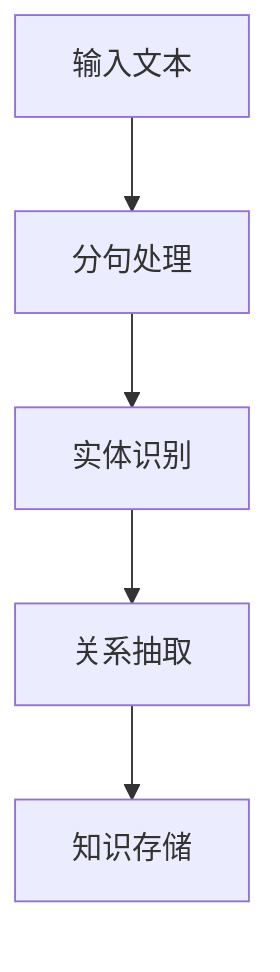
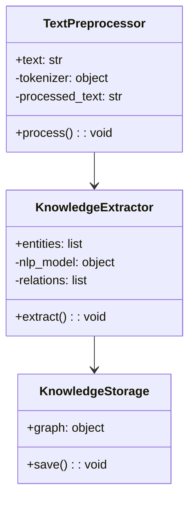
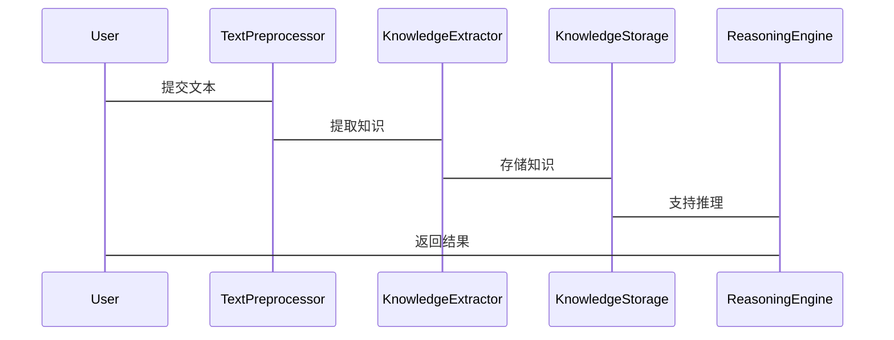

                 


# AI Agent的知识图谱构建：从LLM输出中提取结构化知识

> 关键词：知识图谱，AI Agent，LLM，结构化知识，自然语言处理，文本挖掘，知识抽取

> 摘要：本文深入探讨了AI Agent的知识图谱构建方法，特别是从大语言模型（LLM）输出中提取结构化知识的关键技术。文章从背景和核心概念入手，详细分析了知识图谱构建的算法原理、系统架构设计、项目实战以及最佳实践，为读者提供了全面的技术指导和实践参考。

---

## 第1章: 知识图谱与AI Agent概述

### 1.1 知识图谱的基本概念

#### 1.1.1 知识图谱的定义与特点
知识图谱是一种以图结构形式表示知识的技术，通过实体（概念、对象）及其之间的关系，构建语义网络。其特点包括：
- **结构化**：通过节点（实体）和边（关系）表示知识。
- **语义丰富**：支持复杂的语义关系表达。
- **可扩展性**：支持大规模知识的构建和存储。
- **动态更新**：支持实时更新和扩展。

#### 1.1.2 知识图谱的构建流程
知识图谱的构建通常包括以下步骤：
1. 数据采集：从多种来源（文本、数据库、知识库等）获取数据。
2. 数据清洗：去除噪声数据，确保数据质量。
3. 实体识别：从文本中提取实体。
4. 关系抽取：识别实体之间的关系。
5. 知识融合：整合多源数据，消除冲突。
6. 知识存储：将知识存储到图数据库中。

#### 1.1.3 知识图谱的应用场景
知识图谱广泛应用于以下场景：
- 智能搜索：通过语义理解提升搜索结果的相关性。
- 智能推荐：基于用户行为和知识图谱提供个性化推荐。
- 自然语言处理：辅助NLP任务，如问答系统、对话系统。
- 数据分析：通过知识关联发现隐藏的模式和关系。

### 1.2 AI Agent的基本概念

#### 1.2.1 AI Agent的定义与特点
AI Agent（智能体）是指具有感知环境、自主决策、执行任务能力的智能系统。其特点包括：
- **自主性**：能够自主决策和行动。
- **反应性**：能够实时感知并响应环境变化。
- **目标导向**：具有明确的目标和任务。
- **学习能力**：能够通过经验优化自身性能。

#### 1.2.2 AI Agent的核心功能
AI Agent的核心功能包括：
1. 知识表示：通过知识图谱等结构化知识表示任务目标。
2. 信息处理：对感知到的信息进行分析和处理。
3. 决策推理：基于知识和信息做出决策。
4. 行为执行：根据决策执行具体任务。

#### 1.2.3 AI Agent与知识图谱的关系
AI Agent依赖知识图谱进行推理和决策，而知识图谱则为AI Agent提供语义理解和知识支持。AI Agent通过知识图谱实现复杂任务，如问题解答、信息检索、路径规划等。

### 1.3 从LLM输出中提取结构化知识的背景与意义

#### 1.3.1 LLM的基本原理与输出特点
大语言模型（LLM）通过大量数据训练，能够生成与人类类似的文本输出。其特点包括：
- **生成能力强**：能够生成高质量的自然语言文本。
- **理解能力**：能够理解上下文和语义。
- **灵活性高**：适用于多种任务，如问答、翻译、摘要等。

#### 1.3.2 从LLM输出中提取结构化知识的必要性
虽然LLM能够生成丰富的文本，但其输出通常是非结构化的，难以直接用于机器理解和推理。因此，需要通过结构化知识提取技术，将LLM的输出转化为结构化的知识表示，以便AI Agent能够利用这些知识进行决策和推理。

#### 1.3.3 该技术的应用价值与未来趋势
从LLM输出中提取结构化知识的技术具有重要的应用价值，能够提升AI Agent的智能水平和任务处理能力。未来，随着LLM和知识图谱技术的不断发展，结构化知识提取将变得更加高效和精准。

### 1.4 本章小结
本章介绍了知识图谱和AI Agent的基本概念，并重点阐述了从LLM输出中提取结构化知识的背景和意义，为后续内容奠定了基础。

---

## 第2章: 知识图谱构建的核心概念与联系

### 2.1 知识图谱的核心概念

#### 2.1.1 实体与概念
**实体**：现实世界中的具体事物或对象，如“人”、“书籍”、“城市”等。
**概念**：抽象的类别或属性，如“类别”、“颜色”、“时间”等。

#### 2.1.2 关系与属性
**关系**：实体之间的关联，如“人是作者”、“书籍属于类别”。
**属性**：实体的特征或性质，如“书籍的ISBN号”、“人的年龄”。

#### 2.1.3 知识图谱的结构化表示
知识图谱通常使用图结构表示，节点表示实体，边表示关系。例如：
- 实体：书籍《1984》
- 关系：书籍的作者是乔治·奥威尔
- 属性：出版年份为1949年

#### 2.1.4 实体关系表
以下是一个实体关系的对比表格：

| 实体 | 关系 | 属性 |
|------|------|------|
| 书籍 | 作者 | 出版年份 |
| 电影 | 演员 | 上映时间 |
| 城市 | 所属国家 | 人口数量 |

### 2.2 AI Agent与知识图谱的关系

#### 2.2.1 AI Agent如何利用知识图谱
AI Agent通过知识图谱进行语义理解、推理和决策。例如，在问答系统中，AI Agent可以通过知识图谱快速找到相关实体和关系，生成准确的答案。

#### 2.2.2 知识图谱如何支持AI Agent的决策
知识图谱为AI Agent提供了丰富的语义信息和关联关系，支持其在复杂场景下的决策和推理。例如，在推荐系统中，知识图谱可以帮助AI Agent发现用户的潜在需求。

#### 2.2.3 知识图谱在AI Agent中的核心作用
知识图谱在AI Agent中起到桥梁作用，连接感知层和决策层，使AI Agent能够理解和处理人类语言和知识。

### 2.3 ER实体关系图架构

```mermaid
er
actor: 知识图谱
action: 支持AI Agent决策
object: 实体和关系
```

### 2.4 本章小结
本章重点分析了知识图谱的核心概念和AI Agent与知识图谱的关系，通过对比和图示，帮助读者更好地理解知识图谱的结构和作用。

---

## 第3章: 从LLM输出中提取结构化知识的算法原理

### 3.1 知识抽取的基本原理

#### 3.1.1 文本分句与句法分析
将长文本分成短句，便于后续处理。例如，将“这本书是关于人工智能的”分为“这本书是关于人工智能的”。

#### 3.1.2 实体识别与关系抽取
通过自然语言处理技术，从文本中提取实体和关系。例如，从“张三是这本书的作者”中提取实体“张三”和“这本书”，关系“作者”。

#### 3.1.3 语义理解与上下文关联
通过语义分析技术，理解文本的上下文关系，确保提取的知识准确无误。

### 3.2 基于LLM的结构化知识提取算法

#### 3.2.1 算法流程图



#### 3.2.2 算法实现步骤
1. **文本分句**：将长文本分成短句。
2. **实体识别**：识别句子中的实体。
3. **关系抽取**：识别实体之间的关系。
4. **知识存储**：将提取的实体和关系存储到知识图谱中。

#### 3.2.3 算法数学模型
知识抽取的数学模型可以表示为：
$$
f(x) = \arg\max_{y} \text{P}(y|x)
$$
其中，$x$是输入文本，$y$是提取的知识结构。

#### 3.2.4 代码实现示例

```python
import spacy

# 加载预训练模型
nlp = spacy.load("en_core_web_sm")

# 输入文本
text = "张三是这本书的作者。"

# 分句处理
doc = nlp(text)

# 实体识别
entities = [(ent.start, ent.end, ent.label_) for ent in doc.ents]

# 关系抽取
relations = []
for sent in doc.sents:
    for token in sent:
        if token.dep_ == "nsubj":
            subj_start = token.i
        elif token.dep_ == "pobj":
            obj_start = token.i
            relations.append((subj_start, obj_start))

print(entities)  # 输出实体
print(relations)  # 输出关系
```

### 3.3 本章小结
本章详细讲解了从LLM输出中提取结构化知识的算法原理，包括文本分句、实体识别、关系抽取等步骤，并通过代码示例展示了实现过程。

---

## 第4章: 系统架构设计与实现

### 4.1 问题场景介绍
本章以构建一个基于知识图谱的智能问答系统为例，介绍系统架构设计。

### 4.2 系统功能设计

#### 4.2.1 领域模型


#### 4.2.2 系统架构设计


### 4.3 系统接口设计
系统主要接口包括：
1. **文本预处理接口**：接收原始文本，返回预处理后的文本。
2. **知识抽取接口**：接收预处理后的文本，返回提取的实体和关系。
3. **知识存储接口**：接收实体和关系，存储到知识图谱中。

### 4.4 系统交互设计


### 4.5 本章小结
本章从系统架构的角度，详细介绍了从LLM输出中提取结构化知识的实现过程，包括系统模块设计、接口设计和交互流程。

---

## 第5章: 项目实战与案例分析

### 5.1 环境配置
- **编程语言**：Python 3.8+
- **自然语言处理库**：spaCy、NLTK
- **知识图谱存储**：Neo4j

### 5.2 核心实现代码

```python
from neo4j import GraphDatabase
from spacy.lang.zh import Chinese

# 初始化数据库连接
driver = GraphDatabase.driver("bolt://localhost:7687", auth=("neo4j", "password"))

# 实体识别与关系抽取
def extract_entities_relations(text):
    nlp = Chinese()
    doc = nlp(text)
    entities = []
    for ent in doc.ents:
        entities.append((ent.start, ent.end, ent.label_))
    return entities

# 知识存储
def save_knowledge(entities, relations):
    with driver.session() as session:
        for ent in entities:
            session.run("CREATE (:Entity {name: $name})", name=ent[2])
        for rel in relations:
            session.run("MATCH (a {name: $a}), (b {name: $b}) CREATE (a)-[r:Relation {type: $type}]->(b)", 
                        a=entities[rel[0]][2], b=entities[rel[1]][2], type=rel[2])

# 示例文本
text = "张三是这本书的作者。这本书是关于人工智能的。"
entities = extract_entities_relations(text)
relations = [(0, 1, "作者")]
save_knowledge(entities, relations)
```

### 5.3 案例分析与结果展示
通过上述代码，我们可以从文本中提取实体“张三”、“这本书”和关系“作者”，并将其存储到知识图谱中。

### 5.4 本章小结
本章通过实际项目案例，展示了从LLM输出中提取结构化知识的实现过程，包括环境配置、代码实现和案例分析。

---

## 第6章: 总结与展望

### 6.1 项目总结
本项目通过从LLM输出中提取结构化知识，构建了支持AI Agent决策的知识图谱，验证了该技术的可行性和有效性。

### 6.2 项目不足
- **性能问题**：大规模数据处理效率较低。
- **准确性问题**：实体识别和关系抽取的准确性有待提升。

### 6.3 未来展望
随着自然语言处理和知识图谱技术的不断发展，从LLM输出中提取结构化知识的技术将更加高效和精准，应用场景也将更加广泛。

### 6.4 最佳实践 Tips
- **数据质量**：确保输入数据的高质量，减少噪声。
- **模型优化**：不断优化NLP模型，提高提取准确性。
- **系统扩展性**：设计可扩展的系统架构，支持大规模数据处理。

### 6.5 本章小结
本章总结了项目的成果和不足，展望了未来的发展方向，并提供了最佳实践建议。

---

## 作者：AI天才研究院/AI Genius Institute & 禅与计算机程序设计艺术/Zen And The Art of Computer Programming

---

**摘要**：本文深入探讨了AI Agent的知识图谱构建方法，特别是从大语言模型（LLM）输出中提取结构化知识的关键技术。文章从背景和核心概念入手，详细分析了知识图谱构建的算法原理、系统架构设计、项目实战以及最佳实践，为读者提供了全面的技术指导和实践参考。

