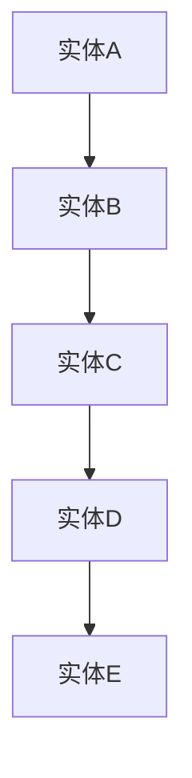
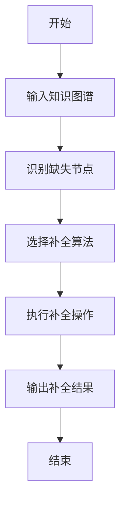
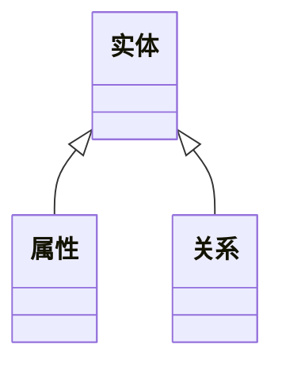
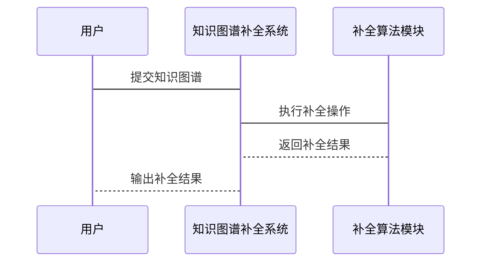

                 


# AI Agent的知识图谱补全技术在推理中的应用

> 关键词：知识图谱补全技术，AI Agent，推理应用，知识图谱构建，属性补全，关系补全

> 摘要：知识图谱补全技术是提升AI Agent推理能力的关键技术之一。本文详细探讨了知识图谱补全技术的核心概念、算法原理、系统架构设计以及实际应用案例，旨在帮助读者深入了解知识图谱补全技术在AI Agent推理中的重要作用和实现方法。

---

## 第1章 知识图谱补全技术的背景与应用价值

### 1.1 知识图谱的基本概念
#### 1.1.1 知识图谱的定义与特点
知识图谱是一种以图结构形式表示知识的语义网络，节点表示实体或概念，边表示实体之间的关系。知识图谱具有语义丰富、结构化、可扩展性强等特点。

#### 1.1.2 知识图谱在AI Agent中的作用
知识图谱为AI Agent提供了丰富的语义信息，帮助AI Agent更好地理解上下文、推理和决策。通过知识图谱，AI Agent可以实现更智能的交互和更复杂的任务处理。

#### 1.1.3 知识图谱补全技术的必要性
知识图谱在构建过程中往往存在数据缺失、关系不完整等问题。补全技术可以有效弥补这些缺陷，提升知识图谱的完整性和准确性。

### 1.2 知识图谱补全技术的问题背景
#### 1.2.1 知识图谱中的常见缺失问题
- 实体缺失：知识图谱中某些实体未被收录。
- 属性缺失：实体的某些属性未被记录。
- 关系缺失：实体之间的关系未被明确描述。

#### 1.2.2 知识图谱补全的挑战与难点
- 数据稀疏性：部分实体或关系在数据集中出现频率较低，难以通过统计方法补全。
- 复杂性：知识图谱涉及多种类型实体和复杂的关系结构，补全技术需要考虑多种因素。
- 可解释性：补全过程需要保证结果的可解释性，以便AI Agent能够理解和使用补全后的知识。

#### 1.2.3 知识图谱补全的边界与外延
知识图谱补全技术不仅包括填补缺失节点，还包括修复错误节点和优化知识图谱结构。

### 1.3 知识图谱补全技术的应用价值
#### 1.3.1 提升AI Agent的推理能力
通过补全知识图谱，AI Agent可以获取更完整的信息，从而提高推理的准确性和效率。

#### 1.3.2 增强知识图谱的完整性与准确性
补全技术可以弥补知识图谱的缺失部分，提升其完整性和准确性，为后续应用提供更好的基础。

#### 1.3.3 促进知识图谱的广泛应用
知识图谱补全技术使得知识图谱能够更好地支持各种应用场景，如问答系统、推荐系统和智能对话系统。

---

## 第2章 知识图谱补全技术的核心概念与联系

### 2.1 核心概念原理
#### 2.1.1 知识图谱补全的基本原理
知识图谱补全技术通过分析现有知识图谱的结构和语义信息，利用多种方法（如规则推理、统计学习和图神经网络）推断出缺失的部分。

#### 2.1.2 知识图谱补全的关键技术
- 基于规则的补全技术：利用领域知识和规则进行推理。
- 基于统计学习的补全技术：通过机器学习模型预测缺失信息。
- 基于图神经网络的补全技术：利用图结构数据进行深度学习。

#### 2.1.3 知识图谱补全的实现流程
1. 识别缺失节点或关系。
2. 选择合适的补全算法。
3. 执行补全操作。
4. 验证和优化结果。

### 2.2 核心概念属性特征对比
#### 2.2.1 基于规则的补全技术
优点：简单易懂，适合领域知识明确的场景。  
缺点：依赖人工规则，难以应对复杂场景。

#### 2.2.2 基于统计学习的补全技术
优点：能够处理大量数据，适用于数据密集型场景。  
缺点：结果可能存在不确定性，需要大量标注数据。

#### 2.2.3 基于图神经网络的补全技术
优点：能够捕捉图结构中的复杂关系，适用于大规模知识图谱。  
缺点：计算复杂度高，需要大量计算资源。

### 2.3 ER实体关系图架构


---

## 第3章 知识图谱补全技术的算法原理

### 3.1 算法原理概述
#### 3.1.1 基于规则的补全算法
基于领域知识和规则进行推理，例如利用常识推理补全缺失属性。

#### 3.1.2 基于统计学习的补全算法
利用机器学习模型（如随机森林、支持向量机）预测缺失信息。

#### 3.1.3 基于图神经网络的补全算法
利用图神经网络（如GAT、GCN）捕捉图结构中的复杂关系，进行深度学习补全。

### 3.2 算法流程图


### 3.3 算法实现代码
```python
def knowledge_graph_completion(kg, missing_nodes):
    # 示例代码：基于规则的补全算法
    completed_kg = kg.copy()
    for node in missing_nodes:
        if node.has_rule_based_inference():
            completed_kg.add_edge(node, inferred_node)
    return completed_kg
```

### 3.4 数学模型与公式
#### 3.4.1 基于概率的补全公式
$$ P(node | context) = \frac{P(context | node) \cdot P(node)}{P(context)} $$

---

## 第4章 系统分析与架构设计方案

### 4.1 问题场景介绍
知识图谱补全系统需要解决实体缺失、属性缺失和关系缺失问题，支持多种补全方法。

### 4.2 系统功能设计
#### 4.2.1 领域模型设计


#### 4.2.2 系统架构设计


### 4.3 系统接口设计
知识图谱补全系统的接口包括：
- 输入接口：接收原始知识图谱和缺失检测结果。
- 输出接口：输出补全后的知识图谱。

### 4.4 系统交互流程


---

## 第5章 项目实战

### 5.1 环境安装
- 安装必要的依赖库：networkx、numpy、scikit-learn。

### 5.2 系统核心实现源代码
```python
def missing_node_detection(kg):
    # 检测知识图谱中缺失的节点
    missing_nodes = []
    for node in kg.nodes():
        if len(kg.get_neighbors(node)) < 2:
            missing_nodes.append(node)
    return missing_nodes
```

### 5.3 代码应用解读与分析
- 上述代码通过检测知识图谱中邻居节点数量较少的节点，识别出可能缺失的节点。

### 5.4 实际案例分析
以医疗知识图谱为例，补全缺失的药物副作用关系。

### 5.5 项目总结
知识图谱补全技术能够有效提升知识图谱的完整性和准确性，为AI Agent的推理能力提供强有力支持。

---

## 第6章 最佳实践

### 6.1 小结
知识图谱补全技术是AI Agent推理中的关键环节，通过多种方法和技术实现知识图谱的完善。

### 6.2 注意事项
- 数据质量对补全效果影响较大，需注意数据清洗和预处理。
- 不同场景下选择合适的补全方法，避免“一刀切”。

### 6.3 拓展阅读
推荐阅读相关论文和书籍，深入理解知识图谱补全技术的前沿研究。

---

## 作者

作者：AI天才研究院/AI Genius Institute & 禅与计算机程序设计艺术 /Zen And The Art of Computer Programming

