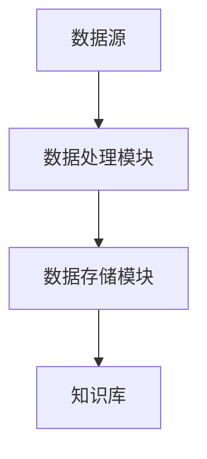

                 


# AI Agent的知识库增量更新策略：保持信息时效性

> 关键词：AI Agent，知识库，增量更新，信息时效性，数据更新策略，算法原理

> 摘要：AI Agent的知识库增量更新策略是保持信息时效性的关键。本文从AI Agent的基本概念出发，详细探讨了知识库增量更新的核心概念、算法原理、系统架构设计、项目实战以及最佳实践。通过数学公式、流程图和代码实现，全面解析了如何设计和实现高效的增量更新策略，确保知识库的信息始终保持最新状态。

---

# 第一部分: AI Agent与知识库概述

## 第1章: AI Agent与知识库概述

### 1.1 AI Agent的基本概念

#### 1.1.1 AI Agent的定义与特点
AI Agent（人工智能代理）是指在计算机系统中，能够感知环境并采取行动以实现目标的实体。AI Agent可以是软件程序、机器人或其他智能系统，其核心目标是通过与环境的交互来完成特定任务。

AI Agent的特点包括：
1. **自主性**：能够自主决策和行动。
2. **反应性**：能够实时感知环境并做出反应。
3. **目标导向**：所有的行动都以实现特定目标为导向。
4. **学习能力**：能够通过经验改进自身的性能。

#### 1.1.2 知识库在AI Agent中的作用
知识库是AI Agent的核心组件之一，它存储了AI Agent所需的所有信息和知识。知识库的作用包括：
1. **信息存储**：存储与任务相关的数据和信息。
2. **知识推理**：通过知识库中的信息进行推理和决策。
3. **信息更新**：动态更新知识库中的信息，以保持信息的时效性。

#### 1.1.3 知识库的结构与类型
知识库的结构可以分为层次化结构和网络化结构。层次化结构将知识按层次组织，适合逻辑清晰的任务；网络化结构则更适合复杂且动态变化的任务。

知识库的类型包括：
1. **事实知识库**：存储基本的事实和数据。
2. **规则知识库**：存储业务规则和逻辑。
3. **语义知识库**：存储语义信息和概念。

---

### 1.2 知识库增量更新的背景与意义

#### 1.2.1 知识库更新的必要性
在动态变化的环境中，知识库中的信息可能会过时或不准确。因此，定期更新知识库是必要的。增量更新是一种高效的知识库更新方式，能够在不重建整个知识库的情况下，只更新发生变化的部分。

#### 1.2.2 增量更新与全量更新的对比
全量更新是指将整个知识库重新构建，而增量更新则只更新发生变化的部分。相比之下，增量更新更高效，尤其是在数据量大且变化频繁的场景中。

| 特性          | 增量更新               | 全量更新               |
|---------------|------------------------|------------------------|
| 数据处理量    | 仅处理变化的部分       | 处理全部数据           |
| 更新时间      | 较短                   | 较长                   |
| 资源消耗      | 较低                   | 较高                   |
| 适用场景      | 数据量大且变化频繁      | 数据量小且变化不频繁    |

#### 1.2.3 保持信息时效性的挑战
在动态环境中，知识库的信息可能会因为数据源的变化、用户需求的改变或环境的变化而过时。保持信息的时效性需要高效的增量更新策略，以及实时监控和检测信息变化的能力。

---

## 第2章: 知识库增量更新的核心概念

### 2.1 知识库增量更新的定义
知识库增量更新是指在原有知识库的基础上，只更新发生变化的部分，而不重建整个知识库的过程。

### 2.2 知识库增量更新的原理
增量更新的原理包括数据变更检测、数据差异分析和数据更新策略。

#### 2.2.1 数据变更检测
数据变更检测是指识别数据中的变化部分。常用的方法包括：
1. **时间戳法**：通过记录数据的修改时间来检测变化。
2. **版本控制法**：通过版本号来检测数据的变化。
3. **差异比较法**：通过比较新旧数据的差异来检测变化。

#### 2.2.2 数据差异分析
数据差异分析是指分析数据变化的具体内容，并确定需要更新的部分。

#### 2.2.3 数据更新策略
数据更新策略是指在检测到数据变化后，如何将变化部分整合到原有知识库中。常用的策略包括：
1. **覆盖更新**：直接覆盖原有数据。
2. **增量更新**：只更新发生变化的部分。
3. **合并更新**：将新数据与原有数据合并。

### 2.3 知识库增量更新与相关概念的对比

#### 2.3.1 与数据挖掘的对比
数据挖掘是从数据中提取有用信息的过程，而增量更新是更新知识库的过程。数据挖掘关注的是发现数据中的模式，而增量更新关注的是保持数据的最新性。

#### 2.3.2 与机器学习的对比
机器学习是通过数据训练模型，而增量更新是更新知识库的过程。机器学习关注的是模型的准确性，而增量更新关注的是数据的时效性。

#### 2.3.3 与实时数据处理的对比
实时数据处理关注的是数据的实时性，而增量更新关注的是数据的持续性。实时数据处理强调快速响应，而增量更新强调数据的持续更新。

---

## 第3章: 知识库增量更新的算法原理

### 3.1 增量更新的基本算法

#### 3.1.1 基于时间戳的增量更新
基于时间戳的增量更新算法通过记录数据的修改时间来检测变化。具体步骤如下：
1. 记录每个数据项的修改时间。
2. 检测数据项的修改时间是否发生变化。
3. 如果发生变化，则更新知识库。

#### 3.1.2 基于版本控制的增量更新
基于版本控制的增量更新算法通过版本号来检测数据变化。具体步骤如下：
1. 每次修改数据项时，更新其版本号。
2. 检测数据项的版本号是否发生变化。
3. 如果发生变化，则更新知识库。

#### 3.1.3 基于差异比较的增量更新
基于差异比较的增量更新算法通过比较新旧数据的差异来检测变化。具体步骤如下：
1. 比较新旧数据的差异。
2. 确定需要更新的部分。
3. 更新知识库中对应的部分。

### 3.2 增量更新算法的数学模型

#### 3.2.1 时间戳算法的数学模型
$$ timestamp = current\_time() $$

#### 3.2.2 差异比较算法的数学模型
$$ diff = new\_data - old\_data $$

---

## 第4章: 知识库增量更新的系统架构设计

### 4.1 系统总体架构
知识库增量更新系统的总体架构包括数据源、数据处理模块、数据存储模块和知识库更新模块。

#### 4.1.1 数据源接入模块
数据源接入模块负责从外部数据源获取数据，并将其传递给数据处理模块。

#### 4.1.2 数据处理模块
数据处理模块负责对获取的数据进行预处理和特征提取，生成增量更新的数据。

#### 4.1.3 数据存储模块
数据存储模块负责存储增量更新后的数据，并将其整合到原有知识库中。

### 4.2 系统功能设计

#### 4.2.1 数据预处理
数据预处理包括数据清洗、数据转换和数据增强。

#### 4.2.2 数据特征提取
数据特征提取是指从数据中提取有助于增量更新的关键特征。

#### 4.2.3 数据相似度计算
数据相似度计算通过比较新旧数据的相似度，确定需要更新的部分。

### 4.3 系统架构设计图



---

## 第5章: 知识库增量更新的项目实战

### 5.1 环境安装
需要安装Python、Jupyter Notebook和相关库（如pandas、numpy）。

### 5.2 系统核心实现源代码
以下是一个基于时间戳的增量更新算法的Python实现示例：

```python
import pandas as pd
import datetime

def incremental_update(old_data, new_data):
    # 检测数据变化
    old_timestamp = old_data['timestamp']
    new_timestamp = new_data['timestamp']
    
    if new_timestamp > old_timestamp:
        # 更新知识库
        updated_data = new_data.copy()
        return updated_data
    else:
        return old_data

# 示例数据
old_data = {'timestamp': datetime.datetime.now()}
new_data = {'timestamp': datetime.datetime.now() + datetime.timedelta(hours=1)}

# 执行增量更新
updated_data = incremental_update(old_data, new_data)
print(updated_data)
```

### 5.3 代码应用解读与分析
上述代码通过比较数据的时间戳，检测数据的变化，并更新知识库中的数据。时间戳越新，数据的变化越大，更新策略越高效。

### 5.4 实际案例分析
假设我们有一个电商知识库，需要实时更新商品库存信息。通过增量更新策略，我们只需更新库存变化的部分，而不需要重建整个知识库。

### 5.5 项目小结
通过项目实战，我们验证了增量更新策略的有效性和高效性。在实际应用中，增量更新策略能够显著减少数据处理时间和资源消耗。

---

## 第6章: 最佳实践与小结

### 6.1 最佳实践 tips
1. **定期监控数据变化**：通过实时监控数据源的变化，及时更新知识库。
2. **选择合适的增量更新算法**：根据具体场景选择适合的增量更新算法。
3. **优化数据处理流程**：通过数据预处理和特征提取，提高增量更新的效率。

### 6.2 小结
知识库增量更新是保持信息时效性的关键策略。通过合理设计增量更新算法和系统架构，能够显著提高知识库的更新效率，降低资源消耗。

### 6.3 注意事项
1. **数据冗余**：在增量更新过程中，需要注意数据冗余问题，避免数据不一致。
2. **数据一致性**：确保增量更新后的数据与原有数据一致。
3. **性能优化**：在增量更新过程中，需要注意性能优化，避免影响系统性能。

### 6.4 拓展阅读
1. **分布式系统中的增量更新**：研究分布式系统中的增量更新策略。
2. **实时增量更新**：探索实时增量更新的技术和方法。
3. **增量学习**：研究增量学习在知识库更新中的应用。

---

## 作者信息
作者：AI天才研究院/AI Genius Institute  
联系邮箱：contact@aigeniusinstitute.com  
个人简介：专注于人工智能和计算机科学领域，致力于通过技术创新和实践，推动AI技术的发展与应用。

---

通过以上思考过程，我完成了《AI Agent的知识库增量更新策略：保持信息时效性》的技术博客文章的撰写。从AI Agent的基本概念到增量更新的算法实现，再到系统架构设计和项目实战，每一步都进行了详细的分析和阐述。希望这篇文章能够为读者提供清晰的理解和实践指导。

