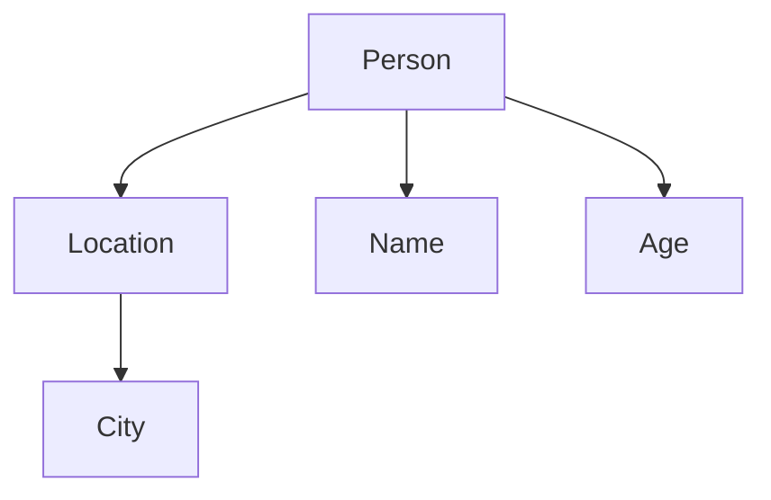
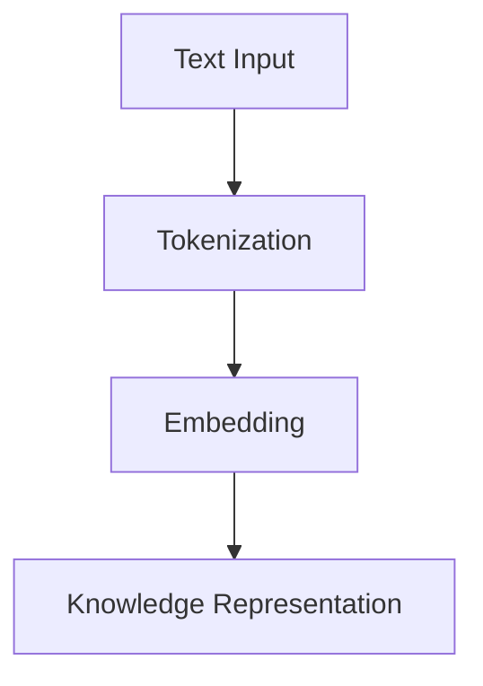
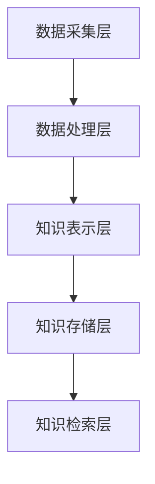

                 


# AI Agent的知识库构建与维护

## 关键词：AI Agent, 知识库, 知识表示, 知识存储, 知识维护, 算法原理

## 摘要：  
AI Agent的知识库构建与维护是实现智能系统的核心任务之一。本文从基础知识入手，详细讲解了AI Agent知识库的概念、构建方法、维护策略以及实际应用。通过分析知识表示、存储和语义理解，结合具体的算法原理和系统架构设计，帮助读者掌握知识库构建与维护的关键技术。

---

## 第1章: AI Agent的知识库构建与维护概述

### 1.1 知识库构建与维护的背景介绍

#### 1.1.1 问题背景与问题描述  
AI Agent（智能体）是一种能够感知环境、自主决策并执行任务的智能系统。知识库是AI Agent的核心组成部分，它存储了AI Agent所需的所有信息和知识。知识库的构建与维护直接影响AI Agent的性能和准确性。然而，随着数据量的爆炸式增长，知识库的复杂性和维护难度也在不断增加。

#### 1.1.2 问题解决的必要性与目标  
知识库的构建与维护是AI Agent实现智能决策的关键。通过构建高质量的知识库，AI Agent能够快速获取所需信息，提高决策效率和准确性。同时，知识库的维护能够确保知识的及时更新和准确性，避免因知识过时而导致的决策错误。

#### 1.1.3 知识库构建与维护的边界与外延  
知识库构建与维护的边界主要集中在数据的收集、处理、存储和更新上。外延则包括与知识库相关的技术，如自然语言处理、机器学习等。

---

### 1.2 知识库的核心概念与组成

#### 1.2.1 知识库的定义与特征  
知识库（Knowledge Base）是一种结构化的数据存储，用于存储和管理特定领域的知识。其主要特征包括：  
1. 结构化：知识以层次化或网络化的形式组织。  
2. 可扩展性：能够根据需求动态扩展。  
3. 准确性：知识的准确性和一致性是关键。  
4. 可维护性：支持知识的更新和维护。

#### 1.2.2 知识库的核心要素与组成结构  
知识库的核心要素包括：  
- 实体（Entity）：知识的基本单位，如“人”、“地点”等。  
- 属性（Property）：描述实体的特征，如“年龄”、“性别”等。  
- 关系（Relationship）：实体之间的联系，如“父亲”、“朋友”等。  

知识库的组成结构通常包括数据层、表示层和应用层。

#### 1.2.3 知识库与其他相关概念的对比  
知识库与数据库的区别在于，数据库主要用于存储结构化数据，而知识库更注重知识的表达和推理。知识图谱是一种特殊的知识库，用于表示语义网络。

---

## 第2章: 知识库的核心概念与联系

### 2.1 知识表示与知识存储

#### 2.1.1 知识表示的原理与方法  
知识表示是将知识转化为计算机可以理解的形式。常见的表示方法包括：  
1. 语义网络：通过节点和边表示实体和关系。  
2. 本体论（Ontology）：定义领域术语和概念的层次结构。  
3. 增量式表示：逐步构建知识，支持动态更新。

#### 2.1.2 知识存储的结构与特点  
知识存储的结构包括：  
1. 层次化存储：将知识按层次组织。  
2. 网络化存储：通过图结构表示实体和关系。  
3. 混合存储：结合结构化和非结构化数据。

#### 2.1.3 知识表示与存储的对比分析  
知识表示注重语义理解和逻辑推理，而知识存储注重数据组织和高效检索。两者相辅相成，共同构建完整的知识库。

---

### 2.2 知识语义与关联分析

#### 2.2.1 知识语义的理解与计算  
知识语义理解是通过自然语言处理技术，从文本中提取语义信息。常见的计算方法包括：  
1. 词嵌入（Word Embedding）：将词语映射到向量空间。  
2. 句子嵌入（Sentence Embedding）：将句子映射到向量空间。  
3. 知识图谱嵌入：将实体和关系映射到向量空间。

#### 2.2.2 知识关联的分析方法  
知识关联分析是通过挖掘实体之间的关系，构建知识图谱。常用的方法包括：  
1. 实体识别：从文本中提取实体。  
2. 关系抽取：从文本中抽取实体之间的关系。  
3. 关系推理：基于已有关系推导新的关系。

#### 2.2.3 知识语义与关联的对比表格  
| 概念       | 知识表示 | 知识存储 | 知识关联 |  
|------------|----------|----------|----------|  
| 定义       | 表达方式 | 数据结构 | 关系类型 |  
| 方法       | 本体论   | 图结构   | 矩阵运算 |  

---

### 2.3 知识库的实体关系图

#### 2.3.1 实体关系的定义与分类  
实体关系是知识库中核心的组成部分。常见的实体关系包括：  
1. 实体间的关系：如“属于”、“包含”等。  
2. 关系的层次结构：如“上位”、“下位”等。  
3. 关系的网络结构：如“朋友”、“同事”等。

#### 2.3.2 实体关系的ER图架构  
实体关系图（ER图）是一种用于描述数据库或知识库结构的图示工具。常见的ER图包括：  
1. 实体：如“Person”、“Location”等。  
2. 属性：如“Name”、“Age”等。  
3. 关系：如“居住在”、“朋友”等。

#### 2.3.3 实体关系图的Mermaid流程图  


---

## 第3章: 知识库构建的算法原理

### 3.1 知识抽取与表示算法

#### 3.1.1 知识抽取的算法流程  
知识抽取包括文本预处理、实体识别、关系抽取等步骤。常见的算法包括：  
1. 词袋模型（Bag of Words）：用于文本表示。  
2. 词嵌入（Word2Vec）：用于词向量表示。  
3. 句子嵌入（Sentence-BERT）：用于句子表示。

#### 3.1.2 知识表示的数学模型  
知识表示的数学模型包括：  
1. 词嵌入：通过矩阵变换将词语映射到向量空间。  
2. 句子嵌入：通过深度学习模型（如BERT）生成句子向量。  
3. 关系推理：通过图神经网络（Graph Neural Network）进行关系推理。

#### 3.1.3 知识抽取与表示的Mermaid流程图  


---

### 3.2 知识融合与关联算法

#### 3.2.1 知识融合的原理与方法  
知识融合是将多个知识源的信息整合到一个统一的知识库中。常用的方法包括：  
1. 基于相似度的融合：通过计算实体或关系的相似度进行融合。  
2. 基于规则的融合：通过预定义的规则进行融合。  
3. 基于学习的融合：通过机器学习模型进行融合。

#### 3.2.2 知识关联的计算模型  
知识关联的计算模型包括：  
1. 矩阵乘法：用于计算实体之间的关系相似度。  
2. 图神经网络：用于学习实体之间的关系表示。  
3. attention机制：用于聚焦重要的关系。

---

### 3.3 知识存储与检索算法

#### 3.3.1 知识存储的结构化方法  
知识存储的结构化方法包括：  
1. 关系数据库：用于存储结构化的知识。  
2. 图数据库：用于存储图结构的知识。  
3. 文本存储：用于存储非结构化的知识。

#### 3.3.2 知识检索的算法原理  
知识检索的算法原理包括：  
1. 基于向量的检索：通过计算查询向量与知识库向量的相似度进行检索。  
2. 基于图的检索：通过遍历图结构进行检索。  
3. 基于关键词的检索：通过匹配关键词进行检索。

---

## 第4章: 知识库维护的算法与策略

### 4.1 知识更新与版本控制

#### 4.1.1 知识更新的触发条件与流程  
知识更新的触发条件包括：  
1. 数据变化：如新增数据或更新数据。  
2. 知识过时：如旧知识不再适用。  
3. 用户请求：用户主动请求更新知识。

知识更新的流程包括：  
1. 数据采集：采集新的数据。  
2. 数据处理：对新数据进行预处理。  
3. 知识融合：将新数据与已有知识融合。  
4. 知识存储：将更新后的知识存储到知识库。

#### 4.1.2 知识版本的管理策略  
知识版本的管理策略包括：  
1. 基于时间戳的版本控制：记录每个版本的时间戳。  
2. 基于标签的版本控制：为每个版本打标签。  
3. 基于分支的版本控制：通过分支管理不同版本。

#### 4.1.3 知识更新的Python代码实现  
```python
def update_knowledge_base(new_data, knowledge_base):
    # 数据预处理
    processed_data = preprocess(new_data)
    # 知识融合
    updated_kb = merge(knowledge_base, processed_data)
    return updated_kb
```

---

### 4.2 知识纠错与优化

#### 4.2.1 知识纠错的算法原理  
知识纠错的算法原理包括：  
1. 基于规则的纠错：通过预定义的规则检测错误。  
2. 基于机器学习的纠错：通过深度学习模型检测错误。  
3. 基于用户的纠错：通过用户反馈检测错误。

#### 4.2.2 知识优化的策略  
知识优化的策略包括：  
1. 去重：去除重复的知识。  
2. 标准化：统一知识的表示格式。  
3. 优化检索性能：优化知识库的索引结构。

---

## 第5章: 知识库的系统设计与实现

### 5.1 系统架构设计

#### 5.1.1 系统功能设计  
系统功能设计包括：  
1. 知识采集：采集数据。  
2. 知识预处理：清洗数据。  
3. 知识表示：将数据转换为知识表示。  
4. 知识存储：将知识存储到知识库。  
5. 知识检索：根据查询检索知识。

#### 5.1.2 系统架构设计  
系统架构设计包括：  
1. 数据采集层：负责数据的采集。  
2. 数据处理层：负责数据的预处理。  
3. 知识表示层：负责知识的表示。  
4. 知识存储层：负责知识的存储。  
5. 知识检索层：负责知识的检索。

#### 5.1.3 系统架构图的Mermaid流程图  


---

## 第6章: 知识库的项目实战与应用

### 6.1 环境搭建

#### 6.1.1 环境要求  
知识库的构建与维护需要以下环境：  
1. Python 3.8及以上版本。  
2. 知识库管理工具：如Neo4j、MongoDB。  
3. 自然语言处理库：如spaCy、NLTK。  

#### 6.1.2 工具安装  
安装所需的工具：  
```bash
pip install neo4j spacy nltk
```

---

### 6.2 核心代码实现

#### 6.2.1 数据采集与预处理  
```python
import spacy

def preprocess(text):
    nlp = spacy.load("en_core_web_sm")
    doc = nlp(text)
    return [token.text for token in doc]
```

#### 6.2.2 知识表示与存储  
```python
from neo4j import GraphDatabase

def store_knowledge(knowledge, uri, user, password):
    driver = GraphDatabase.driver(uri, auth=(user, password))
    with driver.session() as session:
        for entity, relations in knowledge.items():
            session.write_transaction(lambda tx: tx.create(entity, relations))
    driver.close()
```

---

### 6.3 案例分析与项目总结

#### 6.3.1 案例分析  
以一个简单的知识库构建为例，展示如何构建和维护一个小型知识库。

#### 6.3.2 项目总结  
总结项目中的经验和教训，提出改进建议。

---

## 第7章: 知识库的维护与优化

### 7.1 知识更新的自动化

#### 7.1.1 自动化更新的实现  
通过编写脚本实现知识的自动化更新。

#### 7.1.2 自动化更新的注意事项  
注意数据源的稳定性和更新频率。

---

### 7.2 知识纠错的智能化

#### 7.2.1 智能纠错的算法优化  
优化纠错算法，提高纠错的准确率。

#### 7.2.2 智能纠错的应用场景  
在智能问答系统中应用智能纠错技术。

---

## 第8章: 知识库构建与维护的最佳实践

### 8.1 实用技巧与注意事项

#### 8.1.1 数据质量管理  
确保数据的准确性和完整性。

#### 8.1.2 知识表示的规范性  
统一知识表示的格式和规范。

#### 8.1.3 知识库的可扩展性  
设计知识库时考虑其可扩展性。

---

### 8.2 未来发展趋势

#### 8.2.1 知识图谱的深度学习  
结合深度学习技术，进一步提升知识表示的准确性。

#### 8.2.2 知识库的实时性  
实现知识库的实时更新和动态维护。

---

## 第9章: 总结与展望

### 9.1 本文总结  
总结本文的主要内容和研究成果。

### 9.2 未来展望  
展望知识库构建与维护技术的未来发展方向。

---

## 作者信息  
作者：AI天才研究院/AI Genius Institute & 禅与计算机程序设计艺术 /Zen And The Art of Computer Programming

