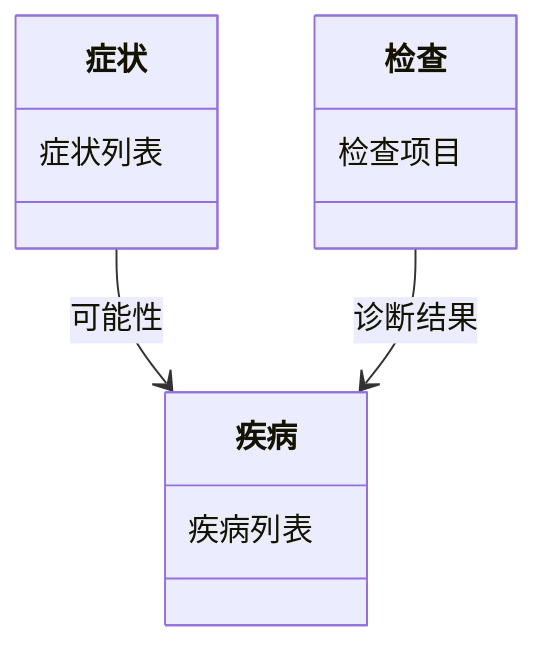
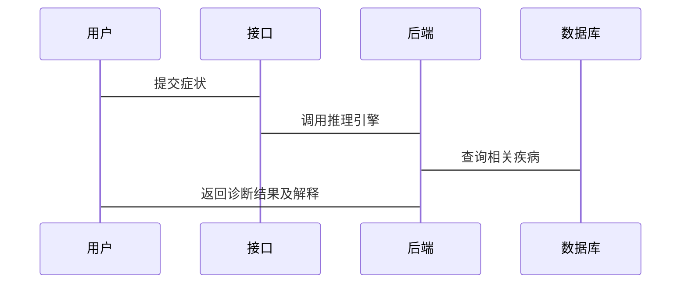

                 


# AI Agent的知识推理可解释性设计

> **关键词**: AI Agent, 知识推理, 可解释性, 背景介绍, 核心概念, 算法原理, 系统设计

> **摘要**: 本文详细探讨了AI Agent的知识推理可解释性设计，从核心概念、算法原理到系统架构，逐步分析，旨在为读者提供一个全面且系统的理解框架，帮助设计出更透明、更可靠的人工智能代理系统。

---

# 第1章 AI Agent的知识推理可解释性设计背景与基础

## 1.1 知识推理的定义与核心概念

### 1.1.1 知识推理的基本概念

知识推理是AI Agent理解、推断和解决问题的核心能力。通过逻辑推理和概率计算，AI Agent能够从已有信息中推导出新的结论，从而做出合理的决策。

### 1.1.2 AI Agent的核心要素

AI Agent由知识库、推理引擎和执行模块组成。知识库存储结构化数据，推理引擎负责信息处理，执行模块将推理结果转化为行动。

### 1.1.3 可解释性的重要性

可解释性确保AI Agent的决策过程透明，便于用户理解和验证，尤其在高风险领域如医疗和金融中至关重要。

## 1.2 问题背景与问题描述

### 1.2.1 知识推理在AI Agent中的作用

知识推理帮助AI Agent处理复杂问题，如诊断、预测和规划，提升其智能性和实用性。

### 1.2.2 当前AI Agent面临的挑战

AI Agent在推理过程中存在可解释性不足的问题，导致用户信任缺失，难以追责。

### 1.2.3 可解释性设计的目标与意义

目标是使AI Agent的决策过程透明可解释，意义在于提升信任度和应用范围。

## 1.3 问题解决与边界外延

### 1.3.1 知识推理的解决方法

采用符号逻辑、概率推理和图结构推理等方法，结合具体场景选择合适的推理策略。

### 1.3.2 AI Agent的边界与限制

受限于数据质量和计算能力，AI Agent的推理能力可能有限，需明确其应用场景和边界。

### 1.3.3 可解释性设计的外延与应用

扩展到数据预处理和模型选择，影响推理速度和准确性，需权衡可解释性和性能。

## 1.4 核心概念结构与要素组成

### 1.4.1 知识推理的核心要素

包括知识表示、推理方法和结果解释，三者共同确保推理过程透明。

### 1.4.2 AI Agent的结构与功能

模块化设计，明确各模块职责，确保功能协同。

### 1.4.3 可解释性设计的要素组成

涵盖推理规则、数据来源和验证机制，确保设计的可解释性。

---

# 第2章 知识推理的核心原理

## 2.1 知识推理的原理与方法

### 2.1.1 符号逻辑推理

基于命题逻辑和谓词逻辑，通过规则引擎进行推理，适用于规则明确的场景。

### 2.1.2 概率推理

利用贝叶斯网络和马尔可夫链，计算条件概率，适用于不确定性的推理。

### 2.1.3 图结构推理

通过知识图谱和图数据库，识别节点关系，适用于复杂关联推理。

## 2.2 核心概念的属性特征

| 方法 | 描述 | 优点 | 缺点 |
|------|------|------|------|
| 符号逻辑 | 基于明确规则 | 结果确定 | 需明确规则 |
| 概率推理 | 考虑可能性 | 处理不确定性 | 计算复杂 |
| 图结构推理 | 分析关联关系 | 可视化清晰 | 需大量数据 |

---

# 第3章 算法原理讲解

## 3.1 符号逻辑推理算法

### 3.1.1 基于规则的推理引擎

```python
def rule_based_inference(knowledge_base, query):
    # 根据规则库进行推理
    for rule in knowledge_base:
        if rule.antecedent_matches(query):
            return rule.consequent
    return None
```

### 3.1.2 基于谓词逻辑的推理

```latex
$$ \text{前提：} P(a) \quad \text{结论：} Q(a) $$
$$ \text{推理规则：} P(a) \rightarrow Q(a) $$
```

## 3.2 概率推理算法

### 3.2.1 贝叶斯网络

构建概率图模型，计算后验概率：

$$ P(B|E) = \frac{P(E|B)P(B)}{P(E)} $$

### 3.2.2 马尔可夫链

状态转移矩阵，预测下一步状态：

$$ P(s_{t+1}|s_t) = \text{转移概率矩阵} $$

## 3.3 图结构推理算法

### 3.3.1 基于图数据库的路径搜索

使用广度优先搜索（BFS）查找最短路径：

```python
def bfs(start, end, graph):
    visited = set()
    queue = deque([start])
    while queue:
        node = queue.popleft()
        if node == end:
            return True
        for neighbor in graph[node]:
            if neighbor not in visited:
                visited.add(neighbor)
                queue.append(neighbor)
    return False
```

---

# 第4章 系统分析与架构设计方案

## 4.1 问题场景介绍

以医疗诊断为例，设计一个可解释的AI诊断系统。

## 4.2 系统功能设计

### 4.2.1 领域模型



### 4.2.2 系统架构


## 4.3 系统交互设计



---

# 第5章 项目实战

## 5.1 环境安装

安装Python和必要的库，如networkx和numpy。

## 5.2 核心代码实现

### 5.2.1 知识库构建

```python
from networkx import DiGraph

def build_knowledge_base(rules):
    kb = DiGraph()
    for rule in rules:
        kb.add_edge(rule['premise'], rule['hypothesis'])
    return kb
```

### 5.2.2 推理引擎实现

```python
def graph_search(start, end, graph):
    if start == end:
        return True
    for neighbor in graph[start]:
        if graph_search(neighbor, end, graph):
            return True
    return False
```

## 5.3 实际案例分析

分析一个医疗诊断案例，展示推理过程和结果解释。

---

# 第6章 总结与展望

## 6.1 本章小结

总结AI Agent的知识推理可解释性设计的核心要点，强调可解释性的重要性。

## 6.2 最佳实践 tips

提供实际应用中的建议，如选择合适的方法和保持数据透明。

## 6.3 注意事项

提醒读者注意数据质量和模型复杂度对可解释性的影响。

## 6.4 拓展阅读

推荐相关书籍和论文，供读者深入学习。

---

# 作者

作者：AI天才研究院/AI Genius Institute & 禅与计算机程序设计艺术 /Zen And The Art of Computer Programming

