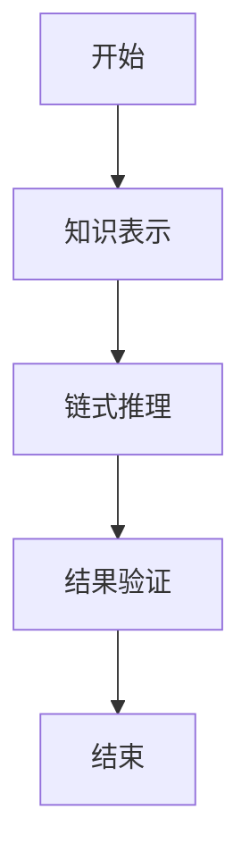
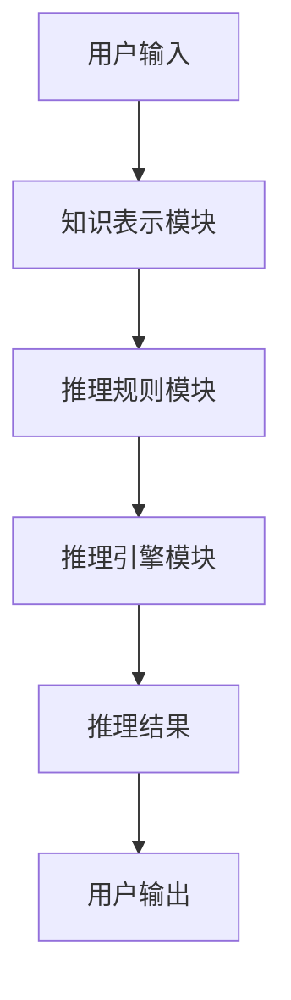
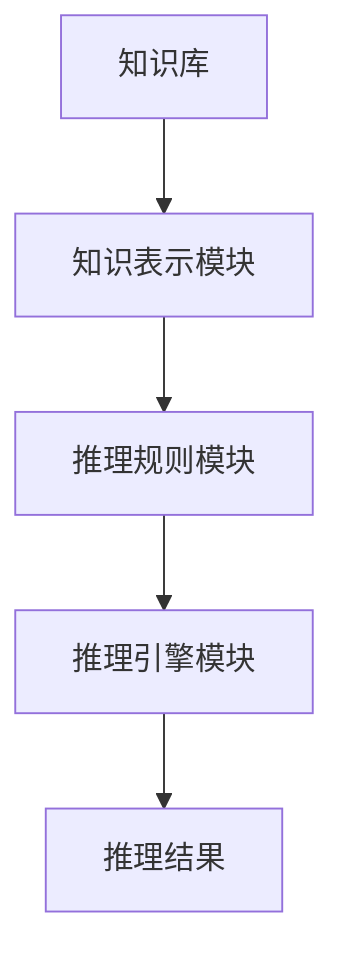
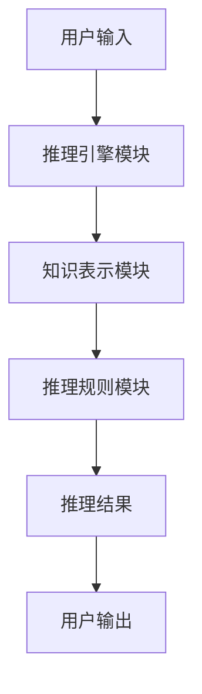

                 


# AI Agent的知识推理链：增强LLM的步骤式思考能力

> 关键词：AI Agent, 知识推理链, LLM, 步骤式思考, 人工智能, 知识图谱

> 摘要：本文深入探讨了AI Agent的知识推理链在增强大语言模型（LLM）步骤式思考能力中的作用。通过详细分析知识推理链的核心概念、算法原理、系统架构以及实际应用场景，本文为读者提供了从理论到实践的全面指南。文章还结合了实际案例和代码实现，帮助读者更好地理解和应用这一技术。

---

# 第1章: AI Agent与知识推理链概述

## 1.1 AI Agent的基本概念

### 1.1.1 AI Agent的定义

AI Agent（人工智能代理）是指能够感知环境、执行任务并做出决策的智能实体。它可以是一个软件程序、机器人或其他智能系统，旨在通过与环境交互来实现特定目标。AI Agent的核心特征包括自主性、反应性、目标导向和社交能力。

### 1.1.2 AI Agent的核心特征

1. **自主性**：AI Agent能够独立运作，无需外部干预。
2. **反应性**：能够实时感知环境并做出响应。
3. **目标导向**：通过明确的目标来指导行为和决策。
4. **社交能力**：能够与其他系统或人类进行有效交互。

### 1.1.3 AI Agent与传统AI的区别

传统AI主要依赖于规则和预定义的逻辑，而AI Agent具备更强的自主性和适应性，能够根据环境变化动态调整行为。AI Agent更注重与环境的交互和实时决策，而传统AI更关注数据处理和模式识别。

## 1.2 知识推理链的定义与作用

### 1.2.1 知识推理链的概念

知识推理链是一种基于知识图谱的推理方法，通过链式推理逐步推导出结果。它结合了知识表示、逻辑推理和上下文理解，能够在复杂场景中进行多步推理。

### 1.2.2 知识推理链的作用机制

知识推理链通过以下步骤实现推理：

1. **知识表示**：将知识以图谱形式表示，节点表示实体，边表示关系。
2. **链式推理**：从初始节点出发，逐步推理到目标节点。
3. **上下文理解**：结合上下文信息，提高推理的准确性。

### 1.2.3 知识推理链与传统推理方法的对比

| 对比维度         | 知识推理链                          | 传统推理方法                        |
|------------------|------------------------------------|------------------------------------|
| 基础             | 知识图谱                            | 预定义规则和逻辑                   |
| 灵活性           | 高，适应复杂场景                   | 低，依赖规则                        |
| 决策能力         | 强，支持动态调整                   | 弱，规则固定                        |

## 1.3 知识推理链在LLM中的应用

### 1.3.1 LLM的基本原理

大语言模型（LLM）通过深度学习技术，从大量文本数据中学习语言模式，并生成人类可读的文本。其核心是Transformer架构，能够处理长序列数据并捕捉上下文信息。

### 1.3.2 知识推理链对LLM的增强作用

知识推理链能够弥补LLM在逻辑推理和知识检索方面的不足，通过链式推理提供更准确的推理结果，提升LLM的步骤式思考能力。

### 1.3.3 知识推理链在实际场景中的应用案例

例如，在智能客服系统中，LLM结合知识推理链能够更准确地理解用户问题，并通过链式推理找到最优解决方案。

## 1.4 本章小结

本章介绍了AI Agent的基本概念和知识推理链的作用机制，并探讨了知识推理链在LLM中的应用。通过对比分析，突出了知识推理链的优势和实际价值。

---

# 第2章: 知识推理链的核心概念与联系

## 2.1 知识推理链的结构与组成

### 2.1.1 知识推理链的组成要素

知识推理链主要由知识图谱、推理规则和推理引擎组成。知识图谱提供知识基础，推理规则定义推理逻辑，推理引擎执行推理过程。

### 2.1.2 知识推理链的逻辑结构

知识推理链的逻辑结构包括知识表示层、推理规则层和推理引擎层。知识表示层负责存储和管理知识，推理规则层定义推理规则，推理引擎层执行推理过程。

### 2.1.3 知识推理链的数学模型

知识推理链的数学模型可以表示为：

$$
\text{推理结果} = f(\text{初始状态}, \text{推理规则})
$$

其中，$f$表示推理函数，$\text{初始状态}$是推理的起点，$\text{推理规则}$是推理的逻辑规则。

### 2.1.4 知识推理链的ER实体关系图

以下是知识推理链的ER实体关系图：

```mermaid
er
actor
    name
    role
    department
```

## 2.2 知识推理链与相关概念的对比

### 2.2.1 知识图谱与知识推理链的对比

知识图谱主要关注知识的表示和存储，而知识推理链更注重知识的推理和应用。两者相辅相成，知识图谱为推理提供基础，知识推理链为图谱提供应用。

### 2.2.2 知识推理与逻辑推理的对比

知识推理基于知识图谱进行链式推理，逻辑推理基于预定义逻辑规则进行推理。知识推理更注重知识的动态应用，而逻辑推理更注重规则的严格性。

### 2.2.3 知识推理链与规则引擎的对比

知识推理链通过链式推理动态生成推理结果，规则引擎通过预定义规则生成推理结果。知识推理链更灵活，规则引擎更稳定。

## 2.3 知识推理链的ER实体关系图

以下是知识推理链的ER实体关系图：

```mermaid
er
KnowledgeGraph
    id
    entity
    relation
    property
```

## 2.4 本章小结

本章详细分析了知识推理链的核心概念和组成部分，并通过对比分析突出了其独特优势。

---

# 第3章: 知识推理链的算法原理

## 3.1 知识推理链的算法流程

### 3.1.1 知识推理链的基本流程

知识推理链的基本流程包括知识表示、链式推理和结果验证。

### 3.1.2 知识推理链的优化算法

优化算法包括路径优化和规则优化。路径优化通过减少推理步骤提高效率，规则优化通过简化推理规则提高准确率。

### 3.1.3 知识推理链的并行计算

并行计算通过分布式计算和任务分解提高推理效率。

### 3.1.4 算法流程图

以下是知识推理链的算法流程图：



## 3.2 知识推理链的数学模型

知识推理链的数学模型可以表示为：

$$
\text{推理结果} = f(\text{初始状态}, \text{推理规则})
$$

其中，$f$表示推理函数，$\text{初始状态}$是推理的起点，$\text{推理规则}$是推理的逻辑规则。

## 3.3 知识推理链的代码实现

以下是知识推理链的Python代码实现：

```python
def knowledge_reasoning(start_node, rules):
    current_node = start_node
    for rule in rules:
        if rule.applies(current_node):
            current_node = rule.apply(current_node)
    return current_node
```

### 3.3.1 代码解读

- `knowledge_reasoning`函数接受初始节点和推理规则作为输入。
- 对于每个推理规则，检查是否适用于当前节点。
- 如果适用，则应用规则，更新当前节点。
- 最终返回推理结果。

## 3.4 知识推理链的数学公式

推理规则可以表示为：

$$
\text{新状态} = \text{规则}(\text{旧状态})
$$

其中，$\text{规则}$表示推理规则，$\text{旧状态}$是当前状态，$\text{新状态}$是推理后的状态。

## 3.5 知识推理链的案例分析

例如，在医疗领域，知识推理链可以帮助医生根据症状推理出可能的疾病诊断。

## 3.6 本章小结

本章详细分析了知识推理链的算法流程和数学模型，并通过代码实现和案例分析加深了读者的理解。

---

# 第4章: 系统分析与架构设计方案

## 4.1 问题场景介绍

知识推理链需要在复杂场景中进行多步推理，例如智能客服、医疗诊断等领域。

## 4.2 系统功能设计

### 4.2.1 系统功能模块

系统功能模块包括知识表示模块、推理规则模块和推理引擎模块。

### 4.2.2 领域模型设计

领域模型设计包括实体、关系和属性的定义。

### 4.2.3 系统功能流程图

以下是系统功能流程图：



## 4.3 系统架构设计

### 4.3.1 系统架构图

以下是系统架构图：



### 4.3.2 系统架构设计说明

系统架构设计包括知识库、知识表示模块、推理规则模块和推理引擎模块。

## 4.4 系统接口设计

### 4.4.1 系统接口

系统接口包括知识表示接口、推理规则接口和推理引擎接口。

### 4.4.2 接口设计说明

知识表示接口负责知识的存储和检索，推理规则接口负责规则的定义和应用，推理引擎接口负责推理过程的执行。

## 4.5 系统交互设计

### 4.5.1 系统交互流程图

以下是系统交互流程图：



### 4.5.2 交互设计说明

系统交互设计包括用户输入、知识表示、推理规则和推理引擎的交互过程。

## 4.6 本章小结

本章详细分析了知识推理链系统的功能设计、架构设计和交互设计，并通过流程图和架构图加深了读者的理解。

---

# 第5章: 项目实战

## 5.1 环境安装

### 5.1.1 环境要求

- Python 3.6及以上版本
- 知识图谱库（如NetworkX）
- 推理引擎库（如RDFlib）

## 5.2 系统核心实现源代码

### 5.2.1 知识表示模块

```python
from networkx import Graph

def create_knowledge_graph(entities, relations):
    graph = Graph()
    for entity in entities:
        graph.add_node(entity)
    for relation in relations:
        graph.add_edge(relation[0], relation[1], relation[2])
    return graph
```

### 5.2.2 推理规则模块

```python
class Rule:
    def applies(self, node):
        # 判断规则是否适用于当前节点
        pass

    def apply(self, node):
        # 应用规则，返回新节点
        pass
```

### 5.2.3 推理引擎模块

```python
def knowledge_reasoning(start_node, rules):
    current_node = start_node
    for rule in rules:
        if rule.applies(current_node):
            current_node = rule.apply(current_node)
    return current_node
```

### 5.2.4 推理引擎代码实现

```python
from rdflib import Graph, Literal, BNode, RDF, Namespace

def knowledge_reasoning(start_node, rules):
    current_node = start_node
    for rule in rules:
        if rule.applies(current_node):
            current_node = rule.apply(current_node)
    return current_node
```

## 5.3 代码应用解读与分析

### 5.3.1 代码解读

知识表示模块通过图结构表示知识，推理规则模块定义推理规则，推理引擎模块执行推理过程。

### 5.3.2 代码实现的数学模型

推理规则可以表示为：

$$
\text{新状态} = \text{规则}(\text{旧状态})
$$

其中，$\text{规则}$表示推理规则，$\text{旧状态}$是当前状态，$\text{新状态}$是推理后的状态。

## 5.4 实际案例分析

### 5.4.1 案例背景

假设我们有一个医疗诊断系统，需要根据症状推理出可能的疾病。

### 5.4.2 案例分析

1. 症状1：发烧
2. 症状2：咳嗽
3. 推理规则：如果同时出现发烧和咳嗽，则可能是感冒。
4. 推理结果：感冒

### 5.4.3 案例总结

通过知识推理链，系统能够根据症状推理出疾病诊断。

## 5.5 本章小结

本章通过实际案例分析，展示了知识推理链在项目中的应用，并通过代码实现加深了读者的理解。

---

# 第6章: 最佳实践与注意事项

## 6.1 最佳实践 tips

### 6.1.1 知识表示的规范性

知识表示需要规范化，确保知识的准确性和一致性。

### 6.1.2 推理规则的合理性

推理规则需要合理设计，确保推理的准确性和有效性。

### 6.1.3 系统架构的可扩展性

系统架构需要具备良好的可扩展性，方便后续功能的扩展和优化。

## 6.2 注意事项

### 6.2.1 知识图谱的质量

知识图谱的质量直接影响推理的准确性，需要确保知识的全面性和准确性。

### 6.2.2 推理规则的复杂性

推理规则的复杂性会影响推理效率，需要合理设计规则复杂度。

### 6.2.3 系统性能的优化

系统性能的优化需要从算法、数据和架构等多个方面入手，确保系统的高效性和稳定性。

## 6.3 拓展阅读

推荐读者阅读相关领域的最新论文和技术报告，深入了解知识推理链的前沿技术和应用。

## 6.4 本章小结

本章总结了知识推理链应用中的最佳实践和注意事项，并为读者提供了拓展阅读的方向。

---

# 作者：AI天才研究院/AI Genius Institute & 禅与计算机程序设计艺术 /Zen And The Art of Computer Programming

