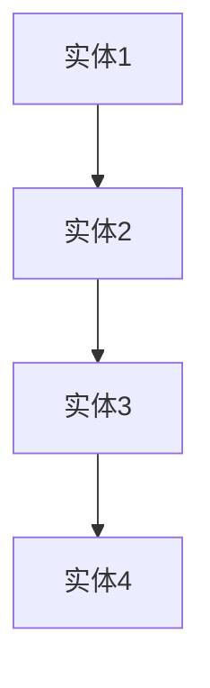
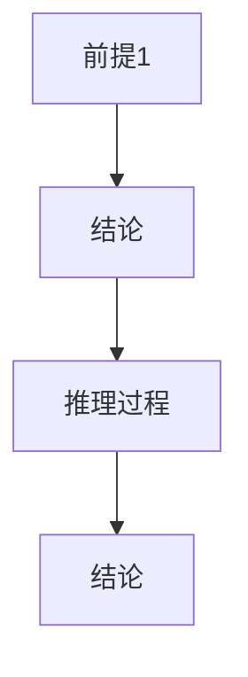
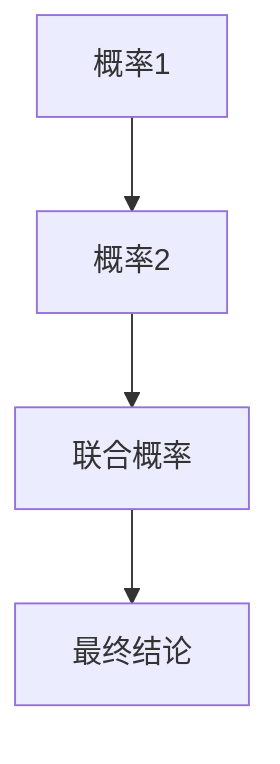
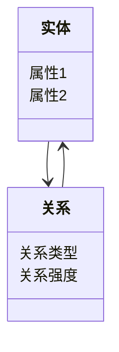
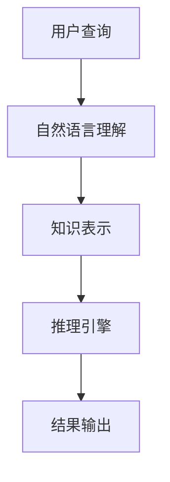
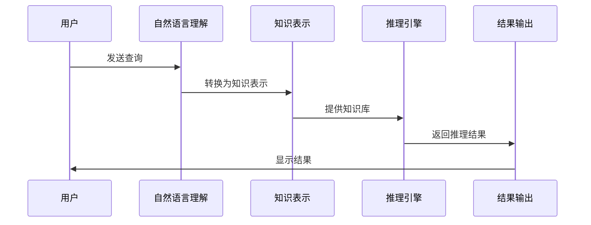

                 


# AI Agent的知识推理：从已知到未知

## 关键词：
AI Agent、知识推理、逻辑推理、概率推理、知识图谱、系统架构、项目实战

## 摘要：
本文将深入探讨AI Agent的知识推理技术，从基础概念到高级算法，再到实际应用，全面解析知识推理的核心原理和实现方法。通过详细的算法原理、系统架构设计以及项目实战案例，帮助读者全面理解AI Agent的知识推理过程，掌握从已知到未知的知识拓展技术。

---

# 第1章 AI Agent与知识推理概述

## 1.1 AI Agent的基本概念

### 1.1.1 AI Agent的定义与分类
AI Agent（人工智能代理）是指能够感知环境、自主决策并执行任务的智能实体。根据功能和智能水平，AI Agent可以分为简单反射型、基于模型的反射型、目标驱动型和效用驱动型。知识推理是AI Agent实现智能决策的核心能力之一。

### 1.1.2 知识推理在AI Agent中的作用
知识推理使AI Agent能够从已知信息中推导出未知结论，从而做出更智能的决策。它是连接感知与行动的桥梁，赋予AI Agent理解、推理和自适应的能力。

### 1.1.3 知识推理的背景与意义
随着AI技术的发展，知识推理在自然语言处理、机器人控制、智能推荐等领域发挥着重要作用。通过知识推理，AI Agent能够处理复杂场景，实现更高效的任务执行。

---

## 1.2 知识推理的基本原理

### 1.2.1 知识表示与推理的关系
知识表示是推理的基础，常见的表示方法包括符号逻辑、概率分布和知识图谱。推理算法则根据这些表示进行逻辑推导，生成新的知识。

### 1.2.2 知识推理的核心流程
知识推理通常包括知识获取、表示、推理和验证四个步骤。每个步骤都有其特定的方法和算法支持。

### 1.2.3 知识推理的边界与外延
知识推理的边界在于数据质量和推理算法的限制。其外延则涉及多领域知识的整合和复杂场景的应用。

---

# 第2章 知识推理的核心概念与联系

## 2.1 核心概念原理

### 2.1.1 知识表示的数学模型
知识可以表示为符号、语义网络或图结构。符号逻辑是最常用的表示方法，通过谓词和规则描述知识。

### 2.1.2 推理算法的基本原理
推理算法通过逻辑规则或概率模型从已知事实推导出新结论。逻辑推理和概率推理是两种主要方法。

### 2.1.3 知识图谱的构建与应用
知识图谱通过实体和关系构建知识网络，广泛应用于语义搜索和实体识别。

## 2.2 核心概念对比表

| 比较维度 | 知识表示 | 推理算法 |
|----------|----------|----------|
| 表示方式 | 符号逻辑 | 逻辑推理 |
| 应用场景 | 数据建模 | 智能决策 |
| 优缺点   | 易处理结构化数据 | 依赖规则库大小 |

---

## 2.3 ER实体关系图



---

# 第3章 知识推理的算法原理

## 3.1 算法原理讲解

### 3.1.1 逻辑推理算法



逻辑推理通过谓词逻辑和规则库进行推理，适用于确定性场景。

### 3.1.2 概率推理算法



概率推理基于贝叶斯网络，适用于不确定性场景。

## 3.2 算法实现代码

### 逻辑推理实现

```python
def logical_inference(rules, facts):
    # rules是规则列表，facts是已知事实
    for rule in rules:
        if all(fact in facts for fact in rule['premises']):
            return rule['conclusion']
    return None
```

### 概率推理实现

```python
def probabilistic_inference(bayes_net, evidence):
    # bayes_net是贝叶斯网络，evidence是已知证据
    return bayes_net.predict(evidence)
```

---

## 3.3 数学模型与公式

### 逻辑推理公式
$$ \text{如果 } P \text{ 和 } Q \text{ 成立，则 } R \text{ 成立。} $$

### 概率推理公式
$$ P(R|E) = \frac{P(E|R)P(R)}{P(E)} $$

---

# 第4章 系统架构设计

## 4.1 问题场景介绍
设计一个基于知识推理的智能问答系统，实现自然语言理解、知识表示和推理。

## 4.2 系统功能设计

### 4.2.1 领域模型



### 4.2.2 系统架构



---

## 4.3 系统接口设计

### 输入接口
- 用户查询：自然语言文本。

### 输出接口
- 推理结果：结构化数据或自然语言文本。

---

## 4.4 系统交互



---

# 第5章 项目实战

## 5.1 环境安装

### 安装依赖
```bash
pip install numpy pandas scikit-learn networkx
```

## 5.2 系统核心实现源代码

### 知识表示实现

```python
class KnowledgeGraph:
    def __init__(self):
        self.nodes = []
        self.edges = []
```

### 推理引擎实现

```python
class ReasoningEngine:
    def __init__(self, knowledge_graph):
        self.knowledge_graph = knowledge_graph
```

## 5.3 代码应用解读与分析
通过代码实现知识表示和推理过程，展示如何将理论应用于实际场景。

## 5.4 实际案例分析
分析一个具体的案例，展示知识推理在智能问答中的应用。

---

## 5.5 项目小结
总结项目实现的关键点和遇到的问题，提出改进建议。

---

# 第6章 最佳实践与小结

## 6.1 最佳实践 tips
- 选择合适的知识表示方法。
- 确保推理算法的高效性。
- 定期更新知识库。

## 6.2 小结
本文系统地介绍了AI Agent的知识推理技术，从理论到实践，全面解析了知识推理的核心原理和实现方法。

## 6.3 注意事项
- 数据质量影响推理结果。
- 推理算法的选择需结合场景需求。
- 知识库的维护需持续投入。

## 6.4 拓展阅读
推荐相关书籍和论文，供读者深入学习。

---

# 作者：AI天才研究院 & 禅与计算机程序设计艺术

