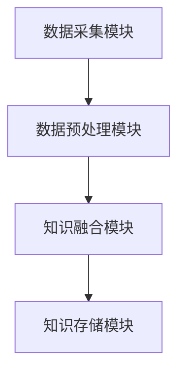

                 


# AI Agent的知识整合：融合多源信息

> **关键词**：AI Agent、知识整合、多源信息、数据融合、知识图谱、信息处理  
> 
> **摘要**：本文深入探讨AI Agent在知识整合中的应用，重点分析如何有效地融合多源信息。通过介绍知识表示、信息融合算法、系统架构设计以及实际案例，本文为读者提供了从理论到实践的全面指南，帮助理解AI Agent如何利用多源信息提升智能决策能力。

---

## 第一部分：AI Agent与知识整合概述

### 第1章：AI Agent的基本概念

#### 1.1 AI Agent的定义与特点
AI Agent（人工智能代理）是指能够感知环境、自主决策并执行任务的智能实体。它具备以下特点：
- **自主性**：能够在没有外部干预的情况下独立运作。
- **反应性**：能够实时感知环境并做出响应。
- **目标导向**：基于目标驱动行为。
- **学习能力**：通过数据和经验不断优化性能。

#### 1.2 多源信息融合的必要性
在实际应用中，AI Agent通常需要处理来自多个来源的信息。例如，一个智能助手可能需要整合来自互联网搜索、用户输入和第三方API的数据。多源信息的融合可以提升AI Agent的决策能力和准确性。

#### 1.3 知识整合的核心概念
知识整合是指将分散在不同来源中的信息进行分析、处理和融合，形成一致、完整的知识体系。这需要解决信息的不一致性、冗余性和不确定性问题。

---

### 第2章：知识整合的技术基础

#### 2.1 知识表示与语义理解
知识表示是将信息转化为计算机可以处理的形式。常用的方法包括：
- **符号表示**：使用符号逻辑表示知识（如谓词逻辑）。
- **向量表示**：通过向量空间模型（如Word2Vec）表示语义信息。
- **图表示**：使用图结构表示知识图谱。

#### 2.2 信息融合的数学模型
信息融合需要解决多个数据源的冲突和不一致问题。常用的方法包括：
- **加权融合**：根据数据源的可信度赋予不同的权重。
- **概率融合**：基于概率论进行信息融合（如贝叶斯网络）。

---

## 第二部分：知识整合的算法与系统设计

### 第3章：知识整合的算法原理

#### 3.1 基于向量空间的融合方法
向量空间模型将信息表示为向量，通过计算向量的相似度进行融合。例如，使用余弦相似度衡量两个向量的相似性：
$$ \text{相似度} = \frac{\vec{A} \cdot \vec{B}}{|\vec{A}| \cdot |\vec{B}|} $$

#### 3.2 基于图的融合算法
图表示方法通过构建知识图谱实现信息融合。例如，使用图的最短路径算法计算节点之间的关系：
$$ \text{路径长度} = \sum_{i=1}^{n} d_i $$
其中，$d_i$ 表示每一步的路径距离。

#### 3.3 基于概率的融合方法
概率方法通过贝叶斯定理进行信息融合：
$$ P(A|B) = \frac{P(B|A)P(A)}{P(B)} $$
其中，$P(A|B)$ 表示在B条件下A发生的概率。

---

### 第4章：系统架构与设计

#### 4.1 系统模块划分
知识整合系统通常包括以下模块：
- 数据采集模块：负责从多个数据源获取信息。
- 数据预处理模块：清洗和转换数据。
- 知识融合模块：将数据进行融合处理。
- 知识存储模块：存储整合后的知识。

#### 4.2 系统架构图
以下是系统的总体架构图：



#### 4.3 系统接口设计
系统接口设计需要考虑数据输入、处理和输出。例如，数据采集模块的接口可能如下：
```python
def collect_data(source):
    # 从指定数据源采集数据
    pass
```

---

## 第三部分：项目实战与案例分析

### 第5章：项目实战

#### 5.1 项目背景与目标
假设我们开发一个智能问答系统，需要整合来自互联网、用户输入和知识库的信息。

#### 5.2 环境搭建
- 安装Python和相关库（如numpy、scikit-learn）。
- 配置数据源（如Wikipedia、API接口）。

#### 5.3 核心代码实现
以下是知识融合的代码示例：
```python
def fuse_info(source1, source2):
    # 加权融合
    weight1 = 0.7
    weight2 = 0.3
    return weight1 * source1 + weight2 * source2
```

---

## 第四部分：总结与展望

### 第6章：知识整合的未来与发展

#### 6.1 知识整合的前沿技术
- **动态知识图谱**：实时更新知识图谱。
- **多模态融合**：结合文本、图像等多种数据类型。

#### 6.2 知识整合的最佳实践
- **数据清洗**：确保数据质量。
- **算法选择**：根据场景选择合适的融合方法。
- **系统优化**：提高系统的性能和可扩展性。

---

**作者**：AI天才研究院/AI Genius Institute & 禅与计算机程序设计艺术 /Zen And The Art of Computer Programming

