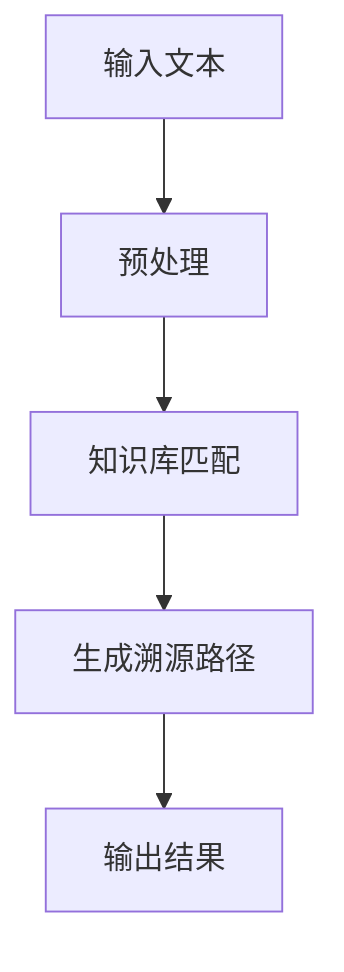
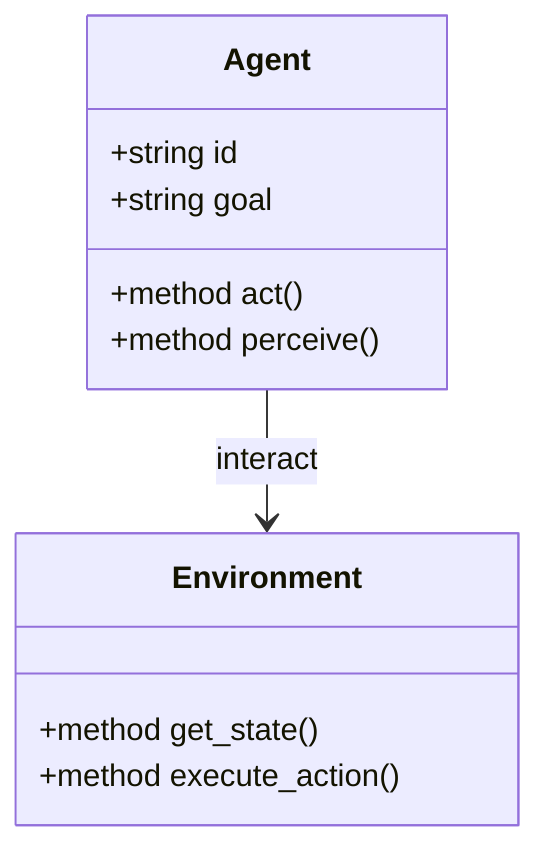

                 


# AI Agent的知识溯源：提高LLM输出的可追溯性

> 关键词：AI Agent，LLM，知识溯源，可追溯性，大语言模型，人工智能

> 摘要：本文探讨了AI Agent的知识溯源问题，重点分析了如何提高大语言模型（LLM）输出的可追溯性。通过介绍知识溯源的背景与重要性，详细讲解AI Agent和LLM的基本概念，分析知识溯源的算法原理，建立数学模型，设计系统架构，并通过项目实战和最佳实践，全面阐述了提高LLM可追溯性的方法和应用。

---

## 第一章: 知识溯源的背景与重要性

### 1.1 知识溯源的背景

#### 1.1.1 知识溯源的定义
知识溯源是指追踪信息或数据的来源，确保输出结果能够被验证和解释。在AI领域，知识溯源尤其重要，因为它可以帮助我们理解AI模型的决策过程。

#### 1.1.2 当前LLM输出的挑战
- **不可追溯性**：LLM的输出往往缺乏明确的知识来源，导致结果难以验证。
- **知识来源模糊**：模型可能从多个来源获取信息，导致输出结果的不确定性。

#### 1.1.3 提高可追溯性的必要性
- **提高可信度**：明确的知识来源可以增强用户对LLM输出的信任。
- **提升可解释性**：通过溯源，用户可以更好地理解模型的决策过程。

### 1.2 问题背景与问题描述

#### 1.2.1 问题背景
随着AI技术的发展，LLM被广泛应用于各种场景，但其输出的可追溯性问题日益凸显。

#### 1.2.2 问题描述
- LLM输出缺乏明确的知识来源。
- 知识来源的模糊性影响了输出的可靠性和可解释性。

### 1.3 知识溯源的核心目标

#### 1.3.1 确保LLM输出的可靠性
通过追踪知识来源，确保输出结果的准确性。

#### 1.3.2 提高LLM决策的可解释性
知识溯源能够帮助用户理解模型的决策过程。

#### 1.3.3 建立知识来源的透明机制
明确的知识来源可以提高模型的透明度，增强用户信任。

---

## 第二章: AI Agent与LLM的基本概念

### 2.1 AI Agent的定义与原理

#### 2.1.1 AI Agent的定义
AI Agent是一种智能体，能够感知环境并采取行动以实现目标。

#### 2.1.2 AI Agent的工作原理
AI Agent通过感知、推理和行动与环境交互，完成特定任务。

#### 2.1.3 AI Agent的核心特征
- **自主性**：能够自主决策。
- **反应性**：能够实时响应环境变化。
- **社会性**：能够与其他Agent或人类交互。

### 2.2 LLM的基本原理

#### 2.2.1 大语言模型的定义
LLM是基于大规模数据训练的神经网络模型，能够生成人类语言文本。

#### 2.2.2 LLM的训练过程
- **数据预处理**：清洗和格式化训练数据。
- **模型训练**：使用深度学习算法训练模型。
- **微调优化**：根据特定任务对模型进行优化。

#### 2.2.3 LLM的输出机制
- **输入处理**：接收用户输入。
- **生成输出**：基于模型参数生成输出文本。
- **结果反馈**：提供输出结果并可能进行调整。

### 2.3 知识溯源在AI Agent中的应用

#### 2.3.1 知识溯源的定义与作用
知识溯源是指追踪AI Agent输出的信息来源，确保信息的准确性和可靠性。

#### 2.3.2 知识溯源与AI Agent的关系
知识溯源是AI Agent实现可靠决策的重要基础。

---

## 第三章: 知识溯源的算法原理

### 3.1 知识溯源算法的流程

#### 3.1.1 输入处理
接收需要进行知识溯源的输入文本。

#### 3.1.2 源数据匹配
将输入文本与知识库中的数据进行匹配，找出可能的来源。

#### 3.1.3 溯源路径生成
根据匹配结果生成知识的溯源路径。

#### 3.1.4 输出结果
输出知识的来源信息和溯源路径。

### 3.2 算法实现的代码示例

```python
def knowledge_tracing(input_text, knowledge_base):
    # 输入处理
    processed_input = preprocess(input_text)
    # 源数据匹配
    matches = find_matches(processed_input, knowledge_base)
    # 溯源路径生成
    tracing_path = generate_tracing_path(matches)
    return tracing_path
```

### 3.3 算法流程图



---

## 第四章: 知识溯源的数学模型

### 4.1 概率模型

#### 4.1.1 概率模型的定义
概率模型用于描述事件发生的可能性。

#### 4.1.2 知识溯源的概率公式
$$ P(source|output) = \frac{P(output|source) \cdot P(source)}{P(output)} $$

### 4.2 图结构模型

#### 4.2.1 图结构模型的定义
图结构模型通过节点和边描述知识之间的关系。

#### 4.2.2 图结构模型的建立
使用图数据库存储知识来源，节点表示知识，边表示关联关系。

---

## 第五章: 系统分析与架构设计

### 5.1 系统功能设计

#### 5.1.1 领域模型


#### 5.1.2 系统架构设计


---

## 第六章: 项目实战

### 6.1 环境安装

#### 6.1.1 安装依赖
```bash
pip install mermaid
pip install graphviz
```

### 6.2 核心实现代码

#### 6.2.1 知识库处理
```python
def preprocess(input_text):
    # 处理输入文本
    pass
```

#### 6.2.2 匹配算法
```python
def find_matches(processed_input, knowledge_base):
    # 匹配知识库中的数据
    pass
```

---

## 第七章: 最佳实践与小结

### 7.1 最佳实践

#### 7.1.1 保持知识库的准确性
确保知识库中的数据准确可靠。

#### 7.1.2 定期更新知识库
根据最新信息更新知识库，保持知识的时效性。

### 7.2 小结

本文详细探讨了AI Agent的知识溯源问题，分析了提高LLM输出可追溯性的方法，通过算法原理和系统设计，展示了如何实现知识的可追溯性。

---

作者：AI天才研究院 & 禅与计算机程序设计艺术

