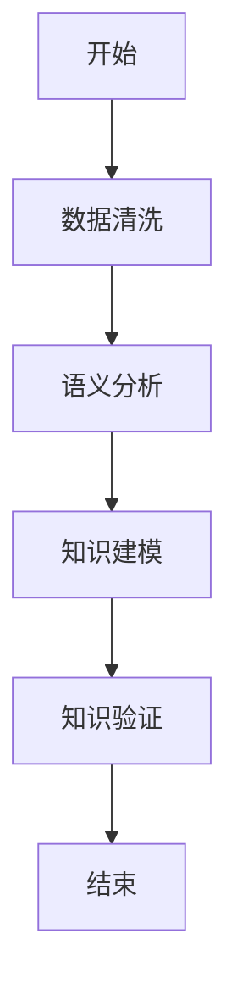

                 


# AI Agent的知识编辑与更新机制设计

> 关键词：AI Agent, 知识编辑, 知识更新, 机器学习, 知识图谱, 知识表示

> 摘要：本文深入探讨了AI Agent的知识编辑与更新机制设计，从背景介绍、核心概念、算法原理、系统架构、项目实战到最佳实践，全面分析了AI Agent知识管理的关键技术与实现方案。

---

# 第一部分: AI Agent的知识编辑与更新机制背景介绍

## 第1章: AI Agent的基本概念与背景

### 1.1 AI Agent的定义与特点
#### 1.1.1 AI Agent的定义
AI Agent（人工智能代理）是一种能够感知环境、自主决策并执行任务的智能实体。它通过与环境交互，利用传感器获取信息，并通过执行器采取行动。AI Agent的核心目标是通过智能算法实现特定任务，例如推理、规划、学习和优化。

#### 1.1.2 AI Agent的核心特点
- **自主性**：AI Agent能够在没有外部干预的情况下自主运行。
- **反应性**：能够实时感知环境变化并做出反应。
- **目标导向**：基于预设目标或学习目标进行决策。
- **适应性**：能够根据环境变化调整策略。

#### 1.1.3 AI Agent与传统智能系统的区别
- AI Agent具有自主性和适应性，而传统智能系统通常依赖于固定的规则和流程。
- AI Agent能够通过学习和优化改进性能，而传统系统难以动态调整。

### 1.2 知识编辑与更新机制的背景
#### 1.2.1 知识编辑的定义与作用
知识编辑是将分散、不结构化的数据转化为结构化知识的过程。其作用包括：
- 提供可计算的知识表示。
- 支持AI Agent的智能决策。
- 促进知识的复用和共享。

#### 1.2.2 知识更新机制的重要性
知识更新机制是保持AI Agent知识库与时俱进的关键。随着环境变化和新信息的出现，知识库需要动态更新以确保准确性。

#### 1.2.3 当前AI Agent知识管理的挑战
- 数据异构性：知识来源多样，格式不统一。
- 知识冗余：如何避免重复知识。
- 实时性要求：快速更新知识以适应动态环境。

## 第2章: AI Agent的知识编辑与更新机制的背景问题

### 2.1 问题背景
#### 2.1.1 AI Agent知识来源的多样性
知识来源包括结构化数据、半结构化数据和非结构化数据，如何统一处理这些数据是知识编辑的关键。

#### 2.1.2 知识编辑的复杂性
知识编辑需要处理语义理解、实体识别和关系抽取等复杂任务，对算法和计算能力要求较高。

#### 2.1.3 知识更新的实时性要求
在动态环境下，AI Agent需要快速更新知识库以应对变化，这对知识更新机制提出了更高的要求。

### 2.2 问题描述
#### 2.2.1 知识编辑的目标与范围
知识编辑的目标是将分散的数据转化为结构化的知识表示，范围包括数据清洗、语义分析和知识建模。

#### 2.2.2 知识更新的周期与策略
知识更新需要制定合理的周期和策略，例如基于时间的更新、基于事件的更新和基于反馈的更新。

#### 2.2.3 知识编辑与更新的边界与外延
知识编辑与更新的边界在于如何区分核心知识与辅助知识，外延则涉及知识共享与协作。

## 第3章: AI Agent知识编辑与更新机制的核心概念

### 3.1 核心概念的结构与组成
#### 3.1.1 知识表示的层次结构
知识表示通常分为概念层、关系层和实例层，不同层次的知识相互关联，形成完整的知识网络。

#### 3.1.2 知识编辑的操作流程
知识编辑包括数据清洗、语义分析、知识建模和知识验证等步骤。

#### 3.1.3 知识更新的机制框架
知识更新机制包括检测变化、知识抽取、知识融合和知识存储等环节。

### 3.2 核心概念的联系与对比
#### 3.2.1 知识表示的多样性
- 知识图谱：基于图结构的知识表示。
- 知识树：层次化的知识表示。
- 知识图：基于图论的知识表示。

#### 3.2.2 不同知识编辑方法的优缺点
| 方法 | 优点 | 缺点 |
|------|------|------|
| 基于规则的编辑 | 精确性高 | 需要人工设计规则 |
| 基于学习的编辑 | 可扩展性好 | 需要大量标注数据 |
| 混合编辑 | 结合规则和学习 | 复杂性较高 |

#### 3.2.3 知识更新策略的分类与特点
| 策略 | 类型 | 描述 |
|------|------|------|
| 基于时间 | 定期更新 | 按固定周期更新知识 |
| 基于事件 | 事件驱动 | 根据特定事件触发更新 |
| 基于反馈 | 用户反馈 | 根据用户反馈进行调整 |

---

# 第二部分: AI Agent的知识编辑与更新机制的核心概念与联系

## 第4章: 知识编辑与更新机制的原理

### 4.1 知识表示的原理
#### 4.1.1 知识图谱的构建原理
知识图谱通过实体和关系构建图结构，支持语义搜索和推理。

#### 4.1.2 知识树的构建方法
知识树通过层次化结构组织知识，支持快速检索和分类。

#### 4.1.3 知识表示的多样性
知识表示可以采用符号表示、向量表示和概率表示等方法，各有优缺点。

### 4.2 知识编辑的原理
#### 4.2.1 知识编辑的基本操作
知识编辑包括数据清洗、语义分析、知识建模和知识验证。

#### 4.2.2 知识编辑的规则与约束
知识编辑需要遵循数据规范、语义一致性和逻辑正确性等规则。

#### 4.2.3 知识编辑的工具与技术
知识编辑工具包括自然语言处理技术、知识抽取算法和知识建模框架。

### 4.3 知识更新的原理
#### 4.3.1 知识更新的触发条件
知识更新可以基于时间、事件或反馈触发。

#### 4.3.2 知识更新的步骤
知识更新包括检测变化、知识抽取、知识融合和知识存储。

#### 4.3.3 知识更新的挑战
知识更新面临数据异构性、知识冗余和更新延迟等问题。

---

## 第5章: 知识编辑与更新机制的核心概念

### 5.1 核心概念的属性特征对比
| 概念 | 属性 | 特征 |
|------|------|------|
| 知识图谱 | 表达方式 | 基于图结构 |
| 知识树 | 组织方式 | 层次化结构 |
| 知识表示 | 可扩展性 | 支持多种表示方法 |

### 5.2 ER实体关系图架构
```mermaid
er
  actor(Agent, 内容, 时间)
  entity(知识来源, 知识目标, 知识关系)
  relation(编辑操作, 更新策略, 知识存储)
  actor -|>- entity: 知识编辑
  entity -|>- relation: 知识关联
  relation -|>- actor: 知识更新
```

---

## 第6章: 知识编辑与更新机制的算法原理

### 6.1 算法原理
#### 6.1.1 算法流程
1. 数据清洗：去除噪声数据。
2. 语义分析：理解数据含义。
3. 知识建模：构建知识表示。
4. 知识验证：验证知识准确性。

#### 6.1.2 算法实现


#### 6.1.3 算法代码示例
```python
def knowledge_edit(data):
    # 数据清洗
    cleaned_data = data Cleaning(data)
    # 语义分析
    semantic_analysis(cleaned_data)
    # 知识建模
    knowledge_model = build_model(cleaned_data)
    # 知识验证
    validate(knowledge_model)
    return knowledge_model
```

---

## 第7章: 知识编辑与更新机制的系统分析与架构设计

### 7.1 问题场景介绍
以智能客服为例，AI Agent需要实时更新知识库以应对客户咨询的变化。

### 7.2 系统功能设计
- **知识表示**：支持多种知识表示方法。
- **知识编辑**：提供数据清洗、语义分析和知识建模功能。
- **知识更新**：支持基于时间、事件和反馈的知识更新。

### 7.3 系统架构设计


---

## 第8章: 知识编辑与更新机制的项目实战

### 8.1 环境安装
安装Python和相关库，例如`numpy`、`pandas`、`networkx`等。

### 8.2 核心代码实现
```python
import networkx as nx

def build_knowledge_graph(data):
    G = nx.Graph()
    for item in data:
        G.add_node(item['entity'])
        G.add_edge(item['entity'], item['relation'])
    return G
```

### 8.3 代码功能解读
上述代码通过`networkx`构建知识图谱，将实体和关系作为节点和边，展示知识之间的关联。

### 8.4 实际案例分析
以智能客服为例，展示如何通过知识编辑和更新机制优化客服响应。

### 8.5 项目总结
知识编辑与更新机制是AI Agent的核心能力，能够显著提升系统的智能性和适应性。

---

## 第9章: 最佳实践与小结

### 9.1 小结
本文从背景、概念、算法、系统架构和项目实战等多个方面全面分析了AI Agent的知识编辑与更新机制设计。

### 9.2 注意事项
- 知识编辑需要结合具体场景。
- 知识更新需要考虑实时性和准确性。
- 知识管理需要注重安全性和隐私性。

### 9.3 拓展阅读
- 《知识图谱构建与应用》
- 《机器学习中的知识表示方法》

---

# 作者：AI天才研究院/AI Genius Institute & 禅与计算机程序设计艺术 /Zen And The Art of Computer Programming

---

**全文总结**：本文系统性地探讨了AI Agent的知识编辑与更新机制设计，从理论到实践，全面分析了相关技术与实现方案，为AI Agent的开发与应用提供了有价值的参考。

