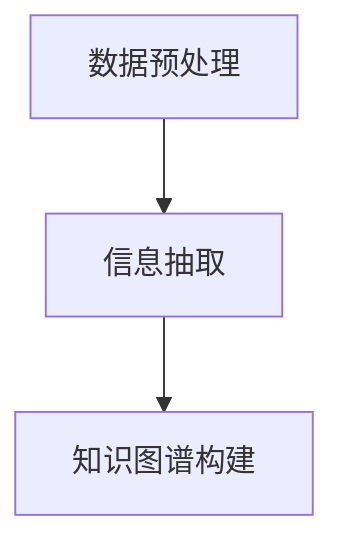

                 


# AI Agent的知识获取：从非结构化文本中提取信息

> 关键词：非结构化文本，信息提取，知识图谱，自然语言处理，AI Agent

> 摘要：本文深入探讨AI Agent从非结构化文本中提取信息的核心技术，分析其背景、原理、算法、系统设计、项目实战及未来趋势。文章首先介绍AI Agent的基本概念和非结构化文本的特点，接着详细讲解文本解析、信息抽取、知识构建的关键技术，包括基于规则、统计学习和深度学习的方法。然后分析系统设计与架构，通过实际项目案例展示如何实现信息提取，并提供代码实现和数学模型。最后总结当前技术的优缺点，展望未来的发展方向。

---

# 第1章: AI Agent与知识获取概述

## 1.1 AI Agent的基本概念

### 1.1.1 什么是AI Agent
AI Agent（人工智能代理）是指能够感知环境、自主决策并执行任务的智能实体。它可以是一个软件程序，也可以是一个物理设备，通过与环境交互来完成特定目标。AI Agent的核心能力包括感知、推理、学习和执行。

### 1.1.2 AI Agent的分类与特点
AI Agent可以分为以下几类：
1. **简单反射型Agent**：基于固定的规则执行任务，通常用于简单的决策场景。
2. **基于模型的反射型Agent**：维护环境的状态模型，能够进行复杂推理。
3. **目标驱动型Agent**：根据目标选择最优行动。
4. **效用驱动型Agent**：通过最大化效用函数来决策。

AI Agent的特点包括自主性、反应性、目标导向和学习能力。

### 1.1.3 知识获取在AI Agent中的重要性
AI Agent需要不断获取和更新知识以适应复杂环境。知识获取是其能力提升的关键，尤其是在处理非结构化文本时，信息提取能力直接影响任务的执行效果。

## 1.2 非结构化文本的特点与挑战

### 1.2.1 非结构化文本的定义
非结构化文本是指没有固定格式，缺乏明确语义标签的文本数据，如新闻报道、社交媒体帖子、法律文档等。

### 1.2.2 非结构化文本的典型特点
1. **多样性**：文本内容和结构多样化。
2. **模糊性**：语义表达模糊，存在歧义。
3. **不一致性**：不同文本中的信息格式和表达方式不一致。

### 1.2.3 从非结构化文本中提取信息的难点
1. **语义理解**：非结构化文本缺乏明确的语义标签，提取信息需要深度语义分析。
2. **信息不完整**：文本中可能存在缺失或不完整的信息。
3. **上下文依赖**：信息提取需要结合上下文进行推理。

## 1.3 本章小结
本章介绍了AI Agent的基本概念和分类，并重点分析了非结构化文本的特点及其提取信息的难点。这些内容为后续章节的技术分析奠定了基础。

---

# 第2章: 文本解析与信息抽取

## 2.1 文本解析的基本原理

### 2.1.1 文本解析的目标
文本解析的目标是将非结构化的文本转换为结构化数据，以便后续处理和分析。

### 2.1.2 文本解析的关键步骤
1. **分词**：将文本分割成单词或短语。
2. **句法分析**：分析句子的语法结构。
3. **语义分析**：理解文本的语义含义。

### 2.1.3 文本解析的常见方法
1. **基于规则的方法**：使用正则表达式等规则进行文本匹配。
2. **统计学习方法**：利用机器学习模型进行文本分析。
3. **深度学习方法**：使用神经网络模型（如BERT）进行语义理解。

## 2.2 信息抽取的核心技术

### 2.2.1 信息抽取的定义
信息抽取是从文本中提取特定信息的技术，通常包括命名实体识别、关系抽取和事件抽取。

### 2.2.2 基于规则的信息抽取
基于规则的信息抽取通过预定义的规则匹配文本中的特定模式。例如，使用正则表达式从法律文本中提取日期。

### 2.2.3 统计学习的信息抽取
统计学习方法通过训练模型从文本中提取信息。例如，使用支持向量机（SVM）进行命名实体识别。

## 2.3 知识构建的流程与方法

### 2.3.1 知识构建的基本流程
知识构建通常包括以下步骤：
1. **信息抽取**：从文本中提取实体、关系和事件。
2. **知识融合**：将多个来源的信息整合到知识图谱中。
3. **知识表示**：使用图结构表示知识。

### 2.3.2 知识图谱的构建方法
知识图谱可以通过以下步骤构建：
1. **实体识别**：识别文本中的实体。
2. **关系抽取**：提取实体之间的关系。
3. **图谱构建**：将实体和关系存储到图数据库中。

### 2.3.3 知识表示的形式化方法
知识表示可以通过图结构、本体论等方法实现。例如，使用RDF（资源描述框架）表示知识。

---

# 第3章: 非结构化文本信息提取的关键技术

## 3.1 基于规则的文本抽取

### 3.1.1 正则表达式的应用
正则表达式是一种强大的工具，可以用来匹配特定模式的文本。例如，使用正则表达式从文本中提取电话号码。

### 3.1.2 基于模板的抽取方法
基于模板的抽取方法通过预定义的模板匹配文本中的特定信息。例如，从新闻标题中提取主要事件。

## 3.2 统计学习的信息抽取

### 3.2.1 统计学习的基本原理
统计学习方法通过训练数据学习特征，提取文本中的信息。例如，使用条件随机场（CRF）进行命名实体识别。

### 3.2.2 基于机器学习的文本抽取
机器学习方法（如SVM、随机森林）可以用于文本分类和信息抽取任务。

## 3.3 深度学习的信息抽取

### 3.3.1 深度学习的基本原理
深度学习通过神经网络模型（如卷积神经网络、循环神经网络）学习文本的语义表示。

### 3.3.2 基于BERT的信息抽取
BERT是一种强大的预训练模型，可以通过微调任务（如命名实体识别）实现信息抽取。

---

# 第4章: 系统分析与架构设计方案

## 4.1 问题场景介绍

### 4.1.1 项目背景
假设我们需要构建一个AI Agent，用于从法律文档中提取关键条款。

### 4.1.2 项目目标
目标是从法律文档中提取合同条款，如违约责任、履行期限等。

## 4.2 系统功能设计

### 4.2.1 领域模型设计
领域模型包括法律文档管理模块、信息抽取模块和知识图谱构建模块。

### 4.2.2 系统架构设计
系统架构包括数据预处理、信息抽取和知识图谱构建三个模块。

## 4.3 系统架构图


---

# 第5章: 项目实战

## 5.1 环境安装

### 5.1.1 安装Python库
安装spaCy和transformers库：
```bash
pip install spacy transformers
```

## 5.2 系统核心实现源代码

### 5.2.1 基于规则的文本抽取
```python
import re

text = "合同签订日期为2023年10月15日。"
date_pattern = r'\d{4}年\d{1,2}月\d{1,2}日'
match = re.search(date_pattern, text)
print(match.group())  # 输出：2023年10月15日
```

### 5.2.2 基于BERT的信息抽取
```python
from transformers import BertTokenizer, BertModel

tokenizer = BertTokenizer.from_pretrained('bert-base-chinese')
model = BertModel.from_pretrained('bert-base-chinese')

text = "违约责任：如一方违约，需支付违约金。"
inputs = tokenizer(text, return_tensors='np')
outputs = model(**inputs)
```

## 5.3 代码应用解读与分析
上述代码展示了如何使用正则表达式和BERT模型从文本中提取信息。正则表达式适用于规则明确的场景，而BERT适用于复杂语义分析。

## 5.4 实际案例分析
以法律文本为例，展示如何提取合同条款。

## 5.5 项目小结
本章通过实际项目展示了如何在AI Agent中实现非结构化文本的信息提取。

---

# 第6章: 总结与展望

## 6.1 技术总结
本文详细介绍了AI Agent从非结构化文本中提取信息的核心技术，包括文本解析、信息抽取和知识构建。

## 6.2 当前技术的优缺点
1. **优点**：基于规则的方法简单高效，深度学习方法语义理解能力强。
2. **缺点**：非结构化文本的多样性和模糊性增加了信息提取的难度。

## 6.3 未来展望
未来，随着深度学习技术的发展，AI Agent的信息提取能力将更加智能化和高效化。

---

# 作者信息

作者：AI天才研究院/AI Genius Institute & 禅与计算机程序设计艺术 /Zen And The Art of Computer Programming

---

通过以上思考和分析，我为您提供了关于《AI Agent的知识获取：从非结构化文本中提取信息》的技术博客文章的详细内容。如果需要进一步调整或补充，请随时告诉我！

