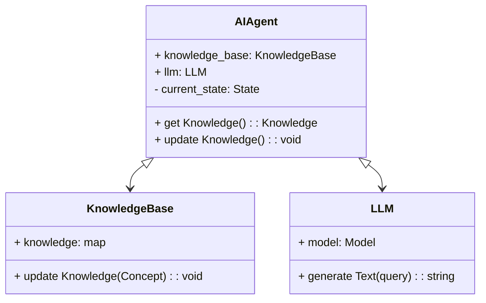

                 


# AI Agent的知识获取：利用LLM进行持续学习

## 关键词：AI Agent，知识获取，LLM，大语言模型，持续学习，人工智能，自然语言处理

## 摘要：AI Agent通过利用大语言模型（LLM）进行持续学习，能够高效地获取和更新知识，从而提升其智能性和适应性。本文深入探讨了AI Agent的知识获取机制，详细分析了LLM的工作原理及其在知识获取中的应用。文章从背景介绍、核心概念、算法原理、系统架构到项目实战，全面解析了AI Agent与LLM结合的知识获取方法，为读者提供了理论基础和实践指导。

---

# 第1章 AI Agent与知识获取概述

## 1.1 AI Agent的基本概念

### 1.1.1 AI Agent的定义与特点
AI Agent（人工智能代理）是指在计算机系统中，能够感知环境并采取行动以实现目标的实体。AI Agent的特点包括自主性、反应性、目标导向性和社交能力。这些特点使其能够适应动态环境并执行复杂任务。

### 1.1.2 知识获取的定义与重要性
知识获取是指AI Agent通过学习和推理，从数据或经验中提取有用信息的能力。它是AI Agent智能水平的核心，决定了其理解和解决问题的能力。

### 1.1.3 AI Agent与知识获取的关系
AI Agent依赖知识获取来实现目标，而知识获取则是通过AI Agent与环境交互来获取信息的过程。两者的结合使得AI Agent能够不断优化自身能力，适应新的任务和环境。

## 1.2 知识获取的背景与问题背景

### 1.2.1 知识获取的背景介绍
随着AI技术的快速发展，知识获取已成为实现智能系统的重要手段。通过大数据和机器学习，AI Agent能够从海量信息中提取知识，提升其决策能力。

### 1.2.2 问题背景分析
传统知识获取方法依赖于规则和专家知识，存在维护成本高、灵活性差等问题。而利用LLM进行知识获取，能够实现自动化和高效的持续学习。

### 1.2.3 知识获取的核心问题描述
知识获取的核心问题包括如何高效提取信息、如何处理不确定性、如何更新知识等。这些问题的解决依赖于先进的算法和系统的架构设计。

## 1.3 问题解决与边界

### 1.3.1 知识获取的主要解决方法
常用的方法包括基于规则的推理、机器学习、深度学习和大语言模型等。其中，LLM的引入为知识获取带来了新的可能性。

### 1.3.2 知识获取的边界与外延
知识获取的边界在于数据的可获得性和模型的准确性。外延则涉及领域知识的深度和广度，以及模型的泛化能力。

### 1.3.3 核心概念结构与组成要素
知识获取的核心结构包括数据源、模型训练、推理引擎和知识库。组成要素包括数据预处理、模型优化和结果评估。

## 1.4 本章小结
本章介绍了AI Agent的基本概念和知识获取的重要性，分析了其在AI Agent中的地位和作用。接下来的章节将详细探讨LLM在知识获取中的应用。

---

# 第2章 LLM与知识获取的关系

## 2.1 大语言模型（LLM）的概述

### 2.1.1 LLM的定义与特点
大语言模型是指基于大规模数据训练的深度学习模型，具有强大的文本生成和理解能力。其特点包括大规模训练、多任务能力、动态推理等。

### 2.1.2 LLM的核心技术与优势
核心技术包括Transformer架构、自注意力机制和大规模训练方法。优势在于能够处理复杂语义、支持多种语言和实现持续学习。

### 2.1.3 LLM在知识获取中的作用
LLM通过自然语言处理技术，能够从文本中提取知识，构建知识图谱，并通过对话交互为AI Agent提供实时支持。

## 2.2 LLM与AI Agent的结合

### 2.2.1 LLM作为AI Agent的知识源
AI Agent可以通过调用LLM API，获取实时的知识更新，实现动态信息处理。

### 2.2.2 LLM驱动的持续学习机制
通过LLM的自适应能力，AI Agent可以不断优化其知识库，提升应对复杂任务的能力。

### 2.2.3 LLM在对话与推理中的应用
LLM能够通过对话交互，帮助AI Agent理解用户需求，并提供解决方案，增强人机协作能力。

## 2.3 核心概念关系分析

### 2.3.1 核心概念属性对比表格
| 核心概念 | 特性                   | 优势                     |
|----------|-----------------------|--------------------------|
| AI Agent | 自主性、目标导向       | 高效问题解决             |
| LLM      | 大规模训练、多任务能力 | 强大的自然语言处理能力   |

### 2.3.2 ER实体关系图架构
```mermaid
erd
  entity AI Agent
  entity LLM
  entity 知识库
  AI Agent -[拥有]-> 知识库
  LLM -[提供]-> 知识库
  AI Agent -[调用]-> LLM
```

### 2.3.3 Mermaid流程图展示
```mermaid
graph TD
  A([AI Agent]) -> B([LLM])
  B -> C([知识库])
  C -> A
```

## 2.4 本章小结
本章分析了LLM在知识获取中的作用，并展示了其与AI Agent的关系。通过LLM，AI Agent能够实现高效的持续学习和知识更新。

---

# 第3章 LLM的知识获取算法原理

## 3.1 LLM的训练过程

### 3.1.1 预训练过程的详细步骤
预训练包括数据清洗、分词、模型初始化和优化器设置。通过自监督学习，模型学习词义表示和上下文关系。

### 3.1.2 微调过程的实现方法
微调是在预训练基础上，针对特定任务进行优化。通过调整学习率和训练数据，模型能够更好地适应目标领域。

### 3.1.3 知识蒸馏技术的应用
知识蒸馏通过将大模型的知识迁移到小模型，降低计算成本，同时保持性能。

## 3.2 LLM的推理机制

### 3.2.1 解码过程的详细分析
解码过程包括输入处理、生成序列和输出结果。模型通过自注意力机制生成上下文相关的输出。

### 3.2.2 概率生成模型的工作原理
概率生成模型基于条件概率分布，通过最大化生成数据的概率来生成最优输出。

### 3.2.3 注意力机制的数学模型
注意力机制通过计算输入序列中每个位置的重要性，生成加权后的表示。

$$ \text{Attention}(Q, K, V) = \text{softmax}\left(\frac{QK^T}{\sqrt{d_k}}\right)V $$

其中，$Q$、$K$、$V$分别是查询、键和值向量。

## 3.3 算法原理的数学模型与公式

### 3.3.1 损失函数的定义与计算
损失函数用于衡量模型预测与真实值的差距，常用的有交叉熵损失和均方误差。

### 3.3.2 解码过程的概率公式
解码过程通过生成概率分布，选择概率最高的词作为输出。

$$ P(y_i|x) = \text{softmax}(z_i) $$

其中，$z_i$是模型的输出向量。

## 3.4 通俗

---

# 第4章 系统分析与架构设计

## 4.1 问题场景介绍
系统需要实现一个基于LLM的AI Agent，能够通过自然语言交互获取知识，并动态更新知识库。

## 4.2 系统功能设计

### 4.2.1 领域模型


### 4.2.2 系统架构
```mermaid
graph TD
  A([User]) -> B([AI Agent])
  B -> C([LLM])
  C -> D([Knowledge Base])
  B -> D
  D -> B
```

### 4.2.3 接口设计
系统接口包括API调用、知识库更新和日志记录。

## 4.3 本章小结
本章通过系统分析和架构设计，展示了如何利用LLM构建高效的AI Agent知识获取系统。

---

# 第5章 项目实战

## 5.1 环境安装
安装Python、LLM库（如Hugging Face Transformers）和相关依赖。

## 5.2 核心代码实现

```python
from transformers import AutoTokenizer, AutoModelForCausalLM

class AI_Agent:
    def __init__(self, model_name):
        self.tokenizer = AutoTokenizer.from_pretrained(model_name)
        self.model = AutoModelForCausalLM.from_pretrained(model_name)
        self.knowledge_base = {}

    def get_knowledge(self, query):
        inputs = self.tokenizer(query, return_tensors="np")
        outputs = self.model.generate(inputs.input_ids, max_length=100)
        return self.tokenizer.decode(outputs[0], skip_special_tokens=True)

    def update_knowledge(self, new_info):
        self.knowledge_base.update(new_info)
```

## 5.3 代码解读与分析
代码实现了AI Agent与LLM的交互，能够通过调用LLM获取知识，并更新知识库。

## 5.4 实际案例分析
通过实际案例展示AI Agent如何利用LLM进行知识获取，并在动态环境中自适应更新。

## 5.5 项目小结
本章通过项目实战，展示了如何将理论应用于实际，构建高效的AI Agent知识获取系统。

---

# 第6章 最佳实践与展望

## 6.1 最佳实践tips
- 定期更新知识库，保持模型的准确性。
- 根据具体任务选择合适的LLM模型。
- 优化系统架构，提高处理效率。

## 6.2 本章小结
本文总结了AI Agent利用LLM进行知识获取的最佳实践，并展望了未来的发展方向。

---

# 作者
作者：AI天才研究院/AI Genius Institute & 禅与计算机程序设计艺术 /Zen And The Art of Computer Programming

