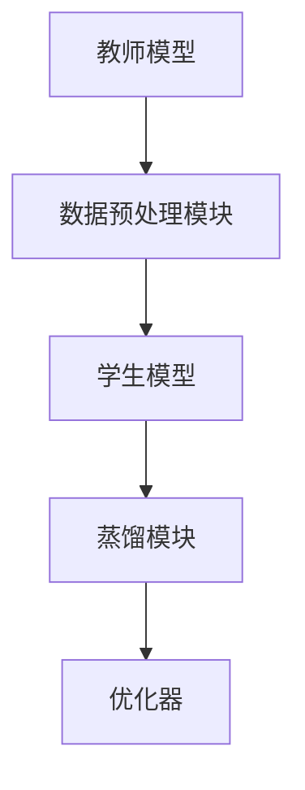

                 

# AI Agent的知识蒸馏与模型压缩技术

> 关键词：AI Agent，知识蒸馏，模型压缩，神经网络优化，深度学习

> 摘要：本文深入探讨了AI Agent中的知识蒸馏与模型压缩技术，分析了其核心原理、实现方法及其在实际应用中的效果。通过结合知识蒸馏与模型压缩，可以有效优化AI Agent的性能，降低计算资源消耗，提升模型的部署效率。

---

# 第一部分: AI Agent的知识蒸馏与模型压缩基础

## 第1章: AI Agent与知识蒸馏概述

### 1.1 AI Agent的基本概念

#### 1.1.1 AI Agent的定义与特点
AI Agent（人工智能代理）是一种能够感知环境、自主决策并执行任务的智能实体。它具备以下特点：
- **自主性**：能够在没有外部干预的情况下自主运作。
- **反应性**：能够根据环境的变化实时调整行为。
- **目标导向性**：具有明确的目标，并通过行动来实现这些目标。
- **学习能力**：能够通过经验改进自身的性能。

#### 1.1.2 AI Agent在人工智能中的角色
AI Agent是人工智能系统的核心组件，广泛应用于自动驾驶、智能助手、推荐系统等领域。它通过感知环境、处理信息并做出决策，帮助人类完成复杂任务。

#### 1.1.3 知识蒸馏技术的背景与意义
知识蒸馏是一种将复杂模型的知识迁移到简单模型的技术，其核心思想是通过教师模型（Teacher）指导学生模型（Student）进行学习。在AI Agent中，知识蒸馏可以帮助优化模型的性能，同时降低计算成本。

---

### 1.2 知识蒸馏的核心原理

#### 1.2.1 知识蒸馏的基本概念
知识蒸馏通过将教师模型的知识迁移到学生模型，使学生模型能够继承教师模型的优良特性。这种技术特别适用于需要在资源受限的环境中部署AI Agent的情况。

#### 1.2.2 教师模型与学生模型的关系
- **教师模型**：通常是一个复杂且训练良好的大模型，具有较高的准确性和丰富的特征提取能力。
- **学生模型**：是一个简单的小模型，通过蒸馏技术从教师模型中学习知识。

#### 1.2.3 知识蒸馏的目标与优势
知识蒸馏的目标是使学生模型在保持较高准确性的前提下，降低模型的复杂度和计算成本。其优势包括：
- **降低计算成本**：学生模型通常比教师模型小，运行速度更快。
- **提升部署效率**：适用于资源受限的环境。
- **保持模型性能**：通过蒸馏，学生模型能够继承教师模型的优良特性。

---

## 第2章: 知识蒸馏的原理与方法

### 2.1 知识蒸馏的基本原理

#### 2.1.1 知识蒸馏的数学模型
知识蒸馏的损失函数通常由分类损失（$L_{\text{cls}}$）和知识蒸馏损失（$L_{\text{distill}$）组成：

$$
L = \lambda L_{\text{cls}} + (1-\lambda) L_{\text{distill}}
$$

其中，$\lambda$ 是平衡参数，控制两种损失的权重。

#### 2.1.2 知识蒸馏的实现步骤
1. **训练教师模型**：在大规模数据上训练一个高性能的教师模型。
2. **初始化学生模型**：通常采用与教师模型相似的架构，但参数更少。
3. **蒸馏过程**：通过最小化知识蒸馏损失，使学生模型逼近教师模型的决策边界。

---

### 2.2 知识蒸馏的主要方法

#### 2.2.1 直接蒸馏法
直接蒸馏法通过最小化学生模型和教师模型输出的交叉熵损失来实现知识迁移。

$$
L_{\text{distill}} = -\sum_{i} p_i \log q_i
$$

其中，$p_i$ 是教师模型的输出概率，$q_i$ 是学生模型的输出概率。

#### 2.2.2 软标签蒸馏法
软标签蒸馏法将教师模型的输出概率作为学生模型的软标签，并结合真实标签进行联合优化。

#### 2.2.3 知识蒸馏的变体方法
- **特征蒸馏**：将教师模型的中间层特征迁移到学生模型。
- **蒸馏网络**：通过设计专门的蒸馏网络来优化知识迁移过程。

---

## 第3章: 模型压缩技术的原理与方法

### 3.1 模型压缩的基本原理
模型压缩通过减少模型的参数数量和计算复杂度，使其能够在资源受限的环境中高效运行。

#### 3.1.1 参数量化
参数量化将模型的权重和激活值量化为低精度（如8位整数）表示，从而减少存储和计算成本。

#### 3.1.2 网络剪枝
网络剪枝通过移除冗余的网络连接，降低模型的复杂度。剪枝通常基于特征重要性或梯度信息进行。

#### 3.1.3 模型压缩与知识蒸馏的结合
结合知识蒸馏和模型压缩技术，可以进一步优化AI Agent的性能和资源利用率。

---

## 第4章: 模型压缩与知识蒸馏的联合应用

### 4.1 知识蒸馏与模型压缩的协同优化
通过结合知识蒸馏和模型压缩，可以在保持模型性能的同时，显著降低计算成本。

#### 4.1.1 蒸馏过程中的模型压缩
在蒸馏过程中，对学生模型进行压缩，进一步减少其参数数量。

#### 4.1.2 压缩过程中的知识蒸馏
在模型压缩后，通过知识蒸馏技术恢复部分性能损失。

---

## 第5章: AI Agent中的知识蒸馏与模型压缩案例

### 5.1 项目背景与目标
本项目旨在通过知识蒸馏和模型压缩技术，优化一个图像分类AI Agent的性能和资源利用率。

#### 5.1.1 项目背景
在资源受限的环境中，AI Agent需要在保证性能的前提下，降低计算和存储成本。

#### 5.1.2 项目目标
- 优化AI Agent的模型性能。
- 降低模型的计算和存储成本。

---

## 第6章: 系统架构设计与实现

### 6.1 系统架构设计
系统架构包括教师模型、学生模型、数据预处理模块和蒸馏模块。

#### 6.1.1 系统功能模块
- **教师模型**：负责生成软标签。
- **学生模型**：负责学习教师模型的知识。
- **数据预处理模块**：处理输入数据并生成训练样本。
- **蒸馏模块**：计算蒸馏损失并优化学生模型。

#### 6.1.2 系统架构图

---

## 第7章: 优化与展望

### 7.1 知识蒸馏与模型压缩技术的优化方向
- **更高效的蒸馏方法**：探索更有效的知识迁移策略。
- **结合深度学习框架**：将知识蒸馏和模型压缩技术集成到主流深度学习框架中。

### 7.2 未来的研究方向
- **多模态蒸馏**：结合视觉、听觉等多种模态的信息进行知识蒸馏。
- **动态蒸馏**：根据环境变化动态调整蒸馏过程。

---

## 第8章: 总结与展望

### 8.1 本文总结
本文系统介绍了AI Agent中的知识蒸馏与模型压缩技术，分析了其核心原理和实现方法，并通过案例展示了其应用效果。

### 8.2 未来展望
知识蒸馏与模型压缩技术将在AI Agent领域发挥越来越重要的作用，特别是在边缘计算和移动设备等资源受限的环境中。

---

## 参考文献
[此处列出相关参考文献]

---

作者：AI天才研究院/AI Genius Institute & 禅与计算机程序设计艺术 /Zen And The Art of Computer Programming

