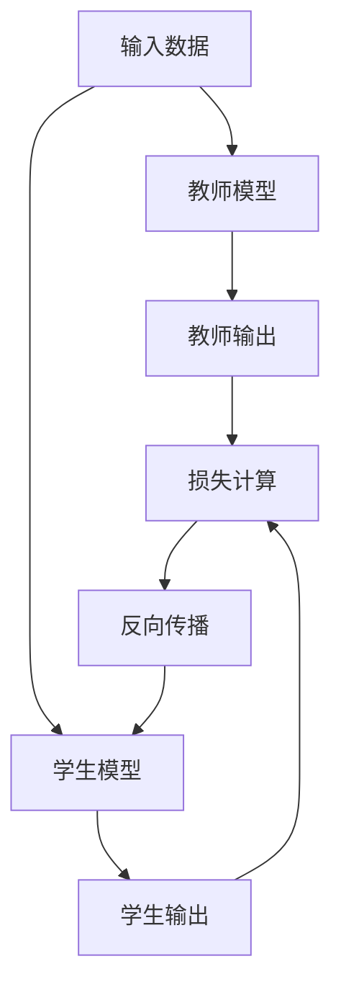
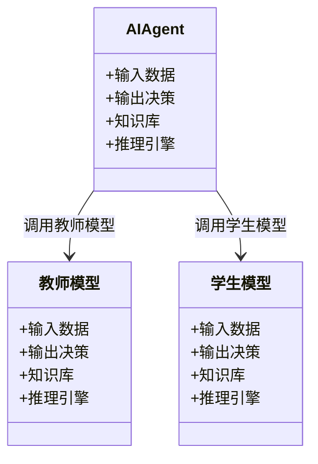
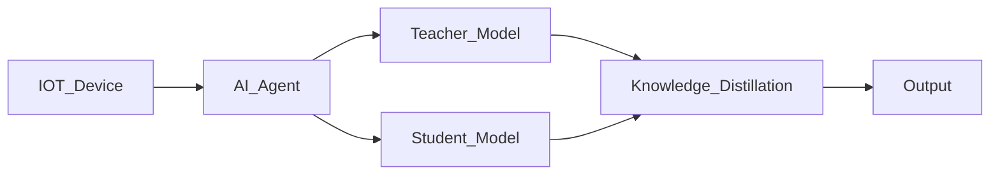
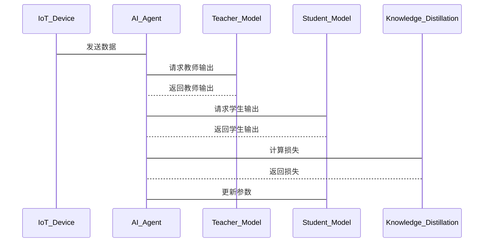

                 


# AI Agent的知识蒸馏在IoT设备中的应用

> 关键词：知识蒸馏，AI Agent，物联网，模型压缩，边缘计算

> 摘要：本文深入探讨了AI Agent的知识蒸馏技术在物联网设备中的应用，分析了知识蒸馏的基本原理、AI Agent的核心功能，以及它们在IoT环境中的结合方式。通过详细讲解算法实现、系统架构设计和实际案例分析，本文为读者提供了从理论到实践的全面指导，展示了如何利用知识蒸馏优化AI Agent在IoT中的性能和效率。

---

# 第一部分: AI Agent与知识蒸馏概述

## 第1章: AI Agent与知识蒸馏的背景介绍

### 1.1 知识蒸馏的定义与背景

#### 1.1.1 知识蒸馏的核心概念
知识蒸馏是一种将复杂模型（教师模型）的知识迁移到简单模型（学生模型）的技术，通过最小化学生模型输出与教师模型输出之间的差异，实现模型压缩和性能提升。

#### 1.1.2 知识蒸馏的背景与问题背景
在AI领域，模型的复杂性不断提高，但物联网设备的计算能力和资源有限，如何在IoT环境中高效部署AI模型成为挑战。知识蒸馏为这一问题提供了解决方案。

#### 1.1.3 知识蒸馏的目标与解决方法
目标：降低模型复杂度，提升推理速度，同时保持或增强模型性能。方法：通过教师模型指导学生模型学习，实现知识迁移。

#### 1.1.4 知识蒸馏的边界与外延
边界：仅关注模型压缩和知识迁移，不涉及模型训练的其他环节。外延：扩展至模型剪枝、量化等其他模型压缩技术。

#### 1.1.5 知识蒸馏的概念结构与核心要素组成
- 教师模型：复杂的预训练模型。
- 学生模型：简单的目标模型。
- 蒸馏过程：通过损失函数优化学生模型，使其逼近教师模型。

### 1.2 AI Agent的基本概念

#### 1.2.1 AI Agent的定义与特点
AI Agent是一种能够感知环境、自主决策的智能体，具备主动性、反应性和社会性等特点。

#### 1.2.2 AI Agent的核心功能与应用场景
- 核心功能：感知、推理、决策、执行。
- 应用场景：智能安防、智能家居、工业自动化等。

#### 1.2.3 AI Agent与传统AI的区别
AI Agent具有自主性和适应性，能够与环境动态交互，而传统AI通常是在固定环境下执行任务。

#### 1.2.4 AI Agent在IoT中的潜力
IoT设备的分布式特性与AI Agent的自主性结合，为智能物联网应用提供了新的可能性。

### 1.3 知识蒸馏与AI Agent的关系

#### 1.3.1 知识蒸馏在AI Agent中的作用
通过知识蒸馏，可以将复杂模型的知识迁移到轻量级AI Agent中，提升其推理速度和性能。

#### 1.3.2 AI Agent如何实现知识蒸馏
AI Agent通过与教师模型交互，学习其决策逻辑和知识库，实现知识蒸馏。

#### 1.3.3 知识蒸馏对AI Agent性能的提升
- 提高推理速度。
- 降低资源消耗。
- 提升模型泛化能力。

#### 1.3.4 知识蒸馏与AI Agent的结合场景
- 边缘计算中的模型部署。
- 物联网中的实时决策任务。

### 1.4 本章小结

#### 1.4.1 知识蒸馏的核心概念
知识蒸馏是一种将教师模型的知识迁移到学生模型的技术，用于模型压缩和性能优化。

#### 1.4.2 AI Agent的基本原理
AI Agent具备感知、推理、决策和执行能力，能够在动态环境中自主运行。

#### 1.4.3 两者结合的应用潜力
通过知识蒸馏，AI Agent能够在IoT设备中高效运行，满足实时性和资源受限的要求。

---

## 第2章: 知识蒸馏的核心概念与原理

### 2.1 知识蒸馏的原理

#### 2.1.1 知识蒸馏的基本流程
1. 训练教师模型。
2. 使用教师模型指导学生模型学习。
3. 优化损失函数，使学生模型逼近教师模型。

#### 2.1.2 教师模型与学生模型的角色
- 教师模型：提供指导输出。
- 学生模型：学习教师模型的知识。

#### 2.1.3 知识蒸馏的关键技术
- 损失函数设计。
- 温度缩放技术。
- 知识蒸馏的优化方法。

#### 2.1.4 知识蒸馏的优缺点
- 优点：模型压缩，推理速度快。
- 缺点：可能损失部分模型性能。

### 2.2 AI Agent的知识蒸馏实现

#### 2.2.1 AI Agent中的知识表示
通过符号化或概率化的方式表示知识，便于教师模型指导学生模型学习。

#### 2.2.2 知识蒸馏在AI Agent中的具体实现
- 教师模型输出决策建议。
- 学生模型学习教师模型的决策逻辑。

#### 2.2.3 知识蒸馏对AI Agent性能的提升
- 提高决策速度。
- 降低计算资源消耗。

#### 2.2.4 知识蒸馏的挑战与解决方案
- 挑战：知识表示的复杂性。
- 解决方案：优化损失函数，采用多种蒸馏技术结合。

### 2.3 知识蒸馏与传统模型压缩的对比

#### 2.3.1 知识蒸馏与模型剪枝的对比
- 知识蒸馏：通过知识迁移实现压缩。
- 模型剪枝：通过去除冗余参数实现压缩。

#### 2.3.2 知识蒸馏与模型参数量化
- 知识蒸馏：关注模型输出的相似性。
- 参数量化：关注参数的位数减少。

#### 2.3.3 知识蒸馏的优势与局限性
- 优势：保持模型性能的同时降低复杂度。
- 局限性：可能需要额外的计算开销。

#### 2.3.4 知识蒸馏与其他模型压缩技术的结合
结合剪枝和量化技术，进一步优化模型大小和推理速度。

### 2.4 本章小结

#### 2.4.1 知识蒸馏的核心原理
通过教师模型指导学生模型学习，实现知识迁移和模型压缩。

#### 2.4.2 AI Agent中的知识蒸馏实现
在AI Agent中，知识蒸馏通过优化损失函数，提升模型性能和推理速度。

#### 2.4.3 知识蒸馏与其他模型压缩技术的对比
知识蒸馏结合其他技术，能够进一步优化模型，但需要综合考虑性能和资源消耗。

---

## 第3章: AI Agent的知识蒸馏算法原理

### 3.1 知识蒸馏算法的流程

#### 3.1.1 教师模型的输出
教师模型输出概率分布或决策建议，作为学生模型的参考。

#### 3.1.2 学生模型的输出
学生模型输出概率分布或决策建议，与教师模型进行对比。

#### 3.1.3 知识蒸馏的损失函数
损失函数 = KLD散度 + 分类损失
$$ \text{loss} = \lambda \text{KL}(P, Q) + (1-\lambda)\text{CE}(Q, Y) $$

#### 3.1.4 知识蒸馏的优化目标
最小化学生模型与教师模型之间的知识差距，同时保持分类性能。

### 3.2 AI Agent的知识蒸馏实现细节

#### 3.2.1 知识蒸馏的数学模型
知识蒸馏的损失函数可以表示为：
$$ \text{loss} = \alpha \text{KL}(P, Q) + \beta \text{CE}(Q, Y) $$
其中，$\alpha$ 和 $\beta$ 是平衡参数。

#### 3.2.2 温度缩放技术
通过调整温度参数，使教师模型的概率分布更加平滑，便于学生模型学习。

#### 3.2.3 知识蒸馏的训练过程
1. 预训练教师模型。
2. 使用知识蒸馏损失函数训练学生模型。
3. 调整温度参数和平衡参数，优化模型性能。

### 3.3 算法实现与代码解读

#### 3.3.1 知识蒸馏算法的Python实现
```python
import torch
import torch.nn as nn
import torch.optim as optim

class TeacherModel(torch.nn.Module):
    def __init__(self):
        super(TeacherModel, self).__init__()
        self.linear = nn.Linear(10, 5)

    def forward(self, x):
        return torch.softmax(x, dim=1)

class StudentModel(torch.nn.Module):
    def __init__(self):
        super(StudentModel, self).__init__()
        self.linear = nn.Linear(10, 5)

    def forward(self, x):
        return torch.softmax(x, dim=1)

def knowledge_distillation_loss(output, teacher_output, temperature=2):
    soft_output = torch.nn.functional.softmax(output / temperature, dim=1)
    soft_teacher_output = torch.nn.functional.softmax(teacher_output / temperature, dim=1)
    loss = torch.nn.KLDivLoss(reduction='batchmean')(soft_output, soft_teacher_output)
    return loss

# 训练学生模型
teacher = TeacherModel()
student = StudentModel()
optimizer = optim.Adam(student.parameters(), lr=0.001)

for epoch in range(100):
    inputs, labels = get_data()  # 假设已有数据加载函数
    teacher_outputs = teacher(inputs)
    student_outputs = student(inputs)
    loss = knowledge_distillation_loss(student_outputs, teacher_outputs, temperature=2)
    optimizer.zero_grad()
    loss.backward()
    optimizer.step()
```

#### 3.3.2 算法流程图


### 3.4 本章小结

#### 3.4.1 知识蒸馏的数学模型
通过损失函数的优化，实现学生模型对教师模型知识的迁移。

#### 3.4.2 算法实现细节
详细讲解了知识蒸馏的实现步骤，包括损失函数设计和优化过程。

#### 3.4.3 算法流程图
通过图形化展示，清晰地呈现了知识蒸馏的整个流程。

---

## 第4章: 系统分析与架构设计

### 4.1 问题场景介绍

#### 4.1.1 IoT设备的资源限制
- 计算能力有限。
- 存储空间有限。
- 电池寿命有限。

#### 4.1.2 知识蒸馏在IoT中的应用需求
- 实时决策需求。
- 低功耗要求。
- 高效数据处理需求。

### 4.2 系统功能设计

#### 4.2.1 系统功能模块
- 数据采集模块。
- 特征提取模块。
- 知识蒸馏模块。
- 决策执行模块。

#### 4.2.2 领域模型设计


#### 4.2.3 系统架构设计


#### 4.2.4 系统接口设计
- 教师模型接口：提供概率分布输出。
- 学生模型接口：接收输入数据，输出决策结果。
- 知识蒸馏接口：计算损失函数，优化学生模型。

#### 4.2.5 系统交互流程图


### 4.3 本章小结

#### 4.3.1 问题场景分析
IoT设备资源受限，需要高效的知识蒸馏技术来优化AI Agent的性能。

#### 4.3.2 系统功能设计
设计了完整的系统功能模块，包括数据采集、特征提取、知识蒸馏和决策执行。

#### 4.3.3 系统架构设计
通过图形化展示，清晰呈现了系统架构和模块交互关系。

---

## 第5章: 项目实战与案例分析

### 5.1 项目环境搭建

#### 5.1.1 环境要求
- Python 3.6+
- PyTorch 1.0+
- CUDA支持（可选）

#### 5.1.2 工具安装
```bash
pip install torch
pip install numpy
pip install matplotlib
```

### 5.2 系统核心实现

#### 5.2.1 核心代码实现
```python
import torch
import torch.nn as nn
import torch.optim as optim
import numpy as np

class TeacherModel(nn.Module):
    def __init__(self):
        super(TeacherModel, self).__init__()
        self.linear = nn.Linear(10, 5)

    def forward(self, x):
        return torch.softmax(x, dim=1)

class StudentModel(nn.Module):
    def __init__(self):
        super(StudentModel, self).__init__()
        self.linear = nn.Linear(10, 5)

    def forward(self, x):
        return torch.softmax(x, dim=1)

def knowledge_distillation_loss(output, teacher_output, temperature=2):
    soft_output = torch.nn.functional.softmax(output / temperature, dim=1)
    soft_teacher_output = torch.nn.functional.softmax(teacher_output / temperature, dim=1)
    loss = torch.nn.KLDivLoss(reduction='batchmean')(soft_output, soft_teacher_output)
    return loss

# 训练学生模型
teacher = TeacherModel()
student = StudentModel()
optimizer = optim.Adam(student.parameters(), lr=0.001)

for epoch in range(100):
    inputs = torch.randn(10, 10)
    labels = torch.randint(0, 5, (10,))

    teacher_outputs = teacher(inputs)
    student_outputs = student(inputs)
    loss = knowledge_distillation_loss(student_outputs, teacher_outputs, temperature=2)
    optimizer.zero_grad()
    loss.backward()
    optimizer.step()
```

#### 5.2.2 代码功能解读
- 教师模型和学生模型的定义。
- 知识蒸馏损失函数的实现。
- 训练过程的优化步骤。

#### 5.2.3 系统功能模块实现
- 数据采集模块：读取输入数据。
- 特征提取模块：处理输入数据，提取特征。
- 知识蒸馏模块：计算损失，优化学生模型。
- 决策执行模块：根据学生模型输出，执行决策。

### 5.3 实际案例分析

#### 5.3.1 案例背景
在智能安防系统中，使用知识蒸馏优化AI Agent的决策性能。

#### 5.3.2 案例分析
通过知识蒸馏，AI Agent能够在资源受限的IoT设备上实现高效的实时决策。

#### 5.3.3 案例结果
- 提高了决策速度。
- 降低了设备功耗。
- 提升了模型性能。

### 5.4 本章小结

#### 5.4.1 项目实战总结
通过实际案例分析，验证了知识蒸馏在IoT设备中的有效性。

#### 5.4.2 案例分析的意义
展示了知识蒸馏技术在智能物联网系统中的具体应用。

#### 5.4.3 知识蒸馏的优势
- 提高了模型的推理速度。
- 降低了设备的资源消耗。
- 提升了系统的整体性能。

---

## 第6章: 最佳实践与注意事项

### 6.1 最佳实践

#### 6.1.1 模型选择与优化
选择合适的教师模型和学生模型，优化模型结构，提升蒸馏效果。

#### 6.1.2 温度参数调整
通过实验调整温度参数，找到最佳值，以平衡模型的准确性和多样性。

#### 6.1.3 训练策略优化
采用渐进式蒸馏策略，逐步降低温度参数，提升模型性能。

### 6.2 注意事项

#### 6.2.1 模型压缩的挑战
模型压缩可能导致性能下降，需要平衡压缩率和性能。

#### 6.2.2 数据隐私问题
在IoT环境中，数据隐私问题需要特别注意，确保数据的安全性。

#### 6.2.3 系统兼容性
确保知识蒸馏技术与现有系统的兼容性，避免因技术不匹配导致的运行问题。

### 6.3 拓展阅读

#### 6.3.1 推荐书籍
- 《Deep Learning》
- 《Neural Networks and Deep Learning》

#### 6.3.2 推荐论文
- "Distilling the Knowledge in Neural Networks"
- "Model Compression via Distillation"

### 6.4 本章小结

#### 6.4.1 最佳实践总结
通过合理选择模型和优化策略，可以显著提升知识蒸馏的效果。

#### 6.4.2 注意事项总结
在实际应用中，需要关注模型压缩的挑战、数据隐私和系统兼容性等问题。

#### 6.4.3 拓展阅读的意义
通过阅读相关书籍和论文，可以深入理解知识蒸馏的理论和最新进展。

---

# 第七章: 总结与展望

## 7.1 总结

### 7.1.1 知识蒸馏的核心价值
知识蒸馏为AI Agent在IoT设备中的高效运行提供了重要技术支持。

### 7.1.2 AI Agent与知识蒸馏的结合意义
通过知识蒸馏，AI Agent能够在资源受限的环境中实现高效的决策和推理。

### 7.1.3 本文章的总结
本文详细探讨了知识蒸馏在AI Agent中的应用，分析了其在IoT环境中的潜力和挑战。

## 7.2 展望

### 7.2.1 知识蒸馏的未来发展方向
- 更高效的蒸馏算法。
- 更广泛的应用场景。
- 更智能的蒸馏策略。

### 7.2.2 AI Agent与知识蒸馏的结合前景
随着技术进步，知识蒸馏将在AI Agent中发挥更大的作用，推动智能物联网的发展。

### 7.2.3 对读者的展望
希望读者能够结合实际应用场景，进一步探索知识蒸馏在AI Agent中的创新应用。

---

# 作者：AI天才研究院/AI Genius Institute & 禅与计算机程序设计艺术 /Zen And The Art of Computer Programming

