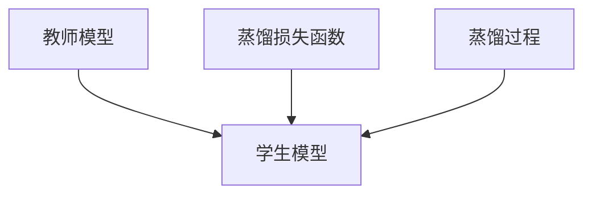
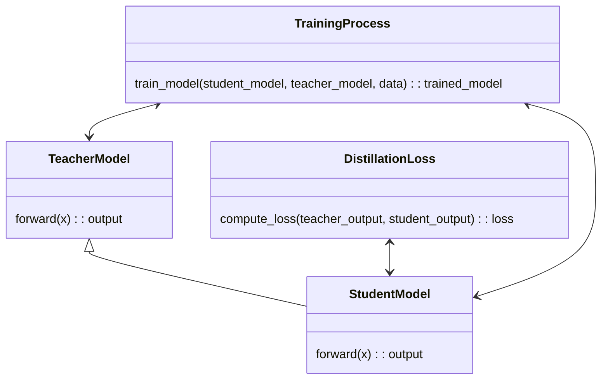

                 


# AI Agent的知识蒸馏在模型压缩中的应用

## 关键词：
AI Agent, 知识蒸馏, 模型压缩, 深度学习, 蒸馏损失

## 摘要：
本文探讨了AI Agent在知识蒸馏技术中的应用，详细分析了知识蒸馏在模型压缩中的原理、算法实现及实际应用。文章从背景介绍、核心概念、算法原理、系统架构到项目实战，全面解析了知识蒸馏如何帮助AI Agent在资源受限的环境中高效运行。通过具体案例分析和代码实现，展示了知识蒸馏在提升模型性能和减少计算成本方面的优势。

---

# 目录大纲

## 第1章：知识蒸馏与模型压缩概述

### 1.1 知识蒸馏的基本概念
- 1.1.1 模型压缩的背景与意义
- 1.1.2 知识蒸馏的定义与核心思想
- 1.1.3 AI Agent在模型压缩中的作用

### 1.2 AI Agent与知识蒸馏的关系
- 1.2.1 AI Agent的定义与特点
- 1.2.2 知识蒸馏在AI Agent中的应用场景
- 1.2.3 问题背景与解决思路

---

## 第2章：知识蒸馏的核心原理

### 2.1 知识蒸馏的原理
- 2.1.1 教师模型与学生模型的关系
- 2.1.2 知识蒸馏的过程与关键步骤
- 2.1.3 蒸馏损失的计算方法

### 2.2 核心概念对比分析
- 2.2.1 不同模型压缩技术的对比
- 2.2.2 知识蒸馏与其他压缩方法的优缺点分析

---

## 第3章：知识蒸馏的算法流程

### 3.1 算法流程图


### 3.2 算法实现代码
```python
import tensorflow as tf
import numpy as np

# 教师模型
def teacher_model(input):
    # 简单的前馈网络
    x = tf.layers.dense(input, 64, activation='relu')
    x = tf.layers.dense(x, 10, activation='softmax')
    return x

# 学生模型
def student_model(input):
    x = tf.layers.dense(input, 32, activation='relu')
    x = tf.layers.dense(x, 10, activation='softmax')
    return x

# 蒸馏损失
def distillation_loss(y_true, y_pred, T=2):
    teacher_logits = teacher_model(y_true)
    student_logits = student_model(y_true)
    teacher_probs = tf.nn.softmax(teacher_logits / T)
    student_probs = tf.nn.softmax(student_logits / T)
    loss = tf.reduce_mean(tf.keras.losses.kullback_leibler_divergence(teacher_probs, student_probs))
    return loss

# 示例训练代码
def train_step(optimizer, inputs, labels):
    with tf.GradientTape() as tape:
        loss = distillation_loss(labels, inputs)
        gradients = tape.gradient(loss, student_model.trainable_weights)
        optimizer.apply_gradients(zip(gradients, student_model.trainable_weights))
    return loss
```

---

## 第4章：知识蒸馏的数学模型

### 4.1 蒸馏损失函数
$$L_{distill} = \lambda KL(p_{teacher}(y|x), p_{student}(y|x))$$

其中：
- $\lambda$ 是蒸馏损失的权重系数。
- $KL(p_{teacher}(y|x), p_{student}(y|x))$ 是KL散度，衡量教师模型和学生模型的分布差异。

---

## 第5章：系统架构设计

### 5.1 系统功能模块设计


---

## 第6章：知识蒸馏的实现与应用

### 6.1 项目实战

#### 6.1.1 环境安装
```bash
pip install tensorflow==2.10.0
pip install numpy==1.21.0
```

#### 6.1.2 核心代码实现
```python
import tensorflow as tf
from tensorflow.keras import layers, models

# 定义教师模型和学生模型
def build_teacher_model(input_shape):
    model = models.Sequential([
        layers.Dense(64, activation='relu', input_shape=input_shape),
        layers.Dense(10, activation='softmax')
    ])
    return model

def build_student_model(input_shape):
    model = models.Sequential([
        layers.Dense(32, activation='relu', input_shape=input_shape),
        layers.Dense(10, activation='softmax')
    ])
    return model

# 定义蒸馏损失
def distillation_loss(teacher_logits, student_logits, T=2):
    teacher_probs = tf.nn.softmax(teacher_logits / T)
    student_probs = tf.nn.softmax(student_logits / T)
    loss = tf.reduce_mean(tf.keras.losses.kullback_leibler_divergence(teacher_probs, student_probs))
    return loss

# 训练过程
def train_distillation(teacher_model, student_model, X_train, y_train, epochs=100, T=2):
    optimizer = tf.keras.optimizers.Adam(lr=0.001)
    for epoch in range(epochs):
        with tf.GradientTape() as tape:
            teacher_output = teacher_model(X_train)
            student_output = student_model(X_train)
            loss = distillation_loss(teacher_output, student_output, T)
        gradients = tape.gradient(loss, student_model.trainable_weights)
        optimizer.apply_gradients(zip(gradients, student_model.trainable_weights))
        print(f"Epoch {epoch}, Loss: {loss.numpy()}")
```

#### 6.1.3 案例分析与详细讲解
- 通过具体的数据集（如MNIST）进行训练，展示知识蒸馏在压缩模型后的准确率变化。
- 分析蒸馏温度T对模型性能的影响。

---

## 第7章：总结与展望

### 7.1 总结
- 知识蒸馏在模型压缩中的核心作用
- AI Agent通过知识蒸馏实现轻量化部署的优势

### 7.2 最佳实践 tips
- 选择合适的蒸馏温度T，避免过高的温度导致信息丢失
- 在学生模型设计时，充分考虑任务需求，避免过度压缩影响性能

### 7.3 小结
- 知识蒸馏是AI Agent实现模型压缩的有效手段
- 通过合理的系统架构设计和算法优化，可以在资源受限的场景下实现高性能AI代理

### 7.4 注意事项
- 蒸馏后的模型可能在某些情况下性能略逊于原模型，需进行充分的测试
- 注意保护教师模型的安全性，防止蒸馏过程中的信息泄露

### 7.5 拓展阅读
- 《Distilling the Knowledge in Neural Networks》
- 《Model Compressing and Knowledge Distillation for Deep Neural Networks》

---

## 作者：AI天才研究院/AI Genius Institute & 禅与计算机程序设计艺术 /Zen And The Art of Computer Programming

