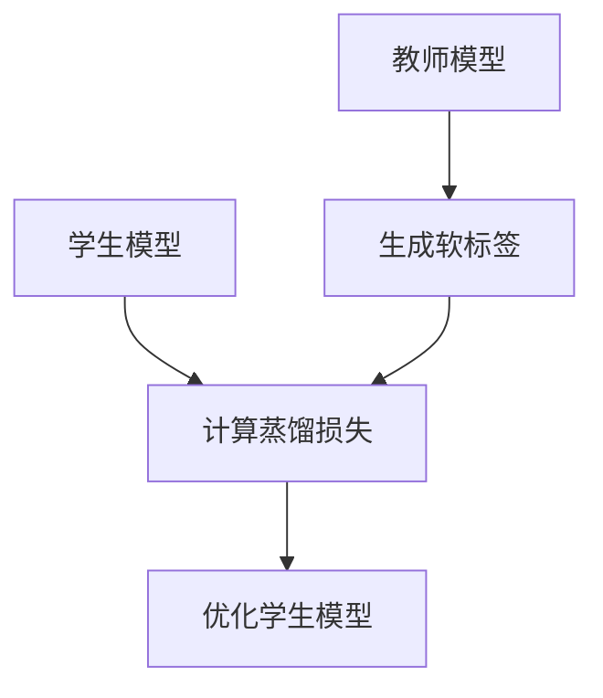
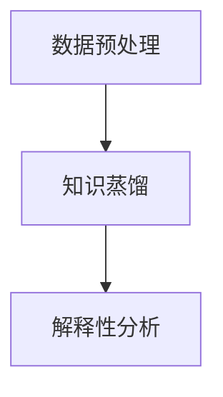
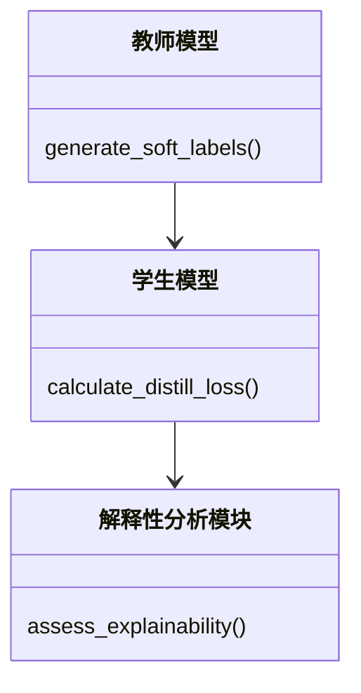

                 


# AI Agent的知识蒸馏在模型解释性中的应用

> 关键词：知识蒸馏，AI Agent，模型解释性，深度学习，可解释性人工智能

> 摘要：本文深入探讨了AI Agent的知识蒸馏在模型解释性中的应用，分析了知识蒸馏的核心原理及其在提升模型解释性方面的作用。通过系统化的分析与案例研究，本文详细阐述了如何通过知识蒸馏技术优化AI Agent的模型解释性，为实际应用提供了理论支持与实践指导。

---

# 第一部分: AI Agent的知识蒸馏背景与概念

## 第1章: 问题背景与定义

### 1.1 模型解释性的重要性

随着人工智能技术的快速发展，AI Agent（人工智能代理）在各个领域的应用越来越广泛。然而，AI模型的“黑箱”特性使得用户难以理解模型的决策过程，这不仅影响了用户对模型的信任，还可能在实际应用中引发风险。因此，提升AI Agent模型的解释性成为了一个重要的研究方向。

#### 1.1.1 为什么需要模型解释性
- 用户信任：解释性是用户信任AI Agent的基础，尤其是在医疗、金融等高风险领域。
- 可靠性验证：通过解释性，用户可以验证模型的决策是否合理，从而确保模型的可靠性。
- 法律合规：在某些领域，模型的解释性是法律合规的必要条件。

#### 1.1.2 解释性在AI Agent中的作用
- 提供决策依据：解释性帮助用户理解AI Agent的决策过程，从而更好地使用和管理AI系统。
- 优化模型：通过分析解释性，可以发现模型的不足之处，进一步优化模型性能。
- 改善人机交互：解释性能够提升人机交互的透明度，降低用户的学习成本。

#### 1.1.3 解释性对用户信任的影响
研究表明，模型的解释性直接影响用户对AI系统的信任度。一个具有较高解释性的模型更容易获得用户的信任，从而提高系统的使用效果和用户满意度。

### 1.2 知识蒸馏的基本概念

知识蒸馏是一种将复杂模型的知识迁移到简单模型的技术。其核心思想是通过教师模型（Teacher）指导学生模型（Student），使学生模型能够继承教师模型的知识，从而在保持性能的同时降低复杂度。

#### 1.2.1 知识蒸馏的定义
知识蒸馏通过将教师模型的输出（如概率分布）作为软标签（soft label），引导学生模型进行学习，从而实现知识的迁移。

#### 1.2.2 知识蒸馏的核心思想
知识蒸馏的核心思想是通过软标签的生成与迁移，将教师模型的决策偏好传递给学生模型，从而实现知识的压缩与共享。

#### 1.2.3 知识蒸馏与模型压缩的区别
| 对比维度 | 知识蒸馏 | 模型压缩 |
|----------|----------|----------|
| 目标     | 提升学生模型性能 | 减小模型体积 |
| 方法     | 通过软标签迁移 | 通过剪枝、量化等技术 |
| 优势     | 保持模型性能的同时降低复杂度 | 在不改变模型性能的前提下减小体积 |

### 1.3 AI Agent的知识蒸馏应用场景

知识蒸馏在AI Agent中的应用广泛，尤其是在需要模型解释性的场景中。

#### 1.3.1 知识蒸馏在AI Agent中的应用
- 医疗诊断：通过知识蒸馏，将专家经验迁移到AI诊断系统中，提升诊断的解释性。
- 金融风控：通过知识蒸馏，将资深分析师的经验迁移到风控模型中，提升模型的可解释性。
- 自然语言处理：通过知识蒸馏，将复杂语言模型的知识迁移到轻量级模型中，提升模型的解释性。

#### 1.3.2 知识蒸馏的优势与局限性
- 优势：
  - 提高模型的可解释性。
  - 降低模型的复杂度。
  - 提升模型的泛化能力。
- 局限性：
  - 知识蒸馏依赖教师模型的质量。
  - 知识蒸馏过程可能引入额外的计算开销。

#### 1.3.3 知识蒸馏的边界与外延
知识蒸馏的边界在于其应用场景的限制，其外延则包括与其他技术的结合，如迁移学习、多任务学习等。

---

## 第2章: 核心概念与联系

### 2.1 知识蒸馏的原理

知识蒸馏的核心是通过软标签的生成与迁移，将教师模型的知识传递给学生模型。

#### 2.1.1 知识蒸馏的数学模型

知识蒸馏的数学模型可以通过以下公式表示：

$$
L_{\text{distill}} = \alpha L_{\text{CE}} + (1-\alpha) L_{\text{KL}}
$$

其中：
- $L_{\text{CE}}$ 是交叉熵损失。
- $L_{\text{KL}}$ 是KL散度损失。
- $\alpha$ 是平衡参数，用于调节交叉熵损失与KL散度损失的比例。

#### 2.1.2 知识蒸馏的核心算法
知识蒸馏的核心算法包括以下几个步骤：
1. 生成软标签：教师模型对输入样本进行预测，生成概率分布。
2. 计算损失：学生模型基于软标签计算蒸馏损失。
3. 优化模型：通过反向传播优化学生模型参数。

### 2.2 模型解释性的评估方法

模型解释性的评估方法可以通过以下步骤进行：

1. 定义解释性指标：如特征重要性、可理解性等。
2. 计算解释性指标：通过特征删除、特征重要性排序等方法计算指标。
3. 评估模型性能：结合解释性指标评估模型的解释性。

#### 2.2.1 可解释性指标的定义
可解释性指标包括：
- 特征重要性：特征对模型输出的影响程度。
- 可理解性：模型决策过程的透明度。

#### 2.2.2 可解释性评估的常用方法
- 特征重要性排序：通过随机森林、梯度提升树等方法评估特征重要性。
- 依赖图：通过部分依赖图（Partial Dependence Plot）展示特征对模型输出的影响。

#### 2.2.3 可解释性与模型性能的关系
模型的可解释性与模型性能之间存在一定的权衡。通常情况下，模型性能越高，解释性可能越低，反之亦然。

### 2.3 知识蒸馏与模型解释性的联系

知识蒸馏与模型解释性之间存在密切的联系。

#### 2.3.1 知识蒸馏如何提升解释性
知识蒸馏通过将教师模型的知识迁移到学生模型，降低了模型的复杂度，从而提升了模型的解释性。

#### 2.3.2 解释性对蒸馏过程的影响
模型的解释性影响知识蒸馏的效果。一个具有较高解释性的教师模型更容易将知识迁移到学生模型中。

#### 2.3.3 蒸馏与解释性的协同优化
通过协同优化蒸馏过程与模型解释性，可以实现模型性能与解释性的双重提升。

---

## 第3章: 知识蒸馏的算法原理

### 3.1 知识蒸馏的核心算法

知识蒸馏的核心算法包括以下几个步骤：

1. 生成软标签：教师模型对输入样本进行预测，生成概率分布。
2. 计算损失：学生模型基于软标签计算蒸馏损失。
3. 优化模型：通过反向传播优化学生模型参数。

#### 3.1.1 蒸馏损失函数的定义
蒸馏损失函数可以通过以下公式表示：

$$
L_{\text{distill}} = \alpha L_{\text{CE}} + (1-\alpha) L_{\text{KL}}
$$

其中：
- $L_{\text{CE}}$ 是交叉熵损失。
- $L_{\text{KL}}$ 是KL散度损失。
- $\alpha$ 是平衡参数，用于调节交叉熵损失与KL散度损失的比例。

#### 3.1.2 蒸馏过程的数学推导
蒸馏过程的数学推导可以通过以下步骤进行：
1. 教师模型生成软标签。
2. 学生模型基于软标签计算损失。
3. 优化学生模型参数。

#### 3.1.3 蒸馏算法的实现步骤
1. 初始化学生模型参数。
2. 训练教师模型。
3. 使用教师模型生成软标签。
4. 训练学生模型，优化蒸馏损失函数。

### 3.2 知识蒸馏的数学模型

知识蒸馏的数学模型可以通过以下公式表示：

$$
L_{\text{distill}} = \alpha L_{\text{CE}} + (1-\alpha) L_{\text{KL}}
$$

其中：
- $L_{\text{CE}}$ 是交叉熵损失。
- $L_{\text{KL}}$ 是KL散度损失。
- $\alpha$ 是平衡参数，用于调节交叉熵损失与KL散度损失的比例。

#### 3.2.1 源模型的概率分布
源模型的概率分布可以通过以下公式表示：

$$
P(y|x) = \text{softmax}(f_{\text{teacher}}(x))
$$

其中：
- $f_{\text{teacher}}(x)$ 是教师模型的输出。
- $\text{softmax}$ 是 softmax 函数。

#### 3.2.2 学生模型的损失函数
学生模型的损失函数可以通过以下公式表示：

$$
L_{\text{distill}} = \alpha L_{\text{CE}} + (1-\alpha) L_{\text{KL}}
$$

其中：
- $L_{\text{CE}}$ 是交叉熵损失。
- $L_{\text{KL}}$ 是KL散度损失。
- $\alpha$ 是平衡参数。

#### 3.2.3 蒸馏过程的公式推导
蒸馏过程的公式推导可以通过以下步骤进行：
1. 教师模型生成软标签。
2. 学生模型基于软标签计算损失。
3. 优化学生模型参数。

### 3.3 算法流程图



---

## 第4章: 系统分析与架构设计

### 4.1 系统功能设计

系统功能设计包括以下几个方面：

1. 数据预处理：对输入数据进行清洗、归一化等处理。
2. 知识蒸馏：通过教师模型生成软标签，学生模型计算蒸馏损失。
3. 解释性分析：评估模型的解释性，优化模型性能。

#### 4.1.1 系统功能模块划分
系统功能模块包括：
- 数据预处理模块
- 知识蒸馏模块
- 解释性分析模块

#### 4.1.2 系统功能流程图



#### 4.1.3 系统功能的实现步骤
1. 数据预处理：清洗、归一化等。
2. 知识蒸馏：生成软标签，计算蒸馏损失。
3. 解释性分析：评估模型的解释性，优化模型性能。

### 4.2 系统架构设计

系统架构设计包括以下几个方面：

1. 教师模型：负责生成软标签。
2. 学生模型：负责计算蒸馏损失。
3. 解释性分析模块：负责评估模型的解释性。

#### 4.2.1 系统功能模块划分
系统功能模块包括：
- 教师模型
- 学生模型
- 解释性分析模块

#### 4.2.2 系统功能的实现步骤
1. 教师模型生成软标签。
2. 学生模型计算蒸馏损失。
3. 解释性分析模块评估模型的解释性。

#### 4.2.3 系统架构图



---

## 第5章: 项目实战

### 5.1 环境安装

项目实战需要以下环境：

1. Python 3.6+
2. TensorFlow 2.0+
3. Keras 2.4+

#### 5.1.1 安装依赖
```bash
pip install tensorflow==2.0.0
pip install keras==2.4.0
```

### 5.2 系统核心实现

系统核心实现包括以下几个部分：

1. 教师模型的定义。
2. 学生模型的定义。
3. 蒸馏损失的计算。

#### 5.2.1 教师模型的定义

```python
import tensorflow as tf
from tensorflow.keras import layers

def teacher_model(input_shape, num_classes):
    model = tf.keras.Sequential()
    model.add(layers.Dense(128, activation='relu', input_shape=input_shape))
    model.add(layers.Dense(num_classes, activation='softmax'))
    return model
```

#### 5.2.2 学生模型的定义

```python
def student_model(input_shape, num_classes):
    model = tf.keras.Sequential()
    model.add(layers.Dense(64, activation='relu', input_shape=input_shape))
    model.add(layers.Dense(num_classes, activation='softmax'))
    return model
```

#### 5.2.3 蒸馏损失的计算

```python
def distillation_loss(y_true, y_pred, teacher logits, alpha=0.5):
    kl_loss = tf.keras.losses.kullback_leibler_divergence(y_pred, teacher logits)
    ce_loss = tf.keras.losses.sparse_categorical_crossentropy(y_true, y_pred)
    return alpha * ce_loss + (1 - alpha) * kl_loss
```

### 5.3 案例分析与实现解读

案例分析与实现解读包括以下几个方面：

1. 数据预处理。
2. 模型训练。
3. 解释性分析。

#### 5.3.1 数据预处理

```python
# 假设X_train和y_train是训练数据
X_train = ...  # 输入数据
y_train = ...  # 标签数据
```

#### 5.3.2 模型训练

```python
# 定义教师模型和学生模型
teacher = teacher_model(input_shape, num_classes)
student = student_model(input_shape, num_classes)

# 编译教师模型
teacher.compile(optimizer='adam', loss='sparse_categorical_crossentropy', metrics=['accuracy'])
teacher.fit(X_train, y_train, epochs=10, batch_size=32)

# 编译学生模型
student.compile(optimizer='adam', loss=lambda y_true, y_pred: distillation_loss(y_true, y_pred, teacher logits, alpha=0.5))
student.fit(X_train, y_train, epochs=10, batch_size=32)
```

#### 5.3.3 解释性分析

```python
# 计算特征重要性
importances = ...  # 特征重要性计算
```

---

## 第6章: 最佳实践与总结

### 6.1 最佳实践 Tips

1. 知识蒸馏的平衡参数α需要根据具体任务进行调整。
2. 在选择教师模型时，需要确保其具有较高的解释性。
3. 在模型训练过程中，需要定期监控模型的解释性指标。

### 6.2 总结与展望

知识蒸馏作为一种有效的模型压缩技术，通过将教师模型的知识迁移到学生模型，显著提升了AI Agent的模型解释性。未来的研究方向可以包括：
- 更高效的蒸馏算法。
- 更多样化的模型解释性评估方法。
- 更广泛的应用场景探索。

---

# 作者：AI天才研究院/AI Genius Institute & 禅与计算机程序设计艺术 /Zen And The Art of Computer Programming

---

通过以上思考和分析，我们可以看到，知识蒸馏在AI Agent的模型解释性中具有重要的应用价值。通过系统的分析与实践，我们能够更好地理解和应用这一技术，为实际问题提供有效的解决方案。

