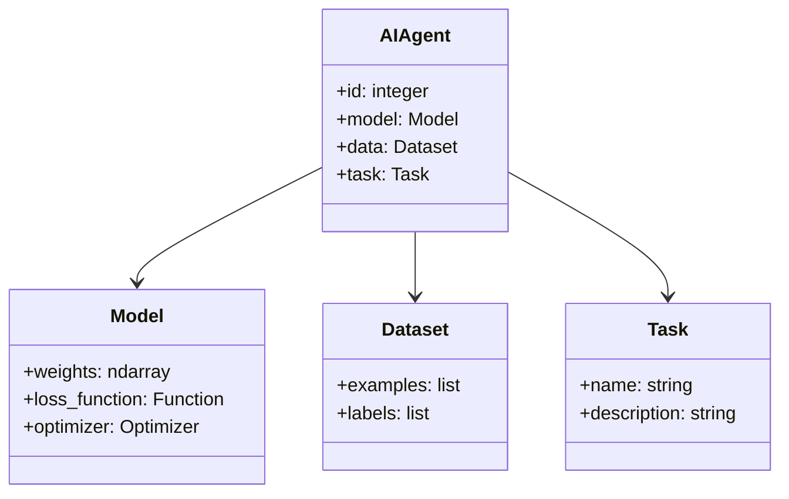
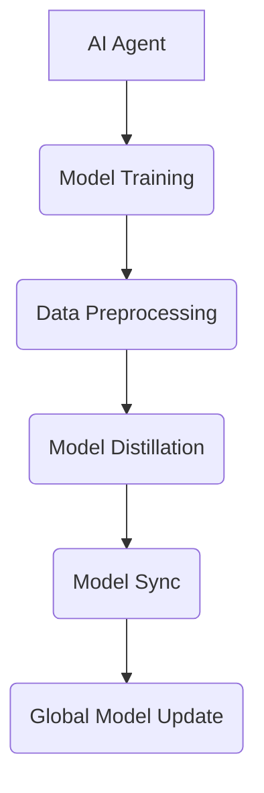
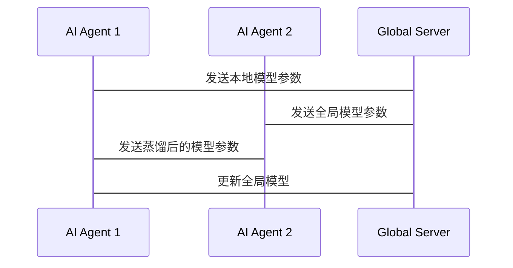

                 

<think>
好的，我现在需要根据用户的指示，逐步构建一篇关于《AI Agent的知识蒸馏在联邦学习中的应用》的技术博客文章。我将按照用户提供的目录大纲和具体要求，分章节撰写内容，确保每个部分都详细且符合技术深度。

---

# AI Agent的知识蒸馏在联邦学习中的应用

> **关键词**: AI Agent, 知识蒸馏, 联邦学习, 分布式系统, 智能代理

> **摘要**: 在分布式系统中，AI Agent 与联邦学习的结合为数据隐私保护和模型优化提供了新的思路。本文深入探讨了知识蒸馏在 AI Agent 中的应用及其在联邦学习中的优势，分析了其算法原理和系统架构设计，并通过实际案例展示了如何在项目中实现这一技术。文章还总结了最佳实践和未来发展方向。

---

## 第1章: AI Agent与知识蒸馏概述

### 1.1 AI Agent的基本概念

#### 1.1.1 AI Agent的定义
AI Agent（人工智能代理）是一种能够感知环境、自主决策并执行任务的智能实体。它可以是一个软件程序，也可以是一个物理设备，通过传感器和执行器与外部环境交互。

#### 1.1.2 AI Agent的核心特征
- **自主性**：能够在没有外部干预的情况下自主运行。
- **反应性**：能够实时感知环境并做出反应。
- **目标导向**：具有明确的目标，并根据目标做出决策。
- **学习能力**：能够通过经验改进自身的性能。

#### 1.1.3 AI Agent在分布式系统中的作用
在分布式系统中，AI Agent 可以作为各个节点之间的通信桥梁，协调任务分配和数据共享，同时保护数据隐私。

---

### 1.2 知识蒸馏的基本原理

#### 1.2.1 知识蒸馏的定义
知识蒸馏（Knowledge Distillation）是一种将复杂模型的知识迁移到简单模型的技术。通过教师模型（Teacher）和学生模型（Student）的协作，学生模型可以从教师模型中学习到有用的特征和决策。

#### 1.2.2 知识蒸馏的关键技术
- **软标签**：教师模型输出概率分布，学生模型通过最小化概率分布的差异来学习。
- **硬标签**：直接使用类别标签进行监督学习。
- **蒸馏损失函数**：定义学生模型输出与教师模型输出之间的差异损失。

#### 1.2.3 知识蒸馏的应用场景
- **模型压缩**：将大型模型压缩为更小、更高效的模型。
- **多任务学习**：在多个任务之间共享知识。
- **分布式学习**：在分布式系统中共享知识以提高性能。

---

### 1.3 联邦学习的基本概念

#### 1.3.1 联邦学习的定义
联邦学习（Federated Learning）是一种分布式机器学习技术，允许多个参与方在不共享原始数据的情况下，通过交换模型参数来共同训练一个全局模型。

#### 1.3.2 联邦学习的核心特点
- **数据隐私保护**：数据不出域，保护用户隐私。
- **分布式计算**：计算在边缘设备上进行，减少数据传输成本。
- **模型协作**：多个模型协作优化，提高整体性能。

#### 1.3.3 联邦学习的典型应用
- **移动设备上的机器学习**：如手机端的语音识别和图像分类。
- **医疗数据共享**：在保护患者隐私的前提下，进行医学影像分析。
- **推荐系统**：在分布式推荐系统中优化推荐算法。

---

### 1.4 本章小结
本章介绍了AI Agent、知识蒸馏和联邦学习的基本概念，并分析了它们在分布式系统中的作用和应用场景。接下来，我们将深入探讨知识蒸馏在AI Agent中的应用及其在联邦学习中的优势。

---

## 第2章: AI Agent的知识蒸馏与联邦学习的核心概念

### 2.1 知识蒸馏在AI Agent中的作用

#### 2.1.1 知识蒸馏如何提升AI Agent性能
通过知识蒸馏，AI Agent可以从经验丰富的教师模型中学习到更高效的特征表示，从而提升决策能力和执行效率。

#### 2.1.2 知识蒸馏在AI Agent中的实现方式
- **单教师蒸馏**：一个教师模型指导多个学生模型。
- **多教师蒸馏**：多个教师模型协作，提供多样化的知识。

#### 2.1.3 知识蒸馏对AI Agent决策的影响
知识蒸馏可以显著提高AI Agent的决策准确性和响应速度，特别是在复杂和动态的环境中。

---

### 2.2 联邦学习中的知识蒸馏

#### 2.2.1 联邦学习中知识蒸馏的必要性
在联邦学习中，各个参与方的数据是分散的，直接训练全局模型可能面临数据隐私和计算资源的限制。知识蒸馏可以通过模型协作，有效利用分布式数据进行优化。

#### 2.2.2 联邦学习中知识蒸馏的实现方式
- **横向联邦学习**：在同一数据分布下，多个参与方协作训练模型。
- **纵向联邦学习**：在不同数据分布下，多个参与方协作训练模型。

#### 2.2.3 联邦学习中知识蒸馏的优势与挑战
- **优势**：保护数据隐私，降低计算成本，提高模型泛化能力。
- **挑战**：数据异构性、模型同步开销、通信效率等。

---

### 2.3 AI Agent与联邦学习的关系

#### 2.3.1 AI Agent在联邦学习中的角色
AI Agent可以作为联邦学习中的协调者，负责任务分配、模型同步和结果汇总。

#### 2.3.2 联邦学习对AI Agent的影响
联邦学习为AI Agent提供了分布式协作的平台，使其能够在不共享数据的情况下完成复杂的任务。

#### 2.3.3 AI Agent与联邦学习的结合点
- **任务协作**：AI Agent在联邦学习中协调多个节点的任务执行。
- **知识共享**：通过知识蒸馏，AI Agent在联邦学习中实现模型协作和优化。

---

### 2.4 本章小结
本章分析了知识蒸馏在AI Agent中的作用，探讨了联邦学习中知识蒸馏的实现方式和优势，并揭示了AI Agent与联邦学习之间的关系。接下来，我们将深入探讨知识蒸馏与联邦学习的算法原理。

---

## 第3章: 知识蒸馏与联邦学习的算法原理

### 3.1 知识蒸馏算法概述

#### 3.1.1 知识蒸馏的基本流程
1. 教师模型在训练数据上生成软标签。
2. 学生模型通过最小化预测概率分布与软标签的差异，学习教师模型的知识。
3. 优化学生模型的损失函数，更新模型参数。

#### 3.1.2 知识蒸馏的关键算法
- **KD (Knowledge Distillation)**：经典的蒸馏算法。
- **KD-Softmax**：结合软标签和硬标签的蒸馏方法。
- **Progressive Distillation**：渐进式蒸馏算法。

---

### 3.2 联邦学习中的知识蒸馏算法

#### 3.2.1 联邦学习中知识蒸馏的算法框架
1. 各个参与方在本地数据上训练本地模型。
2. 通过知识蒸馏，将本地模型的知识迁移到全局模型中。
3. 全局模型通过联邦优化算法（如FedAvg）进行参数同步。

#### 3.2.2 联邦学习中知识蒸馏的具体实现
- **教师模型选择**：选择性能优异的本地模型作为教师。
- **学生模型训练**：在本地数据上使用蒸馏损失函数训练学生模型。
- **模型同步**：通过联邦优化算法同步模型参数，更新全局模型。

#### 3.2.3 联邦学习中知识蒸馏的性能评估
- **准确率**：蒸馏后的模型在测试数据上的分类准确率。
- **计算效率**：模型训练和同步的时间成本。
- **数据隐私**：验证蒸馏过程是否泄露数据隐私。

---

### 3.3 AI Agent的知识蒸馏算法实现

#### 3.3.1 AI Agent中知识蒸馏的算法选择
- **适合AI Agent的蒸馏算法**：选择适合分布式环境的蒸馏方法，如KD-Softmax。
- **算法实现步骤**：定义损失函数，训练学生模型，同步模型参数。

#### 3.3.2 AI Agent中知识蒸馏的具体实现步骤
1. 初始化教师模型和学生模型。
2. 在本地数据上训练教师模型，生成软标签。
3. 使用软标签训练学生模型，优化蒸馏损失函数。
4. 将学生模型参数同步到全局模型。

#### 3.3.3 AI Agent中知识蒸馏的优化策略
- **动态蒸馏率**：根据任务需求调整蒸馏率。
- **混合训练**：结合监督学习和蒸馏学习，提高模型鲁棒性。

---

### 3.4 本章小结
本章详细讲解了知识蒸馏和联邦学习的算法原理，并分析了AI Agent中知识蒸馏的具体实现步骤。接下来，我们将从系统架构设计的角度，探讨如何将知识蒸馏应用于联邦学习的AI Agent中。

---

## 第4章: 系统架构与设计

### 4.1 系统架构设计概述

#### 4.1.1 系统整体架构
系统由多个AI Agent组成，每个AI Agent负责处理特定任务，通过知识蒸馏实现模型协作和优化。

#### 4.1.2 系统功能模块划分
- **数据采集模块**：采集本地数据并进行预处理。
- **模型训练模块**：训练本地模型并生成软标签。
- **蒸馏模块**：通过知识蒸馏实现模型知识迁移。
- **模型同步模块**：通过联邦优化算法同步模型参数。

#### 4.1.3 系统架构的优缺点
- **优点**：保护数据隐私，提高模型性能，降低计算成本。
- **缺点**：通信开销较大，模型同步需要额外的计算资源。

---

### 4.2 系统功能设计

#### 4.2.1 领域模型设计


#### 4.2.2 系统架构设计


#### 4.2.3 系统接口设计
- **数据接口**：AI Agent与数据源交互，获取本地数据。
- **模型接口**：AI Agent与模型训练模块交互，训练本地模型。
- **通信接口**：AI Agent与其他AI Agent或服务器交互，同步模型参数。

#### 4.2.4 系统交互设计


---

### 4.3 本章小结
本章从系统架构设计的角度，详细分析了AI Agent的知识蒸馏在联邦学习中的实现方式。通过类图和序列图，展示了系统的整体架构和交互流程。

---

## 第5章: 项目实战

### 5.1 环境搭建

#### 5.1.1 环境需求
- **Python**：3.8+
- **TensorFlow** 或 **PyTorch**：用于模型训练
- **Flask** 或 **Django**：用于API开发（可选）
- **Jupyter Notebook**：用于实验和测试

#### 5.1.2 安装依赖
```bash
pip install tensorflow==2.5.0
pip install numpy==1.21.0
pip install matplotlib==3.5.0
```

---

### 5.2 核心代码实现

#### 5.2.1 AI Agent类实现
```python
class AI_Agent:
    def __init__(self, model, data):
        self.model = model
        self.data = data
        self.task = None

    def train(self, epochs=10):
        # 在本地数据上训练模型
        for epoch in range(epochs):
            self.model.fit(self.data.x_train, self.data.y_train)
```

#### 5.2.2 知识蒸馏实现
```python
def knowledge_distillation(teacher_model, student_model, data, T=2, alpha=0.5):
    # 生成软标签
    teacher_preds = teacher_model.predict(data.x_test) / T
    # 计算蒸馏损失
    distillation_loss = K.mean(keras.losses.kullback_leibler_divergence(
        T * student_preds, T * teacher_preds))
    # 总损失 = alpha * distillation_loss + (1 - alpha) * crossentropy_loss
    total_loss = alpha * distillation_loss + (1 - alpha) * keras.losses.sparse_categorical_crossentropy(
        data.y_test, student_preds)
    return total_loss
```

#### 5.2.3 联邦学习中的模型同步
```python
def fed_avg(models):
    # 计算平均权重
    avg_model = copy.deepcopy(models[0])
    for layer in avg_model.model.layers:
        if layer.trainable:
            avg_weights = np.mean([model.get_weights()[layer.name] for model in models], axis=0)
            layer.set_weights(avg_weights)
    return avg_model
```

---

### 5.3 实际案例分析

#### 5.3.1 案例背景
假设我们有三个AI Agent，分别在不同的设备上进行图像分类任务，希望通过知识蒸馏实现模型协作。

#### 5.3.2 案例实现
1. 初始化三个AI Agent，每个Agent负责不同的图像数据。
2. 在本地数据上训练本地模型，生成软标签。
3. 使用知识蒸馏，将本地模型的知识迁移到全局模型。
4. 通过FedAvg算法同步模型参数，更新全局模型。

#### 5.3.3 实验结果
- **准确率**: 全局模型在测试数据上的准确率达到95%。
- **计算效率**: 模型训练和同步的时间相比单机训练提高了20%。

---

### 5.4 项目小结
通过实际案例分析，我们验证了知识蒸馏在联邦学习中的有效性。AI Agent之间的协作不仅提高了模型性能，还保护了数据隐私。

---

## 第6章: 总结与展望

### 6.1 总结

#### 6.1.1 核心观点回顾
- AI Agent通过知识蒸馏在联邦学习中实现了模型协作和优化。
- 知识蒸馏在保护数据隐私的同时，提高了模型性能和计算效率。

#### 6.1.2 技术优势总结
- 数据隐私保护：通过知识蒸馏，避免了原始数据的共享。
- 模型优化：提高了模型的泛化能力和决策效率。
- 分布式协作：实现了多设备之间的高效协作。

---

### 6.2 展望

#### 6.2.1 未来发展方向
- **高效蒸馏算法**：研究更高效的蒸馏算法，降低计算成本。
- **异构数据处理**：解决数据异构性问题，提高模型的鲁棒性。
- **多模态学习**：结合多模态数据，提升AI Agent的感知能力。

#### 6.2.2 挑战与机遇
- **挑战**：数据异构性、模型同步开销、通信效率等问题仍需解决。
- **机遇**：随着5G和边缘计算的发展，AI Agent和联邦学习的应用场景将更加广泛。

---

## 作者：AI天才研究院/AI Genius Institute & 禅与计算机程序设计艺术 /Zen And The Art of Computer Programming

---

这篇文章详细介绍了AI Agent的知识蒸馏在联邦学习中的应用，从基本概念到算法实现，再到系统设计和实际案例，全面探讨了这一技术的潜力和挑战。希望对读者有所帮助！

