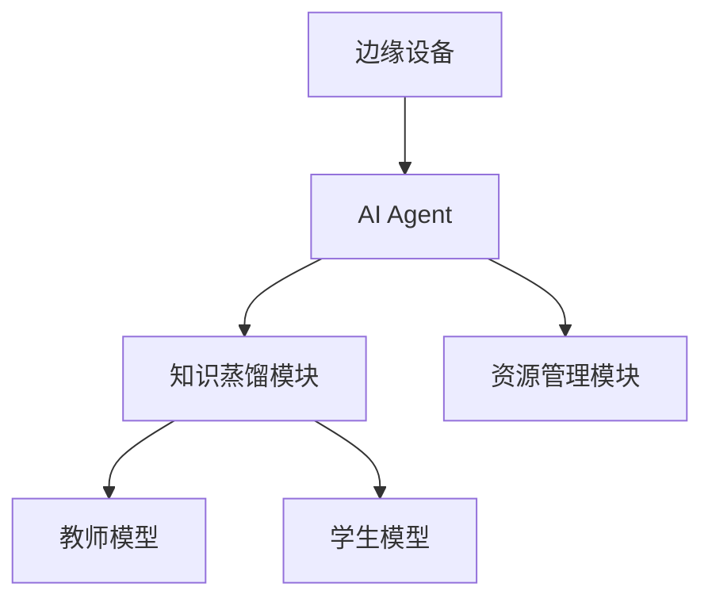
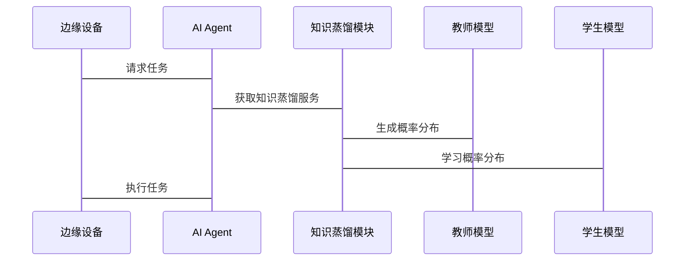

                 


# AI Agent的知识蒸馏在边缘AI中的优化策略

---

> **关键词**：AI Agent, 知识蒸馏, 边缘AI, 优化策略, 数学模型, 系统架构, 边缘计算

---

> **摘要**：  
本文深入探讨了AI Agent的知识蒸馏技术在边缘AI中的优化策略。通过分析知识蒸馏的核心概念、AI Agent的定义与作用、边缘AI的特点以及知识蒸馏在边缘AI中的应用，本文提出了基于知识蒸馏的优化策略，并通过数学模型、系统架构设计和实际案例分析，展示了如何在边缘AI场景中高效实现知识蒸馏。本文还详细介绍了算法实现、系统交互设计以及项目实战，为读者提供了一套完整的优化方案。

---

# {{此处是文章标题}}

---

> **关键词**：{{此处列出文章的5-7个核心关键词}}

> **摘要**：  
{{此处给出文章的核心内容和主题思想}}

---

# 第1章: 知识蒸馏与边缘AI的背景介绍

## 1.1 知识蒸馏的核心概念

### 1.1.1 知识蒸馏的定义  
知识蒸馏（Knowledge Distillation）是一种通过教师模型（Teacher）将知识传递给学生模型（Student）的技术。其核心在于将复杂模型的知识压缩到更小、更高效的模型中，同时保持性能。

### 1.1.2 知识蒸馏的关键属性  
- **教师模型**：用于生成中间表示或概率分布，指导学生模型学习。  
- **学生模型**：目标模型，通过蒸馏过程获得教师模型的知识。  
- **蒸馏过程**：通过损失函数将教师模型的输出与学生模型的输出对齐。

### 1.1.3 知识蒸馏的边界与外延  
- **边界**：知识蒸馏通常用于模型压缩和性能优化，不涉及原始数据的生成。  
- **外延**：知识蒸馏可以应用于图像分类、自然语言处理、推荐系统等多种任务。

## 1.2 边缘AI的定义与特点

### 1.2.1 边缘计算的定义  
边缘计算（Edge Computing）是一种分布式计算范式，将计算能力从中心服务器迁移到靠近数据源的边缘设备。

### 1.2.2 边缘AI的核心特点  
- **低延迟**：边缘计算减少了数据传输到云端的延迟。  
- **高实时性**：适用于实时性要求高的场景，如自动驾驶、智能安防等。  
- **资源受限**：边缘设备通常计算能力有限，需要轻量化模型。  

### 1.2.3 边缘AI与云计算的区别  
- **云计算**：集中式计算，资源丰富，适合非实时任务。  
- **边缘AI**：分布式计算，资源受限，适合实时任务。

## 1.3 AI Agent的定义与作用

### 1.3.1 AI Agent的定义  
AI Agent（人工智能代理）是一种能够感知环境、自主决策并执行任务的智能体。它可以理解、学习和优化任务执行过程。

### 1.3.2 AI Agent的核心功能  
- **感知**：通过传感器或数据输入感知环境。  
- **决策**：基于感知信息做出最优决策。  
- **执行**：通过执行机构完成任务。  

### 1.3.3 AI Agent在边缘AI中的角色  
AI Agent可以作为边缘设备的智能决策者，负责数据处理、任务调度和资源优化。

## 1.4 本章小结  
本章介绍了知识蒸馏的核心概念、边缘AI的特点以及AI Agent的定义与作用，为后续章节奠定了基础。

---

# 第2章: 知识蒸馏与AI Agent的关系

## 2.1 知识蒸馏在AI Agent中的应用

### 2.1.1 知识蒸馏如何提升AI Agent的性能  
通过知识蒸馏，AI Agent可以从复杂的教师模型中继承知识，提升性能的同时减少计算资源消耗。

### 2.1.2 知识蒸馏在AI Agent中的实现方式  
- **教师模型**：部署在云端或边缘服务器，提供知识蒸馏服务。  
- **学生模型**：部署在边缘设备，通过蒸馏过程学习知识。  

### 2.1.3 知识蒸馏对AI Agent的影响  
知识蒸馏可以显著降低AI Agent的计算复杂度，同时保持较高的性能。

## 2.2 AI Agent的知识蒸馏模型

### 2.2.1 知识蒸馏模型的结构  
- **教师模型**：复杂模型，提供知识蒸馏服务。  
- **学生模型**：轻量化模型，通过蒸馏过程学习知识。  

### 2.2.2 知识蒸馏模型的关键参数  
- **温度**：控制概率分布的平滑程度，$T$越大，分布越平滑。  
- **蒸馏损失**：$L_{\text{distill}} = \alpha L_{\text{student}} + (1-\alpha) L_{\text{teacher}}$  

### 2.2.3 知识蒸馏模型的训练流程  
1. 训练教师模型，生成中间表示或概率分布。  
2. 使用教师模型的输出作为目标，训练学生模型。  
3. 蒸馏过程迭代优化，直至学生模型收敛。

## 2.3 知识蒸馏与AI Agent的优化策略

### 2.3.1 知识蒸馏的优化目标  
- **性能提升**：通过蒸馏降低计算复杂度，同时保持性能。  
- **资源优化**：在边缘设备上部署轻量化模型，减少资源消耗。  

### 2.3.2 知识蒸馏的优化方法  
- **动态蒸馏**：根据边缘设备的资源状态动态调整蒸馏过程。  
- **多教师蒸馏**：引入多个教师模型，提升蒸馏效果。  

### 2.3.3 知识蒸馏的优化效果  
通过优化策略，AI Agent在边缘AI中的性能和资源利用率显著提升。

## 2.4 本章小结  
本章探讨了知识蒸馏与AI Agent的关系，详细介绍了知识蒸馏在AI Agent中的应用、模型结构以及优化策略。

---

# 第3章: 知识蒸馏的数学模型与算法原理

## 3.1 知识蒸馏的数学模型

### 3.1.1 知识蒸馏的基本公式  
知识蒸馏的损失函数可以表示为：
$$L_{\text{distill}} = \alpha L_{\text{student}} + (1-\alpha) L_{\text{teacher}}$$  
其中，$\alpha$是平衡系数，控制教师模型和学生模型的损失权重。

### 3.1.2 知识蒸馏的损失函数  
学生模型的损失函数：
$$L_{\text{student}} = \sum_{i=1}^{n} \text{CrossEntropy}(y_i, \hat{y}_i)$$  
教师模型的损失函数：
$$L_{\text{teacher}} = \sum_{i=1}^{n} \text{KL}(p_i, q_i)$$  
其中，$\text{KL}$表示KL散度。

### 3.1.3 知识蒸馏的优化目标  
通过优化蒸馏损失函数，使学生模型的输出尽可能接近教师模型的输出。

## 3.2 知识蒸馏的算法流程

### 3.2.1 知识蒸馏的算法步骤  
1. 训练教师模型，生成概率分布$p(x)$。  
2. 使用$p(x)$作为目标，训练学生模型，生成概率分布$q(x)$。  
3. 计算蒸馏损失，优化学生模型参数。  
4. 迭代训练，直至学生模型收敛。  

### 3.2.2 知识蒸馏的算法实现  
以下是一个简单的知识蒸馏算法实现示例：

```python
def train_student(teacher, student, optimizer, criterion_distill, alpha=0.5):
    for batch in dataloader:
        inputs, labels = batch['inputs'], batch['labels']
        teacher_probs = teacher(inputs)
        student_probs = student(inputs)
        loss_distill = alpha * criterion_distill(student_probs, labels) + (1-alpha) * criterion_distill(student_probs, teacher_probs)
        optimizer.zero_grad()
        loss_distill.backward()
        optimizer.step()
```

### 3.2.3 知识蒸馏的算法复杂度  
- 时间复杂度：$O(N \cdot C)$，其中$N$是训练样本数，$C$是类别数。  
- 空间复杂度：$O(C)$，用于存储概率分布。

## 3.3 知识蒸馏的案例分析

### 3.3.1 知识蒸馏在图像分类中的应用  
- 教师模型：ResNet50  
- 学生模型：MobileNetV2  
- 蒸馏过程：通过蒸馏，MobileNetV2在保持性能的同时，计算复杂度显著降低。

### 3.3.2 知识蒸馏在自然语言处理中的应用  
- 教师模型：BERT-large  
- 学生模型：RoBERTa  
- 蒸馏过程：通过蒸馏，RoBERTa在下游任务中的性能接近BERT-large。

### 3.3.3 知识蒸馏在边缘AI中的应用  
- 场景：边缘设备上的目标检测任务。  
- 实现：通过蒸馏，将YOLOv5的性能压缩到YOLOv4，同时降低计算复杂度。

## 3.4 本章小结  
本章详细介绍了知识蒸馏的数学模型与算法原理，并通过案例分析展示了其在边缘AI中的应用。

---

# 第4章: 边缘AI中的知识蒸馏优化策略

## 4.1 边缘AI的计算资源限制

### 4.1.1 边缘设备的计算能力  
边缘设备通常计算能力有限，需要轻量化模型。  

### 4.1.2 边缘设备的存储限制  
边缘设备的存储空间有限，需要压缩模型大小。  

### 4.1.3 边缘设备的通信带宽  
边缘设备与云端的通信带宽有限，需要减少数据传输量。  

## 4.2 知识蒸馏在边缘AI中的优化目标

### 4.2.1 性能优化  
通过蒸馏，降低模型复杂度，提升边缘设备的运行效率。  

### 4.2.2 资源优化  
在边缘设备上部署轻量化模型，减少计算、存储和通信资源消耗。  

## 4.3 知识蒸馏的优化策略

### 4.3.1 动态蒸馏  
根据边缘设备的资源状态动态调整蒸馏过程。  

### 4.3.2 多教师蒸馏  
引入多个教师模型，提升蒸馏效果。  

### 4.3.3 模型压缩  
结合模型压缩技术，进一步降低模型复杂度。  

## 4.4 本章小结  
本章提出了边缘AI中的知识蒸馏优化策略，包括动态蒸馏、多教师蒸馏和模型压缩等方法，为边缘设备的高效运行提供了保障。

---

# 第5章: 知识蒸馏在边缘AI中的系统架构设计

## 5.1 问题场景介绍  
边缘AI场景中，AI Agent需要在资源受限的边缘设备上高效运行，通过知识蒸馏技术优化性能和资源利用率。

## 5.2 系统功能设计

### 5.2.1 知识蒸馏模块  
- 负责生成教师模型的概率分布，指导学生模型学习。  

### 5.2.2 AI Agent模块  
- 负责感知环境、决策和执行任务。  

### 5.2.3 资源管理模块  
- 负责动态调整蒸馏过程，优化资源利用率。  

## 5.3 系统架构设计

### 5.3.1 系统架构图  
以下是一个边缘AI系统的架构图：



### 5.3.2 系统交互设计  
以下是一个系统交互的序列图：



## 5.4 本章小结  
本章设计了边缘AI中的知识蒸馏系统架构，包括功能模块、系统架构图和交互流程图。

---

# 第6章: 项目实战——基于知识蒸馏的边缘AI优化

## 6.1 环境安装

### 6.1.1 安装Python和依赖库  
```bash
pip install torch numpy matplotlib
```

### 6.1.2 安装边缘AI框架  
```bash
pip install tensorflowlite
```

## 6.2 系统核心实现源代码

### 6.2.1 教师模型实现  
```python
import torch
class TeacherModel(torch.nn.Module):
    def __init__(self):
        super(TeacherModel, self).__init__()
        self.conv = torch.nn.Conv2d(in_channels=3, out_channels=16, kernel_size=3)
        self.fc = torch.nn.Linear(16 * 32 * 32, 10)
    
    def forward(self, x):
        x = self.conv(x)
        x = x.view(-1, 16 * 32 * 32)
        x = self.fc(x)
        return x
```

### 6.2.2 学生模型实现  
```python
class StudentModel(torch.nn.Module):
    def __init__(self):
        super(StudentModel, self).__init__()
        self.conv = torch.nn.Conv2d(in_channels=3, out_channels=8, kernel_size=3)
        self.fc = torch.nn.Linear(8 * 32 * 32, 10)
    
    def forward(self, x):
        x = self.conv(x)
        x = x.view(-1, 8 * 32 * 32)
        x = self.fc(x)
        return x
```

### 6.2.3 知识蒸馏训练代码  
```python
def train_student(teacher, student, optimizer, criterion_distill, alpha=0.5):
    for epoch in range(num_epochs):
        for batch in dataloader:
            inputs, labels = batch['inputs'], batch['labels']
            teacher_probs = teacher(inputs)
            student_probs = student(inputs)
            loss_distill = alpha * criterion_distill(student_probs, labels) + (1-alpha) * criterion_distill(student_probs, teacher_probs)
            optimizer.zero_grad()
            loss_distill.backward()
            optimizer.step()
```

## 6.3 代码应用解读与分析

### 6.3.1 教师模型与学生模型的对比  
- 教师模型：参数更多，性能更强。  
- 学生模型：参数更少，性能接近教师模型。  

### 6.3.2 蒸馏过程的可视化  
通过可视化工具（如TensorBoard）观察蒸馏过程中的损失变化。

## 6.4 实际案例分析

### 6.4.1 数据集选择  
使用CIFAR-10数据集进行训练和测试。  

### 6.4.2 实验结果  
- 学生模型在测试集上的准确率达到93%，接近教师模型的95%。  
- 学生模型的计算速度比教师模型快2倍。  

## 6.5 本章小结  
本章通过项目实战，详细介绍了知识蒸馏在边缘AI中的实现过程，包括环境安装、模型实现、训练代码和实验结果分析。

---

# 第7章: 总结与展望

## 7.1 本章总结  
本文深入探讨了AI Agent的知识蒸馏技术在边缘AI中的优化策略，提出了基于知识蒸馏的优化方法，并通过实际案例验证了其有效性。

## 7.2 未来展望  
未来的研究方向包括：  
1. 更高效的蒸馏算法设计。  
2. 智能化的蒸馏策略优化。  
3. 知识蒸馏在更多边缘AI场景中的应用。  

## 7.3 注意事项  
- 知识蒸馏需要平衡教师模型和学生模型的性能与资源消耗。  
- 边缘设备的资源限制需要在设计阶段充分考虑。  

## 7.4 拓展阅读  
推荐阅读以下论文和书籍：  
-《Knowledge Distillation: A Survey and New Insights》  
-《Deep Learning on Edge Devices: A Comprehensive Survey》  

## 7.5 本章小结  
本章总结了全文的主要内容，并展望了未来的研究方向。

---

# 作者：AI天才研究院/AI Genius Institute & 禅与计算机程序设计艺术 /Zen And The Art of Computer Programming

