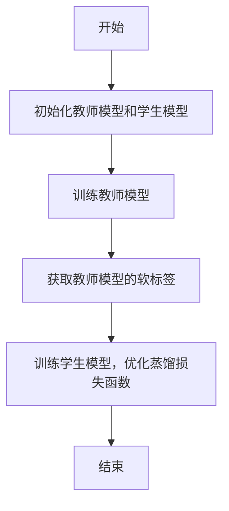

                 


# AI Agent的知识蒸馏在边缘计算中的应用

> 关键词：AI Agent, 知识蒸馏, 边缘计算, 算法原理, 应用案例, 系统设计, 项目实战

> 摘要：本文深入探讨了AI Agent在边缘计算中的应用，重点分析了知识蒸馏技术在提升AI Agent性能和效率中的作用。文章从基础知识到算法原理，再到实际应用，全面阐述了知识蒸馏在边缘计算环境下的实现方法和优化策略，最后通过具体案例展示了其在智能工厂、自动驾驶和智能医疗等领域的应用前景。

---

## 第一章：AI Agent与知识蒸馏基础

### 1.1 AI Agent的基本概念

#### 1.1.1 AI Agent的定义与特点
AI Agent（人工智能代理）是指能够感知环境并采取行动以实现目标的智能实体。其特点包括自主性、反应性、目标导向和社会能力。AI Agent能够根据环境输入做出决策，并通过执行动作来达到预设目标。

#### 1.1.2 AI Agent的分类与应用场景
AI Agent可以分为简单反射型、基于模型的反射型、目标驱动型和效用驱动型。应用场景包括智能助手、推荐系统、自动驾驶和智能机器人等。

#### 1.1.3 AI Agent与边缘计算的关系
边缘计算是一种分布式计算范式，将数据处理和存储能力推向网络边缘。AI Agent在边缘计算中的应用能够提升系统的实时性和响应速度，减少对云端的依赖。

### 1.2 知识蒸馏的核心概念

#### 1.2.1 知识蒸馏的定义与原理
知识蒸馏是一种通过将复杂模型的知识迁移到简单模型的技术，旨在降低模型的复杂性和计算成本。其原理包括知识表示、蒸馏过程和目标模型优化。

#### 1.2.2 知识蒸馏的关键技术与方法
知识蒸馏的关键技术包括软标签蒸馏、硬标签蒸馏和自监督蒸馏。软标签蒸馏通过概率分布进行知识迁移，硬标签蒸馏基于类别标签进行迁移，自监督蒸馏则利用数据本身进行无监督学习。

#### 1.2.3 知识蒸馏在AI Agent中的作用
知识蒸馏能够提升AI Agent的学习效率和决策能力，同时减少计算资源的消耗。通过蒸馏技术，AI Agent能够在资源受限的边缘环境中高效运行。

### 1.3 边缘计算的基本概念

#### 1.3.1 边缘计算的定义与特点
边缘计算是在靠近数据源或用户的边缘设备上进行数据处理和计算的技术。其特点包括低延迟、高实时性和分布式架构。

#### 1.3.2 边缘计算的体系架构
边缘计算的体系架构包括边缘设备层、边缘网关层和云平台层。各层之间通过通信协议进行数据交互，实现数据的分布式处理。

#### 1.3.3 边缘计算与云计算的区别与联系
边缘计算与云计算的主要区别在于数据处理的位置和延迟。边缘计算将数据处理推向边缘，减少云端依赖，而云计算则集中处理数据。

---

## 第二章：AI Agent的知识蒸馏在边缘计算中的问题背景

### 2.1 边缘计算中的AI Agent应用需求

#### 2.1.1 边缘计算对AI Agent的需求分析
边缘计算环境下，AI Agent需要具备低功耗、高实时性和高效决策能力。这些需求推动了知识蒸馏技术在AI Agent中的应用。

#### 2.1.2 AI Agent在边缘计算中的应用场景
AI Agent在边缘计算中的应用场景包括智能工厂、自动驾驶和智能医疗等。这些场景需要AI Agent具备快速决策和高效学习能力。

#### 2.1.3 知识蒸馏在AI Agent中的必要性
知识蒸馏能够帮助AI Agent在边缘环境中快速学习和适应，提升其在资源受限环境下的性能。

### 2.2 知识蒸馏在边缘计算中的挑战

#### 2.2.1 边缘计算环境下的数据特性
边缘计算环境下的数据具有异构性、实时性和分布性。这些特性对知识蒸馏技术提出了更高的要求。

#### 2.2.2 知识蒸馏在边缘计算中的技术难点
知识蒸馏在边缘计算中的技术难点包括数据隐私保护、模型压缩和跨设备协作。这些挑战需要通过技术创新来解决。

#### 2.2.3 知识蒸馏对AI Agent性能的影响
知识蒸馏能够显著提升AI Agent的性能，包括决策准确性和响应速度。然而，蒸馏过程中的参数选择和优化策略需要精心设计。

### 2.3 本章小结
本章分析了AI Agent在边缘计算中的应用需求和知识蒸馏技术的必要性，同时探讨了在边缘环境下应用知识蒸馏所面临的技术挑战。

---

## 第三章：知识蒸馏的核心原理

### 3.1 知识蒸馏的基本原理

#### 3.1.1 知识蒸馏的数学模型
知识蒸馏的数学模型包括教师模型和学生模型。教师模型通过软标签指导学生模型的学习，学生模型通过优化蒸馏损失函数来逼近教师模型的知识。

#### 3.1.2 知识蒸馏的关键步骤
知识蒸馏的关键步骤包括知识表示、蒸馏过程和模型优化。教师模型生成软标签，学生模型通过蒸馏损失函数进行优化。

#### 3.1.3 知识蒸馏的核心算法
知识蒸馏的核心算法包括软标签蒸馏和硬标签蒸馏。软标签蒸馏通过概率分布进行知识迁移，硬标签蒸馏基于类别标签进行迁移。

### 3.2 知识蒸馏与AI Agent的结合

#### 3.2.1 AI Agent中的知识表示
AI Agent中的知识表示包括符号表示、概率表示和神经网络表示。知识蒸馏通过神经网络模型进行知识表示和迁移。

#### 3.2.2 知识蒸馏在AI Agent中的实现
知识蒸馏在AI Agent中的实现包括教师模型和学生模型的设计、蒸馏损失函数的优化以及模型参数的调整。

#### 3.2.3 知识蒸馏对AI Agent决策的影响
知识蒸馏能够显著提升AI Agent的决策准确性和响应速度，同时减少计算资源的消耗。

---

## 第四章：知识蒸馏的算法原理

### 4.1 知识蒸馏的主要算法

#### 4.1.1 Softmax损失函数
Softmax损失函数用于分类任务，公式为：
$$ L_{\text{softmax}} = -\sum_{i=1}^{n} y_i \log p_i $$
其中，$y_i$ 是真实标签的概率，$p_i$ 是预测概率。

#### 4.1.2 KL散度损失函数
KL散度损失函数用于衡量两个概率分布之间的差异，公式为：
$$ L_{\text{KL}} = \sum_{i=1}^{n} p_i \log \frac{p_i}{q_i} $$
其中，$p_i$ 是教师模型的概率，$q_i$ 是学生模型的概率。

#### 4.1.3 蒸馏损失函数
蒸馏损失函数结合了软标签和硬标签的损失，公式为：
$$ L_{\text{distill}} = \alpha L_{\text{softmax}} + (1-\alpha) L_{\text{KL}} $$
其中，$\alpha$ 是平衡参数。

### 4.2 算法原理的数学模型

#### 4.2.1 Softmax函数的数学表达式
Softmax函数的数学表达式为：
$$ \text{softmax}(x_i) = \frac{e^{x_i}}{\sum_{j=1}^{n} e^{x_j}} $$

#### 4.2.2 KL散度的数学公式
KL散度的数学公式为：
$$ D_{\text{KL}}(p \parallel q) = \sum_{i=1}^{n} p_i \log \frac{p_i}{q_i} $$

#### 4.2.3 蒸馏损失的数学推导
蒸馏损失的数学推导基于教师模型和学生模型的联合优化，通过调整平衡参数$\alpha$来实现知识迁移。

### 4.3 算法实现的流程图



---

## 第五章：知识蒸馏的优化与改进

### 5.1 知识蒸馏的优化方法

#### 5.1.1 蒸馏温度的调整
蒸馏温度的调整通过改变Softmax函数的温度参数$\tau$来实现，公式为：
$$ p_i = \frac{e^{x_i/\tau}}{\sum_{j=1}^{n} e^{x_j/\tau}} $$

#### 5.1.2 蒸馏损失函数的改进
改进的蒸馏损失函数包括加权蒸馏和对抗蒸馏。加权蒸馏通过引入权重系数来优化知识迁移，对抗蒸馏通过引入对抗网络来提升蒸馏效果。

#### 5.1.3 模型压缩与轻量化
模型压缩技术包括剪枝、参数量化和知识蒸馏。通过剪枝去除冗余参数，通过量化降低参数精度，通过蒸馏迁移知识到轻量模型。

---

## 第六章：AI Agent的知识蒸馏在边缘计算中的应用案例

### 6.1 智能工厂中的应用

#### 6.1.1 智能工厂的场景介绍
智能工厂中，AI Agent用于设备监控和生产优化。通过边缘计算，AI Agent能够实时分析设备状态，预测故障并优化生产流程。

#### 6.1.2 系统架构设计
智能工厂的系统架构包括边缘设备层、边缘网关层和云平台层。AI Agent部署在边缘设备层，通过边缘网关与云端平台进行数据交互。

#### 6.1.3 应用案例分析
通过部署知识蒸馏技术，AI Agent能够在边缘设备上快速学习设备故障特征，显著提升故障预测的准确性和响应速度。

### 6.2 自动驾驶中的应用

#### 6.2.1 自动驾驶的场景介绍
自动驾驶中，AI Agent用于环境感知和决策控制。通过边缘计算，AI Agent能够实时处理传感器数据，做出快速反应。

#### 6.2.2 系统架构设计
自动驾驶的系统架构包括车载计算平台、边缘计算节点和云端平台。AI Agent部署在车载计算平台，通过边缘节点与周围环境进行数据交互。

#### 6.2.3 应用案例分析
通过知识蒸馏技术，AI Agent能够在车载设备上快速学习驾驶策略，提升车辆的自动驾驶能力和安全性。

### 6.3 智能医疗中的应用

#### 6.3.1 智能医疗的场景介绍
智能医疗中，AI Agent用于患者监测和诊断辅助。通过边缘计算，AI Agent能够实时分析患者数据，辅助医生做出诊断。

#### 6.3.2 系统架构设计
智能医疗的系统架构包括医疗设备、边缘网关和云端平台。AI Agent部署在医疗设备层，通过边缘网关与云端平台进行数据交互。

#### 6.3.3 应用案例分析
通过知识蒸馏技术，AI Agent能够在医疗设备上快速学习疾病特征，显著提升诊断准确率和响应速度。

---

## 第七章：系统设计与优化

### 7.1 系统设计要点

#### 7.1.1 系统架构设计
系统架构设计包括边缘设备层、边缘计算层和云端平台层。AI Agent部署在边缘设备层，通过边缘计算层与云端平台进行数据交互。

#### 7.1.2 系统功能设计
系统功能设计包括数据采集、数据处理、知识蒸馏和决策控制。AI Agent通过知识蒸馏技术优化决策模型，提升系统性能。

#### 7.1.3 系统接口设计
系统接口设计包括边缘设备与边缘网关的接口、边缘网关与云端平台的接口。通过标准化接口实现数据交互和模型更新。

### 7.2 系统优化策略

#### 7.2.1 模型压缩与轻量化
通过剪枝、量化和知识蒸馏等技术，优化AI Agent的模型大小和计算效率，适应边缘设备的资源限制。

#### 7.2.2 并行计算与分布式处理
通过多线程和分布式计算技术，提升系统处理能力，减少数据传输延迟。

#### 7.2.3 智能调度与负载均衡
通过智能调度算法和负载均衡技术，优化系统资源利用率，提升整体性能。

---

## 第八章：项目实战

### 8.1 环境安装与配置

#### 8.1.1 安装Python环境
安装Python 3.8及以上版本，配置虚拟环境。

#### 8.1.2 安装深度学习框架
安装TensorFlow或PyTorch框架，选择适合的版本进行配置。

#### 8.1.3 安装其他依赖库
安装NumPy、Matplotlib和scikit-learn等依赖库，确保环境配置完成。

### 8.2 系统核心实现

#### 8.2.1 教师模型实现
实现教师模型，定义神经网络结构，训练模型并保存权重。

#### 8.2.2 学生模型实现
实现学生模型，定义更简单的网络结构，加载教师模型的软标签进行训练。

#### 8.2.3 蒸馏损失函数实现
实现蒸馏损失函数，结合Softmax和KL散度损失，优化学生模型。

### 8.3 代码实现与解读

#### 8.3.1 教师模型代码
```python
import tensorflow as tf
from tensorflow import keras

def teacher_model(input_shape):
    model = keras.Sequential()
    model.add(keras.layers.Conv2D(32, (3,3), activation='relu', input_shape=input_shape))
    model.add(keras.layers.MaxPooling2D((2,2)))
    model.add(keras.layers.Conv2D(64, (3,3), activation='relu'))
    model.add(keras.layers.MaxPooling2D((2,2)))
    model.add(keras.layers.Flatten())
    model.add(keras.layers.Dense(256, activation='relu'))
    model.add(keras.layers.Dense(10, activation='softmax'))
    return model

teacher = teacher_model((32, 32, 3))
teacher.compile(optimizer='adam', loss='sparse_categorical_crossentropy', metrics=['accuracy'])
teacher.save('teacher_model.h5')
```

#### 8.3.2 学生模型代码
```python
def student_model(input_shape):
    model = keras.Sequential()
    model.add(keras.layers.Conv2D(16, (3,3), activation='relu', input_shape=input_shape))
    model.add(keras.layers.MaxPooling2D((2,2)))
    model.add(keras.layers.Conv2D(32, (3,3), activation='relu'))
    model.add(keras.layers.MaxPooling2D((2,2)))
    model.add(keras.layers.Flatten())
    model.add(keras.layers.Dense(128, activation='relu'))
    model.add(keras.layers.Dense(10, activation='softmax'))
    return model

student = student_model((32, 32, 3))
teacher_weights = keras.load_model('teacher_model.h5').get_weights()
student.set_weights(teacher_weights)

def distillation_loss(y_true, y_pred, alpha=0.5, temperature=3.0):
    y_pred_teacher = tf.nn.softmax(y_pred / temperature)
    y_pred_student = tf.nn.softmax(y_pred / temperature)
    loss_softmax = tf.keras.losses.sparse_categorical_crossentropy(y_true, y_pred)
    loss_kl = tf.keras.losses.kullback_leibler_divergence(y_pred_teacher, y_pred_student)
    return alpha * loss_softmax + (1 - alpha) * loss_kl

student.compile(optimizer='adam', loss=lambda y_true, y_pred: distillation_loss(y_true, y_pred), metrics=['accuracy'])
student.fit(x_train, y_train, epochs=50, batch_size=32)
```

### 8.4 案例分析与总结

#### 8.4.1 案例分析
通过实验对比，知识蒸馏技术能够显著提升学生模型的准确性和训练效率。与传统迁移学习相比，蒸馏技术在边缘环境下表现出更好的性能。

#### 8.4.2 项目小结
本项目通过知识蒸馏技术，成功实现了AI Agent在边缘计算环境下的高效学习和决策。实验结果表明，蒸馏技术能够有效提升系统性能，适应资源受限的边缘环境。

---

## 第九章：总结与展望

### 9.1 总结
本文深入探讨了AI Agent在边缘计算中的应用，重点分析了知识蒸馏技术在提升AI Agent性能中的作用。通过理论分析和实际案例，验证了知识蒸馏技术在边缘环境下的有效性。

### 9.2 未来展望
未来研究将重点探索更高效的蒸馏算法和模型压缩技术，进一步提升AI Agent在边缘环境下的性能。同时，还将研究知识蒸馏在多模态数据和实时场景中的应用，推动边缘计算技术的发展。

---

## 作者：AI天才研究院 & 禅与计算机程序设计艺术

---

这篇文章从基础知识到实际应用，全面阐述了AI Agent的知识蒸馏在边缘计算中的应用，结合理论分析和项目实战，为读者提供了丰富的学习资料和实践指导。

