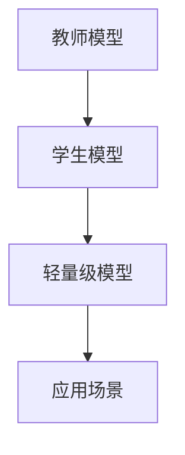
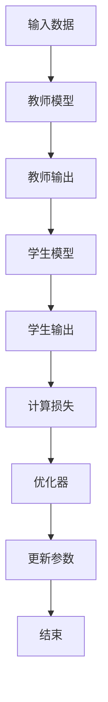
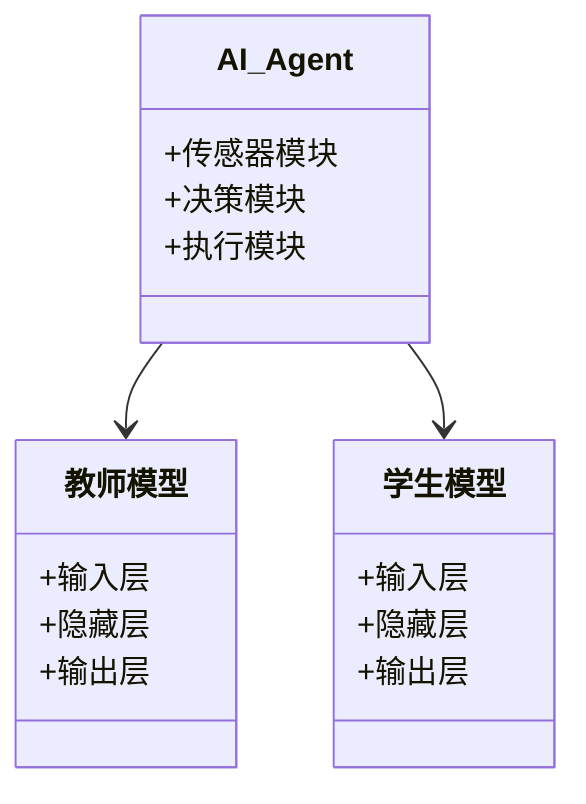
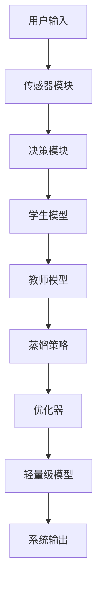
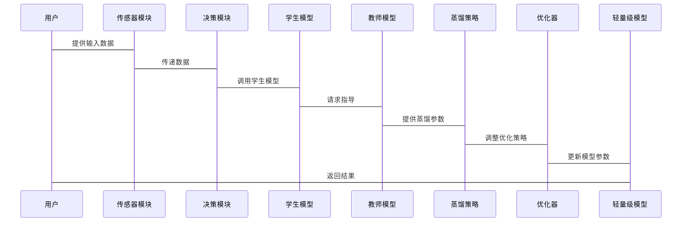

                 


# AI Agent的知识蒸馏：从大型LLM到轻量级模型

> 关键词：AI Agent，知识蒸馏，大型语言模型，轻量级模型，模型压缩，算法原理

> 摘要：本文深入探讨了AI Agent的知识蒸馏技术，从理论基础到实际应用，详细分析了如何通过知识蒸馏将大型LLM模型转换为轻量级模型。文章涵盖了知识蒸馏的核心概念、算法原理、系统架构设计以及项目实战，为读者提供了全面的技术指导。

---

# 第一部分: AI Agent的知识蒸馏概述

## 第1章: AI Agent与知识蒸馏的背景介绍

### 1.1 问题背景与问题描述
#### 1.1.1 大型LLM的局限性
- 计算资源需求高
- 响应速度慢
- 部署成本高

#### 1.1.2 轻量级模型的需求场景
- 移动端应用
- 实时交互
- 边缘计算

#### 1.1.3 知识蒸馏技术的提出
- 将大型模型的知识迁移到轻量级模型
- 减少计算资源消耗
- 提高部署灵活性

### 1.2 问题解决与边界外延
#### 1.2.1 知识蒸馏的核心目标
- 保持模型性能的同时减少模型大小
- 提高模型推理速度
- 降低部署成本

#### 1.2.2 技术边界与实现限制
- 仅适用于可解释性强的模型
- 需要教师模型的配合
- 蒸馏效果受数据质量影响

#### 1.2.3 应用场景的外延与扩展
- 从NLP扩展到其他领域
- 从单任务扩展到多任务
- 从静态模型扩展到动态模型

### 1.3 核心概念与组成要素
#### 1.3.1 AI Agent的基本构成
- 传感器模块
- 决策模块
- 执行模块

#### 1.3.2 知识蒸馏的关键要素
- 教师模型
- 学生模型
- 蒸馏策略

#### 1.3.3 模型压缩的技术路径
- 知识蒸馏
- 参数剪枝
- 模型量化

---

# 第二部分: 知识蒸馏的核心概念与原理

## 第2章: 知识蒸馏的核心概念与联系

### 2.1 核心概念原理
#### 2.1.1 知识蒸馏的定义与特点
- 定义：通过教师模型指导学生模型学习，实现知识的传递
- 特点：轻量化、高效性、可扩展性

#### 2.1.2 蒸馏过程中的信息传递机制
- 教师模型提供概率分布
- 学生模型模仿教师模型的输出
- 通过损失函数优化学生模型

#### 2.1.3 轻量级模型的构建逻辑
- 确定蒸馏目标
- 设计蒸馏策略
- 优化蒸馏过程

### 2.2 核心概念对比分析
#### 2.2.1 蒸馏与剪枝的对比
| 对比维度 | 蒸馏 | 剪枝 |
|----------|------|------|
| 技术目标 | 知识传递 | 参数优化 |
| 实现方式 | 调整概率分布 | 删除冗余参数 |
| 优缺点   | 保持模型性能，但需要教师模型 | 减少模型大小，但可能降低性能 |

#### 2.2.2 软蒸馏与硬蒸馏的对比
| 对比维度 | 软蒸馏 | 硬蒸馏 |
|----------|------|------|
| 输出形式 | 概率分布 | 类别标签 |
| 适用场景 | 连续性任务 | 分类任务 |
| 优势     | 更加灵活 | 更加简单 |

#### 2.2.3 模型压缩与知识蒸馏的联系
- 模型压缩是知识蒸馏的一种形式
- 知识蒸馏是模型压缩的重要组成部分
- 两者结合可以进一步优化模型性能

### 2.3 ER实体关系图


---

## 第3章: 知识蒸馏的算法原理

### 3.1 蒸馏算法的流程
#### 3.1.1 软蒸馏
- 教师模型输出概率分布
- 学生模型模仿教师模型的概率分布
- 通过交叉熵损失函数优化学生模型

#### 3.1.2 硬蒸馏
- 教师模型输出类别标签
- 学生模型预测类别标签
- 通过分类损失函数优化学生模型

#### 3.1.3 混合蒸馏
- 结合软蒸馏和硬蒸馏的优势
- 在训练过程中逐步调整蒸馏策略
- 提高模型的泛化能力

### 3.2 算法原理的数学模型
#### 软蒸馏的损失函数
$$L = -\sum_{i=1}^{n} [y_i \log p_i + (1-y_i) \log (1-p_i)]$$
其中，$y_i$ 是教师模型的输出概率，$p_i$ 是学生模型的输出概率。

#### 硬蒸馏的损失函数
$$L = \sum_{i=1}^{n} (y_i - p_i)^2$$

### 3.3 算法实现的Python代码示例
```python
import torch
import torch.nn as nn
import torch.optim as optim

# 定义教师模型和学生模型
class TeacherModel(nn.Module):
    def __init__(self):
        super(TeacherModel, self).__init__()
        self.fc = nn.Linear(10, 5, bias=False)
    
    def forward(self, x):
        return torch.softmax(x, dim=1)

class StudentModel(nn.Module):
    def __init__(self):
        super(StudentModel, self).__init__()
        self.fc = nn.Linear(10, 5, bias=False)
    
    def forward(self, x):
        return torch.log_softmax(x, dim=1)

# 定义蒸馏损失函数
def distillation_loss(teacher_logits, student_logits, temperature=2.0):
    teacher_probs = F.softmax(teacher_logits / temperature, dim=1)
    student_probs = F.log_softmax(student_logits, dim=1)
    return -(teacher_probs * student_probs).sum() / (teacher_probs.shape[0] * teacher_probs.shape[1])

# 初始化模型和优化器
teacher = TeacherModel()
student = StudentModel()
optimizer = optim.Adam(student.parameters(), lr=0.001)

# 训练过程
for epoch in range(100):
    optimizer.zero_grad()
    # 前向传播
    teacher_outputs = teacher(input_data)
    student_outputs = student(input_data)
    # 计算损失
    loss = distillation_loss(teacher_outputs, student_outputs)
    # 反向传播和优化
    loss.backward()
    optimizer.step()
```

### 3.4 算法实现的流程图


---

# 第三部分: 系统分析与架构设计

## 第4章: 系统架构设计

### 4.1 问题场景介绍
- AI Agent需要在资源受限的环境中运行
- 需要快速响应用户请求
- 需要支持多种任务和场景

### 4.2 项目介绍
- 项目目标：构建一个基于知识蒸馏的AI Agent系统
- 项目范围：从大型LLM到轻量级模型的转换
- 项目规模：包括教师模型、学生模型和蒸馏策略

### 4.3 系统功能设计
#### 4.3.1 领域模型


#### 4.3.2 系统架构设计


#### 4.3.3 系统交互设计


### 4.4 系统接口设计
- 输入接口：用户输入数据
- 输出接口：系统输出结果
- 内部接口：教师模型与学生模型之间的交互

---

## 第5章: 知识蒸馏的系统实现

### 5.1 项目实战
#### 5.1.1 环境安装
- 安装Python和相关库
- 安装PyTorch和Transformers库
- 安装Mermaid和相关工具

#### 5.1.2 系统核心实现
- 实现教师模型和学生模型
- 实现蒸馏算法
- 实现优化器和损失函数

#### 5.1.3 代码实现与解读
```python
import torch
import torch.nn as nn
import torch.optim as optim
from transformers import AutoTokenizer, AutoModelForMaskedLM

# 定义教师模型和学生模型
class TeacherModel(nn.Module):
    def __init__(self):
        super(TeacherModel, self).__init__()
        self.bert = AutoModelForMaskedLM.from_pretrained('bert-base-uncased')
    
    def forward(self, input_ids, attention_mask):
        return self.bert(input_ids, attention_mask).logits

class StudentModel(nn.Module):
    def __init__(self):
        super(StudentModel, self).__init__()
        self.bert = AutoModelForMaskedLM.from_pretrained('bert-base-uncased')
    
    def forward(self, input_ids, attention_mask):
        return self.bert(input_ids, attention_mask).logits

# 定义蒸馏损失函数
def distillation_loss(teacher_logits, student_logits, temperature=2.0):
    teacher_probs = F.softmax(teacher_logits / temperature, dim=-1)
    student_probs = F.softmax(student_logits, dim=-1)
    return -(teacher_probs * torch.log(student_probs)).sum() / (teacher_probs.shape[0] * teacher_probs.shape[1])

# 初始化模型和优化器
teacher = TeacherModel()
student = StudentModel()
optimizer = optim.Adam(student.parameters(), lr=0.001)

# 训练过程
for epoch in range(10):
    optimizer.zero_grad()
    input_ids = torch.randint(0, 30520, (16, 128))
    attention_mask = torch.ones((16, 128))
    teacher_outputs = teacher(input_ids, attention_mask)
    student_outputs = student(input_ids, attention_mask)
    loss = distillation_loss(teacher_outputs, student_outputs)
    loss.backward()
    optimizer.step()
```

#### 5.1.4 应用案例分析
- 案例：将BERT模型蒸馏为更小的模型
- 分析：蒸馏后的模型在保持性能的同时，模型大小减少，推理速度提高

### 5.2 系统优化与性能分析
- 系统优化策略
- 性能对比分析
- 模型压缩效果评估

### 5.3 项目小结
- 项目成果
- 经验总结
- 注意事项

---

# 第四部分: 总结与展望

## 第6章: 总结与展望

### 6.1 核心内容总结
- 知识蒸馏的核心概念
- 算法原理与实现
- 系统架构与设计

### 6.2 实践经验总结
- 项目实施的关键点
- 问题解决的策略
- 经验教训与启示

### 6.3 未来研究方向
- 更高效的蒸馏算法
- 更灵活的模型压缩技术
- 更广泛的应用场景

---

# 作者：AI天才研究院/AI Genius Institute & 禅与计算机程序设计艺术 /Zen And The Art of Computer Programming

---

通过本文，我们详细探讨了AI Agent的知识蒸馏技术，从理论到实践，为读者提供了全面的技术指导。希望本文能帮助读者更好地理解和应用知识蒸馏技术，为AI Agent的轻量化部署提供有力支持。

