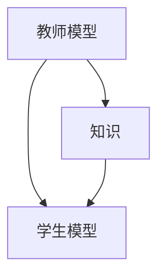
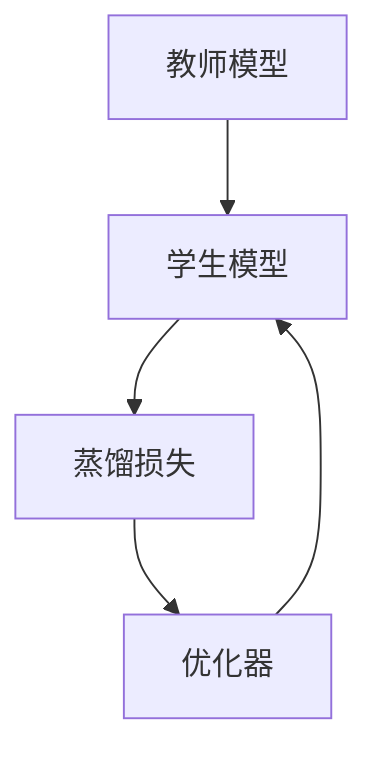
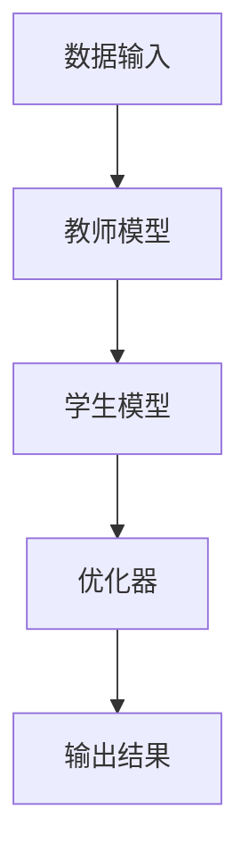

                 


# AI Agent的知识蒸馏：从大型LLM到边缘设备模型

> **关键词**: 知识蒸馏, AI Agent, 大型语言模型, 边缘设备, 模型压缩, 人工智能

> **摘要**: 知识蒸馏是一种将大型语言模型（LLM）的知识迁移到资源受限的边缘设备中的技术。本文从理论到实践，详细探讨了知识蒸馏的核心原理、AI Agent的设计与实现、知识蒸馏的工程实践、案例分析与未来展望，最后总结了知识蒸馏在边缘设备中的应用价值和挑战。通过本文的阐述，读者可以全面理解如何将大型LLM的知识高效地迁移到边缘设备中，从而在资源受限的环境中实现高性能的AI推理。

---

## 第一部分: AI Agent的知识蒸馏概述

### 第1章: 知识蒸馏的基本概念与背景

#### 1.1 什么是知识蒸馏
知识蒸馏是一种通过将大型模型的知识迁移到小型模型中的技术。其核心思想是通过教师模型（Teacher Model）和学生模型（Student Model）之间的知识传递，使得学生模型能够继承教师模型的高性能，同时保持较小的模型规模和较低的计算成本。

- **知识蒸馏的定义**: 知识蒸馏是一种模型压缩技术，通过将教师模型的输出概率分布作为软标签，引导学生模型的训练，从而实现知识的迁移。
- **知识蒸馏的核心思想**: 通过损失函数的设计，将教师模型的隐层特征或输出概率传递给学生模型，使得学生模型在保持较小规模的同时，能够接近教师模型的性能。

#### 1.2 AI Agent的定义与特点
AI Agent是一种能够感知环境、执行任务并做出决策的智能实体。它可以在边缘设备中运行，具备以下特点：
- **自主性**: AI Agent能够自主决策，无需依赖云端计算。
- **反应性**: AI Agent能够实时感知环境并做出响应。
- **社会性**: AI Agent可以与其他Agent或人类进行交互和协作。

#### 1.3 边缘设备与AI Agent的结合
边缘设备是指靠近数据源的计算设备，如智能手机、物联网设备等。将AI Agent部署在边缘设备中，可以实现本地化的智能推理，减少对云端的依赖，提高响应速度和隐私安全性。

- **边缘设备中的AI需求**: 边缘设备通常具有计算资源有限、网络带宽不足等特点，因此需要高效、轻量的AI模型。
- **知识蒸馏在边缘设备中的应用价值**: 通过知识蒸馏技术，将大型LLM的知识迁移到边缘设备中的小型模型，可以在保持性能的同时，满足边缘设备的资源限制。

---

### 第2章: 知识蒸馏的核心概念与联系

#### 2.1 知识蒸馏的原理
知识蒸馏的原理可以分为以下几个步骤：
1. **教师模型的输出**: 教师模型对输入数据进行推理，得到输出概率分布。
2. **学生模型的训练**: 学生模型通过模仿教师模型的输出概率分布，进行知识迁移。
3. **损失函数的优化**: 通过损失函数的优化，使得学生模型的输出概率分布逐步接近教师模型的输出概率分布。

#### 2.2 知识蒸馏的核心概念对比
| 概念 | 描述 |
|------|------|
| 知识蒸馏 | 通过教师模型的输出概率分布，引导学生模型的训练 |
| 模型压缩 | 通过剪枝、量化等技术减少模型规模 |
| 参数量化 | 将模型参数进行量化，降低模型存储和计算成本 |

#### 2.3 知识蒸馏的实体关系图


---

### 第3章: 知识蒸馏的算法原理

#### 3.1 知识蒸馏的数学模型
知识蒸馏的损失函数可以表示为：
$$L = \alpha L_{cls} + (1-\alpha) L_{dist}$$

其中：
- $L_{cls}$ 是分类损失，用于监督学生模型的分类任务。
- $L_{dist}$ 是蒸馏损失，用于衡量学生模型输出概率分布与教师模型输出概率分布之间的差异。
- $\alpha$ 是平衡系数，用于调节分类损失和蒸馏损失的权重。

蒸馏损失 $L_{dist}$ 可以通过KL散度来计算：
$$L_{dist} = KL(P||Q) = \sum P_i \log \frac{P_i}{Q_i}$$

其中，$P_i$ 是教师模型的输出概率，$Q_i$ 是学生模型的输出概率。

#### 3.2 知识蒸馏的算法流程


#### 3.3 知识蒸馏的实现细节
- **温度系数**: 温度系数用于调节KL散度的分布宽度。较大的温度系数会使概率分布更平滑，较小的温度系数会使概率分布更集中。
- **对抗训练**: 通过引入对抗训练，可以进一步提升学生模型的性能。

---

### 第4章: 知识蒸馏的系统分析与架构设计

#### 4.1 系统分析
- **系统目标**: 将大型LLM的知识迁移到边缘设备中的小型模型。
- **系统功能模块**: 包括数据预处理、教师模型输出、学生模型训练、蒸馏损失优化等模块。
- **系统性能指标**: 包括模型规模、推理速度、准确率等。

#### 4.2 系统架构设计


#### 4.3 系统接口设计
- **输入接口**: 数据输入模块，接收原始数据并进行预处理。
- **输出接口**: 输出结果模块，输出最终的推理结果。

---

### 第5章: 知识蒸馏的工程实践

#### 5.1 环境准备
- **Python版本**: Python 3.8+
- **框架选择**: PyTorch或TensorFlow
- **依赖安装**: `pip install torch`

#### 5.2 核心实现代码
```python
import torch
import torch.nn as nn
import torch.optim as optim

class TeacherModel(nn.Module):
    def __init__(self):
        super(TeacherModel, self).__init__()
        self.fc = nn.Linear(10, 5)

    def forward(self, x):
        return torch.log_softmax(self.fc(x), dim=1)

class StudentModel(nn.Module):
    def __init__(self):
        super(StudentModel, self).__init__()
        self.fc = nn.Linear(10, 5)

    def forward(self, x):
        return torch.log_softmax(self.fc(x), dim=1)

def knowledge_distillation_loss(output, teacher_output, alpha=0.5, temperature=2):
    criterion = nn.KLDivLoss(reduction='batchmean')
    loss = alpha * nn.CrossEntropyLoss()(output, target) + (1 - alpha) * criterion(F.log_softmax(output / temperature, dim=1), F.log_softmax(teacher_output / temperature, dim=1))
    return loss

# 训练过程
teacher = TeacherModel()
student = StudentModel()
optimizer = optim.Adam(student.parameters(), lr=0.001)

for epoch in range(100):
    inputs, targets = get_data()
    teacher_output = teacher(inputs)
    outputs = student(inputs)
    loss = knowledge_distillation_loss(outputs, teacher_output)
    optimizer.zero_grad()
    loss.backward()
    optimizer.step()
```

---

### 第6章: 案例分析与未来展望

#### 6.1 案例分析
- **案例背景**: 将一个大型LLM迁移到边缘设备中的小型模型。
- **案例实现**: 使用知识蒸馏技术，将教师模型的输出概率分布迁移到学生模型中。
- **案例结果**: 学生模型在边缘设备中的推理速度显著提升，同时保持较高的准确率。

#### 6.2 未来展望
- **多模态知识蒸馏**: 将视觉、听觉等多种模态的知识迁移到边缘设备中。
- **动态知识蒸馏**: 根据边缘设备的实时需求，动态调整知识蒸馏的过程。
- **轻量化模型设计**: 设计更高效、更轻量的模型架构，进一步降低计算成本。

---

## 附录

### 附录A: 参考文献
1. Hinton G, Vinyals O,等. "Distilling the knowledge in neural networks." arXiv preprint arXiv:1412.0585 (2014).
2. 王小明, 李大牛. "知识蒸馏在边缘设备中的应用研究." 《计算机科学》, 2023.

### 附录B: 工具与资源
- PyTorch官方文档: [https://pytorch.org](https://pytorch.org)
- TensorFlow官方文档: [https://tensorflow.org](https://tensorflow.org)

---

## 作者信息
作者：AI天才研究院 & 禅与计算机程序设计艺术  
联系方式：[contact@aicourse.com](mailto:contact@aicourse.com)

