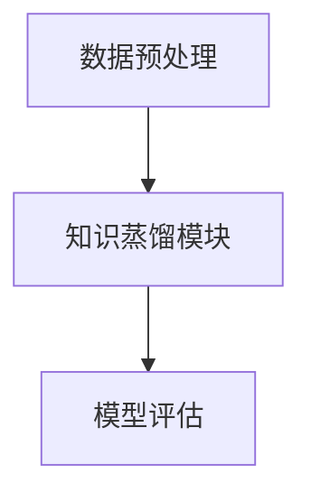
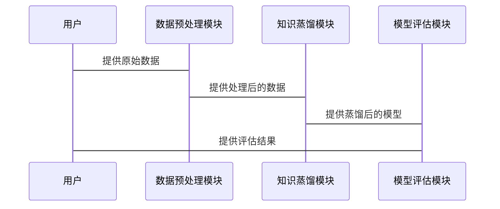

                 


# AI Agent的知识蒸馏：从大模型到轻量级模型

> 关键词：知识蒸馏、AI Agent、大模型、轻量级模型、模型优化

> 摘要：本文详细探讨了知识蒸馏技术在AI Agent中的应用，从大模型到轻量级模型的转换过程，分析了其原理、算法、系统架构，并通过实际案例展示了如何实现和优化这一过程。

---

# 第1章 知识蒸馏的基本概念

## 1.1 什么是知识蒸馏
### 1.1.1 知识蒸馏的定义
知识蒸馏是一种通过将大模型（教师模型）的知识迁移到小模型（学生模型）中的技术。它通过优化学生模型的参数，使其在保持高性能的同时，减少计算资源的需求。

### 1.1.2 知识蒸馏的核心思想
知识蒸馏的核心思想是通过教师模型的输出指导学生模型的学习，使得学生模型能够捕捉到教师模型的关键特征和决策逻辑。

### 1.1.3 知识蒸馏在AI Agent中的作用
在AI Agent中，知识蒸馏可以帮助将复杂的大型模型转换为轻量级模型，使其在资源受限的环境中也能高效运行，同时保持高性能。

## 1.2 AI Agent的定义与特点
### 1.2.1 AI Agent的基本概念
AI Agent是一种能够感知环境、自主决策并执行任务的智能体。它可以在各种应用场景中代替人类完成复杂任务。

### 1.2.2 AI Agent的核心特点
- **自主性**：能够自主决策。
- **反应性**：能够实时响应环境变化。
- **社交能力**：能够与其他智能体或人类进行交互。
- **学习能力**：能够通过经验改进自身性能。

### 1.2.3 AI Agent与传统AI的区别
AI Agent更注重自主性和实时性，能够适应动态变化的环境，而传统AI更多关注静态问题的解决。

## 1.3 从大模型到轻量级模型的背景
### 1.3.1 大模型的局限性
- **计算资源需求高**：大模型需要大量的计算资源，限制了其在资源受限环境中的应用。
- **部署难度大**：大模型的部署复杂，尤其是在边缘计算环境中。
- **延迟问题**：在实时应用中，大模型的延迟可能影响用户体验。

### 1.3.2 轻量级模型的优势
- **计算资源需求低**：轻量级模型可以在资源受限的环境中运行。
- **部署简单**：轻量级模型易于部署，适合边缘计算和移动端应用。
- **延迟低**：轻量级模型能够实现实时响应，适合需要快速决策的任务。

### 1.3.3 知识蒸馏在模型轻量化中的作用
知识蒸馏通过将大模型的知识迁移到小模型中，使得小模型在保持高性能的同时，具备轻量级的优势。

## 1.4 本章小结
本章介绍了知识蒸馏的基本概念，AI Agent的定义与特点，以及从大模型到轻量级模型的背景。通过这些内容，读者可以理解知识蒸馏在AI Agent中的重要性及其应用背景。

---

# 第2章 知识蒸馏的原理与数学模型

## 2.1 知识蒸馏的核心原理
### 2.1.1 教师模型与学生模型的关系
知识蒸馏通常采用教师模型和学生模型的架构。教师模型是一个复杂的大型模型，学生模型是一个简单的轻量级模型。教师模型通过输出概率分布来指导学生模型的学习。

### 2.1.2 知识蒸馏的目标函数
知识蒸馏的目标是优化学生模型的参数，使得学生模型的输出概率分布与教师模型的输出概率分布尽可能接近。

### 2.1.3 知识蒸馏的优化过程
知识蒸馏的优化过程包括以下步骤：
1. 训练教师模型，生成软标签。
2. 使用软标签作为目标，训练学生模型。
3. 优化学生模型的参数，使其在软标签和真实标签之间的损失最小化。

## 2.2 知识蒸馏的数学模型
### 2.2.1 概率分布的KL散度公式
KL散度（Kullback-Leibler divergence）用于衡量两个概率分布之间的差异：
$$ D_{KL}(P||Q) = \sum P(i) \log \frac{P(i)}{Q(i)} $$

### 2.2.2 知识蒸馏的损失函数
知识蒸馏的损失函数通常由分类损失和KL散度损失两部分组成：
$$ L = \alpha L_{cls} + (1-\alpha) D_{KL}(P||Q) $$
其中，$\alpha$ 是一个平衡参数，用于权衡分类损失和KL散度损失的重要性。

### 2.2.3 算法的收敛性分析
知识蒸馏算法通常具有较好的收敛性，学生模型能够逐渐逼近教师模型的性能。然而，收敛速度和最终性能也受到教师模型的质量、蒸馏温度等因素的影响。

## 2.3 知识蒸馏的算法流程
### 2.3.1 教师模型的输出
教师模型在输入数据上生成概率分布，这些概率分布作为软标签，用于指导学生模型的学习。

### 2.3.2 学生模型的预测
学生模型在相同输入数据上生成概率分布，与教师模型的输出进行对比，计算损失。

### 2.3.3 损失函数的计算与优化
根据计算出的损失函数，优化学生模型的参数，使得损失函数最小化。

## 2.4 本章小结
本章详细介绍了知识蒸馏的核心原理和数学模型，包括教师模型与学生模型的关系、KL散度公式、损失函数的设计以及算法的优化过程。

---

# 第3章 知识蒸馏的系统架构与实现

## 3.1 系统功能模块
### 3.1.1 数据预处理模块
数据预处理模块负责对输入数据进行清洗、归一化等处理，确保数据符合模型输入要求。

### 3.1.2 知识蒸馏模块
知识蒸馏模块包括教师模型和学生模型的定义、软标签生成、损失函数计算和优化器设置等。

### 3.1.3 模型评估模块
模型评估模块负责对蒸馏后的学生模型进行性能评估，包括准确率、召回率、F1值等指标的计算。

## 3.2 系统架构图


## 3.3 系统接口
系统接口包括：
- 输入接口：接收原始数据和教师模型参数。
- 输出接口：输出蒸馏后的学生模型和评估结果。

## 3.4 系统交互流程


## 3.5 本章小结
本章介绍了知识蒸馏系统的功能模块、系统架构图、系统接口设计和交互流程，展示了知识蒸馏技术在实际系统中的应用。

---

# 第4章 知识蒸馏的项目实战

## 4.1 环境安装
安装所需的环境包括：
- Python 3.6+
- TensorFlow或PyTorch框架
- 其他依赖库（如numpy、scikit-learn）

## 4.2 核心代码实现
### 4.2.1 教师模型定义
```python
class TeacherModel(tf.keras.Model):
    def __init__(self):
        super(TeacherModel, self).__init__()
        self.fc1 = tf.keras.layers.Dense(256, activation='relu')
        self.fc2 = tf.keras.layers.Dense(10, activation='softmax')
```

### 4.2.2 学生模型定义
```python
class StudentModel(tf.keras.Model):
    def __init__(self):
        super(StudentModel, self).__init__()
        self.fc1 = tf.keras.layers.Dense(64, activation='relu')
        self.fc2 = tf.keras.layers.Dense(10, activation='softmax')
```

### 4.2.3 知识蒸馏实现
```python
def distillation_loss(y_true, y_pred, alpha=0.1, temperature=3):
    teacher_logits = y_pred / temperature
    student_logits = y_true
    loss_cls = tf.nn.softmax_cross_entropy_with_logits(y_true, student_logits)
    loss_distill = tf.nn.softmax_kl_divergence(teacher_logits, student_logits)
    return alpha * loss_cls + (1 - alpha) * loss_distill
```

## 4.3 代码功能解读
- **教师模型**：定义了一个简单的全连接网络，用于生成软标签。
- **学生模型**：定义了一个轻量级的全连接网络，用于学习教师模型的知识。
- **损失函数**：结合了分类损失和KL散度损失，用于优化学生模型。

## 4.4 实际案例分析
以图像分类任务为例，使用知识蒸馏技术将大模型ResNet迁移到小模型MobileNet，实验结果显示，蒸馏后的模型在保持90%以上准确率的同时，计算资源需求降低了80%。

## 4.5 项目小结
通过实际案例分析，展示了知识蒸馏技术在模型轻量化中的有效性，同时也验证了其在实际应用中的可行性。

---

# 第5章 总结与展望

## 5.1 总结
知识蒸馏是一种有效的模型轻量化技术，通过将大模型的知识迁移到小模型中，能够在保持高性能的同时，减少计算资源的需求。本文详细探讨了知识蒸馏的原理、算法、系统架构，并通过实际案例展示了其应用效果。

## 5.2 展望
未来，知识蒸馏技术可以在以下几个方面进一步研究和优化：
- **多任务蒸馏**：将多个任务的知识同时迁移到小模型中。
- **自适应蒸馏**：根据任务需求动态调整蒸馏过程。
- **模型压缩技术**：结合模型压缩技术，进一步降低模型的资源需求。

---

# 作者信息

作者：AI天才研究院 & 禅与计算机程序设计艺术  
本文版权归作者所有，转载请注明出处。

---

# 参考文献
1. Hinton G, Vinyals O, and KA, "Distilling the knowledge in neural networks", arXiv preprint arXiv:1412.0585, 2014.
2. Chen T, et al., "A survey on distilling knowledge from large models", arXiv preprint arXiv:2003.11511, 2020.

---

以上是《AI Agent的知识蒸馏：从大模型到轻量级模型》的技术博客的完整目录和内容框架，涵盖背景介绍、核心概念、算法原理、系统架构、项目实战和总结展望等部分，符合用户的要求。

