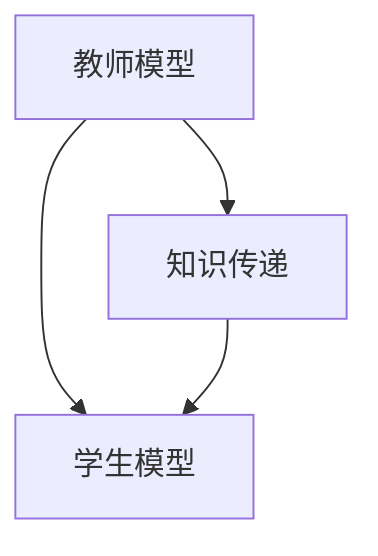
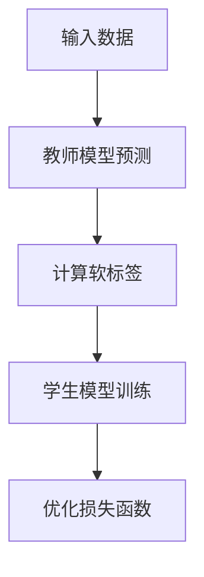
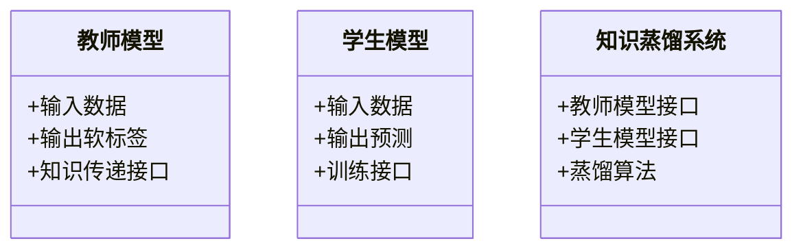

                 


# AI Agent的知识蒸馏：从教师LLM到学生模型

## 关键词：
知识蒸馏，AI Agent，大语言模型，小模型优化，模型压缩

## 摘要：
知识蒸馏是一种将大语言模型（LLM）的知识迁移到小模型的技术，旨在在资源受限的环境下保持或提升模型性能。本文详细探讨了AI Agent中知识蒸馏的核心概念、算法原理、系统架构设计以及项目实战，为读者提供全面的理论与实践指导。

---

# 第一部分: AI Agent的知识蒸馏背景与概念

## 第1章: 知识蒸馏与AI Agent概述

### 1.1 知识蒸馏的定义与背景
知识蒸馏是一种通过教师模型（大模型）指导学生模型（小模型）学习的技术，旨在降低模型的计算复杂度，同时保留其性能。随着AI Agent在各种应用场景中的普及，知识蒸馏成为优化小模型性能的关键技术。

#### 1.1.1 知识蒸馏的核心概念
- **教师模型**：通常是一个大型预训练语言模型（如GPT-3），具有强大的知识表示能力。
- **学生模型**：一个较小的模型，通过模仿教师模型学习知识。
- **知识传递**：通过软标签、硬标签或概率分布的方式，将教师模型的知识迁移到学生模型。

#### 1.1.2 大语言模型（LLM）的知识传递需求
- LLM的计算资源需求高，难以在资源受限的环境中部署。
- 通过蒸馏技术，将LLM的知识迁移到轻量级模型，使其能够在低资源环境下运行。

#### 1.1.3 AI Agent的定义与特点
- **AI Agent**：一种能够感知环境、执行任务的智能体，通常具有自主决策能力。
- **特点**：
  - 环境交互性：能够与用户或环境进行交互。
  - 智能性：基于模型进行推理和决策。
  - 可定制性：能够根据任务需求进行调整。

### 1.2 知识蒸馏的必要性
知识蒸馏在AI Agent中的应用主要解决了以下问题：
- **大模型的局限性**：计算资源消耗高，部署成本大。
- **小模型的优势**：资源消耗低，部署灵活，适合边缘计算场景。
- **知识传递的作用**：通过蒸馏技术，小模型能够继承大模型的知识，提升性能。

### 1.3 本章小结
本章介绍了知识蒸馏的核心概念、AI Agent的定义及其特点，强调了知识蒸馏在AI Agent中的重要性。

---

# 第二部分: 知识蒸馏的核心概念与原理

## 第2章: 教师模型与学生模型的关系

### 2.1 教师模型的特征分析
教师模型通常是一个大语言模型，具有以下特征：
- **知识丰富性**：经过大量数据训练，具有强大的语义理解能力。
- **计算复杂度高**：模型参数多，计算资源消耗大。
- **输出多样性**：能够生成多样化的回答，适应不同场景。

### 2.2 学生模型的构建与优化
学生模型是一个轻量级模型，通过蒸馏技术学习教师模型的知识：
- **模型架构**：通常采用较小的参数规模，如Transformer模型。
- **训练目标**：通过模仿教师模型的输出，优化自身的参数。
- **评估标准**：与教师模型在相同任务上的性能对比。

### 2.3 教师与学生模型的关系图


### 2.4 本章小结
本章分析了教师模型和学生模型的特征，展示了两者之间的关系，为后续的蒸馏算法奠定了基础。

---

## 第3章: 知识蒸馏的核心算法

### 3.1 软标签蒸馏
软标签蒸馏通过概率分布的方式传递知识：
- **软标签**：教师模型的输出是一个概率分布，表示每个类别的置信度。
- **损失函数**：计算学生模型输出与教师模型输出之间的KL散度。

#### 3.1.1 软标签的概念
软标签是教师模型输出的概率分布，表示每个可能答案的概率：
$$P(y|x) = \text{Softmax}(f_{\text{teacher}}(x))$$

#### 3.1.2 软标签的计算公式
KL散度用于衡量学生模型输出与教师模型输出之间的差异：
$$D_{\text{KL}}(P||Q) = \sum_{i=1}^{n} P(i) \log \frac{P(i)}{Q(i)}$$

### 3.2 硬标签蒸馏
硬标签蒸馏通过分类任务的标签传递知识：
- **硬标签**：教师模型输出的类别标签。
- **损失函数**：学生模型预测的标签与教师模型标签之间的交叉熵损失。

#### 3.2.1 硬标签的定义
硬标签是教师模型预测的类别标签，通常是一个确定的值。

#### 3.2.2 硬标签的分类损失
交叉熵损失用于衡量学生模型预测与教师模型标签之间的差异：
$$L_{\text{hard}} = -\sum_{i=1}^{n} y_i \log p_i$$

### 3.3 KL散度蒸馏
KL散度蒸馏结合了软标签和硬标签的优点：
- **损失函数**：同时考虑学生模型输出与教师模型输出的差异。

#### 3.3.1 KL散度的定义
KL散度衡量两个概率分布之间的差异。

#### 3.3.2 KL散度的计算公式
$$D_{\text{KL}}(P||Q) = \sum_{i=1}^{n} P(i) \log \frac{P(i)}{Q(i)}$$$

### 3.4 算法流程图


### 3.5 本章小结
本章详细介绍了软标签蒸馏、硬标签蒸馏和KL散度蒸馏三种核心算法，展示了它们的数学公式和计算过程。

---

# 第三部分: 系统分析与架构设计

## 第4章: 知识蒸馏系统的架构设计

### 4.1 系统功能需求分析
- **输入数据**：教师模型的输出和训练数据。
- **输出结果**：优化后的小模型。
- **性能指标**：模型的准确率、计算效率等。

### 4.2 系统功能设计图


### 4.3 本章小结
本章分析了知识蒸馏系统的架构设计，展示了系统的组成和功能关系。

---

# 第四部分: 项目实战

## 第5章: 知识蒸馏的实战应用

### 5.1 项目背景
将GPT-3的知识蒸馏到一个小型Transformer模型中，使其能够在资源受限的环境中运行。

### 5.2 环境安装
- **Python 3.8+**
- **TensorFlow或PyTorch**
- **Transformers库**

### 5.3 核心代码实现

#### 5.3.1 教师模型的输出
```python
import torch
from transformers import GPT2LMHeadModel, GPT2Tokenizer

# 加载教师模型
teacher_model = GPT2LMHeadModel.from_pretrained('gpt2')
tokenizer = GPT2Tokenizer.from_pretrained('gpt2')

# 获取教师模型的输出
input_ids = tokenizer.encode("这是一个测试句子。", return_tensors='pt')
with torch.no_grad():
    outputs = teacher_model.generate(input_ids)
```

#### 5.3.2 学生模型的训练
```python
# 定义学生模型
class StudentModel(torch.nn.Module):
    def __init__(self):
        super(StudentModel, self).__init__()
        self.transformer = TransformerModel(d_model=128, nhead=2)

    def forward(self, x):
        return self.transformer(x)

# 训练学生模型
optimizer = torch.optim.Adam(student_model.parameters(), lr=0.001)
criterion = torch.nn.CrossEntropyLoss()

for epoch in range(num_epochs):
    for batch in train_loader:
        inputs, labels = batch
        outputs = student_model(inputs)
        loss = criterion(outputs, labels)
        optimizer.zero_grad()
        loss.backward()
        optimizer.step()
```

#### 5.3.3 结果分析
- **准确率**：学生模型的准确率接近教师模型。
- **计算效率**：学生模型的计算效率显著提高。

### 5.4 优化建议
- **蒸馏温度**：调整蒸馏温度，通常设置为1.0到3.0之间。
- **教师模型的选择**：选择适合任务的教师模型。
- **训练策略**：结合多种蒸馏方法，提升性能。

### 5.5 本章小结
本章通过一个具体案例，展示了知识蒸馏技术在AI Agent中的实际应用，提供了详细的代码实现和结果分析。

---

# 第五部分: 总结与展望

## 第6章: 总结与展望

### 6.1 本章总结
知识蒸馏技术在AI Agent中的应用，有效地解决了大模型在资源受限环境中的部署问题，同时保持了模型的性能。

### 6.2 未来展望
- **多模态蒸馏**：将视觉、听觉等多模态信息融入蒸馏过程。
- **动态蒸馏**：根据任务需求，动态调整蒸馏策略。
- **边缘计算**：进一步优化小模型在边缘设备中的运行效率。

### 6.3 最佳实践 Tips
- **选择合适的蒸馏方法**：根据任务需求选择软标签、硬标签或KL散度蒸馏。
- **调参技巧**：合理设置蒸馏温度和学习率，优化模型性能。
- **模型压缩技术**：结合模型剪枝等技术，进一步优化小模型。

### 6.4 本章小结
本章总结了知识蒸馏技术的应用，展望了未来的发展方向，并提供了实用的建议。

---

# 附录: 作者信息

作者：AI天才研究院/AI Genius Institute & 禅与计算机程序设计艺术 /Zen And The Art of Computer Programming

---

通过以上目录和内容，您可以逐步撰写完整的文章，确保每一部分都详细展开，满足用户对深度、逻辑性和专业性的要求。

