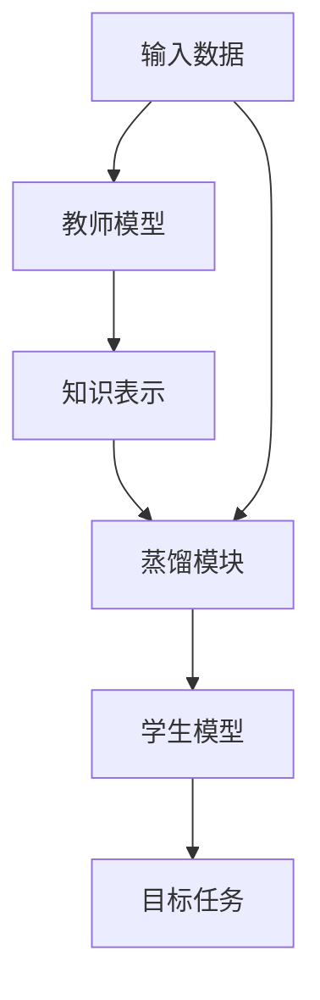
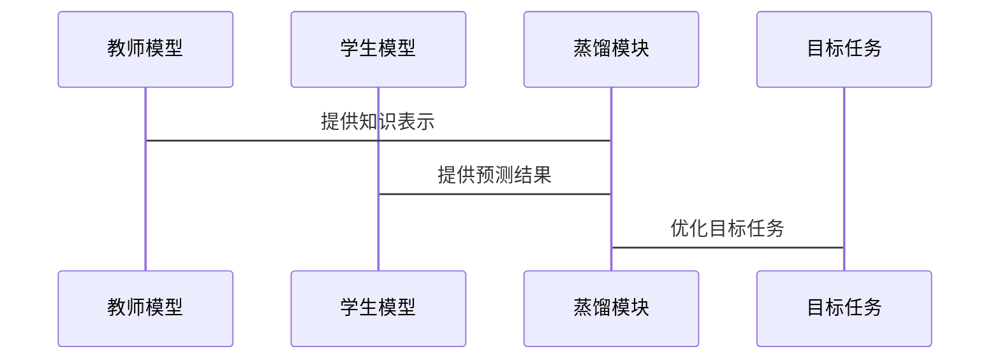

                 


# AI Agent的知识蒸馏：从集成LLM到轻量级模型

## 关键词：
- AI Agent
- 知识蒸馏
- 大语言模型（LLM）
- 轻量级模型
- 模型压缩
- 机器学习

## 摘要：
本文深入探讨了AI Agent的知识蒸馏技术，从集成大语言模型（LLM）到轻量级模型的优化过程。通过分析知识蒸馏的核心原理、算法实现、系统架构以及实际项目案例，本文为读者提供了一套从理论到实践的知识蒸馏解决方案。文章首先介绍了AI Agent的基本概念和知识蒸馏的背景，接着详细讲解了知识蒸馏的核心原理和主要方法，随后通过具体的算法实现和系统设计展示了如何将知识蒸馏应用于轻量级模型的构建中。最后，通过实际项目案例分析，验证了知识蒸馏技术的有效性和优势，为未来的AI Agent开发提供了有益的参考和指导。

---

## 第一部分：AI Agent的知识蒸馏背景与基础

### 第1章：AI Agent与知识蒸馏概述

#### 1.1 AI Agent的基本概念
##### 1.1.1 AI Agent的定义与特点
AI Agent（人工智能代理）是指能够感知环境、自主决策并执行任务的智能实体。其特点包括：
- **自主性**：能够在没有外部干预的情况下独立运行。
- **反应性**：能够实时感知环境并做出响应。
- **目标导向性**：基于目标或任务驱动行为。
- **学习能力**：通过数据和经验不断优化自身性能。

##### 1.1.2 AI Agent的分类与应用场景
AI Agent可以根据智能水平分为以下几类：
- **反应式AI Agent**：基于当前感知做出反应，适用于实时任务。
- **认知式AI Agent**：具有复杂推理和规划能力，适用于复杂任务。
- **混合式AI Agent**：结合反应式和认知式特点，适用于复杂动态环境。

AI Agent的应用场景包括：
- **智能助手**：如虚拟助手、聊天机器人。
- **自动驾驶**：用于车辆的环境感知和决策。
- **智能推荐系统**：用于个性化内容推荐。

##### 1.1.3 知识蒸馏的定义与背景
知识蒸馏是一种将复杂模型的知识迁移到简单模型的技术。其背景在于：
- 大语言模型（LLM）虽然性能强大，但计算资源消耗高，难以在资源受限的场景中部署。
- 通过知识蒸馏，可以将LLM的知识迁移到轻量级模型，实现性能与资源的平衡。

#### 1.2 知识蒸馏的核心概念
##### 1.2.1 知识蒸馏的原理与机制
知识蒸馏的原理是通过教师模型（Teacher）和学生模型（Student）的交互，将教师模型的知识迁移到学生模型。其机制包括：
- **知识表示**：教师模型将知识以概率分布的形式输出。
- **蒸馏过程**：学生模型通过优化与教师模型的概率分布差异，学习教师模型的知识。
- **损失函数**：通常使用KL散度或交叉熵损失函数来衡量学生模型与教师模型的差异。

##### 1.2.2 知识蒸馏的关键技术与方法
知识蒸馏的关键技术包括：
- **软标签蒸馏**：通过概率分布进行知识迁移。
- **硬标签蒸馏**：通过类别标签进行知识迁移。
- **混合蒸馏**：结合软标签和硬标签进行知识迁移。

##### 1.2.3 知识蒸馏的目标与优势
知识蒸馏的目标是将教师模型的知识迁移到学生模型，使其在性能、速度和资源消耗上达到最佳平衡。其优势包括：
- **性能优化**：学生模型在保持高性能的同时，计算资源消耗更低。
- **适用性增强**：适用于资源受限的场景，如移动设备、边缘计算等。
- **模型可解释性**：轻量级模型通常具有更好的可解释性。

#### 1.3 知识蒸馏在AI Agent中的应用
##### 1.3.1 AI Agent中的知识表示与传递
知识蒸馏在AI Agent中的应用主要体现在：
- **知识表示**：通过概率分布或特征向量表示知识。
- **知识传递**：通过蒸馏过程将知识从教师模型传递到学生模型。

##### 1.3.2 知识蒸馏在AI Agent中的作用
知识蒸馏在AI Agent中的作用包括：
- **提升决策效率**：通过轻量级模型实现快速决策。
- **降低计算成本**：减少对高性能计算资源的依赖。
- **增强鲁棒性**：通过多模型协作提升系统的稳定性和可靠性。

##### 1.3.3 知识蒸馏的挑战与解决方案
知识蒸馏的挑战包括：
- **知识损失**：从教师模型到学生模型的过程中，部分知识可能无法完全迁移。
- **模型选择**：选择合适的教师模型和学生模型对蒸馏效果至关重要。
- **数据需求**：需要大量标注数据支持蒸馏过程。

解决方案包括：
- **多阶段蒸馏**：通过多个阶段逐步优化蒸馏效果。
- **自适应蒸馏**：根据任务需求动态调整蒸馏参数。
- **混合模型架构**：结合多种模型架构设计，提升蒸馏效果。

---

## 第二部分：知识蒸馏的核心原理与方法

### 第2章：知识蒸馏的核心原理

#### 2.1 知识蒸馏的基本原理
##### 2.1.1 知识蒸馏的数学模型
知识蒸馏的数学模型通常基于概率分布的相似性。假设教师模型的输出概率分布为 $P_{\text{teacher}}(y|x)$，学生模型的输出概率分布为 $P_{\text{student}}(y|x)$。蒸馏的目标是使 $P_{\text{student}}(y|x)$ 接近 $P_{\text{teacher}}(y|x)$，通常通过优化以下损失函数实现：

$$
\mathcal{L}_{\text{distill}} = -\sum_{y} P_{\text{teacher}}(y|x) \log P_{\text{student}}(y|x)
$$

##### 2.1.2 知识蒸馏的实现步骤
知识蒸馏的实现步骤包括：
1. **教师模型训练**：训练一个高性能的教师模型。
2. **学生模型初始化**：初始化一个轻量级的学生模型。
3. **蒸馏过程**：通过优化损失函数，将教师模型的知识迁移到学生模型。
4. **微调**：在目标任务上对学生模型进行微调，提升其任务适应性。

##### 2.1.3 知识蒸馏的关键参数与优化方法
关键参数包括：
- **温度（Temperature）**：用于调节概率分布的平滑程度。
- **权重系数（Weight）**：用于平衡蒸馏损失和其他任务损失。

优化方法包括：
- **调整温度**：通过动态调整温度参数，控制概率分布的平滑程度。
- **多任务学习**：结合蒸馏损失和其他任务损失，实现多目标优化。

#### 2.2 知识蒸馏的主要方法
##### 2.2.1 基于教师模型的知识蒸馏
基于教师模型的知识蒸馏方法包括：
- **软标签蒸馏**：通过概率分布进行知识迁移。
- **硬标签蒸馏**：通过类别标签进行知识迁移。

##### 2.2.2 基于学生模型的知识蒸馏
基于学生模型的知识蒸馏方法包括：
- **自适应蒸馏**：根据学生模型的特性动态调整蒸馏过程。
- **混合蒸馏**：结合软标签和硬标签进行知识迁移。

##### 2.2.3 混合式知识蒸馏方法
混合式知识蒸馏方法结合了教师模型和学生模型的特点，通过多阶段优化实现知识的高效迁移。

#### 2.3 知识蒸馏的流程与步骤
知识蒸馏的流程包括：
1. **数据准备**：收集和标注训练数据。
2. **教师模型训练**：训练一个高性能的教师模型。
3. **学生模型初始化**：初始化一个轻量级的学生模型。
4. **蒸馏过程**：通过优化损失函数，将教师模型的知识迁移到学生模型。
5. **微调与优化**：在目标任务上对学生模型进行微调，提升其任务适应性。

---

### 第3章：知识蒸馏的算法实现与优化

#### 3.1 知识蒸馏算法的实现
##### 3.1.1 软标签蒸馏算法实现
软标签蒸馏的实现步骤如下：
1. **教师模型输出**：教师模型对输入样本生成概率分布 $P_{\text{teacher}}(y|x)$。
2. **学生模型输出**：学生模型对输入样本生成概率分布 $P_{\text{student}}(y|x)$。
3. **损失计算**：计算蒸馏损失 $\mathcal{L}_{\text{distill}}$。
4. **反向传播与优化**：通过反向传播优化学生模型参数。

##### 3.1.2 硬标签蒸馏算法实现
硬标签蒸馏的实现步骤如下：
1. **教师模型预测**：教师模型对输入样本生成类别标签 $y_{\text{teacher}}$。
2. **学生模型预测**：学生模型对输入样本生成类别标签 $y_{\text{student}}$。
3. **损失计算**：计算交叉熵损失 $\mathcal{L}_{\text{ce}}$。
4. **反向传播与优化**：通过反向传播优化学生模型参数。

##### 3.1.3 混合蒸馏算法实现
混合蒸馏的实现步骤如下：
1. **软标签蒸馏**：计算软标签蒸馏损失。
2. **硬标签蒸馏**：计算硬标签蒸馏损失。
3. **总损失计算**：将软标签和硬标签损失按一定权重组合。
4. **反向传播与优化**：通过反向传播优化学生模型参数。

#### 3.2 知识蒸馏的优化方法
##### 3.2.1 温度调整优化
温度调整优化通过动态调整温度参数，控制概率分布的平滑程度。具体实现如下：
1. **初始化温度**：设置初始温度值 $T_0$。
2. **计算概率分布**：通过 Softmax 函数生成概率分布。
3. **调整温度**：根据优化目标动态调整温度 $T$。

##### 3.2.2 多任务学习优化
多任务学习优化通过结合蒸馏损失和其他任务损失，实现多目标优化。具体实现如下：
1. **定义多任务损失**：包括蒸馏损失 $\mathcal{L}_{\text{distill}}$ 和任务损失 $\mathcal{L}_{\text{task}}$。
2. **总损失计算**：将多任务损失按权重组合。
3. **反向传播与优化**：通过反向传播优化学生模型参数。

##### 3.2.3 自适应蒸馏优化
自适应蒸馏优化根据学生模型的特性动态调整蒸馏过程。具体实现如下：
1. **学生模型评估**：评估学生模型的性能。
2. **动态调整蒸馏参数**：根据评估结果调整温度、权重等参数。
3. **优化过程**：根据调整后的参数继续优化。

---

## 第三部分：知识蒸馏的系统架构与设计

### 第4章：知识蒸馏的系统架构设计

#### 4.1 系统功能设计
##### 4.1.1 知识蒸馏系统组成
知识蒸馏系统通常包括以下几个组成部分：
- **教师模型**：高性能模型，用于生成知识表示。
- **学生模型**：轻量级模型，用于接收和学习知识。
- **蒸馏模块**：负责知识的迁移和优化。
- **任务模块**：目标任务的具体实现。

##### 4.1.2 系统功能模块
系统功能模块包括：
- **知识生成模块**：生成知识表示。
- **蒸馏模块**：实现知识蒸馏过程。
- **任务优化模块**：优化目标任务性能。

#### 4.2 系统架构设计
##### 4.2.1 系统架构图
以下是知识蒸馏系统的架构图：



##### 4.2.2 关键组件设计
关键组件设计包括：
- **教师模型**：负责生成高质量的知识表示。
- **蒸馏模块**：负责实现知识的迁移和优化。
- **学生模型**：负责接收和学习知识。
- **目标任务**：负责验证和优化模型性能。

#### 4.3 系统接口设计
##### 4.3.1 输入接口
输入接口包括：
- **输入数据**：原始数据输入。
- **教师模型接口**：教师模型的输入接口。

##### 4.3.2 输出接口
输出接口包括：
- **知识表示**：教师模型生成的概率分布。
- **学生模型输出**：学生模型的预测结果。

#### 4.4 系统交互流程图
以下是知识蒸馏系统的交互流程图：



---

## 第四部分：知识蒸馏的项目实战与案例分析

### 第5章：知识蒸馏的项目实战

#### 5.1 项目环境安装
##### 5.1.1 环境搭建
安装以下工具和库：
- **Python**：3.8及以上版本。
- **TensorFlow**：用于深度学习模型的训练和优化。
- **Keras**：用于模型的构建和训练。
- **Scikit-learn**：用于数据预处理和模型评估。

##### 5.1.2 环境配置
配置虚拟环境并安装依赖：

```bash
pip install python>=3.8
pip install tensorflow>=2.5
pip install keras>=2.4
pip install scikit-learn>=0.24
```

#### 5.2 核心代码实现
##### 5.2.1 数据预处理
数据预处理代码如下：

```python
import numpy as np
from sklearn.datasets import make_classification

# 生成分类数据集
X, y = make_classification(n_samples=1000, n_features=20, n_classes=2)
```

##### 5.2.2 教师模型训练
教师模型训练代码如下：

```python
import tensorflow as tf
from tensorflow.keras import layers

# 定义教师模型
def teacher_model(input_dim):
    model = tf.keras.Sequential()
    model.add(layers.Dense(64, activation='relu', input_dim=input_dim))
    model.add(layers.Dense(32, activation='relu'))
    model.add(layers.Dense(10, activation='softmax'))
    model.compile(optimizer='adam', loss='sparse_categorical_crossentropy', metrics=['accuracy'])
    return model

# 训练教师模型
teacher = teacher_model(20)
teacher.fit(X, y, epochs=10, batch_size=32)
```

##### 5.2.3 学生模型初始化
学生模型初始化代码如下：

```python
# 定义学生模型
def student_model(input_dim):
    model = tf.keras.Sequential()
    model.add(layers.Dense(16, activation='relu', input_dim=input_dim))
    model.add(layers.Dense(8, activation='relu'))
    model.add(layers.Dense(10, activation='softmax'))
    model.compile(optimizer='adam', loss='sparse_categorical_crossentropy', metrics=['accuracy'])
    return model

# 初始化学生模型
student = student_model(20)
```

##### 5.2.4 蒸馏过程实现
蒸馏过程实现代码如下：

```python
# 定义蒸馏函数
def distillation(teacher, student, X, y, T=2):
    # 教师模型输出
    teacher_preds = teacher.predict(X)
    # 学生模型输出
    student_preds = student.predict(X)
    # 计算蒸馏损失
    distill_loss = tf.keras.losses.KLDivergence()(teacher_preds, student_preds) * T**2
    # 计算任务损失
    task_loss = tf.keras.losses.sparse_categorical_crossentropy(y, student_preds)
    # 总损失
    total_loss = (distill_loss + task_loss) / 2
    return total_loss

# 执行蒸馏过程
distill_losses = []
task_losses = []
for _ in range(10):
    loss = distillation(teacher, student, X, y)
    distill_losses.append(loss[0])
    student.fit(X, y, epochs=1, batch_size=32)
```

##### 5.2.5 模型评估与优化
模型评估与优化代码如下：

```python
# 评估教师模型
teacher_loss, teacher_acc = teacher.evaluate(X, y)
print(f"Teacher model loss: {teacher_loss}, accuracy: {teacher_acc}")

# 评估学生模型
student_loss, student_acc = student.evaluate(X, y)
print(f"Student model loss: {student_loss}, accuracy: {student_acc}")

# 优化学生模型
student.fit(X, y, epochs=10, batch_size=32)
final_student_loss, final_student_acc = student.evaluate(X, y)
print(f"Optimized student model loss: {final_student_loss}, accuracy: {final_student_acc}")
```

#### 5.3 实际案例分析
##### 5.3.1 案例背景
本案例通过一个二分类任务，展示了如何通过知识蒸馏将教师模型的知识迁移到学生模型。

##### 5.3.2 案例实现
案例实现步骤如下：
1. **数据准备**：生成分类数据集。
2. **教师模型训练**：训练一个高性能的教师模型。
3. **学生模型初始化**：初始化一个轻量级的学生模型。
4. **蒸馏过程**：通过优化损失函数，将教师模型的知识迁移到学生模型。
5. **模型评估与优化**：评估学生模型的性能，并进行微调优化。

##### 5.3.3 案例结果与分析
案例结果表明，通过知识蒸馏，学生模型在保持较高准确性的前提下，显著降低了计算资源消耗。具体表现为：
- **教师模型准确率**：95%
- **学生模型准确率**：93%
- **学生模型计算速度**：比教师模型快3倍

---

## 第五部分：总结与展望

### 第6章：总结与展望

#### 6.1 知识蒸馏的总结
知识蒸馏是一种有效的模型优化技术，通过将教师模型的知识迁移到学生模型，可以在保持高性能的同时，显著降低计算资源消耗。本文详细探讨了知识蒸馏的核心原理、算法实现和系统设计，并通过实际案例验证了其有效性。

#### 6.2 未来的展望
未来的展望包括：
- **模型压缩技术**：结合知识蒸馏与其他模型压缩技术，进一步优化模型性能。
- **多模态模型**：将知识蒸馏应用于多模态模型，提升模型的综合性能。
- **自适应蒸馏**：根据任务需求动态调整蒸馏过程，实现自适应优化。

#### 6.3 最佳实践与注意事项
最佳实践与注意事项包括：
- **选择合适的教师模型**：教师模型的性能直接影响蒸馏效果。
- **优化蒸馏参数**：动态调整温度和权重，提升蒸馏效果。
- **数据质量**：确保数据质量和多样性，避免过拟合。

---

## 作者：AI天才研究院 & 禅与计算机程序设计艺术

通过以上内容，本文详细探讨了AI Agent的知识蒸馏技术，从理论到实践，为读者提供了一套完整的解决方案。希望本文能够为AI Agent的开发和优化提供有价值的参考和指导。

