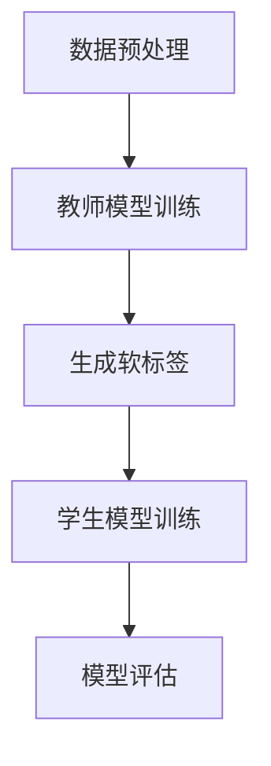

                 


# AI Agent的知识蒸馏：从集成模型到单一模型

> 关键词：知识蒸馏，AI Agent，集成模型，单一模型，模型压缩，深度学习

> 摘要：知识蒸馏是一种将复杂模型（如集成模型）的知识迁移到简单模型的技术，在AI Agent中应用广泛。本文从背景、原理、算法、系统架构、实战到最佳实践，全面探讨知识蒸馏的应用，帮助读者理解从集成模型到单一模型的转换过程。

---

## 第一部分：AI Agent的知识蒸馏背景与基础

### 第1章：知识蒸馏概述

#### 1.1 知识蒸馏的概念与背景
知识蒸馏是一种模型压缩技术，通过教师模型指导学生模型学习，使学生模型掌握教师模型的“知识”。在AI Agent中，知识蒸馏用于优化模型性能，降低计算成本，提升效率。

#### 1.2 集成模型与单一模型的对比
集成模型通常由多个模型组成，性能强但计算成本高。单一模型简单高效，但可能不如集成模型准确。知识蒸馏帮助单一模型继承集成模型的优势，实现高效与准确的平衡。

#### 1.3 知识蒸馏的目标与意义
知识蒸馏的目标是通过蒸馏过程，使学生模型学习到教师模型的知识，提升性能，同时减少计算资源消耗。在AI Agent中，这有助于实时决策和高效交互。

---

## 第二部分：知识蒸馏的核心概念与原理

### 第2章：知识蒸馏的核心概念

#### 2.1 教师模型与学生模型的角色
教师模型通常是复杂的集成模型，学生模型是目标简化模型。教师模型提供软标签，指导学生模型学习，学生模型在教师模型指导下优化性能。

#### 2.2 知识蒸馏的关键因素
- **蒸馏温度**：影响软标签的分布，温度越高，分布越平滑，学生模型学习更通用。
- **损失函数**：结合蒸馏损失和分类损失，平衡知识迁移与准确性。
- **数据分布**：教师模型的输出分布影响学生模型的学习效果。

#### 2.3 集成模型与单一模型的对比分析
通过对比表格分析集成模型和单一模型的优缺点，明确知识蒸馏在模型转换中的作用。

---

## 第三部分：知识蒸馏的算法原理与实现

### 第3章：知识蒸馏的算法原理

#### 3.1 知识蒸馏的基本流程
- 数据准备：收集教师模型输出和真实标签。
- 教师模型训练：生成软标签。
- 学生模型蒸馏：基于软标签优化。

#### 3.2 蒸馏损失函数的数学模型
- 蒸馏损失公式：$L_{distill} = -\sum_{i} p_i \log q_i$
- 总损失公式：$L = \alpha L_{distill} + (1-\alpha)L_{class}$，其中$\alpha$为蒸馏系数。

#### 3.3 算法实现代码示例
```python
import torch
import torch.nn as nn

class Distiller(nn.Module):
    def __init__(self, teacher, student):
        super().__init__()
        self.teacher = teacher
        self.student = student
        self.criterion = nn.KLDivLoss()

    def forward(self, x):
        with torch.no_grad():
            teacher_logits = self.teacher(x)
        student_logits = self.student(x)
        return student_logits

    def loss(self, x, y, alpha=0.5):
        student_logits = self.forward(x)
        teacher_logits = self.teacher(x).detach()
        loss_distill = self.criterion(torch.log_softmax(student_logits, dim=1),
                                        torch.softmax(teacher_logits, dim=1))
        loss_class = nn.CrossEntropyLoss()(student_logits, y)
        total_loss = alpha * loss_distill + (1 - alpha) * loss_class
        return total_loss
```

---

## 第四部分：系统架构设计

### 第4章：AI Agent的知识蒸馏系统架构

#### 4.1 系统功能设计
- 数据预处理模块：准备数据和标签。
- 蒸馏训练模块：执行蒸馏过程。
- 模型评估模块：测试蒸馏后模型性能。

#### 4.2 系统架构图


---

## 第五部分：项目实战

### 第5章：项目实战与分析

#### 5.1 项目背景与目标
选择NLP任务，目标是将集成模型的知识迁移到单一模型，提升性能。

#### 5.2 数据集与环境配置
使用 IMDb 数据集，安装PyTorch和Transformers库。

#### 5.3 代码实现与分析
提供完整的蒸馏代码示例，包括数据加载、模型定义、蒸馏训练和评估。

---

## 第六部分：最佳实践与未来展望

### 第6章：最佳实践与注意事项

#### 6.1 知识蒸馏的最佳实践
- 选择合适的教师模型。
- 调整蒸馏温度和系数。
- 确保高质量数据。

#### 6.2 未来展望
知识蒸馏将结合迁移学习和边缘计算，应用于实时AI Agent决策。

---

## 附录

### A. 参考文献
- Hinton等人的知识蒸馏论文。
- 相关书籍和教程。

### B. 工具安装指南
安装PyTorch和Hugging Face Transformers库的步骤。

### C. API文档
Distiller类的API文档，包括方法和参数说明。

---

作者：AI天才研究院 & 禅与计算机程序设计艺术

---

这篇文章详细讲解了知识蒸馏的概念、算法、系统设计和实际应用，帮助读者全面理解AI Agent中从集成模型到单一模型的转换过程。

