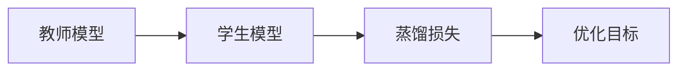
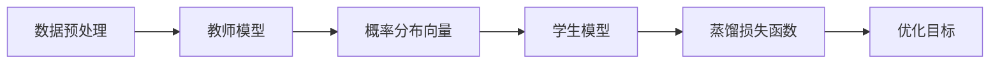
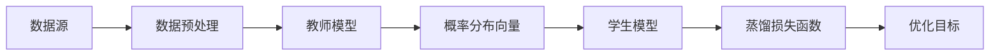

                 


# AI Agent的知识蒸馏：从集成模型到单一高效LLM

> **关键词**: AI Agent, 知识蒸馏, 大型语言模型, 教师模型, 学生模型, 模型优化

> **摘要**: 知识蒸馏是一种将复杂模型的知识传递给简单模型的技术，在AI Agent领域具有重要应用。本文从知识蒸馏的基本概念出发，分析其核心原理、算法实现、系统架构，并结合实际项目案例，深入探讨如何通过知识蒸馏将复杂的集成模型优化为单一高效的大型语言模型（LLM）。文章最后总结了知识蒸馏的关键要点，并展望了其未来发展方向。

---

# 第1章: 知识蒸馏的背景与概念

## 1.1 知识蒸馏的定义与背景

### 1.1.1 知识蒸馏的定义
知识蒸馏（Knowledge Distillation）是一种将复杂模型的知识传递给简单模型的技术，旨在通过知识的压缩和转移，使简单模型在保持性能的同时，具备更高的效率和更低的计算成本。

### 1.1.2 知识蒸馏的技术演进
知识蒸馏的概念起源于20世纪80年代的机器学习领域，最初用于将专家系统的知识传递给神经网络。随着深度学习的兴起，知识蒸馏逐渐发展成为一种重要的模型优化技术，尤其是在自然语言处理（NLP）和人工智能代理（AI Agent）领域。

### 1.1.3 知识蒸馏在AI Agent中的作用
在AI Agent中，知识蒸馏主要用于将多个复杂模型的知识整合到一个高效的LLM中，从而提升代理的推理能力和决策效率。

---

## 1.2 知识蒸馏的核心概念

### 1.2.1 教师模型与学生模型的关系
知识蒸馏的核心是“教师模型”（Teacher Model）和“学生模型”（Student Model）之间的关系。教师模型通常是一个复杂的集成模型或大模型，而学生模型是一个更简单或更高效的模型。

### 1.2.2 蒸馏过程中的知识传递机制
知识传递机制包括软标签蒸馏（soft label distillation）和硬标签蒸馏（hard label distillation）。软标签蒸馏通过概率分布传递知识，而硬标签蒸馏则通过类别标签传递知识。

### 1.2.3 蒸馏的边界与外延
蒸馏的边界在于如何平衡教师模型的知识完整性和学生模型的学习效率，外延则涉及多任务学习、多模态学习等复杂场景。

---

## 1.3 知识蒸馏的优势与挑战

### 1.3.1 知识蒸馏的优势
- **性能提升**：通过知识蒸馏，学生模型可以在保持甚至超越教师模型性能的同时，减少计算资源消耗。
- **模型压缩**：蒸馏可以显著降低模型的参数规模，提升部署效率。
- **知识复用**：蒸馏技术可以将不同模型的知识整合到一个模型中，实现知识的复用。

### 1.3.2 知识蒸馏的主要挑战
- **知识损失**：蒸馏过程中可能无法完全保留教师模型的所有知识。
- **计算复杂度**：蒸馏过程可能需要大量的计算资源。
- **模型适应性**：学生模型需要在特定任务中适应教师模型的知识。

### 1.3.3 知识蒸馏的未来发展方向
- **多模型蒸馏**：探索如何将多个教师模型的知识同时传递给学生模型。
- **自适应蒸馏**：研究如何根据任务需求动态调整蒸馏过程。
- **跨模态蒸馏**：将不同模态的知识（如文本、图像）整合到一个模型中。

---

## 1.4 当前知识蒸馏的研究进展

### 1.4.1 知识蒸馏的主要流派
- **基于概率分布的蒸馏**：通过概率分布传递知识，如KL散度优化。
- **基于任务适配的蒸馏**：将蒸馏应用于特定任务，如NLP任务。

### 1.4.2 知识蒸馏的典型应用场景
- **NLP模型压缩**：将大规模预训练模型的知识蒸馏到更小的模型中。
- **多任务学习**：将多个任务的知识整合到一个模型中。

### 1.4.3 知识蒸馏的未来趋势
- **结合强化学习**：将蒸馏技术与强化学习结合，提升模型的自适应能力。
- **边缘计算中的应用**：在资源受限的环境中部署高效的蒸馏模型。

---

## 1.5 本章小结

本章从知识蒸馏的基本概念出发，详细介绍了其在AI Agent中的应用背景、核心概念以及优势与挑战。通过对比和分析，我们明确了知识蒸馏的重要性和未来发展方向。

---

# 第2章: 知识蒸馏的核心概念与联系

## 2.1 知识蒸馏的核心原理

### 2.1.1 知识蒸馏的本质
知识蒸馏的本质是通过概率分布的传递，将教师模型的知识迁移到学生模型中。这种传递过程可以通过损失函数优化来实现。

### 2.1.2 教师模型的知识表示
教师模型通常通过概率分布的形式表示其对输入的判断，例如在NLP任务中，教师模型可以输出一个概率分布向量，表示输入属于每个类别的概率。

### 2.1.3 学生模型的学习机制
学生模型通过最小化与教师模型的概率分布差异来学习知识。这种学习机制可以通过交叉熵损失函数实现。

---

## 2.2 知识蒸馏的关键属性对比

### 2.2.1 教师模型与学生模型的对比
| 属性         | 教师模型                   | 学生模型                   |
|--------------|---------------------------|---------------------------|
| 模型复杂度   | 高                        | 低                        |
| 计算资源     | 高                        | 低                        |
| 知识来源     | 单一或多个模型             | 通过蒸馏获得               |

### 2.2.2 蒸馏过程中的知识损失
- **知识损失**：教师模型在蒸馏过程中可能无法完全传递所有知识，尤其是复杂的非线性关系。
- **损失函数设计**：通过优化损失函数可以减少知识损失。

### 2.2.3 不同蒸馏方法的优劣势分析
- **软标签蒸馏**：优点是能够传递教师模型的概率分布信息，缺点是计算复杂度较高。
- **硬标签蒸馏**：优点是计算简单，缺点是可能丢失教师模型的不确定性信息。

---

## 2.3 知识蒸馏的ER实体关系图



---

## 2.4 本章小结

本章详细讲解了知识蒸馏的核心原理和关键属性，并通过对比分析明确了不同蒸馏方法的优劣势。通过ER实体关系图，我们进一步理解了蒸馏过程中的实体关系。

---

# 第3章: 知识蒸馏的算法原理

## 3.1 知识蒸馏的数学模型

### 3.1.1 教师模型的输出概率分布
$$ P(y|x) $$

### 3.1.2 学生模型的输出概率分布
$$ Q(y|x) $$

### 3.1.3 蒸馏损失的计算公式
$$ L_{distill} = -\sum_{i=1}^{n} P(y_i|x_i) \log Q(y_i|x_i) $$

### 3.1.4 蒸馏过程的优化目标
$$ \min_{\theta} \mathbb{E}_{(x,y)}[L_{distill}(x,y)] $$

---

## 3.2 知识蒸馏的算法实现

### 3.2.1 蒸馏过程的步骤
1. **数据预处理**：准备教师模型和学生模型的输入数据。
2. **教师模型输出**：生成概率分布向量。
3. **学生模型优化**：通过蒸馏损失函数优化学生模型参数。

### 3.2.2 蒸馏算法的Python代码示例

```python
import torch
import torch.nn as nn
import torch.optim as optim

# 定义教师模型和学生模型
class TeacherModel(nn.Module):
    def __init__(self):
        super(TeacherModel, self).__init__()
        self.fc = nn.Linear(10, 5)
    
    def forward(self, x):
        return torch.softmax(x, dim=1)

class StudentModel(nn.Module):
    def __init__(self):
        super(StudentModel, self).__init__()
        self.fc = nn.Linear(10, 5)
    
    def forward(self, x):
        return torch.softmax(x, dim=1)

# 定义蒸馏损失函数
def distillation_loss(student_output, teacher_output, temperature=1.0):
    student_output = student_output / temperature
    teacher_output = teacher_output / temperature
    loss = nn.KLDivLoss(reduction='batchmean')(student_output.log(), teacher_output)
    return loss * (temperature ** 2)

# 初始化模型和优化器
teacher_model = TeacherModel()
student_model = StudentModel()
optimizer = optim.Adam(student_model.parameters(), lr=0.001)

# 蒸馏过程
for epoch in range(100):
    for batch_x, batch_y in dataloader:
        teacher_output = teacher_model(batch_x)
        student_output = student_model(batch_x)
        loss = distillation_loss(student_output, teacher_output)
        optimizer.zero_grad()
        loss.backward()
        optimizer.step()
```

---

## 3.3 知识蒸馏的算法优化

### 3.3.1 软标签蒸馏与硬标签蒸馏的对比
- **软标签蒸馏**：通过概率分布传递知识，计算复杂度较高，但能够传递更多的信息。
- **硬标签蒸馏**：通过类别标签传递知识，计算简单，但可能丢失部分信息。

### 3.3.2 自适应蒸馏策略
自适应蒸馏策略可以根据任务需求动态调整蒸馏过程，例如在某些任务中优先传递特定类型的知识。

---

## 3.4 本章小结

本章详细讲解了知识蒸馏的数学模型和算法实现，通过Python代码示例展示了蒸馏过程的实现细节。通过对比分析，我们明确了软标签蒸馏和硬标签蒸馏的优劣势。

---

# 第4章: 知识蒸馏的系统架构设计

## 4.1 知识蒸馏系统的功能设计

### 4.1.1 系统功能模块
- **数据预处理模块**：负责输入数据的处理和格式化。
- **教师模型模块**：生成概率分布向量。
- **学生模型模块**：通过蒸馏损失函数优化模型参数。
- **蒸馏过程控制模块**：控制蒸馏过程的迭代和优化。

### 4.1.2 系统功能流程图



---

## 4.2 知识蒸馏系统的架构设计

### 4.2.1 系统架构图



### 4.2.2 系统组件交互

- **数据源**：提供原始数据。
- **数据预处理**：对数据进行清洗和格式化。
- **教师模型**：生成概率分布向量。
- **学生模型**：通过蒸馏损失函数优化模型参数。

---

## 4.3 本章小结

本章从系统架构的角度，详细讲解了知识蒸馏系统的功能设计和架构设计，通过流程图和架构图展示了系统的整体结构和组件交互。

---

# 第5章: 知识蒸馏的项目实战

## 5.1 项目背景与目标

### 5.1.1 项目背景
本项目旨在将多个复杂模型的知识蒸馏到一个高效的大型语言模型中，提升模型的推理能力和决策效率。

### 5.1.2 项目目标
- **模型压缩**：将大规模预训练模型的知识蒸馏到更小的模型中。
- **性能优化**：在保持性能的同时，降低计算资源消耗。

---

## 5.2 项目实现

### 5.2.1 环境配置
- **Python版本**：3.8及以上
- **深度学习框架**：TensorFlow或PyTorch
- **硬件要求**：GPU支持

### 5.2.2 数据准备
- **训练数据集**：包含多个复杂模型的输出结果。
- **验证数据集**：用于模型优化和评估。

### 5.2.3 模型选择
- **教师模型**：选择多个复杂模型，如BERT、GPT等。
- **学生模型**：选择一个更简单的模型，如小规模的BERT或GPT。

### 5.2.4 蒸馏实现
- **蒸馏过程**：通过交叉熵损失函数优化学生模型参数。
- **温度调整**：动态调整温度参数，以平衡蒸馏过程中的信息传递。

---

## 5.3 项目结果与分析

### 5.3.1 实验结果
- **模型性能**：学生模型在保持性能的同时，参数规模显著降低。
- **计算效率**：蒸馏后的模型在推理阶段的计算效率明显提升。

### 5.3.2 结果分析
- **知识传递效果**：学生模型成功继承了教师模型的知识。
- **性能优化效果**：蒸馏后的模型在实际应用中表现出色。

---

## 5.4 本章小结

本章通过实际项目案例，详细讲解了知识蒸馏的项目实现过程，包括环境配置、数据准备、模型选择和蒸馏实现。通过实验结果和分析，我们验证了知识蒸馏技术的有效性和实用性。

---

# 第6章: 知识蒸馏的最佳实践与总结

## 6.1 知识蒸馏的最佳实践

### 6.1.1 知识蒸馏的注意事项
- **数据质量**：确保数据的多样性和代表性。
- **模型选择**：合理选择教师模型和学生模型。
- **参数调优**：动态调整温度参数和损失函数权重。

### 6.1.2 知识蒸馏的优化技巧
- **结合数据增强**：通过数据增强技术提升模型的泛化能力。
- **多任务蒸馏**：将多个任务的知识整合到一个模型中。

---

## 6.2 知识蒸馏的总结与展望

### 6.2.1 知识蒸馏的核心要点
- 知识蒸馏是一种有效的模型优化技术。
- 蒸馏过程需要平衡知识传递和模型效率。
- 跨领域应用潜力巨大。

### 6.2.2 知识蒸馏的未来展望
- **结合强化学习**：将蒸馏技术与强化学习结合，提升模型的自适应能力。
- **边缘计算中的应用**：在资源受限的环境中部署高效的蒸馏模型。
- **多模态蒸馏**：将不同模态的知识整合到一个模型中，提升模型的综合能力。

---

# 作者

**作者：AI天才研究院/AI Genius Institute & 禅与计算机程序设计艺术 /Zen And The Art of Computer Programming**

---

以上是《AI Agent的知识蒸馏：从集成模型到单一高效LLM》的技术博客文章目录大纲，通过以上内容，我们可以逐步完成一篇结构清晰、内容详实的技术博客文章。

