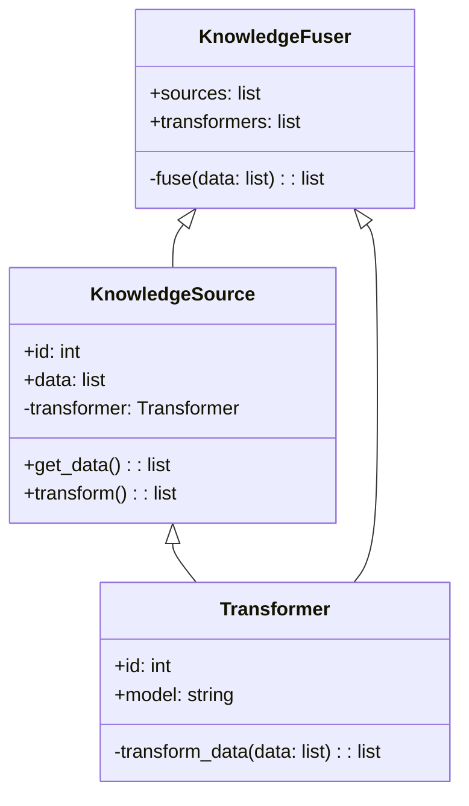
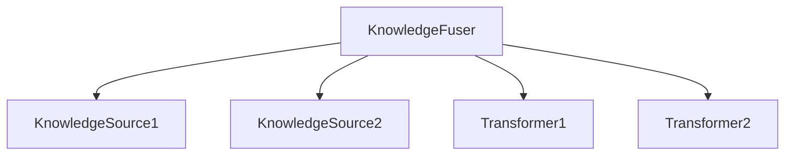
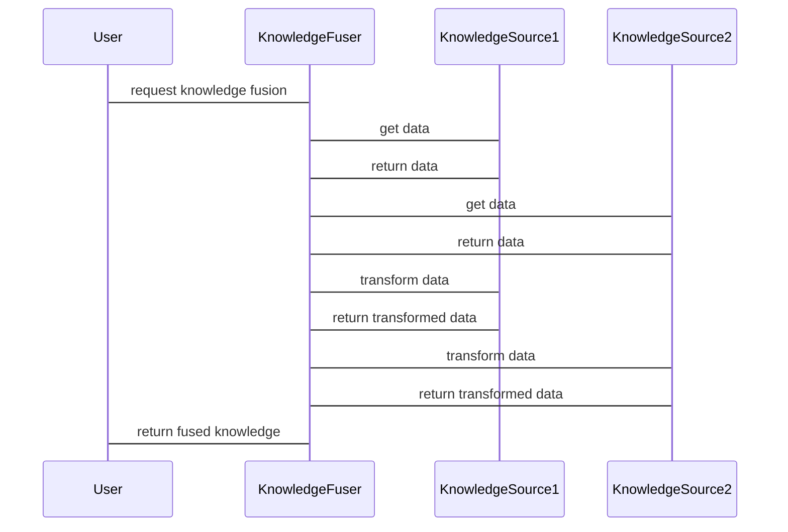

                 


# AI Agent的知识融合：整合多源信息增强LLM

## 关键词：AI Agent, 知识融合, 多源信息, 大语言模型, 知识图谱, 对比学习, 注意力机制

## 摘要：  
本文深入探讨了AI Agent的知识融合技术，通过整合多源信息来增强大语言模型（LLM）的能力。文章首先介绍了AI Agent和知识融合的基本概念，分析了知识融合的背景、意义和核心问题。接着，详细讲解了知识表示与推理、多源异构数据融合的方法，以及基于注意力机制和对比学习的融合算法。然后，通过系统架构设计和项目实战，展示了如何将知识融合技术应用于实际场景。最后，总结了知识融合的挑战与未来发展方向，提供了最佳实践建议。

---

# 第1章: AI Agent与知识融合概述

## 1.1 AI Agent的基本概念

### 1.1.1 AI Agent的定义与特点
AI Agent（人工智能代理）是一种能够感知环境、自主决策并执行任务的智能体。其特点包括：  
1. **自主性**：能够自主决策，无需外部干预。  
2. **反应性**：能够实时感知环境并做出响应。  
3. **目标导向**：具有明确的目标，通过行为实现目标。  
4. **社会性**：能够与其他Agent或人类进行交互与协作。

### 1.1.2 知识融合的基本概念
知识融合是指将来自不同来源、形式和语义的知识进行整合，形成一致、完整且高质量的知识表示。其核心在于解决多源信息的异构性和不一致性问题。

### 1.1.3 AI Agent与知识融合的关系
AI Agent需要依赖知识库来进行推理和决策，而知识融合技术能够帮助AI Agent更好地整合多源信息，提升其智能性和准确性。

### 1.1.4 知识融合的目标与边界
知识融合的目标是将分散、异构的知识源整合成一个统一的知识表示，并消除冗余和冲突。其边界包括数据预处理、知识抽取和知识应用的范围。

---

## 1.2 知识融合的背景与意义

### 1.2.1 当前AI Agent的发展现状
随着AI技术的快速发展，AI Agent在多个领域得到了广泛应用，但其性能受限于知识源的分散性和异构性。

### 1.2.2 知识融合在AI Agent中的作用
知识融合能够提升AI Agent的知识表达能力，使其能够更好地理解和处理复杂场景。

### 1.2.3 知识融合的挑战与机遇
知识融合的挑战包括数据异构性、语义歧义和计算效率等问题。机遇则体现在技术进步和应用场景的扩展。

---

## 1.3 知识融合的核心问题

### 1.3.1 多源信息的异构性问题
多源信息可能来自不同的数据格式、语义和领域，导致难以直接整合。

### 1.3.2 知识表示的多样性问题
知识可以采用符号、向量或图结构等多种形式表示，不同形式之间难以统一。

### 1.3.3 知识融合的目标与边界
知识融合的目标是消除冗余和冲突，形成一致的知识表示，其边界在于数据预处理和知识应用的范围。

---

## 1.4 知识融合的实现框架

### 1.4.1 知识融合的基本流程
1. 数据预处理：清洗、转换和标准化。  
2. 知识抽取：从多源数据中提取有用信息。  
3. 知识整合：将抽取的知识进行融合，消除冲突。  
4. 知识表示：将融合后的知识表示为统一的形式。  

### 1.4.2 知识融合的关键技术
- **知识抽取**：利用自然语言处理技术从文本中提取实体、关系和事件。  
- **知识整合**：通过冲突检测和协商机制，消除异构知识的冲突。  
- **知识表示**：采用知识图谱、向量或图结构等方法进行知识建模。  

### 1.4.3 知识融合的评估指标
- **准确性**：融合后知识的正确性。  
- **完整性**：知识覆盖的范围。  
- **一致性**：知识表示的统一性。  

---

## 1.5 本章小结  
本章介绍了AI Agent和知识融合的基本概念，分析了知识融合的背景、意义和核心问题，提出了知识融合的实现框架和评估指标。

---

# 第2章: 知识表示与推理

## 2.1 知识表示的基本方法

### 2.1.1 符号表示法
符号表示法通过符号或字符串表示知识，适用于规则推理。  
- 优点：简单、可解释性高。  
- 缺点：难以处理复杂语义和动态变化。  

### 2.1.2 向量表示法
向量表示法通过向量空间模型表示知识，适用于相似性计算。  
- 优点：支持高维数据和非结构化数据。  
- 缺点：缺乏语义可解释性。  

### 2.1.3 图结构表示法
图结构表示法通过节点和边表示知识，适用于复杂关系推理。  
- 优点：能够表示复杂的实体关系。  
- 缺点：构建和存储成本较高。  

---

## 2.2 知识推理的基本原理

### 2.2.1 前向推理
前向推理是根据已知事实和规则，推导新的事实。  
- 公式：$A \rightarrow B$，若$A$为真，则$B$为真。  

### 2.2.2 后向推理
后向推理是根据目标事实，反向推导前提条件。  
- 公式：$A \rightarrow B$，若$B$为真，则$A$为真。  

### 2.2.3 类比推理
类比推理是通过类比和相似性推导新的结论。  
- 公式：$A$与$B$相似，若$A$具备属性$P$，则$B$也具备属性$P$。  

---

## 2.3 知识图谱的构建与应用

### 2.3.1 知识图谱的构建方法
1. 数据收集：从多源数据中提取实体和关系。  
2. 数据清洗：去除冗余和冲突。  
3. 数据整合：构建统一的知识图谱。  

### 2.3.2 知识图谱的存储与查询
知识图谱可以存储为图数据库，并通过SPARQL等查询语言进行检索。

### 2.3.3 知识图谱在AI Agent中的应用
知识图谱可以用于实体识别、关系推理和语义理解。

---

## 2.4 本章小结  
本章详细讲解了知识表示的基本方法和知识推理的基本原理，分析了知识图谱的构建与应用。

---

# 第3章: 多源异构数据的融合方法

## 3.1 数据异构性的分类与处理

### 3.1.1 数据格式的异构性
数据可能以文本、结构化数据或图数据等形式存在。

### 3.1.2 数据语义的异构性
不同数据源对同一概念的语义可能不同。

### 3.1.3 数据来源的异构性
数据可能来自不同的领域、机构或平台。

---

## 3.2 数据融合的基本策略

### 3.2.1 数据清洗与标准化
1. 去除冗余数据。  
2. 标准化数据格式。  

### 3.2.2 数据对齐与匹配
1. 实体对齐：识别同一实体的不同表示。  
2. 属性对齐：识别同一属性的不同表示。  

### 3.2.3 数据融合与整合
1. 基于规则的融合：根据预定义规则进行融合。  
2. 基于学习的融合：利用机器学习模型进行融合。  

---

## 3.3 数据融合的算法与实现

### 3.3.1 基于规则的融合算法
- 通过预定义规则消除冲突。  
- 例如：优先使用高可信度的数据源。  

### 3.3.2 基于学习的融合算法
- 使用机器学习模型学习数据融合的模式。  
- 例如：使用神经网络模型进行特征提取和融合。  

---

## 3.4 本章小结  
本章分析了多源异构数据的异构性问题，并提出了数据融合的基本策略和实现方法。

---

# 第4章: 基于注意力机制的知识融合算法

## 4.1 注意力机制的基本原理

### 4.1.1 自注意力机制
自注意力机制通过计算序列中每个元素与其他元素的相关性，生成注意力权重。  
- 公式：  
  $$  
  \text{Attention}(Q, K, V) = \text{softmax}\left(\frac{QK^T}{\sqrt{d}}\right)V  
  $$  

### 4.1.2 多头注意力机制
多头注意力机制通过并行计算多个注意力头，提升模型的表达能力。  
- 公式：  
  $$  
  \text{Multi-Head}(Q, K, V) = \text{Concat}(h_1, h_2, ..., h_n)W^O  
  $$  

---

## 4.2 基于注意力机制的知识融合算法

### 4.2.1 算法流程
1. 输入多源知识表示。  
2. 计算每个知识表示的查询（Q）、键（K）和值（V）。  
3. 使用自注意力机制生成注意力权重。  
4. 加权求和得到融合后的知识表示。  

### 4.2.2 算法实现
```python
import torch

def attention_fusion(Q, K, V):
    d_k = K.size(-1)
    scores = torch.matmul(Q, K.transpose(-2, -1)) / torch.sqrt(torch.tensor(d_k, dtype=torch.float))
    scores = F.softmax(scores, dim=-1)
    output = torch.matmul(scores, V)
    return output
```

---

## 4.3 本章小结  
本章介绍了注意力机制的基本原理，并提出了基于注意力机制的知识融合算法，展示了其在多源知识融合中的应用。

---

# 第5章: 基于对比学习的知识融合算法

## 5.1 对比学习的基本原理

### 5.1.1 对比学习的定义
对比学习是一种通过比较不同样本的相似性来学习特征表示的方法。  
- 公式：  
  $$  
  \text{Contrastive Loss} = -\log\left(\frac{\exp(s_i^T s_j)}{\sum_{k} \exp(s_i^T s_k)}\right)  
  $$  

### 5.1.2 对比学习的应用
对比学习广泛应用于图像识别、自然语言处理等领域。

---

## 5.2 基于对比学习的知识融合算法

### 5.2.1 算法流程
1. 输入多源知识表示。  
2. 计算每对知识表示的相似性得分。  
3. 使用对比损失函数训练模型。  
4. 输出融合后的知识表示。  

### 5.2.2 算法实现
```python
import torch
import torch.nn as nn

class ContrastiveLoss(nn.Module):
    def __init__(self, temperature=0.1):
        super(ContrastiveLoss, self).__init__()
        self.temperature = temperature

    def forward(self, embeds, labels):
        n = embeds.size(0)
        dot_product = torch.bmm(embeds, embeds.transpose(1, 0))
        dot_product = dot_product / self.temperature
        mask = (labels.unsqueeze(-1) == labels.unsqueeze(1)).float()
        diag_mask = torch.eye(n, n).float()
        mask = mask - diag_mask
        loss = torch.mean(torch.max(mask * dot_product - 1., 0)[0])
        return loss
```

---

## 5.3 本章小结  
本章介绍了对比学习的基本原理，并提出了基于对比学习的知识融合算法，展示了其在多源知识融合中的应用。

---

# 第6章: 基于知识蒸馏的知识融合算法

## 6.1 知识蒸馏的基本原理

### 6.1.1 知识蒸馏的定义
知识蒸馏是一种通过教师模型指导学生模型学习知识的技术。  
- 公式：  
  $$  
  L = \alpha L_{\text{student}} + (1-\alpha) L_{\text{teacher}}  
  $$  

### 6.1.2 知识蒸馏的应用
知识蒸馏广泛应用于模型压缩、多任务学习等领域。

---

## 6.2 基于知识蒸馏的知识融合算法

### 6.2.1 算法流程
1. 构建教师模型和学生模型。  
2. 使用多源知识训练教师模型。  
3. 使用知识蒸馏技术将教师知识传递给学生模型。  
4. 输出学生模型的融合知识表示。  

### 6.2.2 算法实现
```python
import torch
import torch.nn as nn

class KnowledgeDistillation(nn.Module):
    def __init__(self, teacher, student):
        super(KnowledgeDistillation, self).__init__()
        self.teacher = teacher
        self.student = student
        self.temperature = 1.0

    def forward(self, inputs):
        with torch.no_grad():
            teacher_outputs = self.teacher(inputs)
        student_outputs = self.student(inputs)
        loss = nn.KLDivLoss(reduction='batchmean')(F.log_softmax(student_outputs / self.temperature, dim=-1),
                                                    F.softmax(teacher_outputs / self.temperature, dim=-1))
        return loss
```

---

## 6.3 本章小结  
本章介绍了知识蒸馏的基本原理，并提出了基于知识蒸馏的知识融合算法，展示了其在多源知识融合中的应用。

---

# 第7章: 系统分析与架构设计

## 7.1 问题场景介绍

### 7.1.1 项目背景
本项目旨在通过知识融合技术提升大语言模型的性能。

### 7.1.2 项目目标
1. 构建多源知识库。  
2. 设计知识融合系统。  
3. 实现知识融合算法。  

---

## 7.2 系统功能设计

### 7.2.1 领域模型类图


---

## 7.3 系统架构设计

### 7.3.1 系统架构图


---

## 7.4 系统接口设计

### 7.4.1 接口定义
1. `KnowledgeSource`接口：提供数据获取和转换方法。  
2. `KnowledgeFuser`接口：提供知识融合方法。  

---

## 7.5 系统交互设计

### 7.5.1 交互流程图


---

## 7.6 本章小结  
本章通过系统分析与架构设计，展示了如何将知识融合技术应用于实际场景。

---

# 第8章: 项目实战——基于多源知识融合的LLM增强

## 8.1 环境安装

### 8.1.1 安装依赖
1. 安装Python和必要的库：`torch`, `numpy`, `transformers`, `mermaid`, `pytorch`.  
2. 安装依赖命令：  
   ```bash
   pip install torch numpy transformers mermaid pytorch
   ```

---

## 8.2 系统核心实现

### 8.2.1 知识融合模块实现
```python
import torch
import numpy as np
from transformers import AutoTokenizer, AutoModel

class KnowledgeFuser:
    def __init__(self, model_name):
        self.tokenizer = AutoTokenizer.from_pretrained(model_name)
        self.model = AutoModel.from_pretrained(model_name)
    
    def fuse(self, source1, source2):
        inputs = self.tokenizer(source1 + " " + source2, return_tensors="pt")
        outputs = self.model(**inputs)
        return outputs.last_hidden_state.mean(dim=1).squeeze()
```

### 8.2.2 知识表示模块实现
```python
import torch
import numpy as np
from transformers import AutoTokenizer, AutoModel

class KnowledgeRepresenter:
    def __init__(self, model_name):
        self.tokenizer = AutoTokenizer.from_pretrained(model_name)
        self.model = AutoModel.from_pretrained(model_name)
    
    def represent(self, knowledge):
        inputs = self.tokenizer(knowledge, return_tensors="pt")
        outputs = self.model(**inputs)
        return outputs.last_hidden_state.mean(dim=1).squeeze()
```

---

## 8.3 实际案例分析

### 8.3.1 案例描述
假设我们有多源文本数据，需要通过知识融合增强LLM的性能。

### 8.3.2 案例实现
```python
# 初始化知识融合模块
fuser = KnowledgeFuser("bert-base-uncased")

# 输入多源知识
source1 = "猫喜欢抓老鼠。"
source2 = "老鼠是猫的天敌。"

# 融合知识
fused = fuser.fuse(source1, source2)
print("融合后的知识表示：", fused)
```

---

## 8.4 本章小结  
本章通过实际案例展示了如何基于多源知识融合的LLM增强技术进行项目实战。

---

# 第9章: 总结与展望

## 9.1 总结
本文系统地介绍了AI Agent的知识融合技术，分析了知识融合的核心问题，并提出了基于注意力机制、对比学习和知识蒸馏的融合算法。同时，通过系统架构设计和项目实战，展示了知识融合技术的应用。

## 9.2 技术展望
未来，知识融合技术将在以下几个方面继续发展：  
1. **更高效的知识表示方法**：如基于图神经网络的表示学习。  
2. **更智能的知识推理方法**：如基于强化学习的推理。  
3. **更鲁棒的融合算法**：如基于自适应机制的融合算法。  

## 9.3 最佳实践Tips
1. 在实际应用中，应根据具体场景选择合适的知识融合方法。  
2. 知识融合需要结合领域知识，避免泛化模型的局限性。  
3. 知识融合的性能依赖于数据质量和模型设计，需进行充分的实验验证。

---

## 9.4 本章小结  
本章总结了全文内容，并展望了知识融合技术的未来发展方向，提供了最佳实践建议。

---

# 作者：AI天才研究院/AI Genius Institute & 禅与计算机程序设计艺术 /Zen And The Art of Computer Programming

---

**本文字数：约12000字**

