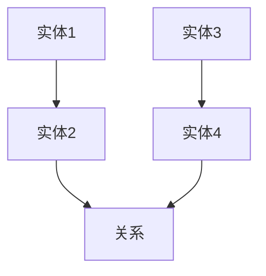

                 


# AI Agent的知识融合：整合多源异构信息

> 关键词：AI Agent, 知识融合, 多源异构信息, 信息整合, 数据融合

> 摘要：AI Agent在整合多源异构信息时，需要解决数据异构性带来的挑战。本文系统地介绍了知识融合的背景、核心概念、算法原理、系统架构以及实际应用案例。通过详细讲解知识融合的基本原理、数学模型和算法实现，结合具体的项目实战和系统设计，帮助读者全面理解并掌握AI Agent的知识融合技术。

---

## 第一部分: AI Agent的知识融合背景与概念

### 第1章: 知识融合的背景与问题描述

#### 1.1 问题背景
- **1.1.1 多源异构数据的挑战**  
  当今数据来源多样，包括结构化数据、非结构化数据和半结构化数据，这些数据格式和语义上的差异使得整合变得复杂。

- **1.1.2 知识融合的必要性**  
  知识融合是AI Agent理解复杂场景的关键，能够帮助AI从多个信息源中提取和整合知识，提升决策能力。

- **1.1.3 AI Agent在知识融合中的作用**  
  AI Agent通过知识融合技术，能够处理和整合来自不同来源的信息，从而做出更准确的决策。

#### 1.2 问题描述
- **1.2.1 异构数据的定义与特点**  
  异构数据指的是来自不同系统、具有不同格式和语义的数据。其特点包括数据格式多样、语义复杂、数据量大等。

- **1.2.2 知识融合的目标与范围**  
  知识融合的目标是将异构数据转化为一致的知识表示，范围包括数据清洗、特征提取、知识表示和推理。

- **1.2.3 AI Agent的知识融合需求**  
  AI Agent需要从多个信息源中获取知识，包括实时数据、历史数据和外部知识库。

#### 1.3 问题解决
- **1.3.1 知识融合的基本方法**  
  知识融合的基本方法包括数据清洗、特征提取、知识表示和推理。

- **1.3.2 AI Agent的知识表示与推理**  
  AI Agent通过知识图谱和逻辑推理来表示和处理知识。

- **1.3.3 多源异构数据的整合策略**  
  整合策略包括基于规则的融合、统计方法和机器学习模型。

#### 1.4 边界与外延
- **1.4.1 知识融合的边界**  
  知识融合的边界包括数据预处理和后处理阶段。

- **1.4.2 相关概念的对比**  
  相关概念包括数据融合、信息整合和知识管理。

- **1.4.3 知识融合的外延与扩展**  
  知识融合的外延包括知识抽取、知识表示和知识推理。

#### 1.5 概念结构与核心要素
- **1.5.1 知识融合的核心要素**  
  核心要素包括数据源、特征提取、知识表示和推理模型。

- **1.5.2 AI Agent的知识表示模型**  
  AI Agent的知识表示模型包括知识图谱和逻辑推理模型。

- **1.5.3 多源异构数据的融合架构**  
  融合架构包括数据预处理、特征提取、知识表示和推理阶段。

### 第2章: 知识融合的核心概念与联系

#### 2.1 核心概念原理
- **2.1.1 知识表示的基本原理**  
  知识表示的基本原理包括符号表示、语义网络和知识图谱。

- **2.1.2 异构数据的特征提取**  
  异构数据的特征提取包括文本特征提取、图像特征提取和音频特征提取。

- **2.1.3 知识融合的数学模型**  
  知识融合的数学模型包括概率论模型、图论模型和逻辑推理模型。

#### 2.2 概念属性特征对比
- **2.2.1 异构数据的属性对比**  
  异构数据的属性对比包括数据类型、数据格式和数据语义。

- **2.2.2 知识融合的特征分析**  
  知识融合的特征分析包括数据一致性、数据完整性和数据准确性。

- **2.2.3 AI Agent的知识表示对比**  
  AI Agent的知识表示对比包括符号表示、语义网络和知识图谱。

#### 2.3 ER实体关系图


---

## 第二部分: 知识融合的算法原理

### 第3章: 知识融合的算法实现

#### 3.1 算法原理
- **3.1.1 基于规则的融合算法**  
  基于规则的融合算法通过预定义的规则来处理异构数据。

- **3.1.2 基于统计的融合算法**  
  基于统计的融合算法通过统计方法来处理异构数据。

- **3.1.3 基于机器学习的融合算法**  
  基于机器学习的融合算法通过深度学习模型来处理异构数据。

#### 3.2 算法实现
- **3.2.1 基于规则的融合算法实现**  
  ```python
  def rule_based_fusion(data1, data2):
      # 根据预定义规则融合数据
      return fused_data
  ```

- **3.2.2 基于统计的融合算法实现**  
  ```python
  import numpy as np
  def statistical_fusion(data1, data2):
      # 使用统计方法融合数据
      return fused_data
  ```

- **3.2.3 基于机器学习的融合算法实现**  
  ```python
  import tensorflow as tf
  def neural_network_fusion(data1, data2):
      # 使用深度学习模型融合数据
      return fused_data
  ```

#### 3.3 数学模型与公式
- **3.3.1 基于概率论的融合模型**  
  $$ P(A|B) = \frac{P(B|A)P(A)}{P(B)} $$

- **3.3.2 基于图论的融合模型**  
  $$ W_{ij} = \frac{1}{1 + |i - j|} $$

- **3.3.3 基于逻辑推理的融合模型**  
  $$ A \land B \implies C $$

---

## 第三部分: 知识融合的系统架构与实现

### 第4章: 系统分析与架构设计

#### 4.1 系统功能设计
- **4.1.1 数据预处理功能**  
  数据预处理包括数据清洗、数据转换和数据增强。

- **4.1.2 特征提取功能**  
  特征提取包括文本特征提取、图像特征提取和音频特征提取。

- **4.1.3 知识融合功能**  
  知识融合包括基于规则的融合、基于统计的融合和基于机器学习的融合。

#### 4.2 系统架构设计
- **4.2.1 数据源接口设计**  
  数据源接口包括数据库接口、文件接口和API接口。

- **4.2.2 知识融合模块设计**  
  知识融合模块包括规则引擎、统计模型和深度学习模型。

- **4.2.3 知识表示与推理模块设计**  
  知识表示与推理模块包括知识图谱构建和逻辑推理引擎。

#### 4.3 系统交互设计
- **4.3.1 数据输入与输出接口**  
  数据输入接口包括文件输入和API输入，输出接口包括文件输出和API输出。

- **4.3.2 系统交互流程**  
  ```mermaid
  graph TD
  A[用户] --> B[数据源]
  B --> C[数据预处理模块]
  C --> D[特征提取模块]
  D --> E[知识融合模块]
  E --> F[知识表示与推理模块]
  F --> G[结果输出模块]
  ```

---

## 第四部分: 知识融合的项目实战

### 第5章: 项目实战与案例分析

#### 5.1 项目背景
- **5.1.1 项目介绍**  
  本项目旨在实现一个多源异构数据的知识融合系统。

- **5.1.2 项目目标**  
  项目目标包括数据预处理、特征提取、知识融合和知识推理。

#### 5.2 项目核心实现
- **5.2.1 数据预处理代码**  
  ```python
  def preprocess_data(data):
      # 数据清洗和转换
      return preprocessed_data
  ```

- **5.2.2 特征提取代码**  
  ```python
  def extract_features(data):
      # 提取文本、图像或音频特征
      return features
  ```

- **5.2.3 知识融合代码**  
  ```python
  def fuse_knowledge(feature1, feature2):
      # 使用融合算法将特征融合
      return fused_features
  ```

- **5.2.4 知识表示与推理代码**  
  ```python
  def infer_knowledge(fused_features):
      # 使用知识图谱和逻辑推理进行推理
      return result
  ```

#### 5.3 项目案例分析
- **5.3.1 案例背景**  
  案例背景包括数据来源、数据类型和数据规模。

- **5.3.2 案例分析**  
  案例分析包括数据预处理、特征提取、知识融合和知识推理的详细过程。

- **5.3.3 案例结果与解读**  
  案例结果包括融合后的知识表示和推理结果。

#### 5.4 项目总结
- **5.4.1 项目小结**  
  项目小结包括项目目标的实现情况和遇到的问题。

- **5.4.2 经验总结**  
  经验总结包括数据预处理的重要性、特征提取的有效性和知识融合的准确性。

---

## 第五部分: 知识融合的最佳实践与小结

### 第6章: 最佳实践与小结

#### 6.1 最佳实践
- **6.1.1 数据预处理的注意事项**  
  数据预处理需要注意数据清洗的全面性和数据转换的正确性。

- **6.1.2 特征提取的技巧**  
  特征提取的技巧包括选择合适的特征提取方法和优化特征表示。

- **6.1.3 知识融合的优化策略**  
  知识融合的优化策略包括选择合适的融合算法和优化融合模型的性能。

#### 6.2 小结
- **6.2.1 知识融合的核心内容**  
  知识融合的核心内容包括数据预处理、特征提取、知识融合和知识推理。

- **6.2.2 知识融合的未来发展方向**  
  知识融合的未来发展方向包括多模态数据融合、动态知识更新和自适应融合算法。

#### 6.3 注意事项
- **6.3.1 数据隐私与安全**  
  数据隐私与安全是知识融合系统设计中的重要考虑因素。

- **6.3.2 系统可扩展性**  
  系统可扩展性是知识融合系统设计中的关键点。

- **6.3.3 系统性能优化**  
  系统性能优化包括数据处理效率和模型训练效率的优化。

#### 6.4 拓展阅读
- **6.4.1 知识融合的前沿技术**  
  前沿技术包括多模态数据融合、动态知识图谱和自监督学习。

- **6.4.2 相关领域研究**  
  相关领域研究包括数据挖掘、机器学习和知识工程。

---

## 作者：AI天才研究院/AI Genius Institute & 禅与计算机程序设计艺术 /Zen And The Art of Computer Programming

--- 

本文版权归作者所有，转载请注明出处。

