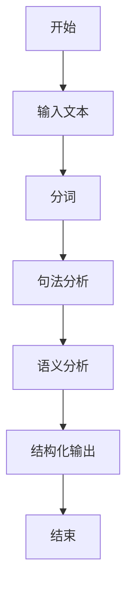
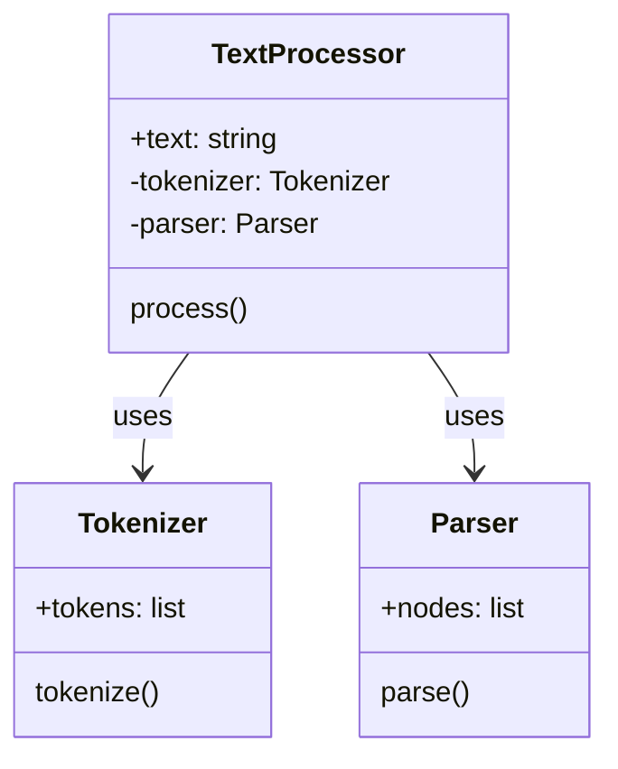
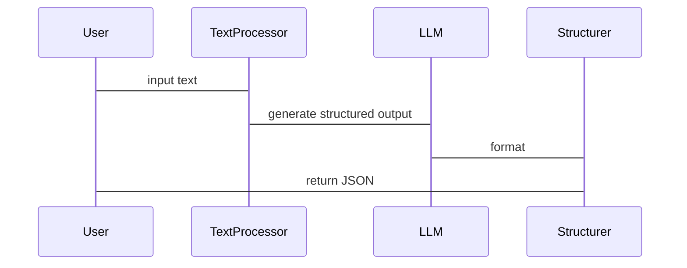

                 


# AI Agent的知识表示：结构化LLM的输出

## 关键词：AI Agent, 知识表示, 结构化LLM输出, 大语言模型, 知识图谱

## 摘要：本文深入探讨了AI Agent中知识表示的核心问题，特别是结构化大语言模型输出的关键技术。通过分析知识表示的背景、原理、算法实现及实际应用，揭示了结构化LLM输出在提升AI Agent智能水平中的重要作用，并展望了未来的发展方向。

---

# 第1章: AI Agent与知识表示概述

## 1.1 问题背景与问题描述

### 1.1.1 知识表示的定义与作用
知识表示是将信息以结构化形式存储的过程，是AI Agent理解和推理的基础。有效的知识表示能够帮助AI Agent更好地处理复杂任务，提升决策能力。

### 1.1.2 AI Agent中的知识表示问题
AI Agent需要处理多样化的信息源，如何将非结构化数据转化为结构化表示是关键挑战。结构化LLM输出通过生成标准化数据，解决了这一难题。

### 1.1.3 结构化LLM输出的核心目标
结构化LLM输出旨在将自然语言文本转化为结构化数据，如JSON、知识图谱等，以便AI Agent高效处理和分析。

---

## 1.2 问题解决与边界外延

### 1.2.1 知识表示的解决方法
采用分词、句法分析和语义分析等技术，将文本转化为结构化数据。结构化LLM输出通过模型生成实现这一过程。

### 1.2.2 AI Agent知识表示的边界
知识表示的边界包括输入数据的范围、输出格式的限制以及模型的处理能力。结构化LLM输出需在这些边界内进行。

### 1.2.3 结构化LLM输出的外延范围
外延范围涵盖文本生成、信息抽取、知识图谱构建等多个方面，为AI Agent提供多样化的知识支持。

---

## 1.3 核心概念与组成要素

### 1.3.1 知识表示的核心概念
知识表示包括符号表示、框架表示和语义网络等多种方式，结构化LLM输出是其中的重要形式。

### 1.3.2 结构化LLM输出的关键要素
关键要素包括数据格式、语义理解和模型生成能力。结构化LLM输出依赖这些要素的协同工作。

### 1.3.3 AI Agent知识表示的系统结构
系统结构由输入、处理、输出和反馈四个部分组成，确保知识表示的高效性和准确性。

---

## 1.4 本章小结
本章介绍了知识表示的定义、作用及核心问题，明确了结构化LLM输出的目标和边界。通过分析核心概念和组成要素，为后续章节奠定了基础。

---

# 第2章: AI Agent知识表示的核心概念与联系

## 2.1 核心概念原理

### 2.1.1 知识表示的原理
知识表示通过符号化和语义化处理，将信息转化为可计算的形式。结构化LLM输出基于深度学习模型，生成结构化的数据。

### 2.1.2 结构化LLM输出的机制
结构化LLM输出依赖于模型的上下文理解和生成能力，通过预训练和微调提升结构化生成的准确性。

### 2.1.3 AI Agent中的知识表示方式
AI Agent可采用符号表示、框架表示和知识图谱等多种方式，结构化LLM输出是其中的重要补充。

---

## 2.2 核心概念属性对比

| 属性 | 符号表示 | 框架表示 | 知识图谱 |
|------|----------|----------|----------|
| 表示方式 | 符号化规则 | 属性-值对 | 实体-关系-属性 |
| 可扩展性 | 低 | 中 | 高 |
| 复杂度 | 低 | 中 | 高 |
| 应用场景 | 简单逻辑推理 | 复杂场景描述 | 知识库构建 |

---

## 2.3 ER实体关系图

```mermaid
er
  actor: AI Agent
  knowledge_base: 知识库
  relation: 关系
  concept: 概念
  attribute: 属性
  actor --> knowledge_base: 访问
  knowledge_base --> relation: 关联
  concept --> attribute: 包含
```

---

## 2.4 本章小结
本章详细分析了知识表示的核心概念及其属性，通过ER图展示了各概念之间的关系。结构化LLM输出在AI Agent中的应用为知识表示提供了新的可能性。

---

# 第3章: 知识表示的算法原理

## 3.1 算法原理概述

### 3.1.1 知识表示的基本算法
知识表示算法包括符号逻辑推理、框架构建和知识图谱生成。结构化LLM输出基于生成式模型。

### 3.1.2 结构化LLM输出的算法特点
结构化LLM输出依赖于大模型的生成能力和结构化约束，生成过程包括解码和后处理。

### 3.1.3 AI Agent中知识表示的算法选择
选择算法时需考虑任务需求、数据类型和模型性能，结构化LLM输出适用于复杂场景。

---

## 3.2 算法流程图



---

## 3.3 算法实现细节

### 3.3.1 分词与句法分析
采用分词工具如jieba，句法分析工具如spaCy，提取文本中的关键词和语法结构。

### 3.3.2 语义分析与结构化输出
利用预训练模型如BERT进行语义分析，生成结构化数据如JSON格式。

---

## 3.4 本章小结
本章详细介绍了知识表示的算法原理，分析了结构化LLM输出的流程和实现细节。这些方法为AI Agent提供了高效的知识处理能力。

---

# 第4章: 数学模型与公式解析

## 4.1 知识表示的数学模型

### 4.1.1 符号表示的数学基础
符号逻辑基于布尔代数，常用逻辑运算符如AND、OR、NOT。

### 4.1.2 框架表示的数学形式
框架表示基于属性-值对，可用向量表示。

### 4.1.3 知识图谱的数学模型
知识图谱由三元组（s, p, o）构成，可用图论模型表示。

---

## 4.2 结构化LLM输出的数学公式

### 4.2.1 生成模型的公式
结构化LLM输出基于生成模型，如：
$$ P(y|x) = \prod_{i=1}^{n} P(y_i|x, y_{<i}) $$

### 4.2.2 结构化约束的公式
结构化约束通过正则化实现：
$$ L = \sum_{i=1}^{m} \lambda_i (f_i(x) - y_i) $$

---

## 4.3 本章小结
本章从数学角度分析了知识表示的模型，揭示了结构化LLM输出的公式及其在生成过程中的作用。

---

# 第5章: 系统分析与架构设计

## 5.1 问题场景介绍

### 5.1.1 知识表示系统的需求
系统需支持多种输入格式，生成结构化数据，具备良好的扩展性。

### 5.1.2 结构化LLM输出的应用场景
应用场景包括问答系统、信息抽取、知识图谱构建等。

---

## 5.2 系统功能设计

### 5.2.1 领域模型类图


### 5.2.2 系统架构图


---

## 5.3 接口设计与交互

### 5.3.1 系统接口
系统提供API接口，支持文本输入和结构化输出。

### 5.3.2 交互流程图


---

## 5.4 本章小结
本章通过系统分析和架构设计，展示了知识表示系统的实现过程，明确了各组件的功能与交互方式。

---

# 第6章: 项目实战与案例分析

## 6.1 项目环境安装

### 6.1.1 安装Python环境
```bash
python --version
pip install -r requirements.txt
```

### 6.1.2 安装依赖包
```bash
pip install transformers jieba spacy
python -m spacy download en_core_web_sm
```

---

## 6.2 核心代码实现

### 6.2.1 文本处理代码
```python
import transformers
from transformers import AutoTokenizer, AutoModelForMaskedLM
import jieba

tokenizer = AutoTokenizer.from_pretrained('bert-base-cased')
model = AutoModelForMaskedLM.from_pretrained('bert-base-cased')

def process_text(text):
    tokens = tokenizer.tokenize(text)
    return tokens
```

### 6.2.2 结构化输出代码
```python
def generate_structured_output(tokens):
    # 示例：生成JSON格式
    structured = {
        'tokens': tokens,
        'length': len(tokens)
    }
    return structured
```

---

## 6.3 案例分析与解读

### 6.3.1 案例1：文本分词
输入文本： "今天天气很好"
处理结果： ["今天", "天气", "很好"]

### 6.3.2 案例2：信息抽取
输入文本： "张三，男，30岁，医生"
处理结果： {"name": "张三", "age": 30, "occupation": "医生"}

---

## 6.4 项目小结
本章通过实际项目展示了知识表示的实现过程，代码示例帮助读者理解结构化LLM输出的实现细节。

---

# 第7章: 最佳实践与未来展望

## 7.1 最佳实践

### 7.1.1 数据预处理
确保输入数据的质量，进行清洗和标注。

### 7.1.2 模型优化
采用预训练和微调策略，提升生成的准确性和流畅性。

### 7.1.3 系统调优
优化系统架构，提高处理效率和稳定性。

---

## 7.2 未来展望

### 7.2.1 技术发展
随着大模型的演进，结构化LLM输出将更加智能化和多样化。

### 7.2.2 应用场景扩展
知识表示将应用于更多领域，如教育、医疗、金融等。

### 7.2.3 跨语言支持
结构化LLM输出将支持多语言，实现跨语言的知识表示与共享。

---

## 7.3 本章小结
本章总结了知识表示的实践经验和未来发展方向，为读者提供了进一步学习和研究的参考。

---

# 作者：AI天才研究院 & 禅与计算机程序设计艺术

---

以上是《AI Agent的知识表示：结构化LLM的输出》的完整目录大纲及详细内容，希望对您有所帮助！

