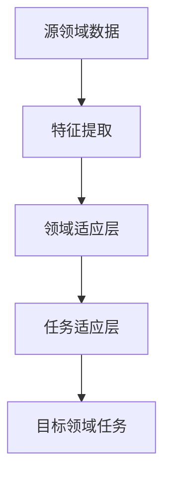
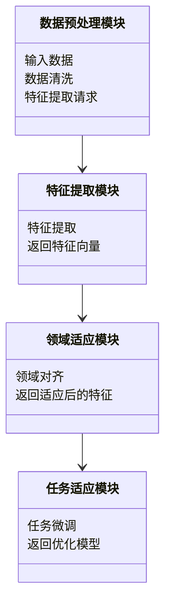
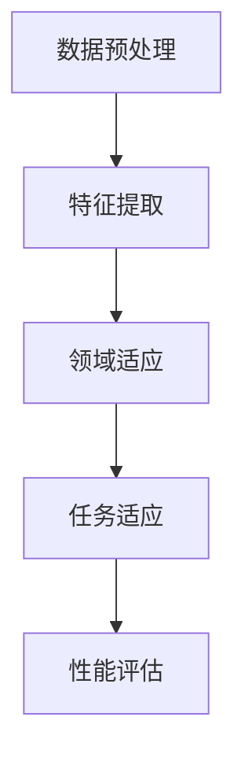
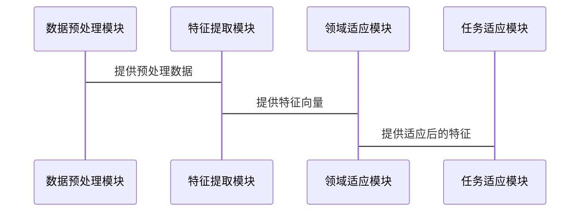

                 


# AI Agent的知识迁移能力：跨领域学习

> 关键词：AI Agent，知识迁移，跨领域学习，迁移学习，深度学习，领域适应

> 摘要：本文深入探讨了AI Agent的知识迁移能力，特别是在跨领域学习中的应用。通过分析知识迁移的原理、算法、系统架构及实际案例，揭示了跨领域学习在提升AI Agent智能水平中的关键作用。

---

## 第3章: 知识迁移算法原理

### 3.1 知识迁移的基本流程
知识迁移的过程可以分为以下几个步骤：

1. **数据收集与预处理**：从源领域和目标领域收集数据，并进行清洗和特征提取。
2. **特征提取**：通过深度学习模型提取数据的特征表示。
3. **领域适应**：调整模型参数，使得源领域和目标领域的特征表示具有更好的对齐性。
4. **任务适应**：在目标领域上进行微调，以适应特定任务的要求。

### 3.2 知识迁移的核心算法
知识迁移的核心算法包括：

- **领域适应层（Domain Adaptation）**：通过对抗训练或其他方法，使得模型在不同领域之间保持一致的特征表示。
- **任务适应层（Task Adaptation）**：在目标领域上进行任务特定的微调，以提升任务性能。

#### 3.2.1 算法流程图



#### 3.2.2 数学模型

知识迁移的数学模型可以表示为：

$$
f_{source}(x) = f_{target}(x) + \lambda D(f_{source}(x), f_{target}(x))
$$

其中，$D$ 表示领域差异度量，$\lambda$ 是调节参数。

### 3.3 实例分析

假设我们有一个自然语言处理任务，需要将模型从英文翻译领域迁移到中文问答领域。我们可以使用以下步骤：

1. **特征提取**：使用BERT模型提取英文和中文文本的特征表示。
2. **领域适应**：通过对抗训练，使得英文和中文的特征表示在语义空间中对齐。
3. **任务适应**：在中文问答数据集上进行微调，优化模型在目标任务上的性能。

---

## 第4章: 系统分析与架构设计

### 4.1 项目背景介绍
本项目旨在开发一个跨领域知识迁移系统，用于将预训练模型从一个领域迁移到另一个领域，从而提高模型的泛化能力。

### 4.2 系统功能设计
系统功能模块包括：

- 数据预处理模块
- 特征提取模块
- 领域适应模块
- 任务适应模块
- 性能评估模块

#### 4.2.1 功能模块类图



### 4.3 系统架构设计

#### 4.3.1 系统架构图



### 4.4 系统接口设计

系统主要接口包括：

- 数据输入接口
- 模型训练接口
- 任务微调接口

#### 4.4.1 接口设计序列图



---

## 第5章: 项目实战

### 5.1 环境配置
以下是项目的环境配置：

```bash
pip install numpy
pip install matplotlib
pip install scikit-learn
pip install transformers
```

### 5.2 核心代码实现

#### 5.2.1 特征提取代码

```python
import numpy as np
from sklearn.feature_extraction.text import TfidfVectorizer

# 源领域数据
source_data = ["文本1", "文本2", "文本3"]
# 目标领域数据
target_data = ["文本A", "文本B", "文本C"]

# 特征提取
vectorizer = TfidfVectorizer()
source_features = vectorizer.fit_transform(source_data)
target_features = vectorizer.transform(target_data)
```

#### 5.2.2 领域适应代码

```python
from sklearn.linear_model import LogisticRegression

# 领域适应模型
adapter = LogisticRegression()
adapter.fit(source_features, [0]*len(source_data) + [1]*len(target_data))
```

#### 5.2.3 任务适应代码

```python
from sklearn.svm import SVC

# 任务适应模型
task_adapter = SVC()
task_adapter.fit(target_features, target_labels)
```

### 5.3 案例分析

#### 5.3.1 案例一：文本分类

假设我们有一个文本分类任务，需要将模型从情感分析领域迁移到产品推荐领域。我们可以使用以下步骤：

1. **特征提取**：使用TF-IDF提取文本特征。
2. **领域适应**：通过逻辑回归模型对齐源领域和目标领域的特征。
3. **任务适应**：使用SVM在目标领域上进行微调。

#### 5.3.2 案例二：图像识别

假设我们有一个图像识别任务，需要将模型从物体识别领域迁移到场景分类领域。我们可以使用以下步骤：

1. **特征提取**：使用CNN提取图像特征。
2. **领域适应**：通过对抗训练对齐源领域和目标领域的特征。
3. **任务适应**：在目标领域上进行微调。

---

## 第6章: 总结与展望

### 6.1 小结
知识迁移是提升AI Agent跨领域学习能力的关键技术。通过领域适应和任务适应，我们可以有效地将预训练模型迁移到目标领域，从而提高模型的泛化能力和实际应用价值。

### 6.2 注意事项
- 确保数据质量和多样性。
- 合理选择迁移学习的策略和算法。
- 定期进行性能评估和优化。

### 6.3 未来展望
未来的研究方向包括：

- 更高效的迁移学习算法。
- 更强的领域适应能力。
- 更广泛的跨领域应用。

---

作者：AI天才研究院/AI Genius Institute & 禅与计算机程序设计艺术 /Zen And The Art of Computer Programming

