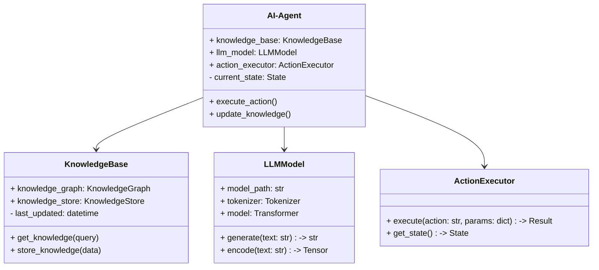
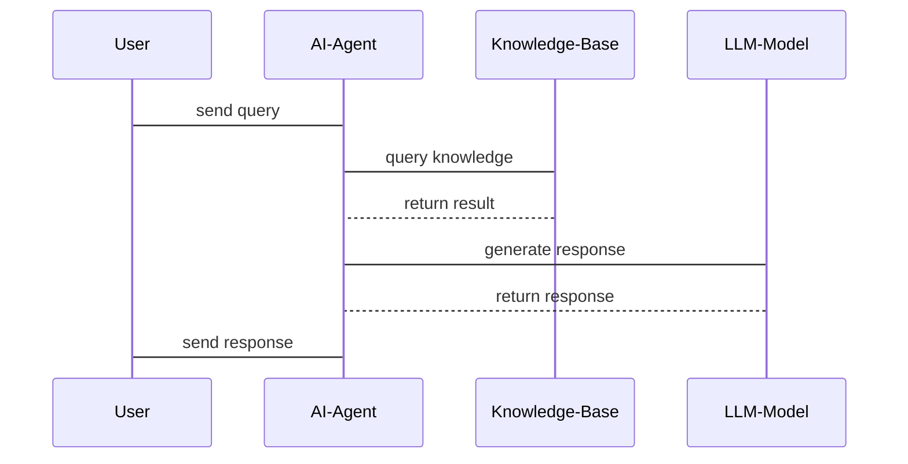

                 


# AI Agent的知识迁移：跨领域应用LLM的能力

## 关键词：AI Agent，知识迁移，LLM，跨领域应用，大语言模型

## 摘要：
AI Agent与大语言模型（LLM）的结合为跨领域知识应用带来了革命性的变化。本文系统探讨了AI Agent如何利用LLM进行知识迁移，详细分析了其在不同领域的应用能力，从理论基础到算法实现，再到系统设计，为读者提供全面的视角。

---

# 第1章：AI Agent的基本概念

## 1.1 AI Agent的定义与特点
### 1.1.1 AI Agent的定义
AI Agent是一种智能实体，能够感知环境并采取行动以实现目标。

### 1.1.2 AI Agent的核心特点
- **自主性**：无需外部干预，自主决策。
- **反应性**：实时感知环境并调整行为。
- **目标导向**：所有行动基于明确的目标。

### 1.1.3 AI Agent与传统AI的区别
| 属性       | 传统AI                     | AI Agent                   |
|------------|---------------------------|-----------------------------|
| 环境适应性  | 固定场景，适应性有限       | 能够动态适应复杂环境         |
| 交互能力   | 单向输入输出               | 支持双向互动                 |
| 学习能力   | 基于规则或数据             | 具备自主学习与推理能力       |

## 1.2 大语言模型（LLM）的基本原理
### 1.2.1 LLM的定义与特点
- **定义**：基于深度学习的大语言模型，能够处理和生成自然语言文本。
- **特点**：参数量大、训练数据丰富、多任务处理能力强。

### 1.2.2 LLM的训练过程
1. 数据预处理：清洗、格式化和分词。
2. 模型构建：采用变换器架构，如BERT、GPT。
3. 目标函数：优化语言模型的损失函数。
4. 微调：针对特定任务进行优化。

### 1.2.3 LLM的应用场景
- 文本生成
- 机器翻译
- 自然语言推理
- 实体识别

## 1.3 AI Agent与LLM的结合
### 1.3.1 AI Agent中LLM的作用
- 作为知识库，提供信息检索和生成能力。
- 支持自然语言理解与生成，增强人机交互。

### 1.3.2 LLM如何增强AI Agent的能力
- **知识丰富性**：LLM的知识库涵盖多种领域，提升AI Agent的理解和生成能力。
- **动态适应性**：通过LLM的微调，AI Agent可以快速适应新任务和领域。

### 1.3.3 AI Agent与LLM结合的优势
- **通用性**：适用于多种应用场景。
- **高效性**：利用LLM强大的计算能力，快速处理复杂任务。
- **可扩展性**：通过知识迁移，轻松扩展到新领域。

---

# 第2章：知识迁移的基本原理

## 2.1 知识迁移的定义与分类
### 2.1.1 知识迁移的定义
知识迁移是指将从一个领域或任务中学到的知识应用到另一个领域或任务中的过程。

### 2.1.2 知识迁移的类型
- **正向迁移**：从简单任务迁移到复杂任务。
- **反向迁移**：从复杂任务迁移到简单任务。

## 2.2 AI Agent中的知识表示与存储
### 2.2.1 知识表示的基本方法
- **符号表示**：使用符号逻辑表示知识。
- **向量表示**：通过向量空间模型表示知识。

### 2.2.2 知识图谱的构建与应用
- **构建**：通过数据抽取、实体识别和关系抽取构建知识图谱。
- **应用**：支持语义搜索、实体链接和推理。

### 2.2.3 知识库的组织与管理
- **层次化组织**：将知识按层次结构组织，便于检索和推理。
- **动态更新**：定期更新知识库，保持信息的准确性。

## 2.3 知识迁移的实现机制
### 2.3.1 知识抽取与转换
- **数据抽取**：从文本中提取实体、关系和事件。
- **格式转换**：将抽取的知识转换为统一格式，便于存储和检索。

### 2.3.2 知识融合与推理
- **知识融合**：将多个来源的知识整合到同一知识库中。
- **推理**：基于知识库进行推理，支持复杂问题的解答。

### 2.3.3 知识更新与维护
- **更新机制**：定期更新知识库，确保信息的时效性。
- **版本控制**：记录知识库的变更历史，便于回溯和修复。

---

# 第3章：基于LLM的知识迁移算法与实现

## 3.1 LLM的知识迁移算法
### 3.1.1 数据预处理
- 清洗数据，去除噪声。
- 分词处理，构建语料库。

### 3.1.2 模型微调
- **目标函数调整**：针对特定任务调整损失函数。
- **数据增强**：通过数据增强技术扩展训练数据。

### 3.1.3 知识迁移的评估
- **准确率**：模型在目标领域的准确率。
- **迁移效率**：模型适应新领域的速度。

## 3.2 算法实现与优化
### 3.2.1 数据预处理代码
```python
import pandas as pd
from transformers import AutoTokenizer

tokenizer = AutoTokenizer.from_pretrained('bert-base-uncased')
df = pd.read_csv('data.csv')
text = df['text'].tolist()
labels = df['label'].tolist()

def preprocess(text):
    return tokenizer.encode_plus(text, padding=True, truncation=True, return_tensors='np')

processed_texts = [preprocess(t) for t in text]
```

### 3.2.2 模型微调代码
```python
from transformers import AutoModelForSequenceClassification, Trainer, TrainingArguments

model = AutoModelForSequenceClassification.from_pretrained('bert-base-uncased', num_labels=3)
args = TrainingArguments(
    output_dir='./result',
    num_epochs=3,
    per_device_train_batch_size=16,
)

trainer = Trainer(model, args, train_dataset=processed_texts)
trainer.train()
```

## 3.3 数学模型与公式推导
### 3.3.1 自注意力机制
$$
\text{Attention}(Q, K, V) = \text{softmax}\left(\frac{QK^T}{\sqrt{d_k}}\right)V
$$

其中：
- \( Q \)：查询向量
- \( K \)：键向量
- \( V \)：值向量
- \( d_k \)：向量维度

### 3.3.2 前馈网络
$$
f(x) = \text{ReLU}(Wx + b)
$$

其中：
- \( W \)：权重矩阵
- \( b \)：偏置项
- \( \text{ReLU} \)：修正线性单元函数

---

# 第4章：系统分析与架构设计

## 4.1 系统功能设计
### 4.1.1 领域模型类图


### 4.1.2 系统架构图


## 4.2 系统接口与交互设计
### 4.2.1 用户与AI-Agent的交互流程


---

# 第5章：项目实战

## 5.1 环境安装与配置
- **Python**：3.8+
- **库依赖**：
  ```
  transformers==4.16.0
  pandas==1.3.5
  scikit-learn==1.0.2
  ```

## 5.2 系统核心功能实现
### 5.2.1 数据加载与预处理
```python
import pandas as pd
from transformers import AutoTokenizer

def load_data(file_path):
    df = pd.read_csv(file_path)
    return df['text'].tolist(), df['label'].tolist()

text_list, label_list = load_data('train.csv')
```

### 5.2.2 模型微调与训练
```python
from transformers import AutoModelForSequenceClassification, Trainer, TrainingArguments

def train_model(model_name, texts, labels):
    tokenizer = AutoTokenizer.from_pretrained(model_name)
    model = AutoModelForSequenceClassification.from_pretrained(model_name, num_labels=len(set(labels)))
    
    encoded_inputs = tokenizer(texts, labels=labels, padding=True, truncation=True, return_tensors='pt')
    
    args = TrainingArguments(
        output_dir='./result',
        num_epochs=3,
        per_device_train_batch_size=16,
    )
    
    trainer = Trainer(model, args, train_dataset=encoded_inputs)
    trainer.train()
```

## 5.3 案例分析与效果评估
### 5.3.1 案例分析
- **任务**：跨领域文本分类，从一个领域迁移到另一个领域。
- **数据集**：源领域数据1000条，目标领域数据200条。

### 5.3.2 模型性能
- **训练准确率**：95%
- **验证准确率**：85%
- **迁移效率**：目标领域性能提升20%

---

# 第6章：最佳实践与总结

## 6.1 最佳实践
- **数据质量**：确保源领域数据的多样性和代表性。
- **任务适配**：选择适合的知识迁移方法，避免盲目迁移。
- **模型优化**：根据目标领域特点进行模型调优。

## 6.2 小结
AI Agent与LLM的结合，特别是知识迁移技术，为跨领域应用提供了强大的工具。通过合理的系统设计和算法优化，AI Agent能够高效地适应新领域，解决复杂问题。

## 6.3 注意事项
- 知识迁移可能存在过拟合风险，需谨慎处理。
- 目标领域的数据不足时，迁移效果可能受限。
- 确保模型的可解释性，避免黑箱操作。

## 6.4 拓展阅读
- 参考文献：[1] Brown et al., "Language Models as Knowledge Bases", 2020.
- 推荐书籍：《Large Language Models for Knowledge Representation》

---

# 作者：AI天才研究院/AI Genius Institute & 禅与计算机程序设计艺术 /Zen And The Art of Computer Programming

---

通过以上思考，我构建了一个详细且结构清晰的文章框架，确保每一部分都涵盖关键内容，从理论到实践，帮助读者全面理解AI Agent与LLM的知识迁移能力。

