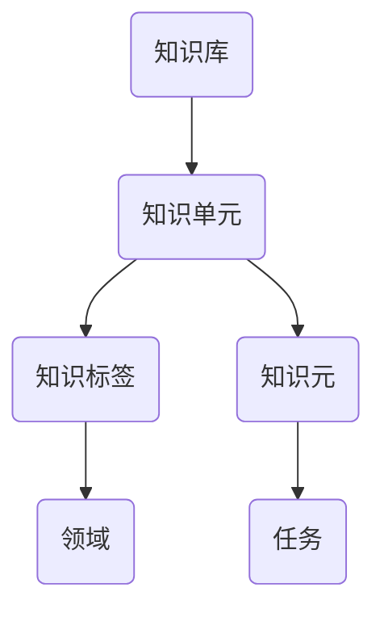
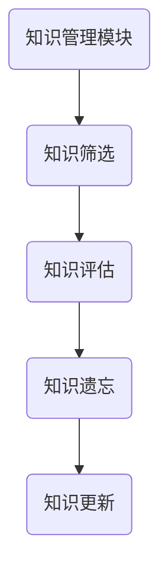
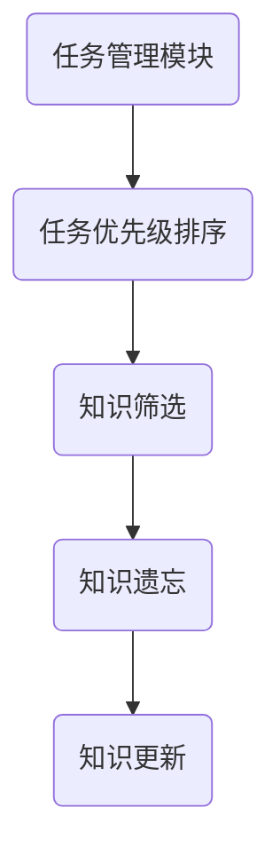
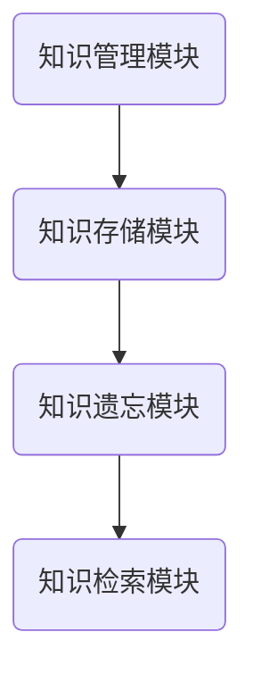
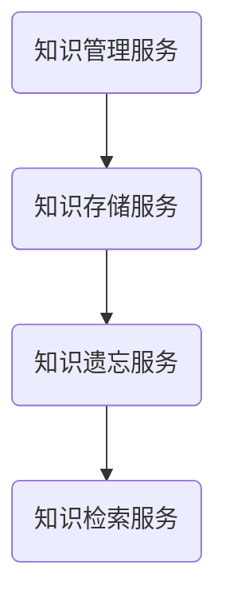
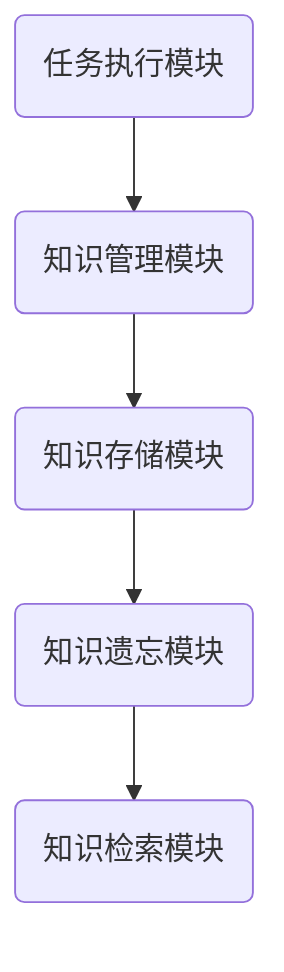

                 


# AI Agent的知识遗忘管理：平衡记忆与效率

---

## 关键词

AI Agent, 知识遗忘, 记忆管理, 效率优化, 知识存储

---

## 摘要

AI Agent在现代人工智能系统中扮演着越来越重要的角色，其核心能力依赖于对知识的高效管理和利用。然而，随着任务的复杂性和规模的不断扩大，AI Agent的知识存储和处理能力面临新的挑战。如何平衡记忆与效率，避免知识冗余和信息过载，成为AI Agent设计中的重要问题。本文从知识遗忘管理的背景出发，深入探讨其核心概念、算法原理、系统设计与实际应用，为AI Agent的优化提供理论支持和实践指导。

---

## 第一部分: AI Agent的知识遗忘管理概述

### 第1章: 知识遗忘管理的背景与问题

#### 1.1 知识遗忘管理的背景

##### 1.1.1 AI Agent的基本概念

AI Agent（人工智能代理）是一种能够感知环境、自主决策并执行任务的智能实体。它可以是一个软件程序、机器人或其他智能系统，其核心能力包括感知、推理、学习和执行。AI Agent的设计目标是通过高效的知识管理和利用，实现复杂任务的自动化处理。

##### 1.1.2 知识遗忘管理的必要性

随着AI Agent处理的任务越来越多，其知识库的规模也在不断扩大。然而，知识的存储和处理需要消耗大量的计算资源和存储空间。如果不加以管理，知识的冗余和过时信息会导致系统的效率下降，甚至影响任务执行的正确性。因此，知识遗忘管理成为AI Agent设计中的一个重要环节。

##### 1.1.3 当前AI Agent面临的挑战

- **知识冗余问题**：AI Agent在处理大量任务时，可能会重复获取和存储相同的知识，导致存储空间浪费。
- **信息过载问题**：随着时间的推移，知识库中的信息可能变得过时或不再相关，影响任务执行的效率。
- **计算资源限制**：过多的知识存储和处理会占用大量的计算资源，降低系统的响应速度。

#### 1.2 知识遗忘管理的核心问题

##### 1.2.1 知识存储的效率与成本

知识存储的效率与成本是知识遗忘管理的核心问题之一。AI Agent需要在存储知识和释放资源之间找到平衡点，既要保证任务执行所需的最低知识水平，又要避免不必要的资源消耗。

##### 1.2.2 知识遗忘的动态平衡

知识遗忘管理需要动态平衡知识的保留与遗忘。AI Agent需要根据任务需求和知识的重要性，决定哪些知识需要长期保留，哪些知识可以被遗忘。

##### 1.2.3 知识遗忘与任务执行的关系

知识遗忘与任务执行密切相关。适当的遗忘可以提高系统的效率，而过度遗忘则可能导致任务执行失败。因此，AI Agent需要根据任务的动态需求，灵活调整知识的遗忘策略。

---

### 第2章: 知识遗忘管理的核心概念与联系

#### 2.1 知识遗忘的基本原理

##### 2.1.1 知识遗忘的分类与特征

知识遗忘可以分为两种类型：**主动遗忘**和**被动遗忘**。主动遗忘是指AI Agent主动选择遗忘某些知识，而被动遗忘则是指由于知识过时或不再相关而自然被遗忘。知识遗忘的特征包括**时间依赖性**、**任务相关性**和**知识重要性**。

##### 2.1.2 知识遗忘的数学模型

知识遗忘的数学模型可以表示为：

$$
F(t) = K_0 \cdot e^{-\lambda t}
$$

其中，$F(t)$表示在时间$t$时的知识保留量，$K_0$是初始知识量，$\lambda$是遗忘速率常数。

##### 2.1.3 知识遗忘与记忆的关系

知识遗忘是记忆的自然过程。AI Agent需要通过遗忘策略来管理知识的生命周期，确保知识的有效性和可用性。

#### 2.2 知识遗忘管理的系统架构

##### 2.2.1 知识存储的实体关系图

以下是知识存储的实体关系图：



##### 2.2.2 知识遗忘的流程图

以下是知识遗忘的流程图：



##### 2.2.3 系统核心模块的功能描述

- **知识管理模块**：负责知识的存储、检索和更新。
- **知识筛选模块**：根据任务需求筛选出需要遗忘的知识。
- **知识评估模块**：评估知识的重要性，决定是否需要遗忘。
- **知识遗忘模块**：执行知识的遗忘操作，释放资源。

---

## 第3章: 知识遗忘管理的算法原理

### 3.1 基于时间的遗忘算法

#### 3.1.1 Ebbinghaus遗忘曲线的应用

Ebbinghaus遗忘曲线描述了人类记忆随时间的衰减规律，可以应用于AI Agent的知识遗忘管理。以下是Ebbinghaus遗忘曲线的数学表达式：

$$
R(t) = e^{-\frac{t}{\tau}}
$$

其中，$R(t)$表示记忆保留率，$\tau$是记忆衰减时间常数。

#### 3.1.2 做时间戳的遗忘策略

基于时间戳的遗忘策略通过记录知识的时间戳，判断知识是否需要遗忘。以下是具体的实现步骤：

1. 为每个知识单元记录创建时间戳。
2. 根据设定的时间阈值，判断知识单元是否需要遗忘。
3. 如果知识单元的创建时间超过阈值，则执行遗忘操作。

#### 3.1.3 算法实现的伪代码

以下是基于时间的遗忘算法的伪代码：

```python
def time_based_forgetting(knowledge_base, threshold):
    for knowledge in knowledge_base:
        if get_age(knowledge) > threshold:
            forget(knowledge)
    return knowledge_base
```

---

### 3.2 基于任务的遗忘算法

#### 3.2.1 任务相关性的度量

任务相关性可以通过以下指标进行度量：

- **任务重要性**：任务对整体目标的贡献程度。
- **任务频率**：任务在一定时间内的执行次数。
- **任务依赖性**：任务与其他任务之间的依赖关系。

#### 3.2.2 基于任务优先级的遗忘策略

基于任务优先级的遗忘策略通过评估任务的优先级，决定哪些知识需要遗忘。以下是具体的实现步骤：

1. 为每个任务分配优先级。
2. 根据优先级排序知识单元。
3. 对优先级最低的知识单元执行遗忘操作。

#### 3.2.3 算法实现的流程图

以下是基于任务的遗忘算法的流程图：



---

## 第4章: 知识遗忘管理的系统分析与架构设计

### 4.1 系统功能设计

#### 4.1.1 知识存储模块

知识存储模块负责知识的存储和管理，支持知识的添加、查询和更新操作。以下是知识存储模块的功能描述：

- **知识添加**：将新的知识单元添加到知识库中。
- **知识查询**：根据任务需求检索相关的知识单元。
- **知识更新**：根据知识的更新信息，动态调整知识库中的知识内容。

#### 4.1.2 知识遗忘模块

知识遗忘模块负责执行知识的遗忘操作，释放资源。以下是知识遗忘模块的功能描述：

- **知识筛选**：根据遗忘策略筛选出需要遗忘的知识单元。
- **知识评估**：评估知识的重要性，决定是否需要遗忘。
- **知识遗忘**：执行遗忘操作，删除或归档不需要的知识单元。

#### 4.1.3 知识检索模块

知识检索模块负责根据任务需求，快速检索相关的知识单元。以下是知识检索模块的功能描述：

- **任务需求分析**：解析任务的需求，确定需要的知识类型。
- **知识检索**：根据知识类型检索相关的知识单元。
- **知识返回**：将检索到的知识单元返回给任务执行模块。

### 4.2 系统架构设计

#### 4.2.1 分层架构设计

以下是分层架构设计的示意图：



#### 4.2.2 微服务架构设计

以下是微服务架构设计的示意图：



#### 4.2.3 系统接口设计

以下是系统接口设计的示意图：



---

## 第5章: 知识遗忘管理的项目实战

### 5.1 项目环境与工具安装

#### 5.1.1 开发环境配置

以下是开发环境配置的示意图：

```bash
# 安装Python和必要的库
pip install python
pip install numpy
pip install matplotlib
pip install pymermaid
```

#### 5.1.2 依赖库安装

以下是依赖库安装的示意图：

```bash
pip install mermaid
pip install graphviz
pip install matplotlib
pip install numpy
```

#### 5.1.3 数据集准备

以下是数据集准备的示意图：

```bash
# 下载知识遗忘管理的数据集
wget https://example.com/knowledge_forgetting_dataset.zip
unzip knowledge_forgetting_dataset.zip
```

---

### 5.2 核心代码实现

#### 5.2.1 知识存储模块的实现

以下是知识存储模块的实现代码：

```python
class KnowledgeUnit:
    def __init__(self, id, content, timestamp):
        self.id = id
        self.content = content
        self.timestamp = timestamp

class KnowledgeBase:
    def __init__(self):
        self.units = {}

    def add_knowledge(self, id, content, timestamp):
        self.units[id] = KnowledgeUnit(id, content, timestamp)

    def get_knowledge(self, id):
        return self.units.get(id, None)

    def update_knowledge(self, id, content):
        if id in self.units:
            self.units[id].content = content
```

---

### 5.2.2 知识遗忘模块的实现

以下是知识遗忘模块的实现代码：

```python
class ForgettingStrategy:
    def __init__(self, threshold):
        self.threshold = threshold

    def should_forget(self, knowledge_unit):
        current_age = time.time() - knowledge_unit.timestamp
        return current_age > self.threshold

class KnowledgeForgetting:
    def __init__(self, knowledge_base, strategy):
        self.knowledge_base = knowledge_base
        self.strategy = strategy

    def forget_old_knowledge(self):
        for id in list(self.knowledge_base.units.keys()):
            if self.strategy.should_forget(self.knowledge_base.units[id]):
                del self.knowledge_base.units[id]
```

---

### 5.2.3 知识检索模块的实现

以下是知识检索模块的实现代码：

```python
class KnowledgeRetriever:
    def __init__(self, knowledge_base):
        self.knowledge_base = knowledge_base

    def retrieve_knowledge(self, query):
        results = []
        for unit in self.knowledge_base.units.values():
            if query in unit.content:
                results.append(unit)
        return results
```

---

## 第6章: 总结与展望

### 6.1 总结

知识遗忘管理是AI Agent设计中的一个重要问题。通过合理的遗忘策略，可以有效平衡知识的存储与效率，提高系统的性能和响应速度。本文从理论到实践，详细探讨了知识遗忘管理的核心概念、算法原理和系统设计，为AI Agent的优化提供了理论支持和实践指导。

### 6.2 展望

未来，随着AI技术的不断发展，知识遗忘管理将面临新的挑战和机遇。如何在动态变化的环境中，实时调整知识的遗忘策略，将是未来研究的重要方向。此外，如何将知识遗忘管理与其他AI技术（如强化学习、自适应计算）相结合，也将是研究的重点。

---

## 作者

作者：AI天才研究院/AI Genius Institute & 禅与计算机程序设计艺术 /Zen And The Art of Computer Programming

