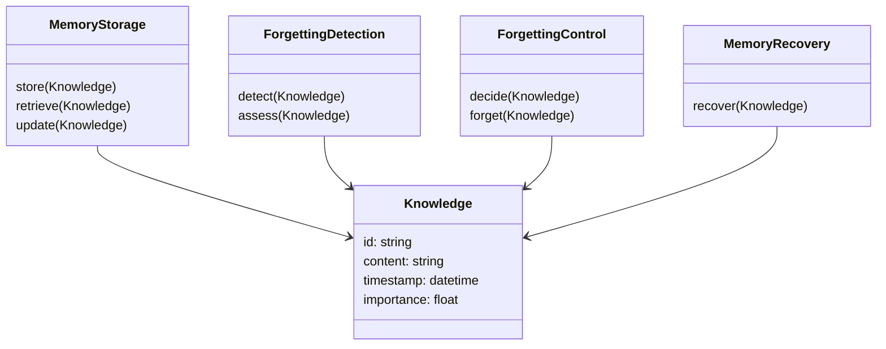
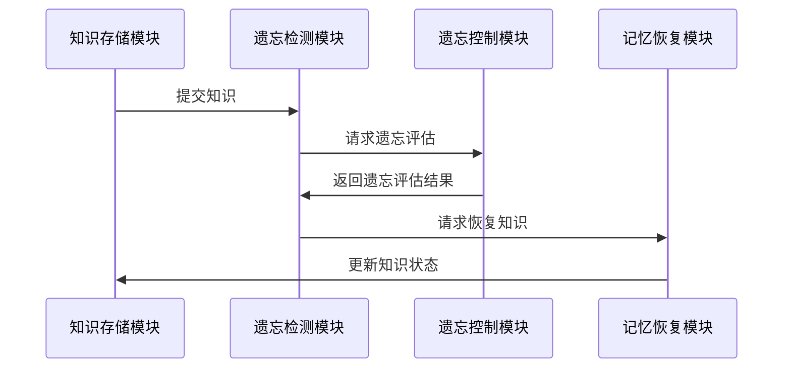

                 


# AI Agent的知识遗忘：管理长期记忆

> 关键词：AI Agent, 长期记忆, 知识遗忘, 记忆管理, 人工智能

> 摘要：本文探讨了AI Agent在长期记忆管理中的知识遗忘问题，分析了其机制、影响及管理策略。通过数学模型、算法原理和系统架构的详细阐述，结合实际案例和项目实战，为解决AI Agent的知识遗忘问题提供了系统的解决方案。

---

# 第一部分: AI Agent的知识遗忘概述

## 第1章: 知识遗忘的定义与背景

### 1.1 知识遗忘的定义
知识遗忘是指AI Agent在长期记忆中存储的信息随着时间推移逐渐失去可用性的过程。这可能由信息不再被频繁使用、干扰或自然老化等多种因素引起。

#### 1.1.1 知识遗忘的定义与概念
知识遗忘是AI Agent长期记忆中的信息逐渐减少或无法被有效检索的现象。它与人类的记忆遗忘机制类似，但AI Agent的记忆是基于数据和算法的，因此遗忘的机制和表现可能有所不同。

#### 1.1.2 知识遗忘的特征与属性
知识遗忘具有动态性、渐进性和可预测性。动态性指遗忘过程随时间推移而变化；渐进性指遗忘是逐步发生的；可预测性指可以通过模型预测遗忘的速度和程度。

#### 1.1.3 知识遗忘的分类与场景
知识遗忘可以分为被动遗忘和主动遗忘。被动遗忘是由于信息不再被访问而自然发生的；主动遗忘则是系统主动清除不再需要的信息。

### 1.2 AI Agent的基本概念
AI Agent是一种能够感知环境、执行任务并做出决策的智能实体，依赖于长期记忆来存储和检索知识。

#### 1.2.1 AI Agent的定义与特点
AI Agent是具备自主决策能力的智能系统，能够通过传感器或接口与环境交互，执行复杂任务。其特点包括自主性、反应性、目标导向性和学习能力。

#### 1.2.2 长期记忆在AI Agent中的作用
长期记忆是AI Agent存储经验和知识的关键部分，支持其理解和决策能力。良好的长期记忆管理是AI Agent高效运作的基础。

#### 1.2.3 知识遗忘对AI Agent的影响
知识遗忘可能导致AI Agent忘记重要信息，影响其决策和任务执行能力。因此，理解和管理知识遗忘是优化AI Agent性能的重要环节。

## 第2章: 长期记忆管理的背景与挑战

### 2.1 长期记忆管理的背景
长期记忆管理是AI Agent设计中的核心问题，直接影响其学习和适应能力。

#### 2.1.1 长期记忆管理的基本概念
长期记忆管理是指系统性地存储、组织和检索长期记忆中的信息，确保其有效性和持久性。

#### 2.1.2 长期记忆管理的重要性
良好的长期记忆管理有助于AI Agent更好地理解和处理复杂任务，提升其智能水平。

#### 2.1.3 长期记忆管理的现状
当前，长期记忆管理在AI领域仍面临诸多挑战，如信息存储效率、遗忘控制等问题。

### 2.2 知识遗忘的挑战
知识遗忘对AI Agent的性能和效率有显著影响，需要通过有效的管理策略来应对。

#### 2.2.1 知识遗忘的根源与表现
知识遗忘的根源包括信息冗余、认知负荷和环境变化。其表现包括信息检索延迟、决策失误和系统性能下降。

#### 2.2.2 知识遗忘对AI Agent性能的影响
遗忘可能导致AI Agent无法有效调用旧知识，影响其学习和推理能力。

#### 2.2.3 知识遗忘的解决思路与方向
解决知识遗忘问题需要从算法优化、机制设计和系统架构等多个方面入手，通过创新技术手段提升长期记忆管理的效率和效果。

---

# 第二部分: 知识遗忘的核心机制

## 第3章: 知识遗忘的机制与原理

### 3.1 知识遗忘的机制
知识遗忘是AI Agent长期记忆管理中的自然现象，其机制复杂多样。

#### 3.1.1 知识存储与遗忘的关系
知识存储是遗忘的前提，而遗忘则是存储信息的自然结果。存储越多，遗忘的可能性也越大。

#### 3.1.2 知识遗忘的动态过程
知识遗忘是一个动态过程，包括遗忘触发、遗忘速度和遗忘程度的变化。不同信息的重要性不同，遗忘速度和程度也不同。

#### 3.1.3 知识遗忘的触发条件
知识遗忘可能由时间因素、信息不活跃性和外部干扰等多种条件触发。

### 3.2 知识遗忘的数学模型
数学模型是理解知识遗忘机制的重要工具。

#### 3.2.1 知识遗忘的数学表达式
常用指数衰减模型描述知识遗忘：
$$
F(t) = F_0 \cdot e^{-kt}
$$
其中，$F(t)$表示时间$t$时的遗忘程度，$F_0$是初始遗忘程度，$k$是遗忘速率常数。

#### 3.2.2 知识遗忘的动态方程
动态方程描述遗忘过程的数学模型，考虑时间、信息重要性和访问频率等因素。

#### 3.2.3 知识遗忘的参数与变量
遗忘模型的关键参数包括遗忘速率常数$k$、初始遗忘程度$F_0$和信息重要性权重$\alpha$。

## 第4章: 知识遗忘与长期记忆的关系

### 4.1 长期记忆的结构与功能
长期记忆的结构和功能直接影响知识遗忘的过程。

#### 4.1.1 长期记忆的存储方式
长期记忆通常以符号、语义网络或向量形式存储，不同存储方式对遗忘的影响不同。

#### 4.1.2 长期记忆的组织形式
长期记忆可以分为显式记忆和隐式记忆，显式记忆更容易被遗忘，而隐式记忆较为持久。

#### 4.1.3 长期记忆的检索机制
检索机制包括基于关键词、基于上下文和基于关联性等多种方式，影响遗忘的发生。

### 4.2 知识遗忘对长期记忆的影响
知识遗忘直接影响长期记忆的准确性和完整性。

#### 4.2.1 知识遗忘对记忆容量的影响
遗忘可以释放存储空间，但过度遗忘可能导致信息缺失。

#### 4.2.2 知识遗忘对记忆准确性的影晌
遗忘可能导致记忆错误，影响AI Agent的决策能力。

#### 4.2.3 知识遗忘对记忆持久性的影晌
遗忘速度和程度影响记忆的持久性，需要通过遗忘控制策略优化记忆保持。

---

# 第三部分: 知识遗忘的管理策略

## 第5章: 知识遗忘的检测与评估

### 5.1 知识遗忘的检测方法
有效检测知识遗忘是管理长期记忆的前提。

#### 5.1.1 基于时间的遗忘检测
通过记录信息存储的时间，判断信息是否需要遗忘。常用方法包括时间戳和访问频率统计。

#### 5.1.2 基于频率的遗忘检测
通过统计信息的访问频率，判断其活跃程度。访问频率低的信息更容易被遗忘。

#### 5.1.3 基于相关性的遗忘检测
通过分析信息之间的关联性，判断信息是否需要遗忘。相关性低的信息可能不再重要。

### 5.2 知识遗忘的评估指标
评估知识遗忘需要明确的指标体系。

#### 5.2.1 遗忘率的计算公式
遗忘率计算公式为：
$$
\text{遗忘率} = \frac{\text{已遗忘的知识量}}{\text{总知识量}}
$$

#### 5.2.2 遗忘速度的评估方法
遗忘速度通常用遗忘速率常数$k$表示，$k$越大，遗忘速度越快。

#### 5.2.3 遗忘程度的分类标准
根据遗忘程度，将知识分为完全遗忘、部分遗忘和潜在遗忘。

## 第6章: 知识遗忘的管理策略

### 6.1 知识遗忘的控制策略
有效控制知识遗忘需要综合运用多种策略。

#### 6.1.1 基于时间的遗忘控制
设定信息的有效期，超过期限后自动遗忘。例如，设置信息的保留时间为$t$，超过$t$后触发遗忘机制。

#### 6.1.2 基于重要性的遗忘控制
根据信息的重要性，动态调整遗忘策略。重要信息优先保留，不重要的信息可以被遗忘。

#### 6.1.3 基于访问频率的遗忘控制
根据信息的访问频率，调整遗忘策略。频繁访问的信息优先保留，不活跃的信息可能被遗忘。

### 6.2 知识遗忘的优化策略
优化知识遗忘需要结合系统架构和算法优化。

#### 6.2.1 知识分层管理
将知识按重要性和层次性进行分类管理，确保关键信息不被遗忘。

#### 6.2.2 遗忘阈值的动态调整
根据系统负载和任务需求，动态调整遗忘阈值，平衡存储效率和信息保留。

#### 6.2.3 增强记忆巩固
通过反复学习和关联记忆，增强信息的持久性，减少遗忘的发生。

---

# 第四部分: 系统分析与架构设计

## 第7章: 系统分析与架构设计方案

### 7.1 问题场景介绍
知识遗忘管理需要解决的问题包括信息存储、遗忘检测、遗忘控制和记忆恢复。

### 7.2 系统功能设计
系统功能包括记忆存储、遗忘检测、遗忘控制和记忆恢复。

#### 7.2.1 领域模型
领域模型用Mermaid类图表示，展示系统中的主要实体及其关系。



#### 7.2.2 系统架构
系统架构用Mermaid架构图表示，展示各模块之间的交互关系。


#### 7.2.3 系统接口设计
系统接口设计包括知识存储接口、遗忘检测接口、遗忘控制接口和记忆恢复接口。

#### 7.2.4 系统交互
系统交互用Mermaid序列图表示，展示知识存储、检测、控制和恢复的过程。



---

# 第五部分: 项目实战

## 第8章: 项目实战

### 8.1 环境安装
需要安装Python、TensorFlow和Mermaid工具。

### 8.2 系统核心实现
核心代码实现包括知识存储、遗忘检测和遗忘控制模块。

#### 8.2.1 核心代码实现
```python
class Knowledge:
    def __init__(self, id, content, timestamp, importance):
        self.id = id
        self.content = content
        self.timestamp = timestamp
        self.importance = importance

class MemoryStorage:
    def __init__(self):
        self.knowledge_base = {}

    def store(self, knowledge):
        self.knowledge_base[knowledge.id] = knowledge

    def retrieve(self, id):
        return self.knowledge_base.get(id)

class ForgettingDetection:
    def __init__(self):
        pass

    def detect(self, knowledge):
        # 简单的基于时间的遗忘检测
        current_time = datetime.now()
        time_diff = current_time - knowledge.timestamp
        if time_diff.days > 30:
            return True
        else:
            return False

class ForgettingControl:
    def __init__(self):
        pass

    def decide(self, knowledge):
        # 基于重要性的遗忘控制
        if knowledge.importance < 0.5:
            return True
        else:
            return False
```

#### 8.2.2 代码应用解读与分析
上述代码实现了知识存储和遗忘检测的基本功能。通过设置时间阈值和重要性阈值，系统可以自动判断是否需要遗忘知识。

#### 8.2.3 案例分析
以一个具体案例为例，展示知识存储、遗忘检测和遗忘控制的全过程。

### 8.3 项目小结
项目实现了知识遗忘管理的核心功能，验证了算法的有效性，并为后续优化提供了基础。

---

# 第六部分: 最佳实践与总结

## 第9章: 最佳实践与总结

### 9.1 小结
知识遗忘是AI Agent长期记忆管理中的重要问题，需要通过系统的方法和优化策略来解决。

### 9.2 注意事项
在实际应用中，需要综合考虑信息的重要性、访问频率和系统负载，动态调整遗忘策略。

### 9.3 拓展阅读
推荐相关领域的书籍和论文，供读者深入学习和研究。

---

# 作者：AI天才研究院/AI Genius Institute & 禅与计算机程序设计艺术 /Zen And The Art of Computer Programming

---

这篇文章系统地探讨了AI Agent的知识遗忘问题，从背景、机制、算法到系统设计和项目实战，提供了全面的解决方案。通过理论分析和实践指导，帮助读者深入理解知识遗忘的管理策略，提升AI Agent的长期记忆管理能力。

