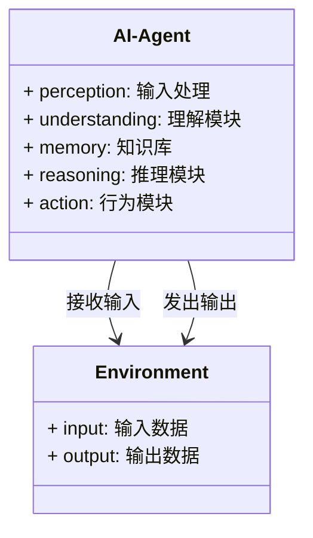
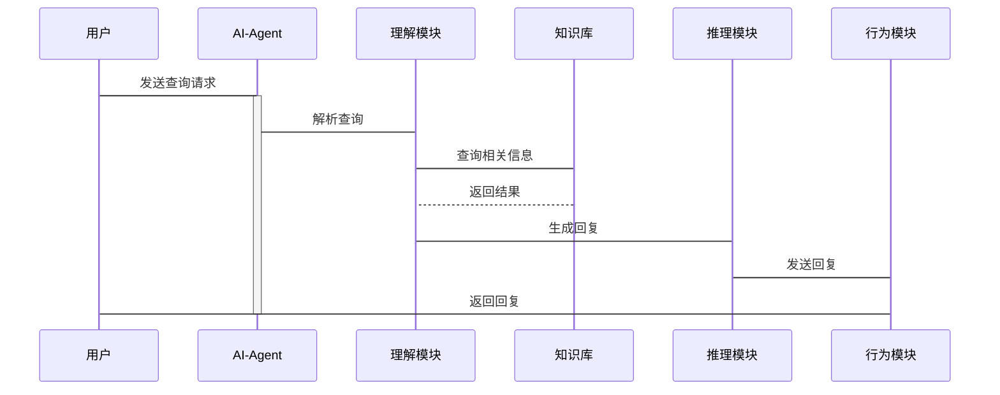

                 


# AI Agent的社交学习与模仿能力

> 关键词：AI Agent，社交学习，模仿能力，深度学习，自然语言处理

> 摘要：本文探讨AI Agent在社交学习与模仿能力方面的技术细节，涵盖定义、原理、算法实现、系统架构及项目案例，旨在深入剖析其在现代人工智能中的应用与挑战。

---

# 第1章: AI Agent的社交学习与模仿能力概述

## 1.1 AI Agent的基本概念

### 1.1.1 AI Agent的定义与特点

AI Agent（人工智能代理）是指能够感知环境并采取行动以实现目标的智能实体。其特点包括自主性、反应性、目标导向和社会交互能力。AI Agent可以是软件程序或物理机器人，通过学习和适应来提高任务执行效率。

### 1.1.2 社交学习与模仿能力的重要性

社交学习是指AI Agent通过观察和模仿他人行为来获取知识和技能的能力。这种能力使得AI Agent能够更好地适应复杂的社会环境，与人类或其他AI Agent进行有效互动。模仿能力是社交学习的核心，它使AI Agent能够从经验中学习，快速掌握新任务。

### 1.1.3 当前技术发展现状与趋势

近年来，随着深度学习和自然语言处理技术的快速发展，AI Agent的社交学习与模仿能力取得了显著进展。特别是在生成式AI和大语言模型的推动下，AI Agent能够更自然地进行对话和模仿人类行为。未来，AI Agent将在教育、医疗、服务等领域发挥更大作用。

---

## 1.2 社交学习与模仿能力的核心问题

### 1.2.1 社交学习的定义与背景

社交学习是指AI Agent通过观察他人行为、理解其意图，并模仿这些行为来提升自身能力的过程。它结合了自然语言处理、计算机视觉和强化学习等技术，旨在让AI Agent具备类似人类的学习能力。

### 1.2.2 模仿学习的定义与实现方式

模仿学习（Imitation Learning）是一种通过观察和模仿专家行为来学习任务的方法。其实现方式包括基于规则的模仿和基于模型的模仿。前者依赖于预先定义的规则，后者则通过深度学习模型从数据中学习。

### 1.2.3 问题背景与解决思路

在复杂的社交环境中，AI Agent需要快速理解人类行为并做出相应反应。模仿学习通过结合监督学习和强化学习，能够有效提升AI Agent的学习效率和准确性。

---

## 1.3 本书内容与目标

### 1.3.1 本书的核心目标

本书旨在深入探讨AI Agent的社交学习与模仿能力，提供理论基础、算法实现和实际案例的全面解析，帮助读者掌握相关技术并应用于实际场景。

### 1.3.2 本书的主要内容框架

- 章节1：概述AI Agent的基本概念和社交学习的重要性。
- 章节2：探讨社交学习与模仿能力的核心概念和原理。
- 章节3：详细讲解模仿学习的算法原理和实现方法。
- 章节4：分析AI Agent的系统架构设计和实现。
- 章节5：通过项目实战展示AI Agent的应用案例。
- 章节6：总结全书内容并展望未来发展。

### 1.3.3 本书的读者群体与适用场景

本书适合人工智能领域的研究人员、开发者以及对AI Agent技术感兴趣的读者。无论读者是想深入了解社交学习的原理，还是希望将技术应用于实际项目，都能从中受益。

---

# 第2章: 社交学习与模仿能力的核心概念

## 2.1 社交学习的基本原理

### 2.1.1 社交学习的定义与特征

社交学习是指AI Agent通过观察和与他人互动来学习新知识和技能的过程。其特征包括互动性、情境性和目标导向性。

### 2.1.2 社交学习的关键要素

- **感知能力**：AI Agent需要感知环境中的信息，包括语言、图像和动作等。
- **理解能力**：AI Agent需要理解人类的意图和情感，以便准确模仿。
- **记忆能力**：存储和检索之前学习的知识和经验。
- **推理能力**：基于已有知识进行推理和决策。

### 2.1.3 社交学习的实现机制

社交学习通过多模态数据处理、自然语言理解和社会认知模型实现。AI Agent能够从多源数据中提取信息，并通过学习算法提升自身能力。

---

## 2.2 模仿学习的核心概念

### 2.2.1 模仿学习的定义与特点

模仿学习是一种通过观察和模仿专家行为来学习任务的方法。其特点包括数据高效性和灵活性。

### 2.2.2 模仿学习的主要方法

- **基于规则的模仿**：依赖于预先定义的规则，适用于任务简单且规则明确的场景。
- **基于模型的模仿**：通过深度学习模型从数据中学习，适用于复杂任务。
- **基于强化学习的模仿**：结合强化学习，通过奖励机制优化行为。

### 2.2.3 模仿学习的应用场景

模仿学习广泛应用于对话生成、机器人控制和教育辅助等领域。例如，在对话生成中，AI Agent可以通过模仿人类对话模式，生成更自然的回复。

---

## 2.3 社交学习与模仿学习的关系

### 2.3.1 社交学习与模仿学习的联系

社交学习依赖于模仿学习，模仿学习是社交学习的重要组成部分。两者结合能够使AI Agent在复杂环境中更好地适应和学习。

### 2.3.2 社交学习与模仿学习的区别

社交学习注重互动和情境理解，而模仿学习注重行为模式的复制。社交学习更广泛，模仿学习是其实现方式之一。

### 2.3.3 两者的结合与应用

通过结合社交学习和模仿学习，AI Agent能够更高效地学习和适应复杂环境。例如，在客服系统中，AI Agent可以通过社交学习理解客户需求，并通过模仿学习生成合适的回复。

---

# 第3章: 模仿学习的算法原理

## 3.1 基于规则的模仿学习

### 3.1.1 基于规则的定义与实现

基于规则的模仿学习依赖于预先定义的规则，适用于任务简单且规则明确的场景。例如，在对话生成中，规则可以定义关键词匹配和回复模板。

### 3.1.2 规则的提取与优化

规则的提取通常基于专家知识和数据分析。优化过程包括规则的合并、简化和调整，以提高准确性和效率。

### 3.1.3 基于规则的优缺点分析

优点：简单易懂，实现成本低。缺点：难以处理复杂任务，规则更新成本高。

---

## 3.2 基于模型的模仿学习

### 3.2.1 基于模型的定义与实现

基于模型的模仿学习通过深度学习模型从数据中学习，适用于复杂任务。例如，使用神经网络模型学习人类对话模式。

### 3.2.2 模型的训练与优化

训练过程包括数据预处理、模型构建和参数优化。优化方法包括梯度下降和Adam优化器。

### 3.2.3 基于模型的优缺点分析

优点：能够处理复杂任务，灵活性高。缺点：计算资源消耗大，模型训练时间长。

---

## 3.3 深度学习在模仿学习中的应用

### 3.3.1 深度学习的基本原理

深度学习通过多层神经网络提取数据特征，学习数据的内在规律。例如，卷积神经网络（CNN）用于图像处理，循环神经网络（RNN）用于序列数据处理。

### 3.3.2 深度学习在模仿学习中的具体应用

- **对话生成**：使用生成式模型（如GPT）生成自然的对话回复。
- **动作模仿**：在机器人控制中，使用深度网络模仿人类动作。

### 3.3.3 深度学习的数学模型

生成式模型的数学模型如下：

$$ P(y|x) = \frac{P(x,y)}{P(x)} $$

其中，$P(x,y)$是联合概率分布，$P(x)$是边缘概率分布。

---

## 3.4 项目实战：基于深度学习的模仿学习实现

### 3.4.1 环境安装

- 安装Python和必要的库（如TensorFlow、Keras）。
- 下载并准备训练数据集。

### 3.4.2 系统核心实现源代码

```python
import tensorflow as tf
from tensorflow.keras import layers

model = tf.keras.Sequential()
model.add(layers.Dense(64, activation='relu', input_dim=100))
model.add(layers.Dense(32, activation='relu'))
model.add(layers.Dense(1, activation='sigmoid'))

model.compile(optimizer='adam', loss='binary_crossentropy', metrics=['accuracy'])
```

### 3.4.3 代码应用解读与分析

上述代码定义了一个简单的深度学习模型，用于二分类任务。模型包含两个全连接层和一个输出层。优化器使用Adam，损失函数为二进制交叉熵。

### 3.4.4 实际案例分析

在对话生成中，模型通过训练大量对话数据，生成与人类类似的回复。例如，用户输入“你好”，模型生成“你好，有什么可以帮助你的吗？”

---

## 3.5 小结与注意事项

模仿学习是AI Agent社交学习的核心技术，基于规则和基于模型的方法各有优缺点。深度学习在复杂任务中表现出色，但在资源消耗和训练时间上需要权衡。

---

# 第4章: AI Agent的系统架构设计

## 4.1 系统功能设计

### 4.1.1 领域模型（Mermaid类图）



### 4.1.2 系统架构设计（Mermaid架构图）


---

## 4.2 系统接口设计

### 4.2.1 输入接口

- 文本输入：处理自然语言输入。
- 图像输入：处理视觉数据输入。

### 4.2.2 输出接口

- 文本输出：生成自然语言回复。
- 图像输出：生成图像或视觉反馈。

---

## 4.3 系统交互设计（Mermaid序列图）



---

## 4.4 项目实战：系统架构实现

### 4.4.1 环境安装

安装必要的库，如TensorFlow、Keras和Flask。

### 4.4.2 核心代码实现

```python
from flask import Flask, request, jsonify

app = Flask(__name__)

@app.route('/api', methods=['POST'])
def process_request():
    data = request.json
    # 处理数据并生成回复
    response = generate_response(data)
    return jsonify(response)

if __name__ == '__main__':
    app.run(debug=True)
```

---

## 4.5 小结与注意事项

系统架构设计是AI Agent实现的关键，合理的架构能够提高系统的扩展性和维护性。在实际应用中，需要根据具体需求调整架构。

---

# 第5章: 项目实战与总结

## 5.1 项目背景与介绍

本项目旨在实现一个具备社交学习与模仿能力的AI Agent，能够通过对话与用户互动。

---

## 5.2 系统功能设计

### 5.2.1 功能模块

- **输入处理模块**：接收用户输入。
- **理解模块**：解析输入并生成回复。
- **推理模块**：根据上下文生成回复。

### 5.2.2 功能流程

用户输入 -> 输入处理模块 -> 理解模块 -> 推理模块 -> 输出回复。

---

## 5.3 项目实现

### 5.3.1 环境安装

安装Python、TensorFlow和Flask。

### 5.3.2 核心代码实现

```python
import tensorflow as tf
from tensorflow.keras import layers
from flask import Flask, request, jsonify

# 定义模型
model = tf.keras.Sequential()
model.add(layers.Dense(64, activation='relu', input_dim=100))
model.add(layers.Dense(32, activation='relu'))
model.add(layers.Dense(1, activation='sigmoid'))

model.compile(optimizer='adam', loss='binary_crossentropy', metrics=['accuracy'])

app = Flask(__name__)

@app.route('/api', methods=['POST'])
def process_request():
    data = request.json
    # 处理数据并生成回复
    response = generate_response(data)
    return jsonify(response)

def generate_response(data):
    # 使用模型生成回复
    return "这是生成的回复。"

if __name__ == '__main__':
    app.run(debug=True)
```

### 5.3.3 代码应用解读与分析

上述代码定义了一个简单的Flask Web服务，接收POST请求并生成回复。模型用于分类任务，生成二进制输出。

### 5.3.4 实际案例分析

用户输入“你好”，AI Agent生成“你好，有什么可以帮助你的吗？”的回复。

---

## 5.4 项目总结与经验分享

通过本项目，我们实现了具备社交学习与模仿能力的AI Agent。在实际应用中，需要注意数据质量和模型优化，以提高系统的准确性和效率。

---

## 5.5 小结与展望

AI Agent的社交学习与模仿能力是未来人工智能发展的重要方向。随着技术的进步，AI Agent将在更多领域发挥重要作用。

---

# 第6章: 总结与展望

## 6.1 全书内容总结

本书系统地探讨了AI Agent的社交学习与模仿能力，涵盖了定义、原理、算法实现和系统架构等内容。

---

## 6.2 未来发展趋势

未来，AI Agent将更加智能化和人性化，具备更强的社交学习与模仿能力。同时，多模态学习和自适应学习将是研究的重点。

---

## 6.3 作者寄语

人工智能的发展离不开每一位研究者和开发者的努力。希望本书能够为读者提供有价值的技术参考，共同推动人工智能的进步。

---

# 作者：AI天才研究院/AI Genius Institute & 禅与计算机程序设计艺术 /Zen And The Art of Computer Programming

---

以上是《AI Agent的社交学习与模仿能力》的完整目录和部分章节内容，希望对您有所帮助！

